原文 by MayIKissYou 
  

  
PS: I’ve been thinking of concluding the pieces of knowledge for a long time. This time at the wooyun summit , I repeated the previous process again and finished this article, wishing that the contents I organized could bring enlightenments to the first party workers and white hats.
  

  
## 0x00 Overview
  
As more attentions are placed on information security and its development is increasingly growing, a lot more security protection software appears. For instance:
  

  
1. Cloud waf;[Ali cloud shield, Baidu cloud acceleration, 360 website guardian and Jiasule]
  
2. Hardware waf from traditional AV vendors and existing ips or ids devices; [Xdown, Venus，SangFor, Anheng]
  
3. Host protection software, such as safedog and cloudlock;
  
4. Software waf, including modsecurity，nginx-lua-waf
  

  
And of course, the popular sqlchop.
  
We use WAF to represent the software for defending web attack, which is the leading star of the following parts.
  

  
## 0x01 Where is WAF?
  
Here “WAF” represents the above software that I mentioned. We need to know where WAF is placed in the network space.
  
From a request （`http://www.miku.com/1.php?id=1%20and1=1`） being sent by a user until the request is forwarded to the server, how many devices are involved during the process? In which layer does these devices work? Which devices are processing our application-layer data?
  
This is a classic problem in data communication. By understanding the place that WAF locates at in the network space, could we clearly identify the knowledge we need to assist us in conducting WAF bypass.
  
As shown in the figure below：
  
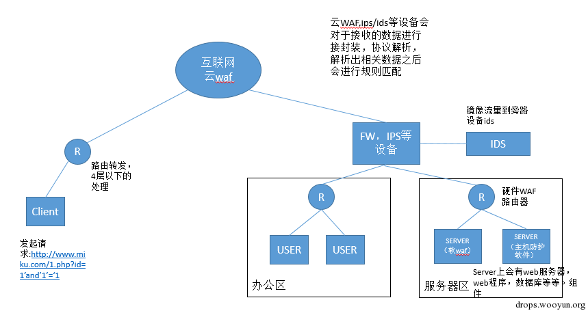
  

  
I draw a simple topological graph.
  
As shown in the figure, the places where our cloud waf, ips/ids hardware protection, hardware waf, host protection and applications locate are clearly demonstrated.
  

  
## 0x02 WAF Data Processing
  
After knowing the topography of each protection software in network environment, it’s time to comprehend how the traffic of basic data and relevant devices are processed.
  
Assuming the client visits url: `http://www.miku.com/1.php?id=1'and'1='1`, the requested data by this request is the record of ID 1 in the database of the server.
  
Suppose this server uses related cloud waf.
  
1）In a complete process, DNS is firstly requested. Since DNS resolution will be modified during the configuration of the cloud waf. After we send the DNS request, the domain name will be resolved to the IP of the cloud waf. Before entering into the next step, DNS resolution will finish to get information on the domain name.
  
2）The HTTP protocol is an application-layer protocol and a tcp protocol. Therefore, it first operates TCP handshake for three times. The handshake detail will not be covered here, assuming it is done.
  

  
3）When a request is sent, the request has to go through the cloud waf, ips/ids hardware protection, hardware waf, server, web server, host protection software/software waf, web applications and database in sequence. Cloud waf, ips/ids hardware and hardware waf all have their own way to process data. I’m not good at the details of cloud waf and hardware waf, but know some about IPS hardware. 
  
Prior to getting HTTP data, TCP restructuring is performed, the purpose of which is to solve the disorder problem of packets during Internet data transmission. Then packets will go through protocol analysis to take those relevant values after the packets are restructured, such as http_method=GET, http_payload=xxx. These values represent the values of related rules in the IPS rule, being used to determine if the rule is matched or not.
  

  
## 0x03 Understanding WAF BYPASS
  
In my own opinion, the so called BYPASS WAF is actually to find out the features of the hardware/software behind WAF equipments, which processes application-layer packets. Construct WAF to miss by leveraging its features, but also enable applications to successfully execute the payload and bypass the protection.
  
Each feature is like a specific scene. Some are discovered by researchers, some remain unknown waiting to be found. If our applications meet every scene and WAF fails to cover these scenes, we would be able to use these features to bypass WAF.
  
For example, if right now we need to bypass a cloud WAF/IPS/Hardware WAF, here we can use:
  

  
1. the Web server layer to bypass
  

  
2. the Web application layer to bypass
  

  
3. the database layer to bypass
  

  
4. the WAF layer to bypass
  

  

  
Because there are many features can be used in every layer and WAF usually takes performance factor into consideration. Therefore WAF contains some weaknesses. The following concludes the features which are often used for bypass in detail.
  
Ps.Got a clearer idea, right! = =
  

  
## 0x04 Bypass WAF Postures
  
### 1 Use the Web server layer to bypass
  
Leverage the features of Web server to bypass WAF, popular combinations including asp+IIS, aspx+IIS, php+apache and java+tomcat etc.
  
This section mainly is used for resolving http and other things, so here my understanding is to find the difference feature between WAF resolving http and real environment resolving http and use the difference feature to bypass WAF.
  
PS.This part remains a lot to dig up and the discovered feature from this part can be lethal for WAF bypass.
  
#### 1.1 IIS Server
  
The program running on IIS usually is asp or aspx. Here are some features that we can use in IIS:
  
**1 the % feature**
  
In asp+iis environment, there is a feature that is special symbol %. When we type s%elect in this environment, the possible result resolved from WAF layer can be s%elect. But in iis+asp environment, the resolved result is select.
  
This is the asp+iis environment built in local for test. The test result is as follows:
  
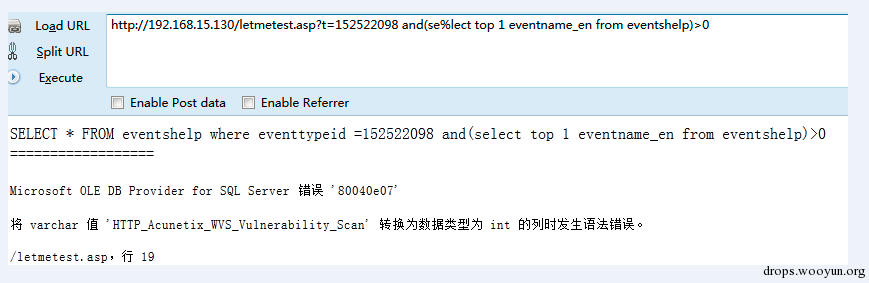
  
Ps.Here I guess the problem occurs when asp.dll is resolved in iis, this feature doesn’t show up in aspx+iis environment.
  

  
**2 the %u feature**
  
The iis server supports resolving unicode, for instance we use unicode encode the character in select and get the following s%u006c%u0006ect. Such character will be converted to select after receiving IIS, but for WAF layer, the received content may still be s%u006c%u0006ect, which results a possible bypass.
  
The asp+iis and aspx+iis environment we built:
  
（1）asp+iis environment
  
The test results are as shown in the figure :
  
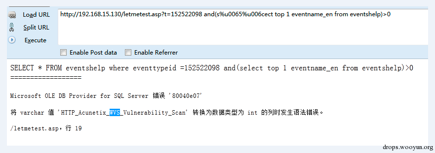
  

  
（2）aspx+iis environment
  
The test results are as shown in the figure :
  
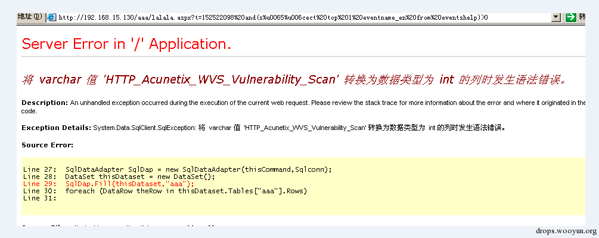
  

  
**3 Another %u feature**
  
PS. Note that as I conducted this feature test, aspx+iis environment was not supported, which requires experiment to verify. I doubt that the contents behind suffix is obtained through asp.net is api, which results different asp and aspx.
  

  
In the above we mentioned that iis supports resolving the unicode format. This iis resolution has a feature. 
  
This vulnerability exploits the fact that after is resolution unicode will be converted to multibyte and during convert: multiple widechar could be converted to a same character.
  
For instance, the e in select corresponds to the %u0065 in unicode, but %u00f0 will be converted to e as well.
  
s%u0065lect->select
  
s%u00f0lect->select
  
It’s possible that the WAF layer can identify the form of s%u0065lect, but it can’t support the form of s%u00f0lect. By using this, we can bypass WAF.
  
build asp+iis environment:
  
asp+iis environment
  
The test results are as shown in the figure :
  
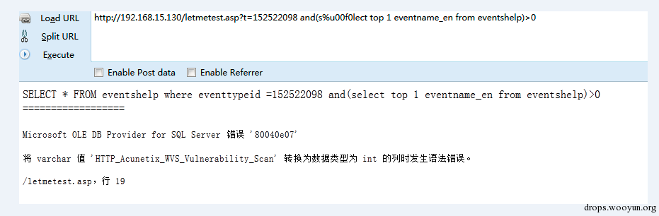
  

  
Ps.This exploit can only be used in limited situation, but the mining idea is worth it.
  

  
#### 1.2 apache server
  
**1 malform method**
  
Some apache version when handling GET request, whatever the value of method, it will take out  contents of the GET, for instance, if the requested method is DOTA2, the returned aid will still be 2.
  

  

  
If some WAF when processing data fully follows GET and POST to obtain data, because apache’s requested method is too lax, it may result in bypass. 
  
ps.The test uses apache2.4.7.
  

  
**2 php+apache malformed boundary**
  
When Php resolves multiple data, it has its unique feature, which only takes the contents before the comma for the identification of boundary. For example, if we set boundary to aaaa,123456, php resolution only identifies aaaa, the rest contents remain untouched. However, others may take the whole string, like WAF resolution, this time bypass may be achievable.
  
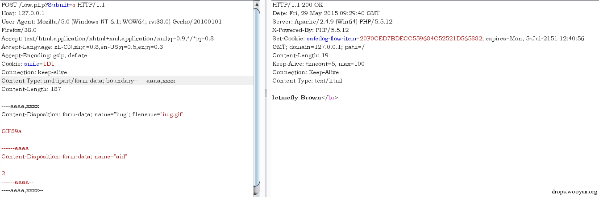
  

  
As shown in the above figure, it’s possible that war may obtain an image content and the value obtained from the web side is aid=2. Such discrepancy may result in bypass.
  

  
### 2 Use the Web application layer to bypass
  
#### 2.1 double url encoding
  
Double url encoding is to perform twice the urlencode operation on data sent by browser. For instance, if perform urlencode on s once, it’s %73, after another urlencode it becomes %25%37%33. Normally, when data go through WAF equipment, url decode will be performed only once, such decoded data typically won’t match rules, which reaches the same effect with bypass.
  

  
Personally, I think double url encoding requires the data to be url decoded twice before being executed by program. If decoding is performed only once, the final result cannot be executed correctly. 
  

  
#### 2.2 Change Request Method
  
2.2.1 Change Request Method
  
**1）GET,POST,COOKIE**
  
In web environment, the situation of parameter obtain may be gathered. Its purpose is to filter the obtained parameters. For instance, I obtained a parameter `t=select 1 from 2` which can be obtained from the get parameter, post parameter or the cookie parameter.
  
It’s typical dedecms. In previous tests, I have found that some war vendors filter get and post, but don’t filter cookie, but to directly change cookie parameters to submit payload, that is bypass.
  

  
**2）urlencode and form-data** 
  
POST use two methods to submit data. The first is to use urlencode to submit , the second is to use form-data to submit. When we tested the site, we found the data that POST submitted was filtered out, this time you can use form-data to submit.
  
We built an environment on the Ali cloud ecs host to create a page with sql inject vulnerability and get parameters from POST. First, I used urlencode to submit data, but the request was intercept.
  
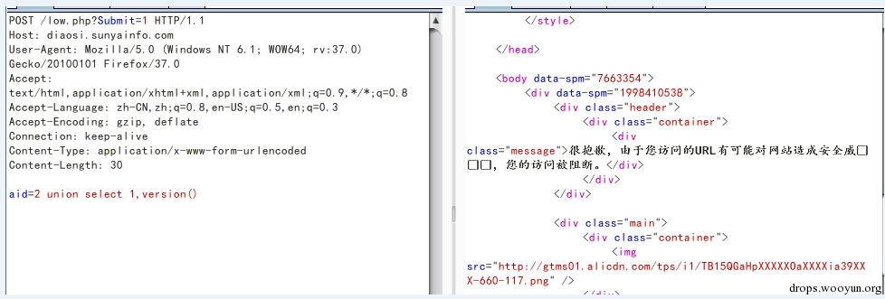
  
Then we used form-data to submit and found the version that would expose database.
  
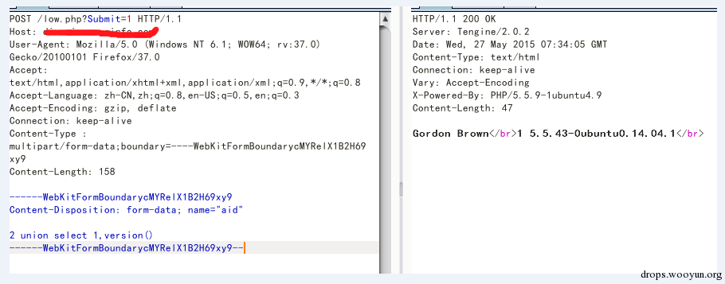
  

  
2.2.2 malformed request method
  
1）asp/asp.net request resolution
  
In asp and asp.net (http://asp.net/), request packets are the parameters often used to obtain the parameters that a user submits, for instance, when using request[‘’], some problems may appear. 
  
When using request[''] to get packets, sometime it’s hard to distinguish GET and POST. For example to construct a request packet, METHOD is GET, but the packet still contains contents and content-type of POST.
  
We build an instance:
  
We built an letmetest.aspx interface to get the contents that a user submits and print the contents of request['t']. [Safedog is installed on the server] First we submitted a normal POST request, then we found it was intercept by Safedog:
  
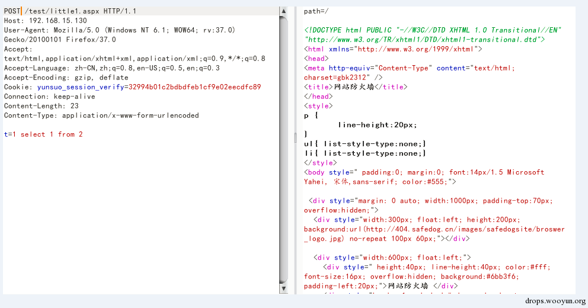
  
At this moment, we submitted the malformed request, the method is GET, but the contents are the contents of POST. We found the printed contents.
  
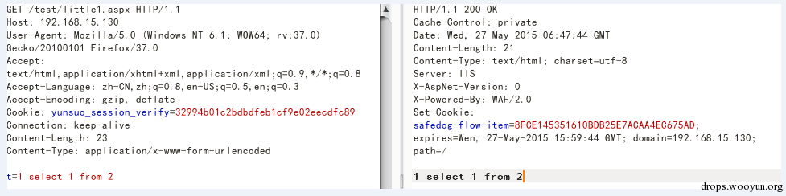
  

  
#### 2.3 hpp method
  
HPP refers to HTTP parameter pollution, which looks like the following:?id=1&id=2&id=3. When using different web technology, this form can get different id value.
  
Assume the submitted parameter is:
  
id=1&id=2&id=3
  

  
Asp.net + iis：id=1,2,3 
  
Asp + iis：id=1,2,3 
  
Php + apache：id=3
  

  
By analysis to know: when WAF and WEB applications use different forms to obtain parameter, WAF bypass can be realized.
  

  
Ps. The key part is to analyze how WAF handles the method to obtain parameters. Here what need to mention is that the use of hpp is very flexible, for example some cmc may base on the whitelist of url, therefore, hpp can be used to add whitelist directory at the place of parameter1 and add malicious payload at the place of parameter 2, the form is like index.php?a=[whitelist]&a=select 1 union select 2
  

  
### 3 Use database layer to bypass
  
Database layer bypass is to inject protection rules into the sql of bypass waf. We need to leverage the feature of this database against it, such as mysql and sqlserver etc. Recently, I am think of organize oracle, which is less researched, I will add this part later in the document.
  
Ps.Currently, there are many features exposed from the database. It’s enough to just leverage these features in a comprehensive manner. So as to the understanding of features and whether if can use it flexibly, it’s up to you.
  
#### 3.1 mysql database
  
Today, mysql is the most used and researched database by researchers. For me, I often test the following filter point, because generally when bypass the select from, it’s able to obtain data by sql injection.
  
common filter position
  

  
1：the position between parameter and union
  
(1): the form of \Nunion：
  
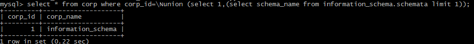
  
(2):the form of floating point, such as 1.1,8.0
  
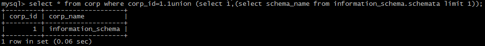
  
(3):the form of 8e0：
  
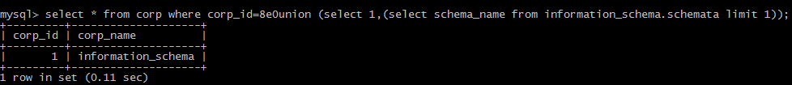
  
(4): use the form of /!50000/
  
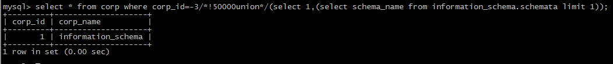
  

  
2：the position before union and select
  
(1)white space
  
the useful white space in Mysql：%09,%0a,%0b,%0c,%0d,%a0；
  
(2)comment
  
use blank comment
  
the useful blank comment in MYSQL：
  
`/**/ `
  
`/*letmetest*/`
  

  
(3)use brackets
  

  

  
3：the position behind union select
  
(1)white space
  
the useful white space in Mysql：%09,%0a,%0b,%0c,%0d,%a0；
  
(2)comment
  
use blank comment
  
the useful blank comment in MYSQL：
  
`/**/`
  
`/*letmetest*/`
  

  
(3)other ways: [Note sometimes union select and select from are two rules, here is for union select.]
  
brackets: select(1)from
  
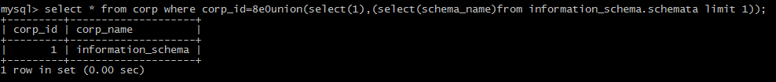
  
operative symbol:
  
minus sign（-）
  
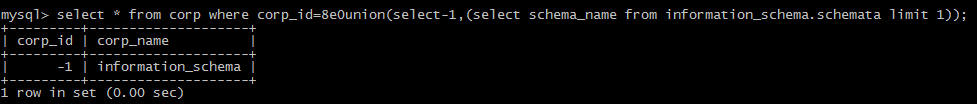
  
plus sign（+）
  
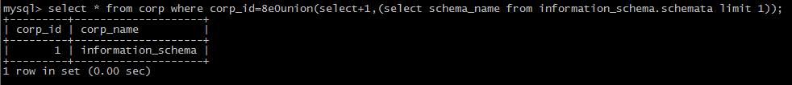
  
~：
  
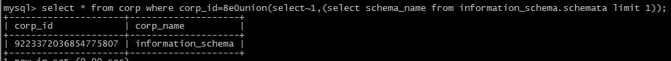
  
!：
  
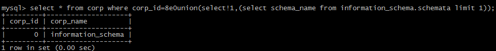
  
@form
  
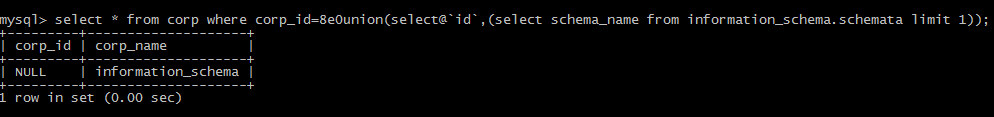
  
use the form of /!50000*/
  
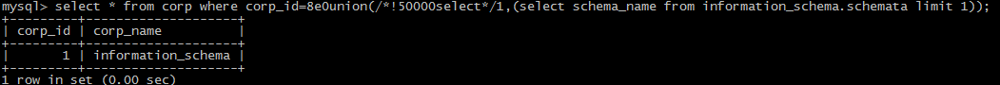
  
single and double quotation marks：
  
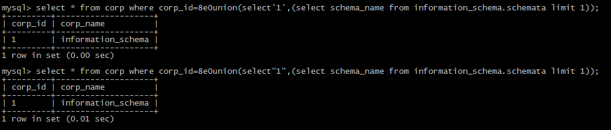
  

  
{ ：
  

  

  
\N symbol:
  
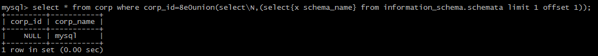
  

  

  
4：the position between select from
  
(1)white space
  
the useful white space in Mysql: %09,%0a,%0b,%0c,%0d,%a0；
  
(2)comment
  
use blank comment
  
the useful blank comment in MYSQL: `/**/` `/letmetest/`
  
(3)other symbols
  
`` symbol
  
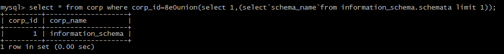
  
+,-,!,~,',"
  
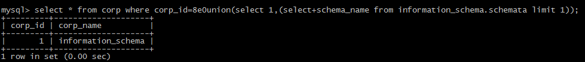
  
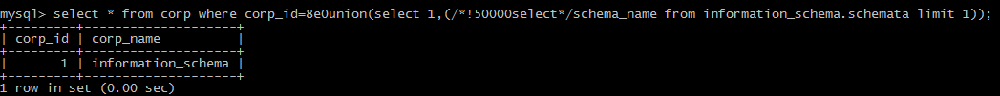
  
{
  

  
(
  
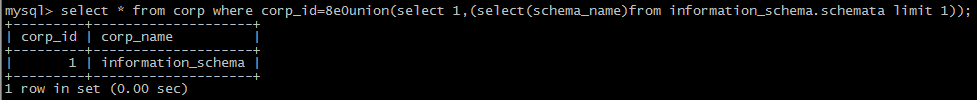
  

  
5：position behind select from
  
(1)white space
  
the useful white space in Mysql: %09,%0a,%0b,%0c,%0d,%a0；
  
(2)comment
  
use blank comment
  
the useful blank comment in MYSQL: `/**/` `/letmetest/`
  
(3)other symbols
  
``
  
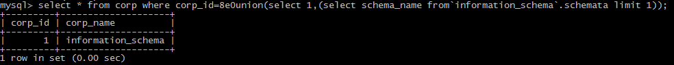
  

  
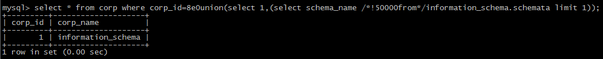
  
{
  
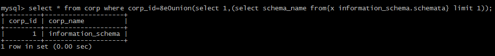
  
(
  

  

  
Ps. white space, comment character, /!50000select*/, {x version} and () can be used in many points, for some special ones, other symbols can be put to use.
  

  
6：common filter functions
  
(1)SUBSTR
  
```
  
Mid(version(),1,1)
  
Substr(version(),1,1)
  
Substring(version(),1,1)
  
Lpad(version(),1,1)
  
Rpad(version(),1,1)
  
Left(version(),1)
  
reverse(right(reverse(version()),1)
  
```
  
(2)concat
  
```
  
concat(version(),'|',user());
  
concat_ws('|',1,2,3)
  
```
  
(3)character conversion
  
Ascii(1) This function is filtered out in a test of a cloud waf, then it needs to use ascii (1).
  
```
  
Char(49)
  
Hex('a')
  
Unhex(61)
  
```
  
7：filter comma
  
(1)the comma at limit:
  
limit 1 offset 0
  
(2)the comma at SUBSTR
  
the comma at mid
  
mid(version() from 1 for 1)
  

  
(3)the comma at union：
  
concat through join.
  
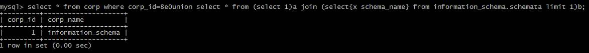
  

  
#### 3.2 sqlserver database
  
1：common filter position
  
(1) the position behind select from
  
white space：
  
01,02,03,04,05,06,07,08,09,0A,0B,0C,0D,0E,0F,10,11,12,13,14,15,16,17,18,19,1A,1B,1C,1D,1E,1F,20
  

  
Need to do urlencode，there are lots of white spaces in sqlserver, it’s not adequate to use black list for block.
  
Comment Symbol Mssql can also use comment symbol `/**/`
  
（2）other symbols
  
"."
  
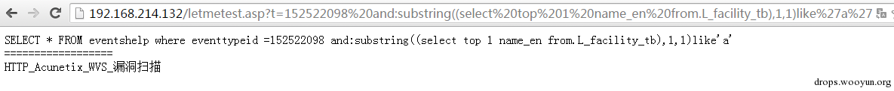
  

  
":"
  
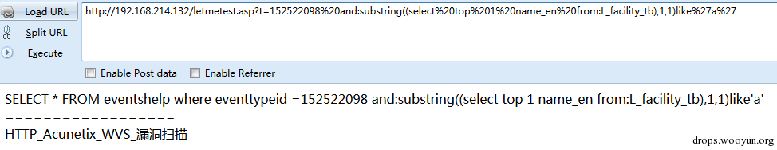
  

  
Comment Symbol Mssql can also use comment symbol `/**/`
  
":"
  
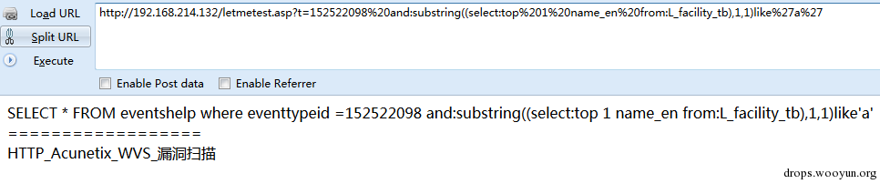
  

  
(3) the position behind and
  
white space：
  
01,02,03,04,05,06,07,08,09,0A,0B,0C,0D,0E,0F,10,11,12,13,14,15,16,17,18,19,1A,1B,1C,1D,1E,1F,20 
  

  
comment symbol
  
Mssql can also use comment symbol /**/
  
":"
  
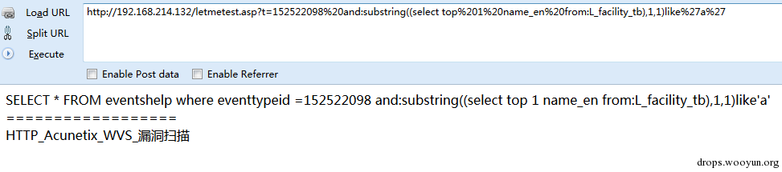
  

  
%2b
  
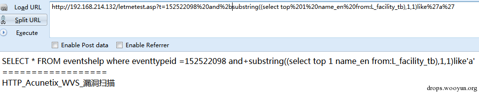
  

  

  
2：common filter functions
  
(1)SUBSTR
  
Substring(@@version,1,1)
  
Left(@@version,1)
  
Right(@@version,1)
  

  
(2) String-Translation Functions
  
Ascii(‘a’) Here the function can add space between the brackets, some loose waf filter can cause bypass.
  
Char(‘97’)
  
(3) other ways
  
Mssql supports multi-statement queries so it can be used; end the above query, and then perform the own statements that you constructed. Dynamic execution.
  
use exec:
  
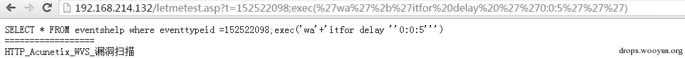
  

  
use sp_executesql:
  
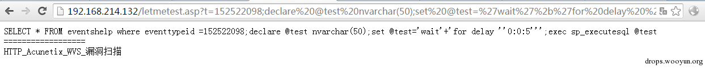
  

  
Use these to combine your parameters and can bypass WAF protection.
  
Using these features and the above mentioned features can bypass the injection protection of safedog.
  

  
### 4 Use WAF layer to bypass
  
1 performance bypass
  
In WAF design, performance will usually be considered. For example, if it’s based on data packets, the packet length will be considered; if it’s based on data flow, the number if a data flow will be checked. Normally they are sort of a check for performance and meanwhile to keep WAF work smoothly, often it will make a bypass design. In performance if the CPU usage is above 80 or memory usage is higher than 80%, it will do check bypass, to ensure the equipment operates smoothly.
  
Equipments like WAF all week on application layer, HTTP, FTP, SMTP are all protocols on application layer. When such data is handled, data and protocol need to be parsed to eventually get application layered data. For instance, what is HTTP method, HTTP querystring or HTTP requestbody. Then match these values obtain in real time with the rules design by WAF. If it matches with a rule, then corresponding handle will be made.
  
(1) performance check bypass
  
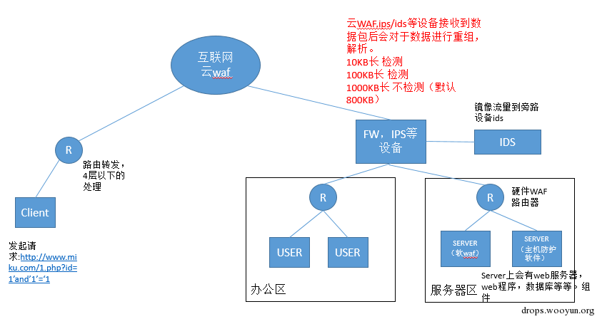
  

  

  
Now the question is how long does it take to check? For example, if I upload a 2G file by HTTP POST, it definitely will occupy CPU and memory usage when checking the entire 2G file. Therefore, a default value may be set in WAF design, which can be the default number of bytes of a flow size or the number of packets.
  
That’s to design a script and constantly populate data into HTTP POST. When data reaches a certain number, the sql inject malicious code in POST will not be checked and realize the purpose of bypass.
  
When testing a cloud WAF, this method is also applicable to achieve the aim to bypass.
  
(2) performance load bypass
  
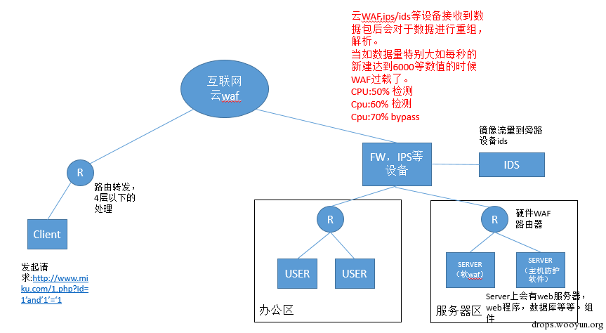
  

  
Some traditional vendors choose to bypass the protection function when performance load is heavy, in case that high performance load like delays, affects user experience. When equipment’s performance load is lower than the threshold value, the protection function will recover.
  

  
This method may not apply to a certain of WAF with high performance, but it applies to some software WAF.
  
Ps.The author tested the following: the author built a payload and added a lot of invalid data to it, so the script failed to send the request, then some of the request went through the WAF, some were blocked. The possible cause of bypass is performance issue.
  

  
2 fuzz bypass
  
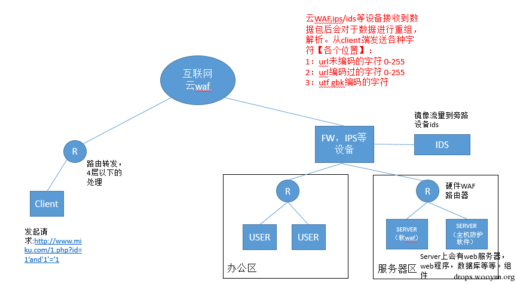
  

  
Use script to detect if WAF equipment has issue in handling with characters, as mentioned above WAF will resolve corresponding data packets when receiving network data. Some WAF may cause issues when resolving some characters, causing universal bypass. Here are some places that we often test:
  
1）：the place that get requests for
  
2）：the place that header requests for
  
3）：the place holding post urlencode contents
  
4）：the places holding post form-data contents
  
The basic contents that fuzz test on
  
1）encoded 0-255 character
  
2）encoding 0-255 character
  
3）utf gbk character
  

  

  
Once in a test for safedog, the data is submitted by using post. The submitted data includes two parameters, one of which is normal fuzz point, the other parameter contains a sql injection statement. In the test of the previous fuzz point, when handling character at \x00, safedog doesn’t block. It is the issue of dealing with the character that leads to bypass.
  
Once in a test for cloud WAF, the data is submitted by using get. The submitted content includes a parameter which is character+sql injection statement. In the test of the fuzz point, when cloud WAF handle the & character, it doesn’t block. Because of the speciality of & character, I guess It is the & character in url request is not handled well that leads to bypass. Since && in mysql can also represent and, therefore a combination of sql statement can achieve the purpose of bypass.
  
Ps.The above fuzz test only tests the single character at each location, there should be more complex tests. WAF is not as perfect as expected, there are other places with issues to fuzz.
  

  
3 whitelist bypass
  
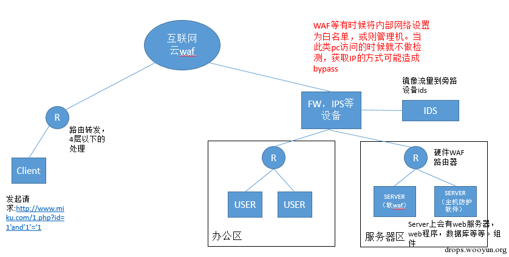
  

  
In WAF design, whitelist is always considered. For example,manage access of IP and can server. Such requests are trusted, don’t have to go through detection procedure.
  
If the IP addresses of the Whitelist are from network layer, bypass is hard to realize. If whitelist is based on the data from application layer, bypass is achievable.
  
This article talks about bypass war by modifying the header of http, here are the contents from the article:
  
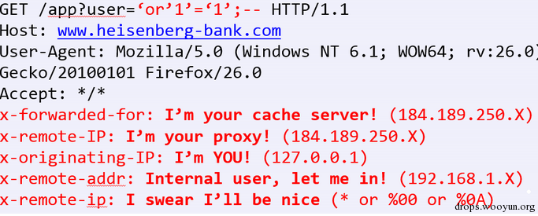
  

  
These headers are usually used to obtain IP addresses and others, like nginx-lua-waf:
  
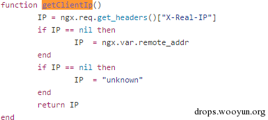
  

  
Obtain clientip by using the header of X-Real-ip.
  
This method can also bypass scenarios such as login locked Ip, login captcha several times and background verification.
  

  
## 0x05 Closing Thoughts
  
Each feature is like a specific scene. Some are discovered by researchers, some remain unknown waiting to be found.
  
As all features are disclosed, the protection ability of WAF will surly be developed against web attack. In my view, when all feature scenarios are covered by WAF, there will be new discoveries rising.(If we know current mysql scenario )
  
So we don’t have worry if all features are covered by WAF and we’ll have no ammunition left. There are so many unknown features waiting to dig up.
  

  
When you find all there postures can’t function well, it’s time to discover new features. After all WAF designers all continue their design by current perception. As new features arise, another round of bypass will come. 
  

  
