原文 by [嘶吼](http://www.4hou.com/web/10659.html)  

DevOps概念的流行跟近些年微服务架构的兴起有很大关系，DevOps是Dev(Development)和Ops(Operations)的结合，Dev负责开发，Ops负责部署上线，Docker出现之前，公司需要搭建一个数据库环境，有了Docker之后，只需在一些开源的基础镜像上构建出公司自己的镜像即可。  

因此目前大多数DevOps设置都在CI管道中的某处设置了Docker，这就意味着你所看到的任何构建环境都将使用Docker等容器解决方案。由于这些构建环境需要接受不可信的用户提供的代码并进行执行，因此探讨如何将这些代码安全地装入容器就显得非常有意义。  

在这篇文章中，我将探讨在构建环境中非常小的错误配置是如何产生严重的安全风险的。  

需要注意的是，我并未在本文描述Heroku，Docker，AWS CodeBuild或容器中的任何固有漏洞，而是讨论了在查看基于Docker容器的多租户构建环境时发现的错误配置漏洞。在常规运行下，虽然Docker容器技术提供了非常稳定的安全默认设置，但是在特殊情况时，有时候小的错误配置就会导致严重安全风险。  

## 特殊的构建环境

可能的特殊构建环境可以具有以下架构：  

1.具有完全托管的生成服务,可编译源代码、运行测试以及生成可供部署的软件包——AWS CodeBuild；  

2.Docker构建服务中的Docker容器；  

Docker容器可以通过Dind（Docker-in-Docker，是让你可以在Docker容器里面运行Docker的一种方式）创建，因此，从理论上来说，你最终得到两个攻击者需要逃脱的容器。使用CodeBuild可进一步最小化攻击面，因为你拥有AWS提供的一次性容器，而且租户不会与对方的构建过程互动。  

## 攻击者是如何控制构建过程的？

在大多数构建或CI管道中要做的第一件事就是创建一个包含你想要构建和部署的代码的Git仓库。然后这些代码将被打包并转移到构建环境，最后应用到docker构建过程。  

通过查看构建服务，你通常可以通过两种方式配置容器，即通过Dockerfile或config.yml，这两种方法都与源代码有关。  

其中有一个CI配置文件，我称之为config-ci.yml，如下图所示。  
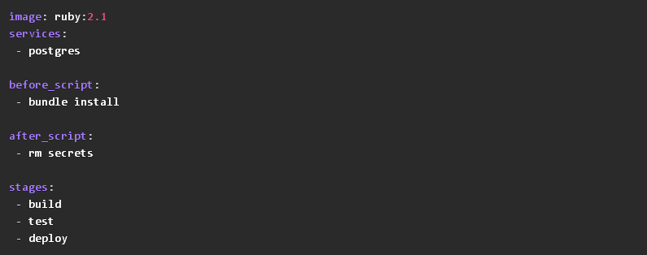  

在其它的构建过程开始之前，该文件将在构建过程中被转换为Dockerfile。如果你有明确指定要使用的Dockerfile环境，可以将config-ci.yml更改为以下内容。  
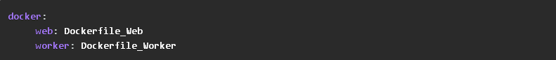    

Dockerfile_Web和Dockerfile_Worker是源代码存储库中Dockerfiles的相对路径和名称，既然现在我已经提供了完整的构建信息，就可以开始构建了。构建通常是通过原始仓库上的代码上传来启动的。启动时，你会看到如下所示的输出内容。  
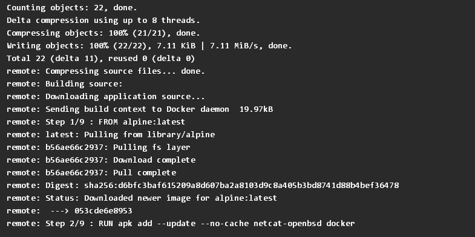    

正如你所看到的，输出的内容有docker build -f Dockerfile。这些内容即对调试过程有用，又对于发现可能出现的攻击有用。  

## 对预构建过程进行攻击

在进入docker构建之前，我首先想到的是尝试并中断构建过程，或者，我可以尝试将来自CodeBuild环境的文件链接到我的Docker构建的上下文中。  

由于我已经控制了config-ci.yml文件的内容，更具体地说，我控制的是“要使用的Dockerfile的相对路径”，所以我可以尝试用一种老式攻击方法——目录遍历攻击。  

第一个尝试就是试着改变构建的目录:    
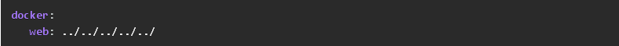  

一旦构建过程开始，我就会立即得到以下错误信息。  
  

有趣的是，该错误是我造成的，并导致了路径泄漏，如果我尝试“读取”文件会发生什么？  
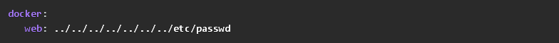   

可以看出，我解析了Docker守护进程的错误。不幸的是，这只针对我系统上的第一行文件。尽管如此，这也是一个有趣的开始。 
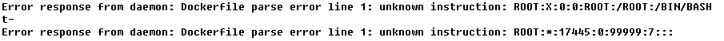    

其实，我这么做的另一个想法是想尝试使用符号链接将文件包含到我的构建中。不过，Docker阻止了我这么做，因为它不会将构建目录之外的文件包含到构建上下文中。  

## 攻击构建过程，以发现漏洞

让我们先回到实际的构建过程，看看可以对什么进行攻击？由于构建过程发生在dind Docker容器中，该容器在一次性CodeBuild实例中运行。为了进一步寻找攻击，docker构建过程会在一次性Docker容器中运行所有命令。Docker的容器是把应用程序和环境打包在一起的，所以是一次构建，多处发布。举个例子，以前你开发完程序后，测试人员和运维人员都需要去部署，通过docker只需要一个run命令即可。因此docker最大的好处就是标准化了应用交互，同时支持多个不同平台和多个不同的云服务商，只要机器能装docker，就能无差别的运行程序。  

所以Docker构建的每一步实际上都是一个新的Docker容器，这从构建过程的输出中就可以看出。  
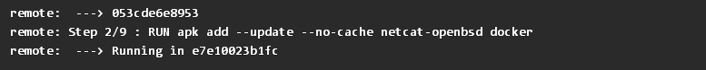    

在上述情况下，在新的Docker容器e7e10023b1fc中执行上面输出代码段中的Step 2/9。因此，即使用户决定在Dockerfile中插入一些恶意代码，它们也应该在一次性隔离容器中运行，而不会造成任何损害，如下所示。  
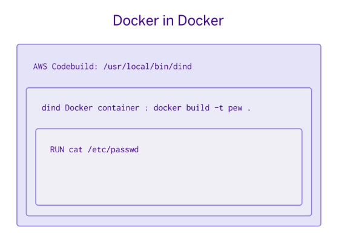   

在发布Docker命令时，这些命令实际上被传递给负责创建/运行/管理Docker镜像的dockerd守护进程。为了继续实现dind，dind需要运行自己的Docker守护进程。然而，由于实现dind的方式是使用主机系统的docker实例（dockerd instance），以允许主机和后台共享Docker镜像，并从Docker的所有缓存中受益。  

如果Dind使用下面的包装脚本启动会发生什么结果：  
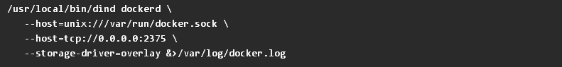   

/usr/local/bin/dind是一个使Docker在容器中运行的包装脚本，该包装脚本确保来自主机的Docker套接字在容器内部可用，因此，此特定配置会引入安全漏洞。  

通常Docker构建过程将无法与Docker守护进程交互，但是，在这种情况下，却可以实现交互。敏锐的观察者可能会注意到，dockerd守护进程的TCP端口也是通过–host=tcp://0.0.0.0:2375进行映射的。通过这种错误配置设置的Docker守护进程会监控容器上的所有接口。因此，这就成了Docker网络功能中的一个漏洞。除非另有说明，否则所有容器都将会被放入相同的默认Docker网络中。这意味着每个容器都能够与其他容器进行通信，而不会受到阻碍。  

现在，我的临时构建容器（执行用户代码的那个容器）已经能够向托管它的dind容器发出网络请求。由于dind容器只是重复使用了主机系统的Docker守护进程，所以我实际上是直接向主机系统AWS CodeBuild发出命令。  

## 实施Dockerfiles攻击

为了测试Dockerfiles攻击，我可以将下面的Dockerfile提供给构建系统，这样我就能够交互访问正在构建的容器。需要说明的是，我这么做只是为了加速寻找漏洞的过程，而不是为了减少等待构建过程的时间。  
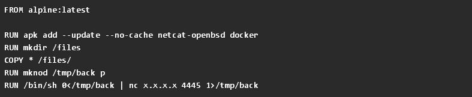    
可以看出，反向shell可以通过很多不同的方式完成。  

这个Dockerfile会安装一些依赖项，即docker和netcat。然后它们会将我的源代码目录中的文件复制到构建容器中。这将在后来的步骤中用到，除此之外，这么做还可以更容易地将我的完整漏洞快速传输到系统。由于mknod指令会创建一个文件系统节点，以允许通过文件重定向stdin和stdout。使用netcat可以打开一个反向shell，除此之外，我还需要在我使用公共IP地址控制的系统上为此反向shell设置监控器。  
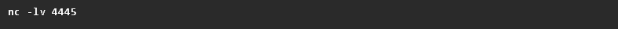   
这样，当构建发生时，我将收到一个反向连接。  
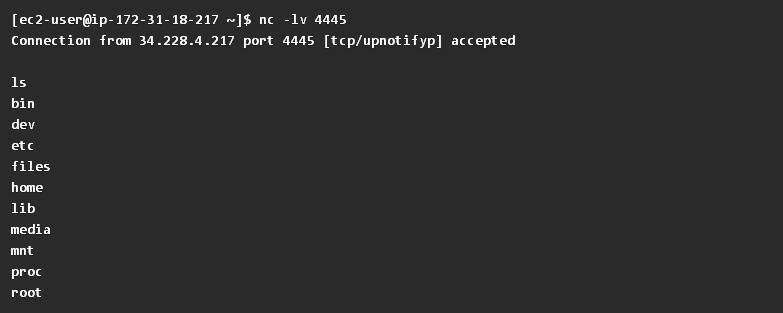   
现在通过远程交互式访问，我就可以检查是否能对Docker守护进程进行访问。  
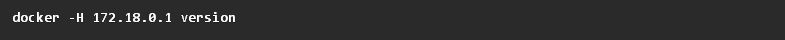   
我会使用-H 172.18.0.1来指定远程主机，由于我发现Docker使用的网络范围是172.18.0.0/16，因此使用了此地址。为了找到这个远程主机，我的交互式shell被用来充作ip addr和ip route，以获得分配给我的构建容器的网络。请注意，默认情况下，所有Docker容器都将被放入同一个网络，默认网关将是运行Docker守护进程的实例。  
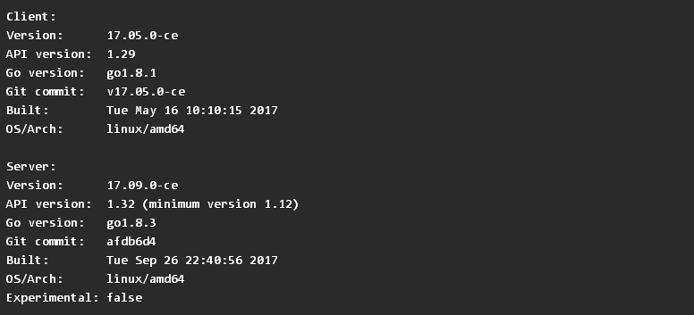   
这样漏洞就会被成功发现，此时我可以从正在构建的容器中访问Docker，以便在下一步启动一个具有额外特权的新容器。  

## 进行栈处理

此时，我已有一个shell，不过它还是位于一次性的构建容器中，作用不是很大。另外，我也可以访问Docker守护进程。于是我就想，把这两者结合起来会怎么样？为此，我引入了第二个Dockerfile，它会在构建和运行时创建一个反向shell。以下就是我启动第二个监控器来捕获的新的shell。  
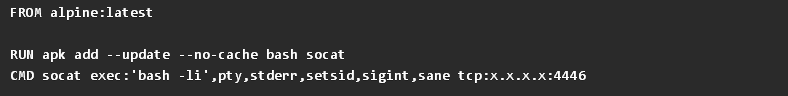   
这将作为Dockerfile2保存在源代码目录中，现在，当源代码文件被复制到构建容器中时，我可以直接访问它了。  

当我重新运行构建过程时，我将在端口4445上获得我的第一个反向shell，这样我就可以留在构建容器中。现在我可以构建Dockerfile2，它被复制到COPY * /files/中的构建容器中。  
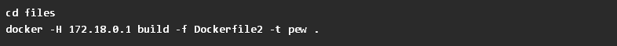   
现在我可以使用主机Docker守护进程并构建一个新的可用Docker映像，我只需要运行它即可。不过这里有个小的技巧，就是我需要通将根目录映射到新的Docker容器，这可以通过-v/:/vhost完成。  

以下是我得到的第一个反向shell：  
   
现在，一个新的反向shell就会连接到攻击系统上的4446端口。这样我就将处于一个新的容器中，并直接访问底层CodeBuild主机的文件系统和网络。这首先是因为–net=host将通过主机网络映射，而不是将容器保存在一个独立的隔离网络中。其次，因为Docker守护进程正在主机系统上运行，所以当使用-v /:/vhost的文件映射完成时，主机系统的文件系统将被映射。  
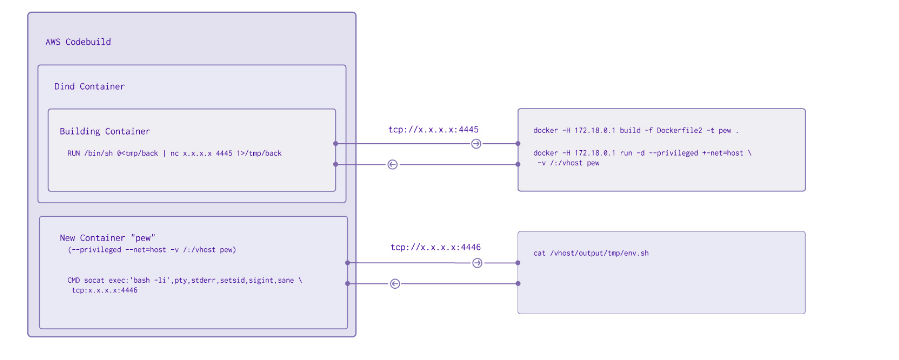   
这样在新的反向shell中，我现在就可以探索底层的主机文件系统了。通过检查以下两个之间的区别，我就可以证明我在与此文件系统交互时不在Docker中。  
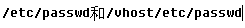   

在/vhost中我还发现有一个新的目录，它可以清楚地表明我在CodeBuild实例文件系统中，而不是在任何Docker容器中。  
   

这样在codebuild里，就会出现一个神奇的结果。这是AWS Codebuild用来控制构建环境的内容，快速浏览一下可以看到一些有趣的数据。  
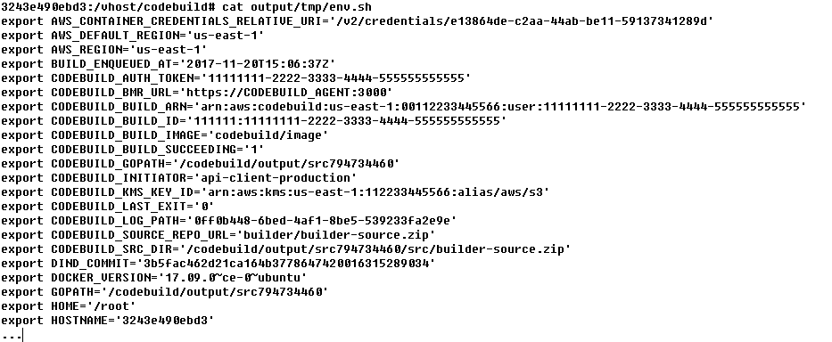  

此时，我通常会尝试提取AWS凭证和数据透视表，为此，我需要使用AWS_CONTAINER_CREDENTIALS_RELATIVE_URI。  
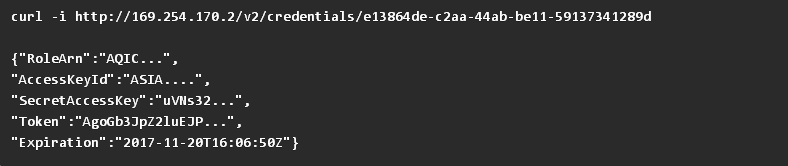  

根据与该IAM相关的权限，现在应该有机会绕过AWS环境。  
上述步骤可自动化实现，并且只需要一个反向shell即可完成，但是，请记住，你需要保持正常的构建环境。请注意，大多数构建环境会在30-60分钟后自动删除。  

## 缓解措施

在这种情况下，修复非常简单，永远不要将Docker守护进程绑定到所有接口上。从包装脚本中删除–host=tcp://0.0.0.0:2375 行也可以来修复这个漏洞。另外，不需要绑定到TCP端口，因为unix套接字已经通过了–host=unix:///var/run/docker.sock映射。  

## 总结

虽然容器策略提供了一个很好的机制，来让你创建运行不受信任代码的安全环境，而不需要额外的虚拟化过程。然而，这些容器的安全性与它们的配置一样。默认情况下，它们非常安全，但只需一个小的配置错误就可以让整个安全环境崩塌。  

## Reference
https://blog.heroku.com/exploration-of-security-when-building-docker-containers  
