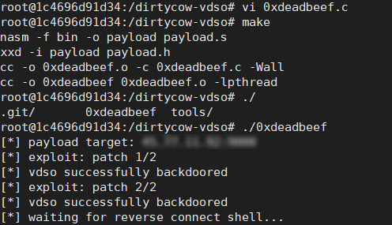
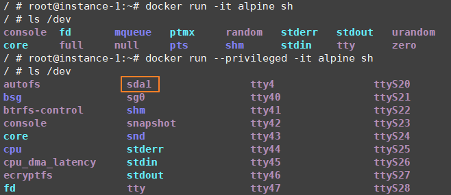

原文 by [docker安全杂谈](https://0x0d.im/archives/docker-security.html?from=groupmessage&isappinstalled=0)  

最近在看 Docker 安全方面的资料，根据 Docker 官方的 [Docker security non-events](https://docs.docker.com/engine/security/non-events/) 来看，大部分漏洞都是系统调用函数如 `keyctl()`、`ptrace()` 之类的锅，还有一部分是 Linux 的内核漏洞，比如去年影响很大的 `DirtyCow`。    
因为容器和宿主机是共用内核的，所以如果宿主机的内核没升级的话，直接在容器里打 [Exploit](https://github.com/gebl/dirtycow-docker-vdso) 就能获得宿主机权限了。    

按照 [Dirty COW - (CVE-2016-5195) - Docker Container Escape](https://blog.paranoidsoftware.com/dirty-cow-cve-2016-5195-docker-container-escape/) 一文试了下，效果还是不错的：  

  

不过 AWS、GKE、Aliyun 之类的 CaaS 服务商肯定早就升级过系统内核，而且云平台一般都是在 KVM 上跑 Docker，所以就算逃出了 Docker 还得逃出虚拟机才能接触到真正的服务器。  
关于这方面 360 的大佬已经有过介绍（[Escape From The Docker-KVM-QEMU Machine](http://conference.hitb.org/hitbsecconf2016ams/wp-content/uploads/2015/11/D1T1-Shengping-Wang-and-Xu-Liu-Escape-From-The-Docker-KVM-QEMU-Machine.pdf)），虽然我看不懂…   

之前的文章里讨论了一些[攻击 Docker 编排和管理系统](https://0x0d.im/archives/attack-container-management-platform.html)  的方法，主要是未授权访问的问题。    
我在测试的时候发现 `Mesos` 文档中没有挂载宿主机目录的方法，其实是需要通过 `Marathon` 在创建容器的时候挂载，当时没有深入研究就放弃了。    

在看文档时发现有一个有趣的选项 privileged。参考 [Privileged containers and security](https://groups.google.com/forum/#!topic/docker-user/RWLHyzg6Z78)  的讨论，这个选项是用来方便容器访问宿主机挂载的设备的，同时给了容器一些其他的能力(具体多了哪些还不清楚）。    

> When the operator executes docker run --privileged, Docker will enable to access to all devices on the host as well as set some configuration in AppArmor or SELinux to allow the container nearly all the same access to the host as processes running outside containers on the host. Additional information about running with --privileged is available on the [Docker Blog](https://blog.docker.com/2013/09/docker-can-now-run-within-docker/).  

设计这个选项最初是用来运行 `Docker in Docker` 的容器，构建持续集成环境的。但后来原作者也觉得这个选项不太安全，写了一篇文章 [Using Docker-in-Docker for your CI or testing environment? Think twice](http://jpetazzo.github.io/2015/09/03/do-not-use-docker-in-docker-for-ci/)。      

为什么说 privileged 不安全呢？看到一个利用 Unix socket 来传递文件描述符最终读取其他用户文件（flag）的例子：[32C3 CTF: Docker writeup](https://kitctf.de/writeups/32c3ctf/docker)。  
这个例子里因为 Docker 容器运行时指定了 --net=host，所以容器内可以访问宿主机的网络资源。  
由于 privileged 会给予容器所有的 Capabilities，那么当 docker run 时加上了 --privileged 时或许产生更大的隐患。  

前面说到 privileged 让容器可以访问宿主机挂载的设备，参考 [Privileged Docker Containers](http://obrown.io/2016/02/15/privileged-containers.html)，我们看看使用 privileged 前后 /dev 目录下有什么不同：  

    

很明显宿主机的根文件系统 sda1 居然也可以被访问到，至于利用方式就不赘述了。        

另外看到一篇有趣的文章 [Capturing all the flags in BSidesSF CTF by pwning our infrastructure](https://hackernoon.com/capturing-all-the-flags-in-bsidessf-ctf-by-pwning-our-infrastructure-3570b99b4dd0)，打 CTF 时主办方比赛平台被搞掉我们都听说过，但在 GKE 上用了 Kubernetes 还被攻破就很神奇了。    

原来 Kubernetes 有个叫 Service Account 的东西，参考在 [Kubernetes Pod 中使用 Service Account 访问 API Server](http://tonybai.com/2017/03/03/access-api-server-from-a-pod-through-serviceaccount/)，这个 Service Account 是给内部的 Pods 访问 API 用的。引用 [Kubernetes 技术分析之安全](http://dockone.io/article/599) 里的一段话：      

Service Account 概念的引入是基于这样的使用场景：运行在 Pod 里的进程需要调用 Kubernetes API 以及非 Kubernetes API 的其它服务（如 image repository/被 mount 到 Pod 上的 NFS volumes 中的 file 等）。    
我们使用 Service Account 来为 Pod 提供 id。 Service Account 和 User Account 可能会带来一定程度上的混淆，User Account 可以认为是与 Kubernetes 交互的个体，通常可以认为是 human，目前并不作为一个代码中的类型单独出现，比如第一节中配置的用户，它们的区别如下：       

* User Account 通常是为 human 设计的，而 Service Account 则是为跑在 pod 里的 process。
* User Account 是 global 的，即跨 namespace 使用；而 Service Account 是 namespaced 的，即仅在所属的namespace 下使用。
* 创建一个新的 User Account 通常需要较高的特权并且需要经过比较复杂的 business process（即对于集群的访问权限的创建），而 Service Account 则不然。  

Kubernetes 默认会挂载 `/run/secrets/kubernetes.io/serviceaccount/token` 到各个 Pod 里，但这样会导致攻击者进入容器后读取 token 就能和 Kubernetes API 通信了，详细攻击过程可以看看：[sfbsidesctfpwn.md](https://gist.github.com/tmc/8cd2364f7b6702ac6318c64a3d17e32d)。    

Kubernetes 1.6 版加上了 RBAC 认证来解决这个问题，但是我个人觉得对基于 Kubernetes 的云平台的影响不大，因为 Service Account 只会影响同一个 namespace 下的 Pods，而租户间的 namespace 肯定是不一样的。另外一些云平台经过测试发现没有使用 Service Account 而是通过 keystone 的 API 获取 token。  

最后该文章提到 GKE 和 AWS 之类的云平台会在本地提供元数据服务供开发者获得自己私有仓库的认证信息，如在 GKE 的机器上执行  
`curl http://metadata.google.internal/computeMetadata/v1beta1/instance/service-accounts/default/token`  
就能获得访问自己 Docker 仓库的 token，一旦出现 SSRF，攻击者就能从你的私有镜像源窃取镜像了（当然需要想办法知道项目名和镜像名）。  