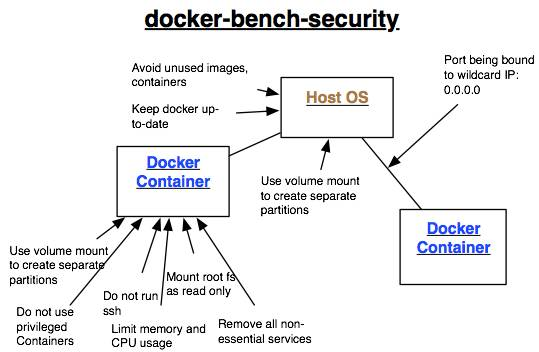
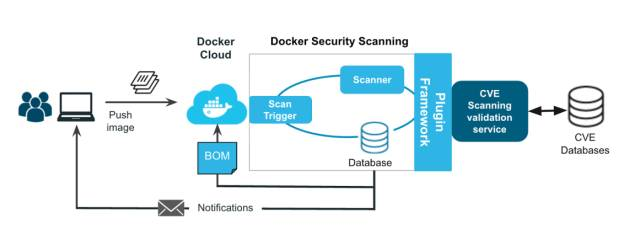
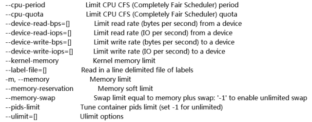
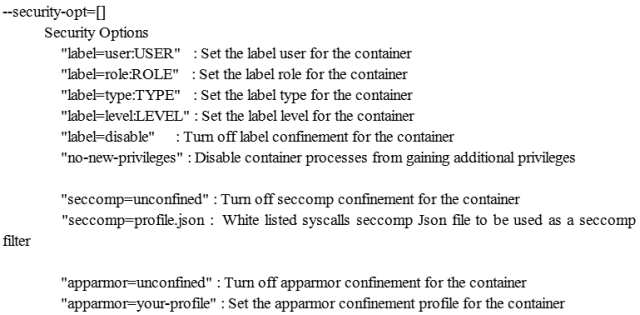

原文 by [从自身漏洞和架构缺陷，谈docker安全建设](https://mp.weixin.qq.com/s?__biz=MzI4NTA1MDEwNg==&mid=2650762256&idx=2&sn=39ecb1b246bf889e77b3a3825c764d3a&chksm=f3f9d985c48e509300153d0989d0cb7515a2f6fedca5bd6013f8dcd396aae9afdcb3be9c6d66&mpshare=1&scene=1&srcid=09196ffrRNIPbgZEdk0Xq5Qv#rd)  

与其它介绍Docker的文章不同，本文专注于分析Docker安全。第一部分介绍Docker存在的安全问题、整套Docker应用架构的安全基线以及安全规则，重头戏是Docker安全规则的各种思路和方案，第一部分重点介绍Docker官方安全建议。第二部分是Docker安全规则的各种思路与方案的详细实现，包括技术选型、应用部署、功能使用以及如何与企业或组织的Docker容器编排系统、仓库集成等具体问题，这部分更多是介绍业界实现。  

## Docker简介

按照Docker官方的介绍：Docker是世界领先的容器平台。开发人员使用Docker在与同事协作代码时消除“在我的机器上工作”的问题。 运营商使用Docker在并行容器中并行运行和管理应用程序，以获得更好的计算密度。企业使用Docker构建敏捷软件交付管道，以更快，更安全，更可靠地为Linux和Windows Server应用程序提供新功能。挺拗口的，大概是这么一回事。  

说起容器，很容易想到虚拟机，人们也热衷于讨论虚拟机与容器的区别，那么，本文也不能免俗，下面就来对比一下两者，从而突出Docker容器的不同之处。  

## Docker与虚拟机的区别

### 隔离与共享：

虚拟机通过添加hypervisor层，虚拟出网卡，内存，CPU等虚拟硬件，再在其上建立客户机，每个客户机都有自己的系统内核。而docker容器则是通过隔离的方式，将文件系统，进程，设备，网络等资源进行隔离，再对权限，CPU资源等进行控制，最终让容器之间互不影响，容器无法影响宿主机。容器与宿主机共享内核，文件系统，硬件等资源。  

### 性能与损耗：

与虚拟机相比，容器资源损耗要小得多。 同样的宿主机下，能够建立容器的数量要比虚拟机多得多。  

### 安全性：

但是虚拟机的安全性要比容器好一些，要从虚拟机突破到宿主机或其他虚拟机，需要先突破hypervisor层，这是极其困难的。 而docker容器与宿主机共享内核，文件系统等资源，更有可能对其他容器，宿主机产生影响。  
  


## Docker存在的安全问题

下面进入正题，从攻击树上来讲，Docker的安全问题如下图所示：  
    


## Docker自身漏洞

Docker作为一款应用本身实现上会有代码缺陷。CVE官方记录docker历史版本共有超过20项漏洞，参见 https://docs.docker.com/engine/security/non-events/ 。主要有代码执行，权限提升，信息泄露，绕过这几类。现在Docker已经到了17.03版本，版本更迭非常快，docker用户最好将docker升级为最新版本。    

## Docker源问题

Docker提供了docker hub可以让用户上传创建的镜像，以便其他用户下载，快速搭建环境。但同时也带来了一些安全问题。下载的镜像被恶意植入后门，传输的过程中镜像被篡改， 镜像所搭建的环境是否本身就包含漏洞等等，不一而足。主要介绍下面三种：  

### 黑客上传恶意镜像
如果有黑客在制作的镜像中植入木马，后门等恶意软件，那么环境从一开始就已经不安全了，后续更没有什么安全可言。  

### 镜像使用有漏洞的软件
据一些报告显示，hub上能下载的镜像里面，75%的镜像都安装了有漏洞的软件，所以下载镜像后，需要检查里面软件的版本信息，对应的版本是否存在漏洞，并及时更新打上补丁。  

### 中间人攻击篡改镜像
镜像在传输过程中可能被篡改，目前新版本的Docker已经提供了相应的校验机制来预防这个问题。  

## Docker架构缺陷与安全机制

由Docker本身的架构与机制可能产生的问题，这一攻击场景主要产生在黑客已经控制了宿主机上的一些容器（或者通过在公有云上建立容器的方式获得这个条件），然后对宿主机或其他容器发起攻击来产生影响。  

### 容器之间的局域网攻击

同一主机上的容器之间可以构成局域网，因此针对局域网的ARP欺骗，嗅探，广播风暴等攻击方式便可以用上。所以在一个主机上部署多个容器需要合理的配置网络，设置iptable规则。  

### DDoS攻击耗尽资源

cgroups安全机制就是要防止此类攻击的，不要为单一的容器分配过多的资源即可避免此类问题。  

### 调用有漏洞的系统调用

我们都知道Docker与虚拟机的一个区别就是，Docker与宿主公用一个操作系统内核，一旦宿主内核存在可以横向越权或者提权漏洞，那么尽管Docker使用普通用户执行，一旦容器被入侵，攻击者还是可以利用内核漏洞逃逸到宿主，做更多事情。  

### 共享root

如果以root权限运行容器，容器内的root用户也就拥有了宿主机的root权限。  

### 未隔离的文件系统

虽然Docker已经对文件系统进行隔离，但是有一些重要的系统文件暂时没有被隔离，如/sys, /proc/sys, /proc/bus等。  

## Docker安全基线

这部分结合了Docker官方文档与陈爱珍的《如何打造安全的容器云平台》整理而成，从内核、主机、网络、镜像、容器以及其他等6大方面总结了Docker安全基线标准。  
    


### 内核级别

* 及时更新内核
* User NameSpace（容器内的root权限在容器之外处于非高权限状态）
* Cgroups（对资源的配额和度量）
* SELiux/AppArmor/GRSEC（控制文件访问权限）
* Capability（权限划分）
* Seccomp（限定系统调用）
* 禁止将容器的命名空间与宿主机进程命名空间共享

### 主机级别

* 为容器创建独立分区
* 仅运行必要的服务
* 禁止将宿主机上敏感目录映射到容器
* 对Docker守护进程、相关文件和目录进行审计
* 设置适当的默认文件描述符数
* 用户权限为root的Docker相关文件的访问权限应该为644或者更低权限
* 周期性检查每个主机的容器清单，并清理不必要的容器

### 网络级别
* 通过iptables设定规则实现禁止或允许容器之间网络流量
* 允许Dokcer修改iptables
* 禁止将Docker绑定到其他IP/Port或者Unix Socket
* 禁止在容器上映射特权端口
* 容器上只开放所需要的端口
* 禁止在容器上使用主机网络模式
* 若宿主机有多个网卡，将容器进入流量绑定到特定的主机网卡上

### 镜像级别

* 创建本地镜像仓库服务器
* 镜像中软件都为最新版本
* 使用可信镜像文件，并通过安全通道下载
* 重新构建镜像而非对容器和镜像打补丁
* 合理管理镜像标签，及时移除不再使用的镜像
* 使用镜像扫描
* 使用镜像签名

### 容器级别
* 容器最小化，操作系统镜像最小集
* 容器以单一主进程的方式运行
* 禁止privileged标记使用特权容器
* 禁止在容器上运行ssh服务
* 以只读的方式挂载容器的根目录系统
* 明确定义属于容器的数据盘符
* 通过设置on-failure限制容器尝试重启的次数
* 限制在容器中可用的进程树，以防止fork bomb

### 其他设置

* 定期对宿主机系统及容器进行安全审计
* 使用最少资源和最低权限运行容器
* 避免在同一宿主机上部署大量容器，维持在一个能够管理的数量
* 监控Docker容器的使用，性能以及其他各项指标
* 增加实时威胁检测和事件响应功能
* 使用中心和远程日志收集服务

## Docker安全规则

Docker安全规则其实属于Docker安全基线的具体实现，不过对于Docker官方提出的方案本文会直接给出实现方式，而对于第三方或者业界使用的方案，则只是介绍基本规则，具体实现方案会在本系列下部分介绍。  

### 容器最小化

仅在容器中运行必要的服务，像ssh等服务是绝对不能开启的。使用以下方式来管理你的容器：  
`docker exec -it mycontainer bash`  

### Docker remote api访问控制

Docker的远程调用API接口存在未授权访问漏洞，至少应限制外网访问。如果可以，建议还是使用socket方式访问。  

建议监听内网ip或者localhost，docker daemon启动方式：  
```
docker -d -H uninx:///var/run/docker.sock  -H tcp://10.10.10.10:2375#或者在docker默认配置文件指定
other_args=" -H  unix:///var/run/docker.sock -H tcp://10.10.10.10:2375"
```
然后在宿主iptables上做访问控制  
```
*filter:
HOST_ALLOW1 - [0:0]
-A HOST_ALLOW1 -s 10.10.10.1/32 -j ACCEPT
-A HOST_ALLOW1 -j DROP
-A INPUT -p tcp -m tcp -d 10.10.10.10 --port 2375 -j HOST_ALLOW1
```
### 限制流量流向  

可以使用以下Iptables过滤器限制Docker容器的源IP地址范围与外界通讯。  
```
Iptables -A FORWARD -s <source_ip_range> -j REJECT --reject-with icmp-admin-prohibited
Iptables -A FORWARD -i docker0 -o eth0 -j DROP
Iptables-A FORWARD -i docker0 -o eth0 -m state –state ESTABLISHED -j ACCEPT
```
### 使用普通用户启动Docker服务

截至Docker 1.10用户命名空间由Docker守护程序直接支持。此功能允许容器中的root用户映射到容器外部的非uid-0用户，这可以帮助减轻容器中断的风险。此功能可用，但默认情况下不启用。  

1、使用用户映射  
要解决特定容器中的用户0在宿主系统上等于root的问题，LXC允许您重新映射用户和组ID。配置文件条目如下所示：  
```
lxc.id_map = u 0 100000 65536
lxc.id_map = g 0 100000 65536
```
这将容器中的前65536个用户和组ID映射到主机上的100000-165536。主机上的相关文件是/etc/subuid和/etc/subgid。此映射技术命名为从属ID，因此称为“子”前缀。  

对于Docker，这意味着将其作为-lxc-conf参数添加到docker run：  
`docker run -lxc-conf ="lxc.id_map = u 0 100000 65536" -lxc-conf ="lxc.id_map = g 0 100000 65536"`  

2、启动容器时不带--privileged参数  
`docker run -it debian8:standard /bin/bash`  

### 文件系统限制

挂载的容器根目录绝对只读，而且不同容器对应的文件目录权限分离，最好是每个容器在宿主上有自己单独分区。  
```
su con1
docker run -v dev:/home/mc_server/con1 -it debian8:standard /bin/bash
su con2
docker run -v dev:/home/mc_server/con2 -it debian8:standard /bin/bash
```

### 镜像安全

如下图所示，在镜像仓库客户端使用证书认证，对下载的镜像进行检查 ，通过与CVE数据库同步扫描镜像，一旦发现漏洞则通知用户处理，或者直接阻止镜像继续构建。  

如果使用的是公司自己的镜像源，可以跳过此步；否则至少需要验证baseimage的md5等特征值，确认一致后再基于baseimage进一步构建。  

一般情况下，我们要确保只从受信任的库中获取镜像，并且不要使用`--insecure-registry=[]`参数。具体实现我们在漏洞扫描部分一块介绍。   
    

### Docker client端与Docker Daemon的通信安全

按照Docker官方的说法，为了放置链路劫持、会话劫持等问题导致Docker通信时被中间人攻击，c/s两端应该通过加密方式通讯。  

`docker –tlsverify –tlscacert=ca.pem –tlscert=server-cert.pem –tlskey=server-key.pem  -H=0.0.0.0:2376`  

### 资源限制

限制容器资源使用，最好支持动态扩容，这样既可以尽可能降低安全风险，也不影响业务。下面是使用样例，限制cpu使用第2核、分配2048：  

`docker run -tid –name ec2 –cpuset-cpus 3 –cpu-shares 2048 -memory 2048m –rm –blkio-weight 100 --pids--limit 512`  

更多限制可以参考Docker官方说明：    
      


### 宿主及时升级内核漏洞

使用Docker容器对外提供服务时，还要考虑宿主故障或者需要升级内核的问题。这时为了不影响在线业务，Docker容器应该支持热迁移，这个可以纳入容器调度系统的功能设计中。此外，还应考虑后续的内核升级方案规划、执行以及回迁方案等。  

### 避免Docker容器中信息泄露

就像之前Github上大量泄露个人或企业各种账号密码的问题，我们一般使用dockerfile或者docker-compose文件创建容器，如果这些文件中存在账号密码等认证信息，一旦Docker容器对外开放，则这些宿主机上的敏感信息也会随之泄露。因此可以通过以下方式检查容器创建模板的内容：  
```
# check created users
grep authorized_keys $dockerfile
# check OS users
grep "etc/group" $dockerfile
# Check sudo users
grep "etc/sudoers.d" $dockerfile
# Check ssh key pair
grep ".ssh/.*id_rsa" $dockerfile
# Add your checks in below
```

### 安装安全加固

如果可能，使用安全的Linux内核、内核补丁。如SELinux，AppArmor，GRSEC等，都是Docker官方推荐安装的安全加固组件。  

如果先前已经安装并配置过SELinux，那么可以在容器使用setenforce 1来启用它。Docker守护进程的SELinux功能默认是禁用的，需要使用--selinux-enabled来启用。容器的标签限制可使用新增的—-security-opt加载SELinux或者AppArmor的策略进行配置，该功能在Docker版本1.3[9]引入。例如：  

`docker run --security-opt=secdriver:name:value -i -t centos bash`  

SELinux的相关选项：  


AppArmor的选项：  

`--secutity-opt ="apparmor:PROFILE"（设置AppArmor配置文件）`

GRSEC的选项：  

`gradm -F -L /etc/grsec/learning.logs`  

GRSEC的更多说明请参考：https://en.wikibooks.org/wiki/Grsecurity  

### 限制系统命令调用

1 系统调用层面  

Linux系统调用列表见：  
http://www.ibm.com/developerworks/cn/linux/kernel/syscall/part1/appendix.html  

Seccomp（secure computing mode），就是安全计算模式，这个模式可以设置容器在对系统进行调用时进行一些筛选，也就是所谓的白名单。它可以去指定允许容器使用哪些的调用，禁止容器使用哪些调用，这样就可以增强隔离，它其实也是访问控制的一个部分。  

2 函数调用层面  

通过使用“–security-optseccomp=<profile>”标记来指定自定义的seccomp描述文件：  

`$ docker run -d –security-opt seccomp:allow:clock_adjtime ntpd`  
这条命令将会允许容器内使用clock_adjtime调用  

`$docker run -d –security-opt seccomp:deny:getcwd /bin/sh`  
这条命令将会禁止容器内执行的shell查询当前自己所在的目录  
   


在没有缺省secconf配置文件的情况下运行，可以通过unconfined运行配置不在默认seccomp配置文件的容器。  
`$ docker run --rm -it --security-opt seccomp =ulimit-debian：jessie \ unshare --map-root-user --user sh -c whoami`  

### suid和guid限制

SUID和GUID程序在受攻击导致任意代码执行（如缓冲区溢出）时将非常危险，因为它们将运行在进程文件所有者或组的上下文中。如果可能的话，使用特定的命令行参数减少赋予容器的能力，阻止SUID和SGID生效。  

`docker run -it --rm --cap-drop SETUID --cap-drop SETGID`  

还有种做法，可以考虑在挂载文件系统时使用nosuid属性来移除掉SUID能力。最后一种做法是，删除系统中不需要的SUID和GUID程序。这类程序可在Linux系统中运行以下命令而找到：  
```
find / -perm -4000 -exec ls -l {} \; 2>/dev/null
find / -perm -2000 -exec ls -l {} \; 2>/dev/null
```
然后，可以使用类似于下面的命令将移除SUID和GUID文件权限：  

`sudo chmod u-s filename sudo chmod -R g-s directory`  

### 能力限制

尽可能降低Linux能力。  

Docker默认的能力包括：`chown、dac_override、fowner、kill、setgid、setuid、setpcap、net_bind_service、net_raw、sys_chroot、mknod、setfcap、和audit_write`。在命令行启动容器时，可以通过`--cap-add=[]`或`--cap-drop=[]` 进行控制。例如：  

`docker run --cap-drop setuid --cap-drop setgid -ti <container_name> /bin/sh`  

此功能在Docker 1.2版本引入。  

### 多租户环境

由于Docker容器内核的共享性质，无法在多租户环境中安全地实现责任分离。建议将容器运行在没有其它目的，且不用于敏感操作的宿主上。可以考虑将所有服务迁移到Docker控制的容器城。可能的话，设置守护进程使用--icc=false，并根据需要在docker run时指定-link，或通过—-export=port暴露容器的一个端口，而不需要在宿主上发布。将相互信任的容器的组映射到不同机器上。  

### 完全虚拟化

使用一个完全虚拟化解决方案来容纳Docker，如KVM。如果容器内的内核漏洞被发现，这将防止其从容器扩大到宿主上。类似Docker-in-Docker工具，Docker镜像可以嵌套来提供该KVM虚拟层。  

### 日志分析

收集并归档与Docker相关的安全日志来达到审核和监控的目的，一般建议使用rsyslog或stdout+ELK的方式进行日志收集、存储与分析，因为Docker本身要求轻量，所以不建议像虚拟机或者物理机上安装安全agent，这时实时威胁检测和事件响应功能就要依赖实时日志传输和分析了。可以在宿主上使用以下命令在容器外部访问日志文件：  

`docker run -v /dev/log:/dev/log <container_name> /bin/sh`  

使用Docker内置命令：  

`docker logs ... (-f to follow log output)`  

日志文件也可以导出成一个压缩包实现持久存储：`docker export`  

### 漏洞扫描

前面的镜像安全，跟这里的漏洞扫描关联很密切，可以使用相同的工具去实现安全扫描，不过漏洞扫描更倾向于外部检测，镜像安全则需要镜像仓库和CI系统联动，始终不是一回事，所以分来介绍。    

下面介绍5款用于Docker漏洞扫描的工具，它们各有千秋，从镜像到容器，从宿主到容器，从dockerfile到docker-compose，从安全基线检查与漏洞发现，从容器安全到性能优化，均有覆盖。    

1 docker-slim  

参考：https://github.com/docker-slim/docker-slim  

创建小容器需要大量的巫术魔法，它可以是相当痛苦的。你不应该丢掉你的工具和你的工作流程。使用Docker应该很容易。docker-slim是一个容器的魔法减肥药。它将使用静态和动态分析为你的应用程序创建一个紧凑的容器。  

2 Docker Bench for Security

参考：https://github.com/docker/docker-bench-security  
Docker Bench for Security是一个脚本，用于检查在生产环境中部署Docker容器的几十个常见的最佳实践，测试都是自动化的，受CIS Docker 1.13基准的启发而来。  

3 Clair

参考：https://github.com/coreos/clair   

Clair是一个用于静态分析应用程序容器（目前包括appc和Docker）中的漏洞的开源项目。基于K8S，将镜像上传到clair所在机器扫描即可。从已知的一组源连续导入漏洞数据，并与容器映像的索引内容相关联，以便产生威胁容器的漏洞的列表。当漏洞数据在上游发生变化时，可以传递通知，并且API会查询以提供漏洞的先前状态和新状态以及受这两者影响的图像。  

4 Container-compliance

参考：https://github.com/OpenSCAP/container-compliance  

Container-compliance是基于OpenSCAP的用于评估镜像、容器合规性的资源和工具。  

5 Lynis

参考：https://cisofy.com/lynis/plugins/docker-containers/

Lynis本身是一套Linux/Unix系统安全审计的shell脚本，执行时系统消耗很低。Lynis-docker是Lynis的一个插件，这个插件收集关于Docker配置和容器的信息。  

### 端口扫描

很多人认为，容器被入侵带来的风险，远比不上物理机和传统虚拟机，于是他们直接把Docker容器对外网开放，而且不配置任何访问控制。另外，也会存在宿主iptables错误调导致容器直接对外开放的问题存在，于是，这时针对容器进行快速批量的端口快速扫描显得很有必要。目前Nmap/Masscan这两款工具用的比较多。  

Nmap支持tcp/udp端口扫描以及自定义插件扫描任意漏洞，是最著名、应用最广的端口扫描器。masscan的扫描结果类似于nmap，在内部，它更像scanrand, unicornscan, and ZMap，采用了异步传输的方式。它和这些扫描器最主要的区别是，它比这些扫描器更快。  

参考：https://github.com/robertdavidgraham/masscan  

## 总结

上面介绍了很多配置、工具，如果要应用到生产环境，还是需要大量调研的，所以本文的下半部分会结合将它们联动起来，深入到应用部署、功能使用以及如何与企业或组织的Docker容器编排系统、仓库集成等具体实现，形成一套企业级Docker安全解决方案，敬请期待。  

## Reference
Docker官方Docker安全文档：https://docs.docker.com/engine/security  
关于Docker的几点安全解析：http://www.4hou.com/technology/2902.html   
如何打造安全的容器云平台：http://blog.qiniu.com/archives/7743  
Docker安全部署指南：https://github.com/GDSSecurity/Docker-Secure-Deployment-Guidelines  