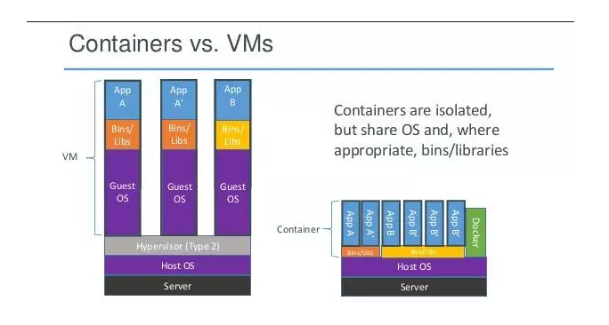
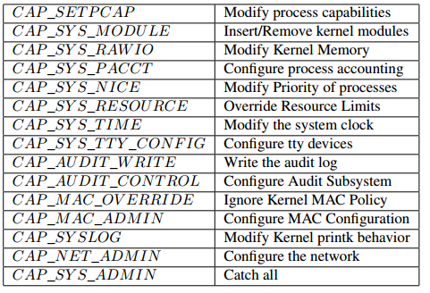

## Docker简介

Docker是目前非常流行的应用程序执行容器，能够让用户通过创建或者下载镜像快速部署执行环境，可以在docker hub分享自己的镜像。与虚拟机相比，docker非常轻量，其架构对比如下。  
  
虚拟机通过添加hypervisor层，虚拟出网卡，内存，CPU等虚拟硬件，再在其上建立guest机。每个guest机都有自己的系统内核。  

而docker容器则是通过隔离的方式，将文件系统，进程，设备，网络等资源进行隔离，再对权限，CPU资源等进行控制，最终让容器之间互不影响，容器无法影响宿主机。容器与宿主机共享内核，文件系统，硬件等资源。  

与虚拟机相比，容器资源损耗要小得多。 同样的宿主机下，能够建立容器的数量要比虚拟机多得多。但是虚拟机的安全性要比容器好一些，要从虚拟机突破到宿主机或其他虚拟机，需要先突破hypervisor层，这是极其困难的。 而docker容器与宿主机共享内核，文件系统等资源，更有可能对其他容器，宿主机产生影响。  

Docker的安全问题主要可能来源于这三个方面：1. Docker本身的架构与安全机制不完善；2.docker镜像源污染； 3.docker本身的漏洞。  

## Docker安全机制

Docker容器与LCX非常相似，它们的安全保障主要来源于三个机制：namespaces，cgroups，capabilities。运行一个新的容器时，docker会为这个容器创建一个命名空间和控制组的集合。  

### 内核命名空间(kernel namespaces)  

Kernel namespaces提供最基本的隔离机制。  

进程隔离  

这使得容器内的进程无法看到，无法影响到宿主机的进程和其他容器的进程。  

文件隔离  

文件系统命名空间用于限制容器内的事件影响到容器外的文件系统。但有一些内核文件没有包含在内。  

设备隔离  

隔离设备，使容器不能访问其他容器的虚拟设备。  

IPC隔离  

Dokcer用IPC命名空间实现IPC隔离。保证一个IPC命名空间下面无法获取到其他IPC命名空间的信息，如信号量，消息队列，共享内存等。  

网络隔离  

Docker会为每个容器创建独立的网络协议栈。每个容器都有私有的IP地址，IP路由表，网络设备。宿主机拥有一个外网地址，这之间通过NAT进行转换。一组容器可以组成一个局域网，可以设置iptable规则对其进行管理。  
  
### 控制组(contrl groups)  

控制组实现资源的统计与限制。这一机制保证每个容器获得公平的内存，CPU，磁盘I/O分配权限。 并防止单一的容器通过耗尽某一项资源导致系统崩溃。控制组按照分配权重，竞争的机制对资源进行管理。 如容器A，容器B各分配权重100， 当容器A单独运行时，最多可占100%的资源，当A和B同时运行，并都满负荷运行时，双方各获得50%的资源。  

如果A分配权重100，B权重50，同时满负荷运行时，A分配66%资源，B分配33%资源。同时启动容器时还有选项可对使用的最大资源进行限制。    

### Capabilities机制(linux kernel capabilities)

传统的unix权限分级方式将进程分为两种级别：超级用户root的特权级别和普通用户的非特权级别。特权级别下，内核会省略所有的权限检查。  

Linux 内核2.2以后将超级用户的权限分割成一项项的能力（29项），每项能力都能单独的开启或者关闭。比如CAP_NET_ADMIN能力提供了修改系统网络的权限，进程拥有这个能力就能够修改系统的网络配置。容器与宿主机共享内核，因此为了保证容器不会拥有超级权限，docker默认关闭一些容器所不需要的能力，部分关闭的能力如下：  
  

其他一些机制  

1. 容器与宿主机共享内核
2. 用户之间可以通过hub共享镜像
3. 容器共享docker守护进程的权限

## 可能的攻击方式

通过对docker构架与安全机制的分析，可以整理出下面这么一些可能的攻击方式  
   

1. Docker自身漏洞  
Docker作为一款软件，自然也跟其他软件一样，本身实现上会有代码缺陷。CVE官方记录docker历史版本共有9项漏洞。 主要有代码执行，权限提升，信息泄露，绕过这几类。 高危漏洞1个，中危漏洞4个。基本出现在1.6.1及以前的版本中，目前docker最新版本为1.10.2暂未被发现cve漏洞。 因此docker用户最好将docker升级为最新版本，CVE详情如下：  
http://www.cvedetails.com/vulnerability-list/vendor_id-13534/product_id-28125/Docker-Docker.html  

2. Docker源问题  
Docker提供了docker hub可以让用户上传创建的镜像，以便其他用户下载，快速搭建环境。但同时也带来了一些安全问题。下载的镜像是否被恶意植入后门？ 传输的过程中镜像是否会被篡改？ 镜像所搭建的环境是否本身就包含漏洞？ 这些问题都与我们在网络上下载软件所遇到的相同。  
黑客上传恶意镜像。 如果有黑客在制作的镜像中植入木马，后门等恶意软件，那么环境从一开始就已经不安全了，后续更没有什么安全可言。 通用的软件可以使用杀毒软件进行扫描，但是目前的杀毒软件并没有能够很好的支持镜像的扫描。我们下载的镜像是否安全除了信任官方以外，我们可能只能够仔细检查下载的源是否有后门（比如运行镜像然后在里面安装杀毒软件扫描），并且确认我们的请求指向官方源。 也许以后会有针对docker镜像的扫描软件产生。  
镜像使用有漏洞的软件。 据一些报告显示，hub上能下载的镜像里面，75%的镜像都安装了有漏洞的软件，所以下载镜像后，需要检查里面软件的版本信息，对应的版本是否存在漏洞，并及时更新打上补丁。  
中间人攻击篡改镜像。 镜像在传输过程中可能被篡改，目前新版本的docker已经提供了相应的校验机制来预防这个问题。  

3. Docker架构缺陷与安全机制  
由docker本身的架构与机制可能产生的问题，这一攻击场景主要产生在黑客已经控制了宿主机上的一些容器（或者通过在公有云上建立容器的方式获得这个条件），然后对宿主机或其他容器发起攻击来产生影响。  
容器之间的局域网攻击。 同一主机上的容器之间可以构成局域网，因此针对局域网的ARP欺骗，嗅探，广播风暴等攻击方式便可以用上。所以在一个主机上部署多个容器需要合理的配置网络，设置iptable规则。  
耗尽资源造成拒绝服务攻击。 cgroups安全机制就是要防止此类攻击的，不要为单一的容器分配过多的资源即可避免此类问题。  
调用有漏洞的系统调用。 容器与宿主机共享内核，容器可以执行一些系统调用。 如果宿主机的系统调用存在漏洞，容器便可以利用这些系统调用进行提权，进行虚拟机逃逸。要防范此类问题需要及时更新宿主机的系统漏洞，对于不常用的系统调用，禁止容器使用。  
通过docker提权。 如果以root权限运行容器，容器内的root用户也就拥有了宿主机的root权限。 尽量不要以root权限运行容器，docker默认不分配一些能力给容器，不要去分配一些不必要的能力给容器。  
未隔离的文件系统。 虽然docker已经对文件系统进行隔离，但是有一些重要的系统文件暂时没有被隔离，如/sys, /proc/sys, /proc/bus等。 对于这些系统文件需要小心设置权限，如设置只读。  

## 一些安全建议

除了docker本身的安全机制，还可以有一些安全措施可以对宿主机进行加固，如SELinux，AppArmor。即使容器逃逸到主机，也可以降低对损害。  

docker使用的一些安全建议如下：  

1. 安装安全加固，如SELinux，AppArmor，GRSEC等

2. 及时更新docker，修复docker的安全漏洞

3. 在镜像仓库客户端使用证书认证，对下载的镜像进行检查，分析是否有已知漏洞，后门

4. 对下载镜像的hash值进行校验
示例 `$ docker pull debian@sha256:a25306f3850e1bd44541976aa7b5fd0a29be`  

5. 合理配置容器之间的网络，将信任的容器划分都同一网络中，配置iptables.用其他SDN方案（如SocketPlane）对网络进行重新规划。  

6. 不要将容器以host模式启动，以host启动容器可以有完整的权限操纵主机的协议栈、路由表、防火墙

7. 及时更新宿主机内核漏洞，禁止容器的一些系统调用

8. 不要使用root启动容器，不要给容器分配过多的能力，不启用特权级别

9. 对一些重要的文件系统，设置只读权限

10. 尽量不要将一些用户名密码，key等认证数据放入到镜像中，以免将其上传到公共仓库造成信息泄露。 类似于github中代码包含了一些数据库，网站的管理员密码  