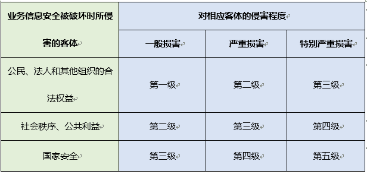

原文 by [浅谈docker安全合规建设](https://mp.weixin.qq.com/s?__biz=MzA5OTAyNzQ2OA==&mid=2649690923&idx=1&sn=3741c618f186058bae628cc4bb669bb3&mpshare=1&scene=1&srcid=0709lCW8m1YOMDzL3uH8aT87#rd)  

通过阅读网上帖子及浏览相关信息，大家可能会产生一种错觉：Docker安全性不足，对Docker导入生产环境持保守态度。不过实际情况是，虽然我们需要对容器的安全性高度关注，但只要使用得当，完全可以成为一种不低于使用虚拟机或者裸机的安全、高效生产系统。  

今天和大家聊聊Docker的安全合规建设。  

安全，这里我们指的是信息安全，包括数据安全和网络安全，主要是数据在处理、传输、存储等过程中的安全，它包括了信息本身的安全和防护安全。  

在安全方面，各行各业甚至国家、国际机构都有很严格的标准： 

* 归功于消费领域企业的不懈广告下， 大家应该都听过ISO9000（质量管理体系）SO14000（环境管理体系），在安全方面，国际标准化组织也有信息安全标准ISO27000，其中ISO 27001在其中具有核心作用，该标准发布于2005年，目前最新版为ISO27001:2013DIS版。  

* 国家在这方面也有信息安全等级保护要求，简称等保；它有五个等级，在很多行业等保有硬性要求，如互联网金融行业至少要符合第四级的等保要求。  
  
* 各个行业对安全也有专门的标准，如在支付行业，有内卡的非金融机构支付业务设施技术认证JR/T1022-2014，JR/T0213-2014和外卡的数据安全标准PCI_DSS v3.1。  

说了这么多，需要重点指出的是，各种标准的发布和修订基本上只考虑了虚拟化环境的技术标准。说到虚拟机，我在接触的很多正在使用或者正准备使用Docker的人总喜欢把容器和虚拟机比较，或者把容器就当成虚拟机在用，嘿！ 说的就是你，还在用Docker Commit替代Dockerfile！ 还在用SSH连接容器！  

我个人更喜欢把容器比喻成一种沙箱（Sandbox）：每个应用程序都有自己的存储空间；应用程序不能翻过自己的围墙去访问别的存储空间的内容；应用程序请求的数据都要通过权限检测，假如不符合条件的话，不会被放行。是不是似曾相识？其实我们的ISO应用就是这种方式执行的。  

回归正题，事实上，目前行业标准当中所包含的各种准则针对虚拟化技术进行了调整，对于任何想要保护数据的企业来说都可以起到很大帮助作用。使用针对特定行业的标准进行合规审查，可以在很大程度上保证信息处于最佳安全实践的保障之下。安全的信息环境对于企业、客户和员工来说都是至关重要的。  

Docker技术目前还没有对应的认证条款，由于比较新，在数据隔离方面是否能够达到要求还具有不确定性，Docker的安全性也还不够强健，只要具备Docker权限的用户都可以对Docker容器进行所有的操作。这无疑将增加审核范围及边界的不确定性。  

另外，Docker在当前阶段还在快速推出更新版本，也存在不兼容的情况，等待未来版本和安全性问题解决之后或许会有文件来指导合规过程。目前我不推荐大家直接用于认证环境。  

幸运的是， 关于Docker这种虚拟化技术背景的产品，标准要求本身是没有变化的，可以按虚拟技术进行评估。我们可以在业务相关的环境当中将Docker作为虚拟化技术的使用准则之一。比如，在PCI DSS第2.2.1章节当中指出一个虚拟系统组件或者设备只能实现一项主要功能，这正是容器的特点之一。  

对于非认证的生产及非生产环境，我这里有一些Docker使用上的经验和心得和大家分享一下：  

**内核安全**：所有进程运行在同一个内核中，即使有多个容器，所有的系统调用其实都是通过主机的内核处理，因此该内核中存在的任何安全漏洞都有可能造成巨大影响。如果某套容器系统导致内核崩溃，那么这反过来又会造成整台主机上的全部容器毁于一旦。在虚拟机当中，情况则要好得多：传统的虚拟机同样地很多操作都需要通过内核处理，但这只是虚拟机的内核，并非宿主主机内核。因此万一出现问题时，最多只影响到虚拟系统本身。当然你可以说先攻破Hypervisor，再攻破SELinux，然后攻破宿主主机内核就可以控制宿主机上的所有虚拟机，先不说虚拟机发展这么多年存在的漏洞还有多少，光虚拟机内核→Hypervisor→SELinux→宿主主机内核这几层的隔离的安全性和容器就不是一个数量级上的。所以建议大家密切关注内核的安全。在内核安全的合规建设上，虚拟机和容器的要求是一致的，大家完全可以遵从当前的行业标准。  

**拒绝服务攻击**：所有容器都共享同样的内核资源。如果某套容器能够以独占方式访问某些资源，那么与其处于同一台主机上的其它容器则很可能因资源匮乏而无法正常运转。这正是拒绝服务攻击（简称DDoS）的产生原理，即合法用户无法对部分或者全部系统进行访问。在这方面大家亦可参考虚拟机时代的经验，预估应用的资源消耗上限，设计更多的Cgroups，用于控制那些打开过多文件或者过多子进程等资源的进程，对容器资源进行限制，如CPU使用率，内存上限等，虽然容器的隔离性没虚拟机那么彻底，但至少能保证业务的连续性。  

**镜像安全**：还有一部分来自于镜像本身的安全。由于Docker Hub上的镜像成千上万，甚至国内各种PaaS云服务公司提供的镜像仓库，如果攻击者诱导用户下载由其精心设计的镜像，那么运行的主机与数据都将处于威胁之下。建议大家使用可靠来源甚至是官方的镜像，并检查是否存在篡改。同样的，大家还需要确保自己运行的镜像为最新版本，且其中不包含任何存在已知安全漏洞的软件版本。  

**用户权限**：如果大家在容器内拥有root权限，那么在主机上亦将具备root身份。在系统中非root用户只要加入Docker用户组，就无需使用sudo的情况下运行Docker命令。同样，添加了`–privileged`参数运行的容器也将获得主机的完全控制权。这种情况，首先，建议大家尽量不要使用`–privileged`参数，若实在有业务需求，可以将所有需要–privileged参数的容器严格控制在一台或某几台主机以隔离其他容器。其次，建议大家配合sudo来增加用户的审计和日志功能，在/ect/sudoers中添加以下内容： `user ALL=(ALL) /usr/bin/docker` ，这样user使用Docker命令的时候需要密码验证，并会在系统中记录所有的操作日志用于审计。   

文件完整性：有些Linux系统的内核文件系统必须要mount到容器环境里，否则容器里的进程就会罢工。这给恶意进程非常大的便利，但是大部分运行在容器里的App其实并不需要向文件系统写入数据。基于这种情况，建议在mount时使用只读模式，如 `–v /etc/localtime:/etc/localtime:ro` 。  

总之通过适配、加固的Docker容器方案，在安全性上完全可以达到商用标准。就是可能对实施人员的技术要求和门槛较高。  

今天的分享就暂时到这里，谢谢大家的倾听，也欢迎大家多多交流。谢谢！  

## Q&A
Q：容器安全和虚拟机的安全有什么异同？  

A：容器可以在更细的颗粒度上来保护应用，比如说物理机好比大楼，虚拟机好比不同的房间，容器就是里面同房的租户，大楼及房间保障了外部的安全，如果你不相信同屋的租客，则需要用容器来更强的隔离，这是2个不同角度的问题。  

Q：镜像安全，Clair扫描靠谱么？  

A：Clair是CoreOS发布的一款开源容器漏洞扫描工具。该工具可以交叉检查Docker镜像的操作系统以及上面安装的任何包是否与任何已知不安全的包版本相匹配。漏洞是从特定操作系统的通用漏洞披露（CVE）数据库获取,它偏向于静态扫描，即镜像安全，国际上对容器运行时安全方案涉足较少，国内容器云对安全更是空白一片。  

Q：Docker有一个User Namespace的机制，这种隔离在正式的安全规范里有相应描述吗？有没有尝试过利用这种机制增加安全性？  

A：Docker的安全标准规范基本处于空白阶段，大家都在摸索，主要是实践累计。User Namespace可以增强一定的隔离性，但是刚才也提到：用User Namespace隔离后，其实太多用户不会用操作日志，用于后期追踪及审计。  

Q：能介绍下沙箱与容器的不同吗？  

A：沙箱和容器只是在工作的方式上比较类似，但是底层的技术实现和代码其实是完全不一样的。 

Q：如何才能有效的检测出下载的镜像是否含有木马等不安全的信息呢?挂载到容器中的目录，如何给只读权限，后续数据库一些信息想写入宿主机又如何实现？  

A：对镜像扫描目前世面上还是有一些产品的，比如说刚才某位同学提到的Clair。 挂载到容器的目录可以通过ro参数设定只读权限，但是需要写入的目录挂载只设只读权限程序是不能运行的，这样就涉及到宿主机的文件安全，相信宿主机的安全产品及方案，现在已经很多，就不复述了。  

Q：木马检测涉及到特征代码库，检测比较难吧？  

A：木马检测其实都是基于目前的技术， 只是容器的数量可以远远大于虚拟机，这样对检测的性能和时效有了更高的要求。  

Q：最近一直被人问到安全性的问题，但是只从单机角度考虑安全性是否已经无法满足分布式计算环境，我们是否更应该从分布式计算带给我们的规模效应和自愈机制来重新审视Docker的安全标准，请问嘉宾是如何看待分布式计算中的整体和部分，以及它们之间的安全关系？谢谢。  

A：分布式也是由节点组成的，单机安全是基础，如果单机安全性都无法满足，分布式的安全更无从说起。 当然，分布式存在大规模效应，节点更多需要关注的是数据的处理及储存安全；在满足了节点安全后，分布式更多的应该是考虑跨节点之间的数据传输安全，尤其是跨公网的数据传输（VPN 隧道也是属于跨公网的传输一种）。自愈机制其实应该算保障业务连续性的一种方式，当然也可以归纳为安全的一种。  

Q：请问Rancher 除了使用“环境”外，目前能完美实现租户隔离吗？  

A：可以使用主机标签+容器策略的方式，将不同用户用虚拟机或物理机进行隔离。 就目前Rancher来说，不同环境是比较好的隔离方案。  
  
Q：不知道嘉宾给的安全建议是否适用于CoreOS这种Docker化的OS，还是说这类OS会有更好的合规功能？  

A：CoreOS这种系统确实更适合容器，而且承载的功能也更加少，相应的需要合规的点也越少。 但是不排除某些合规要求强制的功能点无法满足，这需要根据实际情况来判断。  

Q：除了镜像扫描，还有哪些容器安全需要注意的地方，和哪些成熟方案呢？  

A：除了镜像扫描，还需要关注容器运行时安全，如网络安全，应用程序漏洞，防止被攻击，安全策略等； 相信接下来有容云发布的AppSafe产品不会让大家失望。  

Q：虚拟机的安全方案是否也同样适用于容器？  

A：应该是部分适合，刚才提到容器和虚拟机关注点是不一样的。 虚拟机更多是系统安全+应用安全， 容器的主要关注点还是应用安全，如代码漏洞，软件漏洞等等。  

Q：如何评价Docker 1.12中Swarm模式自带的TLS认证？   

A：大家都知道前段时间的心血漏洞，大家也知道目前互联网环境的情况， 其实TLS认证已经是很多环境的必备要求，甚至对TLS的版本号也是严格的要求，比如说某些行业必须使用TLS1.2以上的版本才能合规。Swarm模式自带的TLS认证相信也是基于此类要求。   