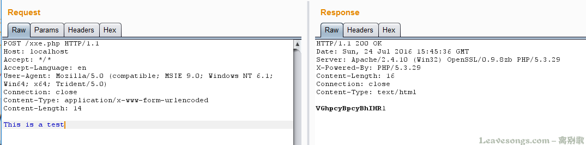
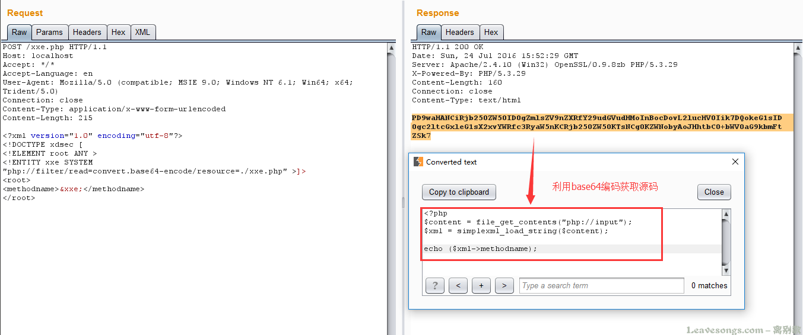
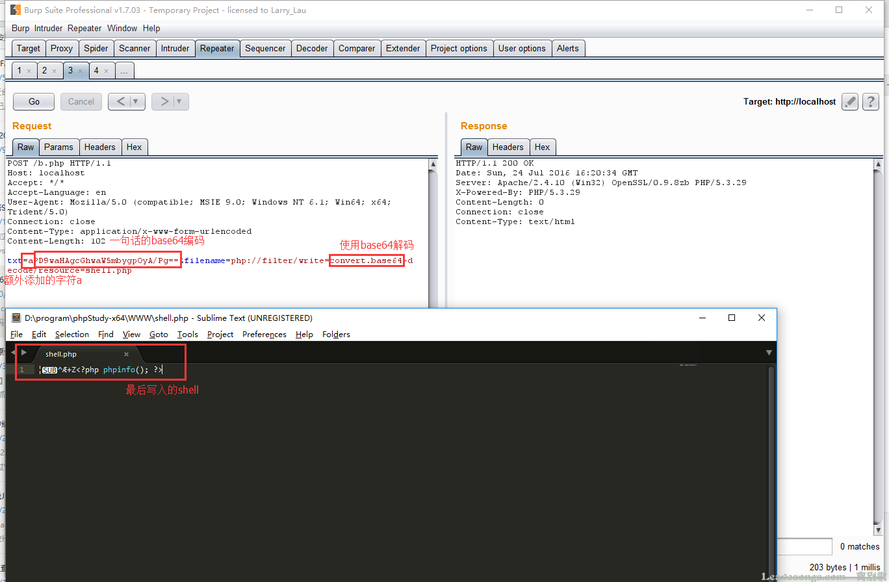
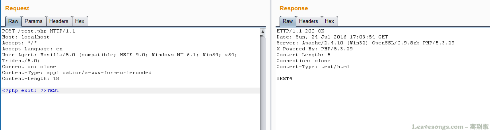
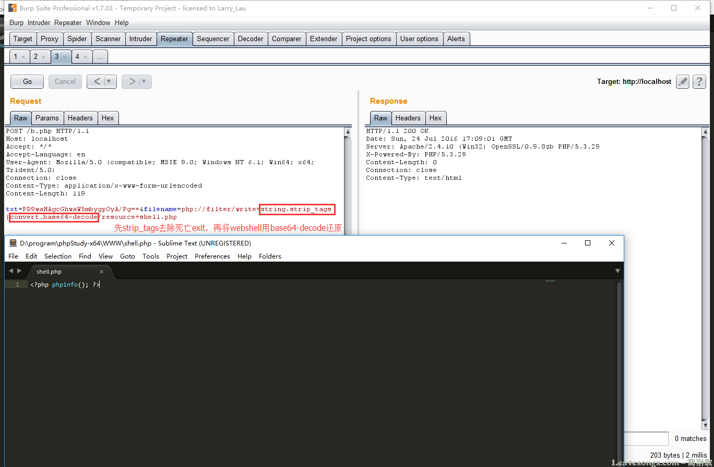
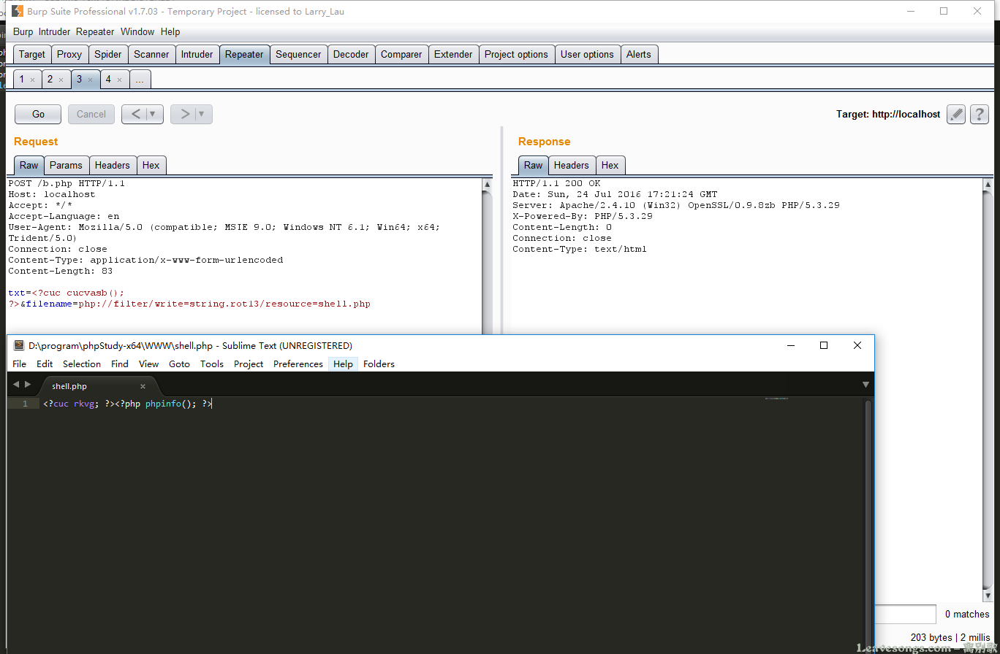

原文 by PHITH0N 

## 一、XXE中的使用
php://filter之前最常出镜的地方是XXE。由于XXE漏洞的特殊性，我们在读取HTML、PHP等文件时可能会抛出此类错误 parser error : StartTag: invalid element name 。其原因是，PHP是基于标签的脚本语言，`<?php ... ?>`这个语法也与XML相符合，所以在解析XML的时候会被误认为是XML，而其中内容（比如特殊字符）又有可能和标准XML冲突，所以导致了出错。  

那么，为了读取包含有敏感信息的PHP等源文件，我们就要先将“可能引发冲突的PHP代码”编码一遍，这里就会用到`php://filter`。  
`php://filter` 是PHP语言中特有的协议流，作用是作为一个“中间流”来处理其他流。比如，我们可以用如下一行代码将POST内容转换成base64编码并输出： `readfile("php://filter/read=convert.base64-encode/resource=php://input");`  
如下：  
  
所以，在XXE中，我们也可以将PHP等容易引发冲突的文件流用`php://filter`协议流处理一遍，这样就能有效规避特殊字符造成混乱。  
如下，我们使用的是`php://filter/read=convert.base64-encode/resource=./xxe.php`  
  

## 二、巧用编码与解码
使用编码不光可以帮助我们获取文件，也可以帮我们去除一些“不必要的麻烦”。   
记得前段时间三个白帽有个比赛，其中有一部分代码大概类似于以下：   
``` php
$content = '<?php exit; ?>';
$content .= $_POST['txt'];
file_put_contents($_POST['filename'], $content);
```
$content在开头增加了exit过程，导致即使我们成功写入一句话，也执行不了（这个过程在实战中十分常见，通常出现在缓存、配置文件等等地方，不允许用户直接访问的文件，都会被加上`if(!defined(xxx))exit;`之类的限制）。那么这种情况下，如何绕过这个“死亡exit”？  
幸运的是，这里的`$_POST['filename']`是可以控制协议的，我们即可使用 `php://filter`协议来施展魔法：  
使用`php://filter`流的base64-decode方法，将$content解码，利用php base64_decode函数特性去除“死亡exit”。  
众所周知，base64编码中只包含64个可打印字符，而PHP在解码base64时，遇到不在其中的字符时，将会跳过这些字符，仅将合法字符组成一个新的字符串进行解码。  
所以，一个正常的base64_decode实际上可以理解为如下两个步骤：  
`$_GET['txt'] = preg_replace('|[^a-z0-9A-Z+/]|s', '', $_GET['txt']);`
`base64_decode($_GET['txt']);`  
所以，当$content被加上了`<?php exit; ?>`以后，我们可以使用 `php://filter/write=convert.base64-decode` 来首先对其解码。在解码的过程中，字符`<`、`?`、`;`、`>`、空格等一共有7个字符不符合base64编码的字符范围将被忽略，所以最终被解码的字符仅有“phpexit”和我们传入的其他字符。  
“phpexit”一共7个字符，因为base64算法解码时是4个byte一组，所以给他增加1个“a”一共8个字符。这样，"phpexita"被正常解码，而后面我们传入的webshell的base64内容也被正常解码。结果就是`<?php exit; ?>`没有了。  
最后效果是 ：  


## 三、利用字符串操作方法
有的同学说，base64的算法我不懂，上面的方法太复杂了。  
其实，除了使用base64特性的方法外，我们还可以利用`php://filter`字符串处理方法来去除“死亡exit”。我们观察一下，这个`<?php exit; ?>`实际上是什么？  
实际上是一个XML标签，既然是XML标签，我们就可以利用strip_tags函数去除它，而`php://filter`刚好是支持这个方法的。  
编写如下测试代码即可查看 `php://filter/read=string.strip_tags/resource=php://input` 的效果：  
`echo readfile('php://filter/read=string.strip_tags/resource=php://input');`  
  
可见，`<?php exit; ?>`被去除了。但回到上面的题目，我们最终的目的是写入一个webshell，而写入的webshell也是php代码，如果使用strip_tags同样会被去除。  
万幸的是，`php://filter`允许使用多个过滤器，我们可以先将webshell用base64编码。在调用完成strip_tags后再进行base64-decode。“死亡exit”在第一步被去除，而webshell在第二步被还原。  
最终的数据包如下：  
  

除此之外，我们还可以利用rot13编码独立完成任务。原理和上面类似，核心是将“死亡exit”去除。`<?php exit; ?>`在经过rot13编码后会变成`<?cuc rkvg; ?>`，在PHP不开启short_open_tag时，php不认识这个字符串，当然也就不会执行了：  

当然，这个方法的条件就是不开启短标签。  

## Reference
[谈一谈php://filter的妙用](https://www.leavesongs.com/PENETRATION/php-filter-magic.html)
