原文 by sixwhale 

## 0x01 整体
   
学习代码审计的目标是能够独立完成对一个CMS的代码安全监测。其通用的思路有：
   

   
* 通读全文代码，从功能函数代码开始阅读，例如include文件夹下的common_fun.php，或者有类似关键字的文件。
   
* 看配置文件，带有config关键字的文件，找到mysql.class.php文件的connect()函数，查看在数据库连接时是否出现漏洞。
   
* 继续跟读首页文件index.php，了解程序运作时调用了哪些函数和文件。以index.php文件作为标线，一层一层去扩展阅读所包含的文件，了解其功能，之后进入其功能文件夹的首页文件，进行扩展阅读。
   
注： register_globals、magic_quotes_gpc、safe_mode 在 PHP 5.3.x~5.4.x 中已废弃
   

   
## 0x02 各种洞洞
   
### a.文件操作漏洞
   
* 能不用文件名参数就不用 尽量不要让用户可控
   
* 平行用户的权限 管理员的权限 操作权限
   
* 禁止传入参数类似于这种 `..` 、`/` 、`\` ， 检查传入的参数，做出限制，停止程序往下执行
   

   
#### 1.文件包含漏洞：
   
(1) 本地文件包含：
   

   
* 一般存在于模块加载，模板加载，cache调用
   
* 包括函数：include()/include_once(),require()/require_once()，寻找可控变量
   

   
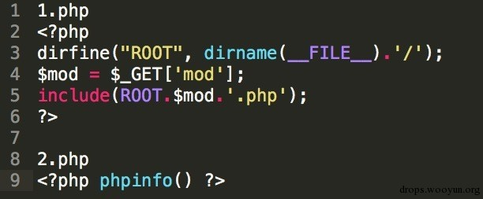
   

   

   
(2) 远程文件包含：
   

   
* 前提条件：allow_url_include = on
   
* 出现频率不如本地包含
   

   
(3) 文件包含截断：
   

   
* %00截断(php版本小于5.3)
   
* 问号截断(问号后面相当于请求的参数，伪截断)
   
* 英文(.) 、反斜杠(/) 截断
   

   
#### 2.文件读取(下载)漏洞：
   
搜索关键函数:file_get_contents(),highlight_file(),fopen(),read file(),fread(),fgetss(), fgets(),parse_ini_file(),show_source(),file()等
   

   
#### 3.文件上传漏洞：
   
搜索关键函数:move_uploaded_file() 接着看调用这个函数的代码是否存在为限制上传格式或者可以绕过。
   
(1) 未过滤或本地过滤：服务器端未过滤，直接上传PHP格式的文件即可利用。
   
(2) 黑名单扩展名过滤：
   
* 限制不够全面：IIS默认支持解析.asp,.cdx, .asa,.cer等。
   
* 扩展名可绕过：不被允许的文件格式.php，但是我们可以上传文件名为1.php(注意后面有一个空格)
   

   
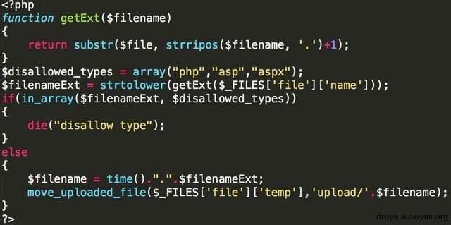
   

   
(3) 文件头 content-type验证绕过：
   

   
* getimagesize()函数：验证文件头只要为GIF89a，就会返回真。
   
* 限制$_FILES["file"]["type"]的值 就是人为限制content-type为可控变量。
   

   

   
(4) 防范：
   

   
* 使用in_array()或 利用三等于===对比扩展名。
   
* 保存上传文件是重命名，规则采用时间戳拼接随机数：md5(time() + rand(1,1000))。
   

   
#### 4.文件删除漏洞：搜索关键函数：
   

   
* unlink()利用回溯变量的方式
   
* 老版本下的session_destroy()，可以删除文件，现已基本被修复。
   

   
##### Metinfo的任意文件删除漏洞：
   

   
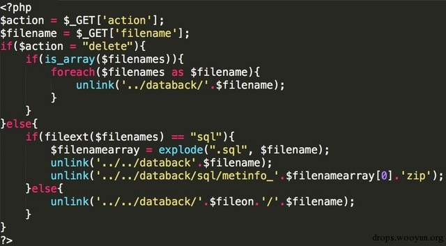
   
$action = delete即可删除.sql的文件，如果文件不是sql直接删除提交的文件名
   
target.com/recovery.php?&action=delete&filename=../../index.php
   

   
### b.代码执行漏洞
   
#### 1.代码执行函数：
   
搜索关键函数：eval(), assert(), preg_replace(), call_user_func(), call_user_func_array(), array_map()
   
(1) preg_replace()函数：
   
mixed preg_replace ( mixed $pattern , mixed $replacement , mixed $subject [, int $limit = -1 [, int &$count ]] )
   
当$pattern处存在e修饰符时，$replacement 会被当做php代码执行。
   
(2)mixed call_user_func( callable $callbank [ , mixed $parameter [ , mixed $…)：
   
第一个参数为回调函数，第二个参数是回调函数的参数
   

   
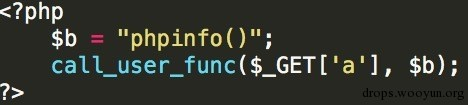
   
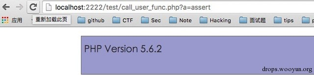
   

   
(3)eval()和assert()：
   
当assert()的参数为字符串时 可执行PHP代码
   
【区分】：
   
eval(" phpinfo(); ");【√】 eval(" phpinfo() ");【X】
   
assert(" phpinfo(); ");【√】 assert(" phpinfo() ");【√】
   

   
#### 2.动态函数执行：
   
动态函数后门：
   
``` php
   
<?php
   
$_GET['a']($_GET['b']);
   
?>
   
```
   

   
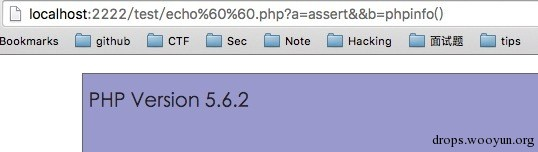
   

   
#### 3.命令执行函数：
   
搜索关键函数：system(), exec(), shell_exec(), passthru() ,pcntl_exec(), popen(),proc_open()
   
(1) popen和proc_open()：
   
``` php
   
<?php 
   
popen( 'whoami >> /Users/bingdaojueai/Desktop/1.txt', 'r' ); 
   
?>
   
```
   
所在路径就会出现一个1.txt 里面的内容为命令执行后的结果
   
(2) 反引号命令执行：
   

   
* echo &#96;whoami&#96;; 直接就可以执行命令
   

   
* 双引号和单引号的区别：
   
``` php
   
$a = 1
   
echo " $a "    output：1
   
echo ' $a '    output：$a
   
```
   
双引号时，可以直接解析变量，造成代码执行漏洞，过狗绕过。
   

   
### c.变量覆盖漏洞
   
#### 1.函数使用不当：
   
* int extract( array &$var_array , int $extract_type = EXTR_OVERWRITE , string $prefix = null )
   
* void parse_str( string $str , array &$arr )
   
* bool import_request_variables( string $type , string $prefix )
   

   
#### 2.$$变量覆盖：
   

   
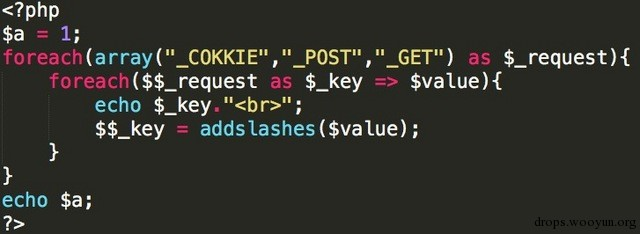
   

   

   
### d.逻辑漏洞需要思考的问题：
   

   
* 程序是否可以重复安装
   
* 修改密码是否存在越权修改其他用户密码
   
* 找回密码验证码是否可以暴力破解
   
* cookie是否可以预测，验证存在绕过
   

   
#### 1.等于与存在判断绕过：
   
(1) in_array()： 比较之前会自动转换类型
   

   
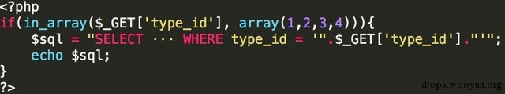
   
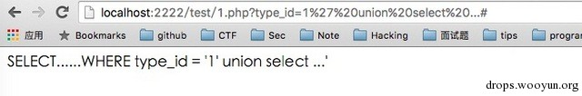
   
(2)is_numeric()：当传入参数为hex时，直接通过并返回true，并且MYSQL可以直接使用hex编码代替字符串明文，
   
可以二次注入，并且可能造成XSS漏洞
   
(3)双等于==和三等于===
   

   
* 双等于会在变量比较时，进行类转换，与in_array()是一样的问题。
   
* 三等于是type和value的双重比较，相比之下更加安全。
   

   
#### 2.账户体系中的越权问题：
   
* 水平越权：A用户能够以B用户的身份，进行B用户的全部权限操作。前提A用户和B用户拥有相同的权限。
   
* 垂直越权：A用户能够以C用户的身份，进行C用户的全部权限操作，前提C用户比A用户拥有更高的权限。
   

   
(1) 未exit/return/die：
   
``` php
   
<?php
   
if(file_exists('install.lock)){
   
    header("Location:xxx.com");
   
    //exit();
   
}
   
echo "test";
   
?>
   
```
   
test 依旧会被输出，替换成安装流程，PHP依旧会进行。
   
(2) 支付漏洞：
   

   
* 客户端修改单价
   
* 客户端修改总价和购买数量
   
* 服务端未校验严格
   
* 重复发包利用时间差：
   

   
``` php
   
<?php
   
if (check_money($price)){
   
  //Do something
   
  //花费几秒
   
  $money = $money - $price;
   
}
   
?>
   
```
   
可能导致漏洞函数： str_replace()
   

   
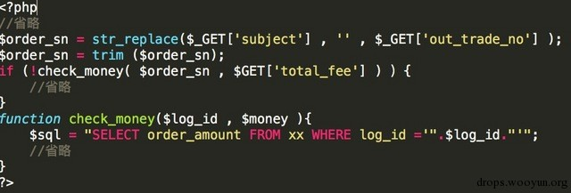
   
``` php
   
<?php
   
$a = addslashes($_GET['a']);
   
$b = addslashes($_GET['b']);
   
echo "$a<br>$b<br>";
   
$c = str_replace($a,'',$b);
   
echo trim($c);
   
?>
   
```
   

   
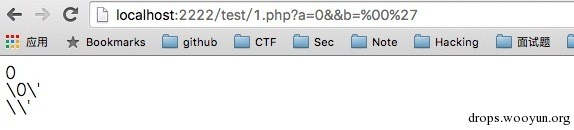
   

   
### e.会话认证漏洞
   
* COOKIE验证：没有使用SESSION验证，将信息直接保存在COOKIE中
   
	1. 找到传入sql语句的参数的传递过程，回溯变量到最原始的函数，看它保存在cookie的算法，是否可逆
   
	2. 和MD5比起 sha1更安全，解密sha1的网站更少
   
	3. 限制一个用户只能同时在一个IP上登录
   

   
* 审计代码时，查看登录处代码
   

   
### f.二次漏洞
   
#### 1.类型：
   
* 不是逻辑问题，是可信问题。
   
* 业务逻辑复杂度，与二次漏洞触发率 成正比。
   
* 购物车 / 订单 / 引用数据 / 文章编辑 / 草稿 ==> SQL注入 / XSS
   

   
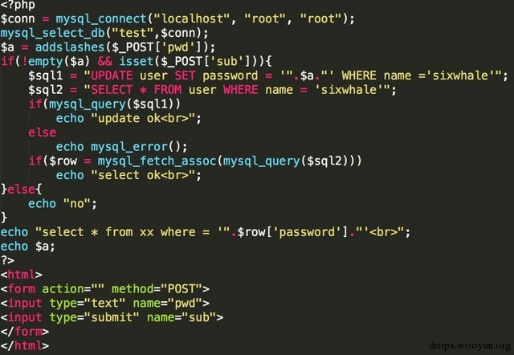
   
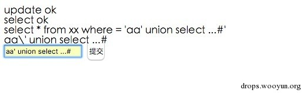
   

   
#### 2.技巧：
   
(1) 钻GPC等转义的空子：
   

   
* 不受GPC保护的$_SERVER变量：PHP5以后，$_SERVER取到的header不再受GPC影响，就算开启特殊字符也不会被转义，存在注入
   
* 编码问题转换：
   
	1. GBK的宽字节注入：`%df'` 单引号自动被转义成(`\'`)，同时%df与%5c连在一起组合成運字单引号依然在，成功闭合。【php与mysql交互过程中发生的编码转换问题】
   
	2. mb_convert_encoding()：
   
	``` php
   
	<meta http-equiv="Content-Type" content="text/html;charset=utf-8"/> 
   
	<?php
   
	$sql = "WHERE id='".urldecode("-1%df%5c' == ")."'"; 
   
	print_r(mb_convert_encoding($sql,"UTF-8","GBK"));
   
	?>
   
    ```
   

   
(2)字符串问题：
   

   
* 利用报错，找到敏感信息
   
* 字符串截断：
   
1. %00空字符截断：【PHP版本小于5.3】
   
```	php
   
<?php                                 
   
include($_GET['file'].'.php');      
   
//1.php?file=2.txt%00
   
//2.txt里面是 <?php phpinfo()?>
   
?>
   
```
   

   
2. iconv函数字符编码转换截断：【对PHP版本有要求】
   
``` php
   
chr(128)—chr(255)可以截断字符
   
<?php 
   
$a = '1'.chr(130).'2’; 
   
echo $a."<br>";                   //1�2
   
echo iconv("UTF-8", "GBK", $a);   //1
   
?>
   
```
   
当$str中有一个字符不能被目标字符集所表示时，str 从第一个无效字符开始截断并导致一个 E_NOTICE。
   
* php:// 输入输出流：
   
``` php
   
<?php
   
    include($_GET['file']);
   
?>
   
1.php?file=php://filter/convert.base64-encode(内容被base64编码)/resource=example.txt(远程文件)
   
```
   

   
* php代码解析标签：
   
	1. `<script language="php">…</script>`
   
	2. <?…?>：php3.0.4版本后可用
   
	3. <%…%>：asp标签，需要asp_tags=on，默认是off
   

   
* 正则表达式：
   
	1. 没有使用^ 和 $ 限定匹配开始位置：
   
	2. 特殊字符未转义：
   

   
* 报错注入：   
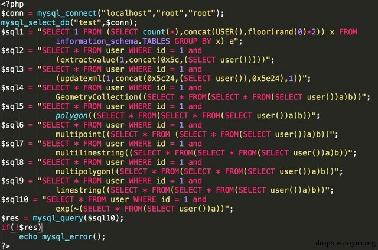  
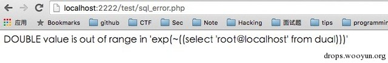
   

   
* windows findfirstfile 利用：若要搜索12345.txt文件，可使用1<<来代替或者12<<，不可以单独使用一个"<"或">"，因为单独一个只是代表了一个字符，两个代表多个字符。
   

   

   

   

   
