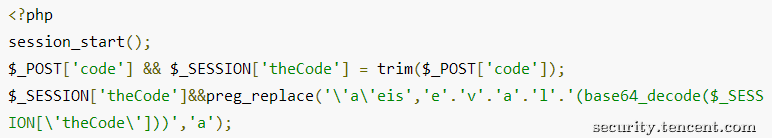
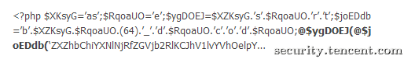
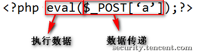
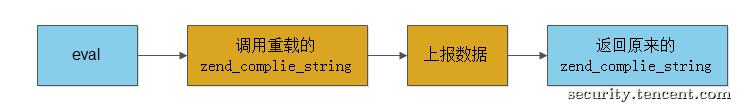
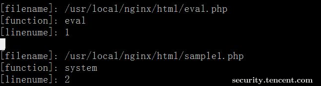
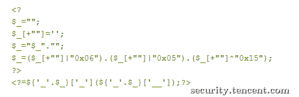
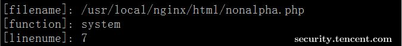
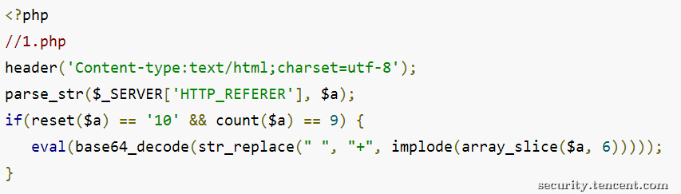

原文 by [tsrc](https://security.tencent.com/index.php/blog/msg/19)  

## 一、变形webshell

webshell比如eval($_POST[])大家都耳熟能详，近几年在常见的webshell基础上衍生了很多变种，加大了检测难度，下面先看几个从网上摘取的样本：  

### 1、无ascii码和数字的webshell  
  

 
### 2、隐藏关键字  
  

 
### 3、编码 + 隐藏关键字  
  

 
从目前已经公开的样本来看，变形的php webshell都是采取了隐藏关键字（eval、system等）的方法来躲避查杀。有一位monyer同学写过一篇webshell的检测文章，他把webshell拆分为下面的结构，执行数据和数据传递，检测思路是：以小括号为界限，匹配执行数据部分是否命中收集的样本的关键字。这种思路很好，个人觉得有两处不足：  
1、需要人工维护收集新样本。  
2、误报量不可预估。  
   


再看这个结构，变形的webshell无非是隐藏了执行数据部分或者数据传递部分，不过无论怎么变形本质上还是去调用eval、调用system、exec等命令执行函数，杀毒软件通过异常行为来检测木马病毒，比如开机自启动，这种思想同样也可以用在webshell的检测中。获取行为数据是第一步。  
 
## 二、PHP HOOK

这里我们只需要一些敏感的行为数据，比如eval、system的调用。实现方法很简单，hook这些php函数或语法结构，这里通过php扩展来实现hook。下面以eval和system来简要概述下hook的方法。  

Eval是一个语法结构，调用eval最终会调用php内核的zend_compile_string函数，hook eval的只需要重写zend_complie_string函数即可，流程如下：  
  

 
System是php的一个内部函数，php代码是转化为opcode(指令)来执行，函数调用的指令是ZEND_DO_FCALL，风雪之隅大牛在taint扩展（详见参考二）就是通过重载ZEND_DO_FCALL的方法实现了。因为我们并不需要hook每个内部函数，所以这里介绍另外一种方法，流程如下：  
  

 
上报的数据写在一个日志文件中，包括文件名、调用函数名、代码在文件的行数。日志结构和内容如下：  
  

 
附件中有eval、system函数hook实现的demo，具体细节可以查看代码。demo只在php-5.3.6上测试过，不兼容之处忘见谅。  
 
## 三、检测

变形webshell分为两大类，下面依次说明一下检测逻辑。  

### 1、执行数据隐藏

一个正常的程序员如果使用eval、system是不会刻意的转换隐藏的，如果发现某个函数执行了，代码中却找不到这个函数名，我们认为这是一个异常行为。以下面这个变形为例


 
比如黑客传入参数nonalpha.php?_=system&__=whoami执行了一条命令，日志会记录
  

我们在后端取nonalpha.php文件的第7行内容匹配system(字符串，如果没找到，则认为是一个变形webshell。
 
### 2、数据传递隐藏

先看下面这个例子  
  

 
这个webshell通过编码的referer来传递攻击载荷，利用日志文件记录到的文件名和行数把代码上报到后端，和后端svn中的代码做对比，如果不一致，则认为是一个webshell。  
 
## 四、不足

web承受着大量的访问请求，增加的php扩展的性能和稳定性是一个严峻的考验，另外在服务器比较多的公司还存在一个推广和部署成本。

## 五、附录demo
``` c
// php_antiwebshell.h
#ifndef PHP_ANTIWEBSHELL_H
#define PHP_ANTIWEBSHELL_H

extern zend_module_entry antiwebshell_module_entry;
#define phpext_antiwebshell_ptr &antiwebshell_module_entry

#ifdef PHP_WIN32
#	define PHP_ANTIWEBSHELL_API __declspec(dllexport)
#elif defined(__GNUC__) && __GNUC__ >= 4
#	define PHP_ANTIWEBSHELL_API __attribute__ ((visibility("default")))
#else
#	define PHP_ANTIWEBSHELL_API
#endif

#ifdef ZTS
#include "TSRM.h"
#endif

PHP_MINIT_FUNCTION(antiwebshell);
PHP_MSHUTDOWN_FUNCTION(antiwebshell);
PHP_RINIT_FUNCTION(antiwebshell);
PHP_RSHUTDOWN_FUNCTION(antiwebshell);
PHP_MINFO_FUNCTION(antiwebshell);

PHP_FUNCTION(internal_system_hook);

#ifdef ZTS
#define ANTIWEBSHELL_G(v) TSRMG(antiwebshell_globals_id, zend_antiwebshell_globals *, v)
#else
#define ANTIWEBSHELL_G(v) (antiwebshell_globals.v)
#endif

#endif	/* PHP_ANTIWEBSHELL_H */
```  
``` c
// antiwebshell.c  

#ifdef HAVE_CONFIG_H
#include "config.h"
#endif
#define VERSION "1.0"
#define EX_T(offset) (*(temp_variable *)((char *) EX(Ts) + offset))
#define RETURN_VALUE_USED(opline) (!((opline)->result.u.EA.type & EXT_TYPE_UNUSED))

#include "php.h"
#include "php_ini.h"
#include "ext/standard/info.h"
#include "php_antiwebshell.h"

/* True global resources - no need for thread safety here */
static int le_antiwebshell;

char logfile[32] = "/tmp/antiwebshell.log";
zend_function *p;

static zend_op_array *(*old_compile_string)(zval *source_string, char *filename TSRMLS_DC);
static zend_op_array* hook_compile_string(zval *source_string, char *filename TSRMLS_DC);
void FuncRestore(char*);
void BackupFunc(char*);

zend_function_entry danger_functions[] = {
        PHP_FALIAS(system, internal_system_hook, NULL)
        {NULL, NULL, NULL}
};

zend_module_entry antiwebshell_module_entry = {
#if ZEND_MODULE_API_NO >= 20010901
	STANDARD_MODULE_HEADER,
#endif
	"antiwebshell",
	NULL,
	PHP_MINIT(antiwebshell),
	PHP_MSHUTDOWN(antiwebshell),
	PHP_RINIT(antiwebshell),	/* Replace with NULL if there's nothing to do at request start */
	PHP_RSHUTDOWN(antiwebshell),	/* Replace with NULL if there's nothing to do at request end */
	PHP_MINFO(antiwebshell),
#if ZEND_MODULE_API_NO >= 20010901
	VERSION, /* Replace with version number for your extension */
#endif
	STANDARD_MODULE_PROPERTIES
};

#ifdef COMPILE_DL_ANTIWEBSHELL
ZEND_GET_MODULE(antiwebshell)
#endif

PHP_MINIT_FUNCTION(antiwebshell)
{
	return SUCCESS;
}

PHP_MSHUTDOWN_FUNCTION(antiwebshell)
{
	return SUCCESS;
}

PHP_RINIT_FUNCTION(antiwebshell)
{
	detect_init();
	return SUCCESS;
}

PHP_RSHUTDOWN_FUNCTION(antiwebshell)
{
	zend_compile_string = old_compile_string;
	return SUCCESS;
}

PHP_MINFO_FUNCTION(antiwebshell)
{
	php_info_print_table_start();
	php_info_print_table_header(2, "antiwebshell support", "enabled");
	php_info_print_table_row(2, "Version", VERSION);
	php_info_print_table_end();
}

PHP_FUNCTION(internal_system_hook)
{
        char funcname[16] = "baksystem";
        FuncRestore(funcname);
}

int detect_init()
{
        old_compile_string =  zend_compile_string;
        zend_compile_string = hook_compile_string;
        char funcname[8] = "system";
        BackupFunc(funcname);
        zend_register_functions(NULL, danger_functions, CG(function_table), MODULE_PERSISTENT TSRMLS_CC);
        return 0;
}

static zend_op_array* hook_compile_string(zval *source_string, char *filename TSRMLS_DC) {
        zend_op_array *op_array;
        op_array = old_compile_string(source_string, filename TSRMLS_CC);
        if(strstr(op_array->filename, "eval()'d code")) {
        	char *file_name = zend_get_executed_filename(TSRMLS_C);
        	char function_name[8] = "eval";
        	int lineno = zend_get_executed_lineno(TSRMLS_C);
		danger_log(file_name, function_name, lineno);
        }
        return old_compile_string(source_string, filename TSRMLS_CC);
}

void FuncRestore(char *func)
{
        TSRMLS_FETCH();
        char funcname[16];
        strcpy(funcname, func);

        char *file_name = zend_get_executed_filename(TSRMLS_C);
        char *function_name = get_active_function_name(TSRMLS_C);
        int lineno = zend_get_executed_lineno(TSRMLS_C);
	danger_log(file_name, function_name, lineno);

        zend_function *q;
        zend_execute_data *execute_datatmp = EG(current_execute_data);
        zend_execute_data execute_data = *execute_datatmp;
        zend_op *opline = EX(opline);
        zend_hash_find(CG(function_table), funcname, strlen(funcname) + 1, (void **)&q);
        temp_variable *ret = &EX_T(opline->result.u.var);
        ALLOC_INIT_ZVAL(ret->var.ptr);
        ret->var.ptr_ptr = &ret->var.ptr;
        ret->var.fcall_returned_reference = q->common.return_reference;
        q->internal_function.handler(opline->extended_value, ret->var.ptr, q->common.return_reference?&ret->var.ptr:NULL, EX(object)
, RETURN_VALUE_USED(opline) TSRMLS_CC);
        opline = EX(opline);
}

void BackupFunc(char *func)
{
        TSRMLS_FETCH();
        char funcname[8];
        strcpy(funcname, func);
        zend_hash_find(CG(function_table), funcname, strlen(funcname) + 1, (void **)&p);
        char bakfuncname[16] = "bak";
        strcat(bakfuncname, funcname);
        zend_hash_add(CG(function_table), bakfuncname, strlen(bakfuncname) + 1, p , sizeof(zend_internal_function), NULL);
        zend_hash_del(CG(function_table), funcname, strlen(funcname) + 1);
}

void danger_log(char *file_name, char *function_name, int lineno)
{
        FILE *fh;
        fh = fopen(logfile, "ab+");
        fprintf(fh, "[filename]: %s\n[function]: %s\n[linenume]: %d\n\n", file_name, function_name, lineno);
        fclose(fh);
}

```
