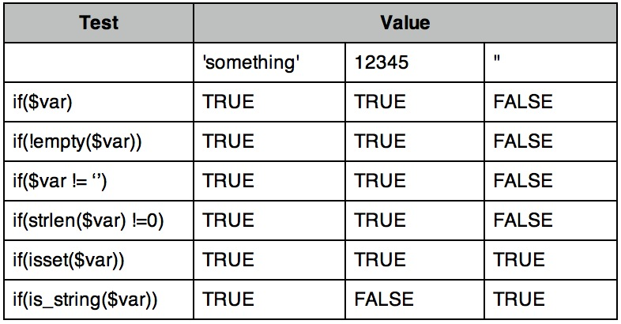
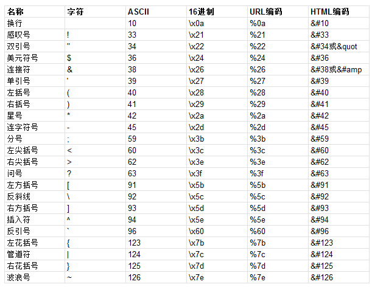

原文 by 瞌睡龙

## 一、验证过滤用户的输入
即使是最普通的字母数字输入也可能是危险的，列举几个容易引起安全问题的字符：  
! $ ^ & * ( ) ~ [ ] \ | { } ' " ; < > ? - `  

在数据库中可能有特殊意义的字符：  
' " ; \  

还有一些非打印字符：  
字符\x00或者说ASCII 0，NULL或FALSE  
字符\x10和\x13，或者说ASCII 10和13，\n \r  
字符\x1a或者说ASCII 26，表示文件的结束  
输入错误的参数类型，也可能导致程序出现意想不到的错误。  
输入过多的参数值，可能导致溢出等错误。  
## 二、PHP中验证用户的输入
这里特别要注意php.ini中的register_globals的设定，在早期的php版本中是默认开启的，这会导致很严重的安全问题：  
``` php
<?php
// set admin flag
if ($auth->isAdmin()) {
$admin = TRUE;
}
// ...
if ($admin) {
// do administrative tasks
}
?>
```
上面这段代码看起来是安全的，但是如果register_globals开启了的话，在访问的url中加入`?admin=1`即可绕过前半部分的逻辑判断。  
更安全的代码应该给$admin赋默认FALSE值：  
``` php
<?php
// create then set admin flag
$admin = FALSE;
if ($auth->isAdmin()) {
    $admin = TRUE;
}
// ...
if ($admin) {
    // do administrative tasks
}
?>
```
早期人们开发调试的时候发现使用register_globals有极大的便利，所以早期的php版本中默认开启。但是随着越来越多的安全问题，从php 4.2.0开始，register_globals变为了默认关闭。当你发现register_globals是on的时候，你可能会在脚本当中加入如下代码使其关闭：  
`ini_set('register_globals', 0);`  
但实际上，当所有的全局变量已经创建了之后，以上代码并不会起到作用。但是你可以在文档的根目录下的.htaccess的文件中加上下面这一行：  `php_flag register_globals 0`  

变量声明：强烈建议总是事先声明变量。  
检查输入的类型，长度和格式：  
字符串检查：在PHP中，字符串几乎可以是任何事情，但有些值并不是严格的字符串类型，可以用is_string()函数来确定。  
有些时候你不介意数字作为字符串，可以用empty()函数。  
数字类型检查：使用is_int()函数或者is_integer()或is_long()，例如：  
``` php
$year = $_POST['year'];
if (!is_int($year))
exit("$year is an invalid value for year!");
```
也可以使用gettype()函数判断类型后做处理：  
``` php
if (gettype($year) != 'integer') {
exit("$year is an invalid value for year!");
}
```
至少还有三种方式可以吧$year变量转变为整数：  
``` php
$year = intval($_POST['year']);
$year = ( int ) $_POST['year'];
if (!settype($year, 'integer')) {exit("$year is an invalid value for year!");}
```
如果允许浮点型与零的值，可以使用is_numeric()函数来做判断。 判断一个值是否为布尔型的时候使用is_bool()函数。  
下表是对各种类型变量使用各函数判断的结果：  
  

检查字符串的长度使用strlen()变量：  
``` php
if (strlen($year) != 4)
    exit("$year is an invalid value for year!");
```
概括总结一下PHP中类型，长度，格式等验证：  
``` php
<?php
// set up array of expected values and types
$expected = array(
    'carModel' => 'string',
    'year' => 'int',
    'imageLocation' => 'filename'
);
// check each input value for type and length
foreach ($expected AS $key => $type) {
    if (empty($_GET[$key])) {
        ${$key} = NULL;
        continue;
    }
    switch ($type) {
        case 'string':
            if (is_string($_GET[$key]) && strlen($_GET[$key]) < 256) {
                ${$key} = $_GET[$key];
            }
            break;
        case 'int':
            if (is_int($_GET[$key])) {
                ${$key} = $_GET[$key];
            }
            break;
        case 'filename':
            // limit filenames to 64 characters
            if (is_string($_GET[$key]) && strlen($_GET[$key]) < 64) {
                // escape any non-ASCII
                ${$key} = str_replace('%', '_', rawurlencode($_GET[$key]));
                // disallow double dots
                if (strpos(${$key}, '..') === TRUE) {
                    ${$key} = NULL;
                }
            }
            break;
    }
    if (!isset(${$key})) {
        ${$key} = NULL;
    }
}
// use the now-validated input in your application
```
对于一些可能有害的字符，可以用如下的几种方式进行保护：  

* 使用 \ 对其进行转义。  

* 使用引号把他引起来。 

* 使用%nn的方式编码，如urlencode()函数。  

可以尝试在php.ini中开启magic_quotes_gpc，这样对于所有由用户GET、POST、COOKIE中传入的特殊字符都会转义。  
也可以使用addslashes()函数，但是开启magic_quotes_gpc所造成的影响可能远超过益处。addslashes()也只对最常见的四个字符做了转义：单引号、双引号、反斜线、空字符。同时为了使数据还原，需要使用stripslashes()函数，也可能破坏一些多字节的转义。  
推荐使用mysql_real_escape_string()函数，虽然只是用来设计转义插入数据库的数据，但是他能转义更多的字符。  
如：NULL、\x00、\n、\r、\、'、"和\x1a。使用用例：  
``` php
<?php
$expected = array(
    'carModel',
    'year',
    'bodyStyle'
);
foreach ($expected AS $key) {
    if (!empty($_GET[$key])) {
        ${$key} = mysql_real_escape_string($_GET[$key]);
    }
}
?>
```
使用mysql_real_escape_string()函数也不是万能的，转义一些并非是要写入mysql的数据库的数据可能不会产生作用或者出现错误。
可以根据自己的实际需要，自己使用str_replace()函数写一个针对特殊字符的转义。  

## 三、对于文件的路径与名称的过滤
文件名中不能包含二进制数据，否则可能引起问题。  
一些系统允许Unicode多字节编码的文件名，但是尽量避免，应当使用ASCII的字符。  
虽然Unix系统几乎可以在文件名设定中使用任何符号，但是应当尽量使用 `- ` 和 ` _` ， 避免使用其他字符，同时需要限定文件名的长度。
php中的文件操作通常使用fopen()函数与file_get_contents()函数。  
``` php
<?php
$applicationPath = '/home/www/myphp/code/';
$scriptname      = $_POST['scriptname'];
highlight_file($applicationPath . $scriptname);
?>
```
上面代码的问题在于用户POST输入的scriptname没有做任何过滤，如果用户输入../../../../etc/passwd，则有可能读取到系统的passwd文件。  
``` php
<?php
$uri = $_POST['uri'];
if (strpos($uri, '..'))
    exit('That is not a valid URI.');
$importedData = file_get_contents($uri);
```
如果发现 .. 字符串就不执行会不会出现问题呢？如果前面并没有路径限制的话，仍然会出现问题：  
使用file协议，当用户输入`file:///etc/passwd`的时候，会把passwd的内容带入$importedData变量中。  

## 四、防止SQL注入
### SQL注入是如何产生的：
1、接收一个由用户提交的变量，假设变量为$variety：  
`$variety = $_POST['variety'];`  
2、接收的变量带入构造一个数据库查询语句：  
`$query = "SELECT * FROM wines WHERE variety='$variety'";`  
3、把构造好的语句提交给MySQL服务器查询，MySQL返回查询结果。  
当由用户输入`lagrein' or 1=1#`时，产生的结果将会完全不同。  
### 防止SQL注入的几种方式：
检查用户输入的类型，当用户输入的为数字时可以使用如下方式：  
使用is_int()函数（或is_integer()或is_long()函数）  
使用gettype()函数  
使用intval()函数  
使用settype()函数  
检查用户输入字符串的长度使用strlen()函数。  
检查日期或时间是否是有效的，可以使用strtotime()函数  
对于一个已经存在的程序来说，可以写一个通用函数来过滤：  
``` php
function safe($string)
{
    return "'" . mysql_real_escape_string($string) . "'";
}
```
调用方式：  
``` php
$variety = safe($_POST['variety']);
$query   = "SELECT * FROM wines WHERE variety=" . $variety;
```
对于一个刚开始写的程序，应当设计的更安全一些，PHP5中，增加了MySQL支持，提供了mysqli扩展：  
PHP手册地址：http://php.net/mysqli  
``` php
<?php
// retrieve the user's input
$animalName = $_POST['animalName'];
// connect to the database
$connect    = mysqli_connect('localhost', 'username', 'password', 'database');
if (!$connect)
    exit('connection failed:  ' . mysqli_connect_error());
// create a query statement resource
$stmt = mysqli_prepare($connect, "SELECT intelligence FROM animals WHERE name = ?");
if ($stmt) {
    // bind the substitution to the statement
    mysqli_stmt_bind_param($stmt, "s", $animalName);
    // execute the statement
    mysqli_stmt_execute($stmt);
    // retrieve the result...
    mysqli_stmt_bind_result($stmt, $intelligence);
    // ...and display it
    if (mysqli_stmt_fetch($stmt)) {
        print "A $animalName has $intelligence intelligence.\n";
    } else {
        print 'Sorry, no records found.';
    }
    // clean up statement resource
    mysqli_stmt_close($stmt);
}
mysqli_close($connect);
?>
```
mysqli扩展提供了所有的查询功能。  
mysqli扩展也提供了面向对象的版本：  
``` php
<?php
$animalName = $_POST['animalName'];
$mysqli     = new mysqli('localhost', 'username', 'password', 'database');
if (!$mysqli)
    exit('connection failed:  ' . mysqli_connect_error());
$stmt = $mysqli->prepare("SELECT intelligence FROM animals WHERE name = ?");
if ($stmt) {
    $stmt->bind_param("s", $animalName);
    $stmt->execute();
    $stmt->bind_result($intelligence);
    if ($stmt->fetch()) {
        print "A $animalName has $intelligence intelligence.\n";
    } else {
        print 'Sorry, no records found.';
    }
    $stmt->close();
}
$mysqli->close();
?>
```
## 四、防止XSS攻击
xss攻击一个常用的方法就是注入HTML元素执行js脚本，php中已经内置了一些防御的函数（如htmlentities或者htmlspecialchars）：  
``` php
<?php
function safe($value)
{
    htmlentities($value, ENT_QUOTES, 'utf-8');
    // other processing
    return $value;
}
// retrieve $title and $message from user input
$title   = $_POST['title'];
$message = $_POST['message'];
// and display them safely
print '<h1>' . safe($title) . '</h1>
       <p>' . safe($message) . '</p>';
?>
```
### 过滤用户提交的URL
如果允许用户输入一个URL用来调用一个图片或者链接，你需要保证他不传入`javascript:`或者`vbscript:`或`data:`等非http协议。  
可以使用php的内置函数parse_url()函数来分割URL，然后做判断。  
设置允许信任的域：  
``` php
<?php
$trustedHosts      = array(
    'example.com',
    'another.example.com'
);
$trustedHostsCount = count($trustedHosts);
function safeURI($value)
{
    $uriParts = parse_url($value);
    for ($i = 0; $i < $trustedHostsCount; $i++) {
        if ($uriParts['host'] === $trustedHosts[$i]) {
            return $value;
        }
    }
    $value .= ' [' . $uriParts['host'] . ']';
    return $value;
}
// retrieve $uri from user input
$uri = $_POST['uri'];
// and display it safely
echo safeURI($uri);
?>
```
## 五、防止远程执行
远程执行通常是使用了php代码执行如eval()函数，或者是调用了命令执行如exec()，passthru()，proc_open()，shell_exec()，system()或popen()。php为开发者提供了非常多的方法可以来调用允许php脚本，我们就需要注意对用户可控的数据进行过滤。  
### 调用的几种方式：
include()和require()函数，eval()函数，preg_replace()采用e模式调用，编写脚本模板。  
``` php
<?php
print Hello . world;
?>
```
上面代码将会输出Helloworld，php在解析的时候会检查是否存在一个名为Hello的函数。  
如果没有找到的话，他会自己创建一个并把它的名字作为它的值，world也是一样。  

攻击者可以上传一个看似很普通的图片，PDF等，但是实际上呢？  
linux下可以使用如下命令插入php代码进入图片中：  
`$ echo '<?php phpinfo();?>' >> locked.gif`  
把代码插入到了locked.gif图片中，并且此时用file命令查看文件格式仍为图片：  
`$ file -i locked.giflocked.gif: image/gif`  
任何的图像编辑或图像处理的程序包括PHP的getimagesize()函数，都会认为它是一个GIF图像。  
但当把图片的后缀改为php或者以php的方式解析时，插入的phpinfo()函数便会执行。  
### Shell命令执行
PHP提供了一些可以直接执行系统命令的函数，如exec()函数或者 `（反引号）。  
PHP的安全模式会提供一些保护，但是也有一些方式可以绕过安全模式：  
1、上传一个Perl脚本，或者Python或Ruby等，服务器支持的环境，来执行其他语言的脚本可绕过PHP的安全模式。  
2、利用系统的缓冲溢出漏洞，绕过安全模式。  
下表列出了跟Shell相关的一些字符：  
  

如下PHP脚本：  
```  php
<?php
// get the word count of the requested file
$filename = $_GET['filename'];
$command  = "/usr/bin/wc $filename";
$words    = shell_exec($command);
print "$filename contains $words words.";
?>
```
用户可以输入如下的URL来攻击读取passwd文件：  
wordcount.php?filename=%2Fdev%2Fnull%20%7C%20cat%20-%20%2Fetc%2Fpasswd  

字符串拼接之后，将会执行 /usr/bin/wc /dev/null | cat - /etc/passwd这条命令  
如果能够不使用命令执行函数与eval()函数，可以在php.ini中禁止：`disable_functions = "eval,phpinfo"`  
PHP中还有一个preg_replace()函数，可能引起代码执行漏洞。  
mixed preg_replace ( mixed $pattern , mixed $replacement , mixed $subject [, int $limit ] )  

在 subject 中搜索 pattern 模式的匹配项并替换为 replacement 。如果指定了 limit ，则仅替换 limit 个匹配。  
如果省略 limit 或者其值为 -1，则所有的匹配项都会被替换。  
特别注意：  
/e 修正符使 preg_replace() 将 replacement 参数当作 PHP 代码（在适当的逆向引用替换完之后）。  
提示：要确保 replacement 构成一个合法的 PHP 代码字符串，否则 PHP 会在报告在包含 preg_replace() 的行中出现语法解析错误。  
``` php
<?php
function test($str)
{
    //......
    //......
    return $str;
}
echo preg_replace("/\s*\[p hp](.+?)\[\/php\]\s*/ies", 'test("\1")', $_GET["h"]);
?>
```
当用户输入 `?h=[p hp]phpinfo()[/php]`  

经过正则匹配后， replacement 参数变为`'test("phpinfo()")'`，此时phpinfo仅是被当做一个字符串参数了。  
但是当我们提交`?h=[p hp]{${phpinfo()}}[/php]` 时，phpinfo()就会被执行。  

在php中，双引号里面如果包含有变量，php解释器会将其替换为变量解释后的结果；单引号中的变量不会被处理。  
注意：双引号中的函数不会被执行和替换。  
在这里我们需要通过`{${}}`构造出了一个特殊的变量，`'test("{${phpinfo()}}")'`，达到让函数被执行的效果， `${phpinfo()}` 会被解释执行。  
