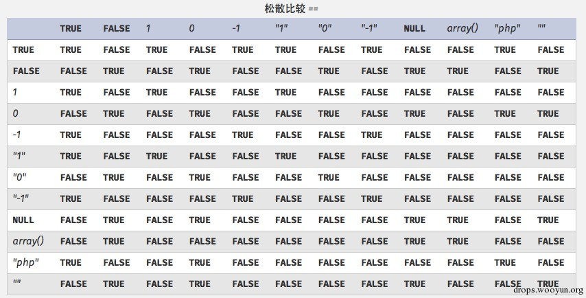

原文 by 乘物游心

## PHP弱类型简介
在PHP中，可以进行以下的操作：
```
$param = 1;
$param = array();
$param = "stringg";
```

弱类型的语言对变量的数据类型没有限制，你可以在任何地时候将变量赋值给任意的其他类型的变量，同时变量也可以转换成任意的其他类型的数据。
### 类型转换问题
类型转换是无法避免的问题。例如需要将GET或者是POST的参数转换为int类型，或者是两个变量不匹配的时候，PHP会自动地进行变量转换。但是PHP是一个弱类型的语言，导致在进行类型转换的时候会存在很多意想不到的问题。
#### 比较操作符
类型转换
在$a==$b的比较中
```
$a=null;$b=flase ; //true
$a='';$b=null;         //true
```
这样的例子还有很多，这种比较都是相等。使用比较操作符的时候也存在类型转换的问题，如下：
```
0=='0'           //true
0 == 'abcdefg'      //true
0 === 'abcdefg'    //false
1 == '1abcdef'     //true
```
当不同类型的变量进行比较的时候就会存在变量转换的问题，在转换之后就有可能会存在问题。


Hash比较
除了以上的这种方式之外在进行hash比较的时候也会存在问题。如下：
```
"0e132456789"=="0e7124511451155"//true
"0e123456abc"=="0e1dddada"  //false
"0e1234"=="0"     //true
```
在进行比较运算时，如果遇到了0e\d+这种字符串，就会将这种字符串解析为科学计数法。所以上面例子中2个数的值都是0因而就相等了。如果不满足0e\d+这种模式就不会相等。

十六进制转换
还存在一种十六进制余字符串进行比较运算时的问题。例子如下：
```
"0x1e240"=="123456"               //true
"0x1e240"==123456           //true
"0x1e240"=="1e240"          //false
```
当其中的一个字符串是0x开头的时候，PHP会将此字符串解析成为十进制然后再进行比较，0x1240解析成为十进制就是123456，所以与int类型和string类型的123456比较都是相等。

#### 类型转换
常见的转换主要就是int转换为string，string转换为int。
int转string：
```
$var = 5;
方式1：$item = (string)$var;
方式2：$item = strval($var);
```
string转int：intval()函数。
对于这个函数，可以先看2个例子。
```
var_dump(intval('2'))        //2
var_dump(intval('3abcd'))        //3
var_dump(intval('abcd')) //0
```

说明intval()转换的时候，会将从字符串的开始进行转换知道、、直到遇到一个非数字的字符。即使出现无法转换的字符串，intval()不会报错而是返回0。同时，程序员在编程的时候也不应该使用如下的这段代码：

```
if(intval($a)>1000) {
    mysql_query("select * from news where id=".$a)
}
```
这个时候$a的值有可能是1002 union…..

### 内置函数的参数的松散性
内置函数的松散性说的是，调用函数时给函数传递函数无法接受的参数类型。解释起来有点拗口，还是直接通过实际的例子来说明问题，下面会重点介绍几个这种函数。
#### md5()
```
$array1[] = array(
    "foo" => "bar",
    "bar" => "foo",
);
$array2 = array("foo", "bar", "hello", "world");
var_dump(md5($array1)==var_dump($array2));       //true
```
PHP手册中的md5()函数的描述是string md5 ( string $str [, bool $raw_output = false ] )，md5()中的需要是一个string类型的参数。但是当你传递一个array时，md5()不会报错，只是会无法正确地求出array的md5值，这样就会导致任意2个array的md5值都会相等。

#### strcmp()
strcmp()函数在PHP官方手册中的描述是int strcmp ( string $str1 , string $str2 ),需要给strcmp()传递2个string类型的参数。如果str1小于str2,返回-1，相等返回0，否则返回1。strcmp函数比较字符串的本质是将两个变量转换为ascii，然后进行减法运算，然后根据运算结果来决定返回值。如果传入给出strcmp()的参数是数字呢？
```
$array=array(1,2,3);
var_dump(strcmp($array,'123')); //null,在某种意义上null也就是相当false。
```
#### switch()
如果switch是数字类型的case的判断时，switch会将其中的参数转换为int类型。如下：
```
$i ="2abc";
switch ($i) {
case 0:
case 1:
case 2:
    echo "i is less than 3 but not negative";
    break;
case 3:
    echo "i is 3";
}
```

这个时候程序输出的是i is less than 3 but not negative，是由于switch()函数将$i进行了类型转换，转换结果为2。

#### in_array()
在PHP手册中，in_array()函数的解释是bool in_array ( mixed $needle , array $haystack [, bool $strict = FALSE ] ),如果strict参数没有提供，那么in_array就会使用松散比较来判断$needle是否在$haystack中。当strict的值为true时，in_array()会比较needls的类型和haystack中的类型是否相同。

```
$array=array(0,1,2,'3');
var_dump(in_array('abc', $array)); //true
var_dump(in_array('1bc', $array)); //true
```
可以看到上面的情况返回的都是true,因为 'abc' 会转换为0，'1bc' 转换为1。array_search()与in_array()也是一样的问题。

## Reference
[weakly-typed-security](http://blog.spoock.com/2016/06/25/weakly-typed-security/)