原文 by xiaoL-PKAV
   
认识一些主流的开发框架与现在程序设计理念，包含了一些WEB设计上的趋势与概念。另外以我自己的角度去说明一下怎么去看一个PHP程序，方法适合于以上开源框架和一些公司内部开发的框架（只要能看到源码）。  
   

   
## 框架的选择
   

   
ThinkPHP V3.2  
   
CodeIgniter V2.2.2  
   
Laravel V5.1  
   

   
选择以上三个框架也是以为这三个框架算是比较有代表性的  
   

   
ThinkPHP（TP）在国内很受欢迎，特别是小公司。  
   

   
CodeIgniter（CI）是传统且很流行的框架，并且也是很成熟的框架，据我说知sina的大多数地方站都是这个框架写的。  
   

   
Laravel是一个充满设计感的框架，应用了目前PHP上的所有新技术，并且借鉴了大量java与python的框架设计结构，也是目前调查的最流行的的Laravel框架（国内外）  
   

   
## 认识框架
   

   
依次排开：Laravel-> CodeIgniter(CI)->ThinkPHP(TP)  
   
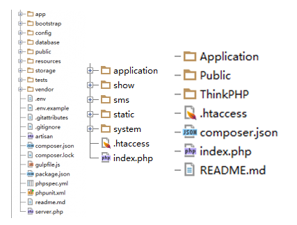  
   

   

   
中间的CI并未包含composer.json这个文件，这是PHP的包管理配置文件，在CI的3.0+版本中同样加入了PHP的包管理，真的是方便了大多数程序员。  
   

   
这样的目录结构很明显，一眼就能看出来。  
   

   
## 框架的基本设计模式
   

   
基本的设计模式就是MVC设计模式。  
   
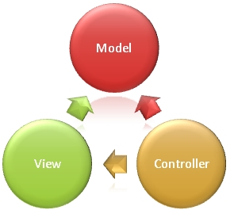  
   

   

   
注意：多层级的分层模式为HMVC模式。HMVC就是把客户端应用程序分解为有层次的父子关系的MVC。  
   
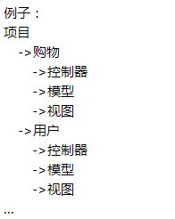 
   

   

   
## MVC对应的文件位置
   

   
看一个cms程序首先就是找控制器代码在哪个位置，之后就是模型文件的位置，视图文件最后，不过我真的在使用框架开发的程序中发现了模型控制代码而找到漏洞  
   

   
控制器  
   

   
Laravel-> CodeIgniter(CI)->ThinkPHP(TP)  
   
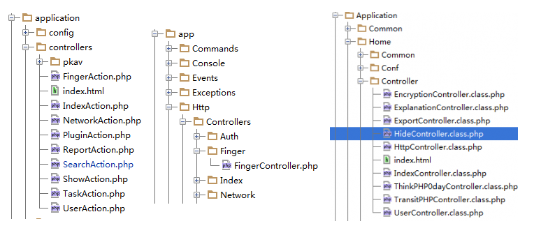  
   

   

   
模型  
   

   
Laravel-> CodeIgniter(CI)->ThinkPHP(TP)  
   
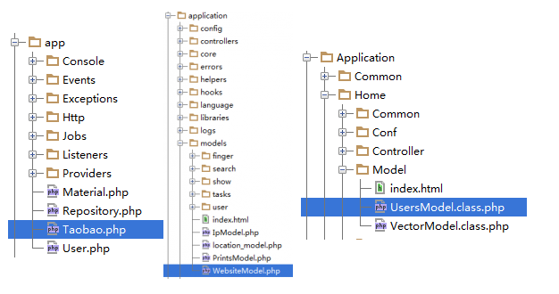  
   

   

   
数据库连接文件  
   

   
TP：（通用2.0|3.0）  
   

   
(Application)\(Home)\Conf\config.php  
   
//(Application) 默认为Application，保不齐修改，可以直接查看index.php  
   
  
   

   

   
//(home) 项目目录，因项目而异！  
   
```
   
'DB_TYPE' => 'mysql', // 数据库类型
   
'DB_HOST' => 'localhost', // 服务器地址
   
'DB_NAME' => 'chopperproxyl', // 数据库名
   
'DB_USER' => 'root', // 用户名
   
'DB_PWD' => 'root', // 密码
   
'DB_PORT' => 3306, // 端口
   
'DB_PREFIX' => 'xl_', // 数据库表前缀
   
```
   
CI:（通用2.0|3.0） 
   

   
(application)\config\database.php    
   
//一般是固定形式application，保不齐修改一样可以到index.php里面查看项目命名。    
   
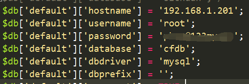    
   

   

   
Laravel：（5.0|4.0的目录少一个app）    
   

   
这个特殊一些，在代码目录下有一个.env文件，里面存在项目的一些配置，可以在这里设置数据库连接信息。（当然可以不）    
   
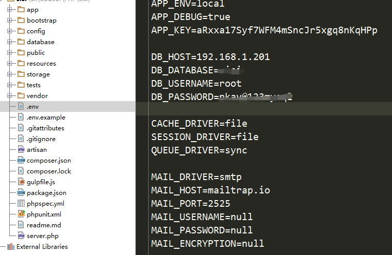    
   

   

   
另外可以直接写在文件中：   
   

   
config\database.php文件    
   
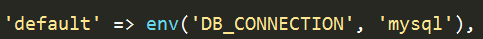    
   

   

   
//定义默认的数据库类型    
   
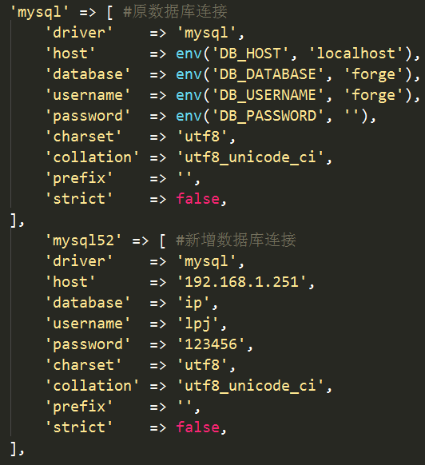    
   

   

   
备注：具体的配置可能是这样两种类型，使用env中定义，或者写入文件。    
   

   
如果配置文件中同时存在上图中的两套配置，说明系统可能使用了多数据库。    
   

   
这是几个框架最基本的东西了，下面把其中的关于安全的部分以及自己的一部分见解写出来，会挺有意思的。    
   

   
## SQL操作模型
   

   
在PHP开发过程中，一般都会使用两种技术。   
   

   
一：  
   

   
Active  
   
Record（ORM）  
   
ORM技术：Object-Relational  
   
Mapping，把关系数据库的表结构映射到对象上。  
   

   
例如  
   

   
ThinkPHP中：  
   
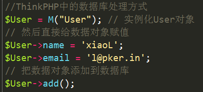   
   

   

   
CI中的：  
   
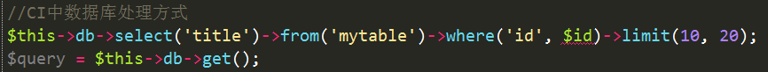   
   

   

   
二：查询构造器方式  
   

   
定义一个抽象数据库类，包含常用的各种方式。  
   

   
例如：在laravel中的  
   
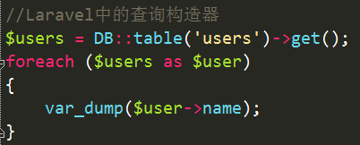   
   

   

   
注意：这两种方式的区别简单说就是需不需要自己去顶一个model文件。    
   

   
## 可能存在的SQL注入问题：  
   

   
1、 由于业务的复杂性导致SQL语句有时候很变态，几乎每种框架都支持使用原生SQL语句。  
   

   
CI：  
   
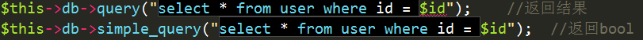  
   

   

   
TP：  
   
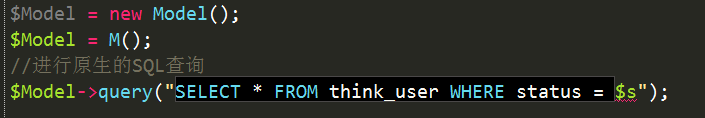  
   

   

   
Laravel：  
   

   
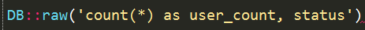  
   

   
注意：凡是这些方式中带入的参数未经过过滤，底层的解析都是不会进行注入处理的，都有可能造成注入。  
   

   
2、 错误的安全函数用法（预编译）  
   

   
TP官方方法：  
   

   
如果使用3.1以上版本的话，使用字符串条件的时候，建议配合预处理机制，确保更加安全，例如：  
   
```
   
$Model-&gt;where("id=%d and
   
username='%s' and xx='%f'",array($id,$username,$xx))-&gt;select();
   
```
   

   
或者使用：  
   
```
   
$Model-&gt;where("id=%d and
   
username='%s' and xx='%f'",$id,$username,$xx)-&gt;select()
   
```
   

   
底层实现原理：获取函数输入参数，所有参数经过一次addslashes，然后使用vsprintf格式化字符串。  
   
  
   
问题：如果在数字字段带入%s，且没有引号，一样能注入。  
   

   
3、 where子查询中key字段可控  
   

   
CI：  
   
 
   
控制器代码  
   
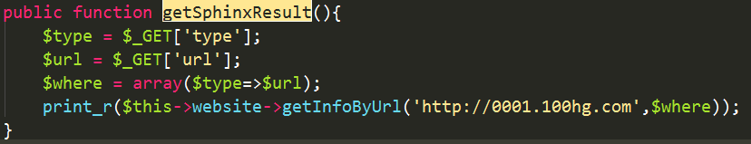  
   

   

   
模型代码：  
   
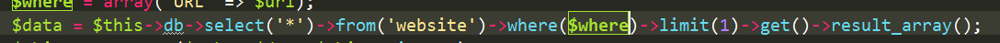  
   

   

   
针对查询数组中的value字段是会做处理的，但是针对key字段并不会。  
   

   
访问查看：  
   
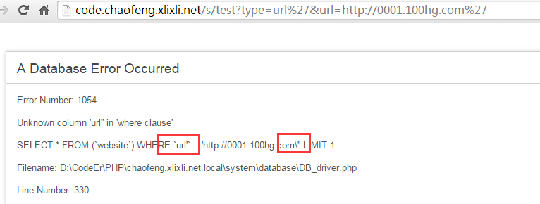  
   

   

   
Laravel：  
   

   
同样的Laravel这个框架也存在这个问题。  
   
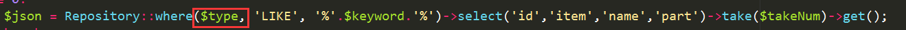  
   

   

   
其中$type可控一样可以造成注入。  
   
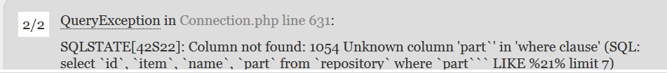  
   

   

   
备注：Thinkphp这种框架就没有，它自己写了解析where字句的方式，虽然在这点上很安全，可是历史上出事最多的就是它了。  
   

   
## URL路由
   

   
一般看一个CMS就是要去找URL对应的代码是哪些，这样才有办法进行审计。  
   

   
WEB开发过程中有一个概念是URL语义化。  
   

   
传统的URL  
   
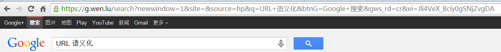  
   

   
https://g.wen.lu/search?newwindow=1&site=&source=hp&q=URL+%E8%AF%AD%E4%B9%89%E5%8C%96&btnG=Google+%E6%90%9C%E7%B4%A2&gws_rd=cr&ei=Jli4VeX_Bciy0gSNjZvgDA  
   

   

   
就是参数=值的形式。  
   

   
做了语义化的URL  
   
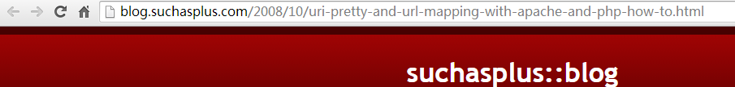  
   

   
http://blog.suchasplus.com/2008/10/uri-pretty-and-url-mapping-with-apache-and-php-how-to.html  
   

   

   

   
简单解释就是从URL上就能知道该页面具体展示的数据或者是什么功能，这是以后WEB开发的一个趋势。  
   

   
（这里不光指这三个框架，其他框架或者自己开发的框架都将会有这样的功能）  
   

   
作为一个先进的PHP框架，都是存在路由绑定这个功能的。路由绑定就是将用户访问URL对应到项目的具体控制器中去。（代码审计过程中就是怎么通过URL去访问对应的代码）  
   

   
Laravel：  
   

   
项目目录中app\Http\routes.php  
   

   
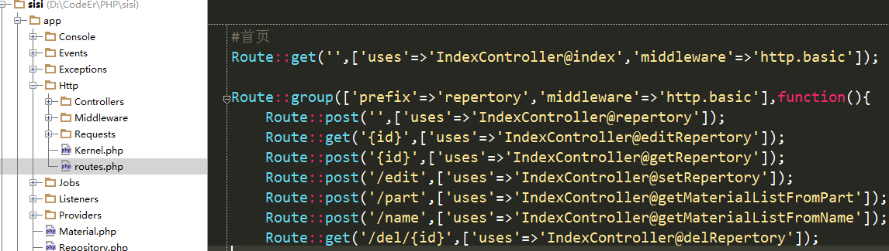  
   

   

   
CI：  
   
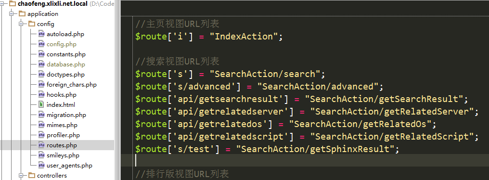  
   

   

   
TP：  
   
 
   
像TP这种框架，到3.2默认的URL方式还是  
   

   
http://serverName/index.php/模块/控制器/操作  
   

   
这种常见方式，但是也有路由绑定的功能。  
   

   
查找配置项  
   

   
`'URL_ROUTER_ON' => true,`  
   

   
然后寻找配置项  
   

   
`URL_ROUTE_RULES`  
   

   
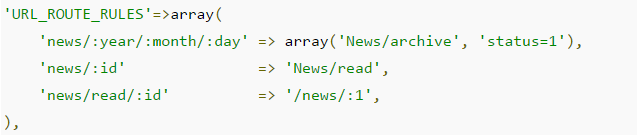  
   

   
备注：通过这些配置项目可以快速的找到URL对应的控制器代码是什么。  
   

   
说这个还有一个原因就是以后可能会接触到REST模式的URL，这个也是趋势。  
   

   
** 同一条URL可能对应不同的几个控制器代码。**  
   

   
HTTP协议存在GET POST PUT DELETE方法。  
   

   
web程序就是增删改查，对应的操作就是CURD，直接对应到的方法就是：  
   

   
C对应POST，R对应GET，U对应PUT，D对应DELETE  
   

   
具体代码就是通过判断请求方法来调用对应的控制器。  
   
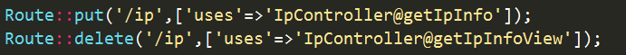  
   

   

   
## 框架的过滤机制（审计过程需要注意的点） 
   

   
一：针对URL的过滤  
   

   
由于URL路由的关系，现在的框架在GET方式上都或多或少的存在过滤或者说验证。  
   

   
TP：  
   

   
1、例如\d就限制了该参数只能是数字。  
   
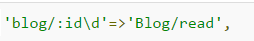  
   

   

   
2、或者是使用正则的方式来匹配，达到过滤的效果。  
   
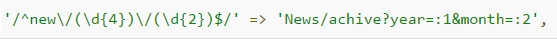  
   

   

   
CI：  
   

   
CI的过滤也一样，就是使用正则去匹配。  
   
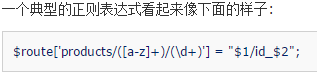  
   

   

   
Laravel：  
   
 
   
同样可以在定义URL路由的时候定义过滤，直接在路由上用where函数限制参数的类型。  
   

   
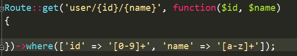  
   

   
或者在文件app\Providers\RouteServiceProvider.php中存在boot的函数，可以定义全局过滤，可以在这里面找找。  
   

   
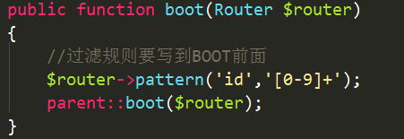  
   

   

   
二：针对接收参数的过滤  
   

   
现在的框架一般都会重写$_GET/$_POST/$_REQUEST，自建系统的输入，然后这些输入存在一些参数可以选择是否过滤。  
   

   
TP：  
   

   
重写的函数 I()  
   

   
用法
   

   
`I('get.id'); | I('post.id');`
   

   

   
利用设置默认值，设置过滤函数来达到过滤的效果。
   

   
`I('get.name','test','htmlspecialchars');`
   

   
CI:
   

   
CI中所有的系统方法都是$this开头的。
   

   
重写的输入函数 $this->input
   

   
用法
   

   
`$this-&gt;input-&gt;post('something');`
   

   
针对输入的第二个参数仅针对XSS，设置成true会进过一次CI内奸的xss_clean函数。
   

   
Laravel：
   

   
这个比较厉害，这玩意自己定义了一个中间件Middleware类型（借鉴java）。中间件的作用就是在HTTP请求实际接触应用程序之前，进行层层的检查跟过滤，甚至完全拒绝。
   

   
一般被用来做权限验证，参数过滤，数据加解密等等。
   

   
所有中间件都在app\Http\Middleware目录下面，根据具体情况查看是否将过滤写在这里面了。
   

   
重写的输入函数
   
```
   
Request $request
   

   
$request-&gt;input('ip');
   
```
   
第二个参数仅有设置默认值的作用，并没有实际的过滤。
   

   
三：默认设置的全局安全机制
   

   
CI：
   
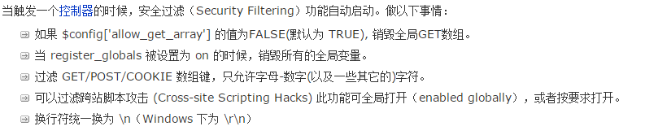
   

   

   
默认还有一个参数
   

   
`$config['global_xss_filtering'] = TRUE;`
   
开启后所有的参数都会经过xss_clean函数一遍。
   

   
TP：
   

   
全局的过滤参数
   

   
`'DEFAULT_FILTER' =&gt;'strip_tags,stripslashes',`
   

   
对接收数据进行依次的过滤。
   

   
Laravel：
   

   
默认开启的全局CSRF过滤（借鉴django等框架）。
   

   
其他貌似就没了。
   

   
## 由各个框架编写过程联想到的一些东西
   

   
1、 测试的时候如果一个正常的请求就是获取不到数据，可以在HTTP头里面加上
   

   
`X-Requested-With:XMLHttpRequest`
   

   
就是ajax请求。现在一般程序员的编写纯api接口的时候习惯是会区分直接访问还是ajax的，这样可以减少乱七八的数据请求。
   

   
例如：
   

   
Laravel：
   
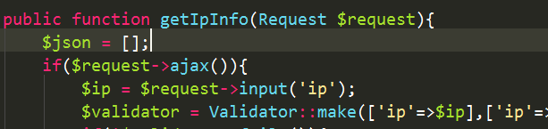
   

   

   
CI：
   
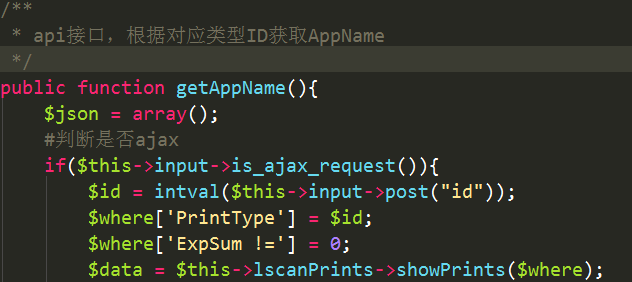
   

   

   
TP：
   

   
常量IS_AJAX 判断是否是AJAX提交。
   

   
2、 如果上传成功一个文件，但是就是访问不到，有几个原因。
   

   
.htaccess 文件限制了根目录下index.php以外的所有文件的访问权限，配合URL路由这个功能所有不在路由中的路径
   

   
`http://testtest.net/test/test.php`
   

   
都是无法访问的。
   

   
这个也是django类似的框架难以攻击的一个原因。（PHP正在往规范严谨的方向去）
   

   
这种时候要么能覆盖route文件，要么能覆盖对应的方法（这个太难，需要不破坏文件，只是修改对应的方法。）
   

   
Laravel这样的框架本身www设置的时候就是一个public目录（默认）。
   

   
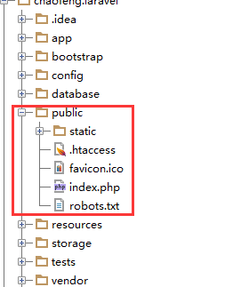
   

   

   
这个目录除了index.php文件啥也没有了，上传文件一般都在www目录的外层目录，无法直接访问。
   

   
这种时候只能靠跳转目录来跳到public下面才能访问，或者文件包含。
   

## Reference
[L-PKAV](http://xlixli.net/)
