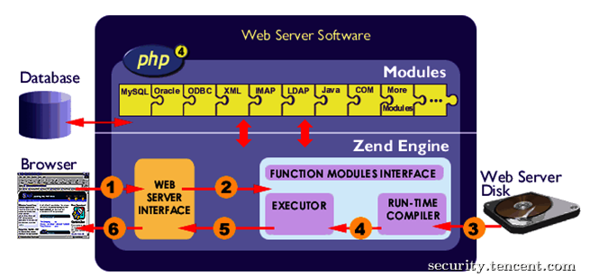
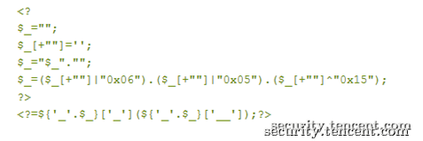

原文 by [tsrc 博客](https://security.tencent.com/index.php/blog/msg/57)    

## 1 背景概述
 
WEB应用漏洞导致的入侵时有发生，扫描器和WAF并不能解决所有的问题，于是尝试在主机侧针对PHP环境做了一个防御方案。很荣幸的邀请到TSRC部分白帽子做了一次对抗演习，本文主要分享一下防御思路。  
 
防御方案主要想解决的问题是getshell、主机敏感文件泄漏等问题。于是乎出了下面这样一个题目：部署了防御方案的Nginx + PHP 的WEB环境，提供一个上传入口，可上传任意文件。找到WEB目录下的一个flag文件读取到内容即算突破。  
 

## 2 PHP扩展
 
防御方案使用了PHP扩展来完成阻断。PHP内核支持C/C++开发一些扩展功能，并且提供了一个框架 - ext_skel帮助生成基本的代码简化开发，由于PHP扩展并不涉及底层的资源管理，所以编写一个PHP扩展和编写一个C应用程序是一样的。下图展示了PHP扩展所处的结构层次，扩展位于PHP内核ZEND 和 PHP应用层代码之间，那么利用PHP扩展可以：    
 
1)监控PHP应用层代码的执行细节，包括执行CGI、函数名、参数等；  

2)调用PHP内核ZEND提供的API接口，包括禁用类、修改配置选项等。  
  

图1 PHP语言的结构    
 
## 3 相关知识  
 
### 3.1  HOOKPHP代码  
 
PHP是解释型语言，代码被翻译为中间字节码由ZEND引擎解析执行。PHP把中间字节码称之为OPCODE，每个OPCODE对应ZEND底层的一个处理函数，ZEND引擎最终执行这个处理函数。实现HOOK功能只需要改变HOOK OPCODE对应的处理函数即可，而ZEND预先就提供了一个现成的接口：`zend_set_user_opcode_handler`。防御方案只需要HOOK以下三个OPCODE：    

`ZEND_INCLUDE_OR_EVAL` — eval、require等    

`ZEND_DO_FCALL` — 函数执行system等  

`ZEND_DO_FCALL_BY_NAME` — 变量函数执行 `$func = “system”;$func();`    


举例：  
`ZEND_DO_FCALL`这个OPCODE对应的功能是函数调用，如果需要HOOK所有的函数调用：  

1) 在模块初始化函数中使用zend_set_user_opcode_handler修改ZEND_DO_FCALL新的处理函数为mysub：  
```
PHP_MINIT_FUNCTION(phpips){
       zend_set_user_opcode_handler(ZEND_DO_FCALL,  mysub);
       return SUCCESS;
}
```

2) 在自定义函数中实现自己需要的功能并返回原来的处理函数：
```
void mysub(){
自定义功能;
return ZEND_USER_OPCODE_DISPATCH;
}
```
 
### 3.2 ZEND接口
 
HOOK之外还需要获取一些基本信息或功能，比如：  
 
1) 获取执行的PHP脚本名，可调用ZEND的接口`zend_get_executed_filename`：  

`char *cgi_name = (char*)zend_get_executed_filename(TSRMLS_C);`  
 
2) 禁用一些类库，可使用zend_disable_class接口；  

ZEND提供了很多丰富的接口，可根据需求选择调用。  
 
### 3.3 数据结构
 
PHP是弱类型语言，其上层并不区分变量类型，变量底层对应的是一个union结构体，以php-5.3.6版本举例，结构体在Zend/zend.h文件中定义；内容如下：
```
typedef union _zvalue_value {
        long lval;                                      /* longvalue */
        double dval;                            /* double value */
        struct {
                char *val;
                int len;
        } str;
        HashTable *ht;                          /* hash table value*/
        zend_object_value obj;
} zvalue_value;
``` 
PHP是在底层区分开了变量类型；在union结构体中有个非常重要的结构体HashTable，PHP中的数组结构就是利用HashTable这个结构体实现，如果变量是个数组，获取变量内容需要遍历这块HashTable，数据结构这块不做太多介绍。ZEND底层用zval这个结构体存储变量，同时ZEND提供了几个宏可以方便的转换zval到具体的数据类型，比如把zval类型转换为字符串 -- `zval el; Z_STRVAL_P(el)`，常用的还有：  
`Z_LVAL_P` 、`Z_DVAL_P` 、`Z_ARRVAL_P`等，以上宏列表在 `Zend/zend_operators.h` 有定义。  
 
 
## 4 规则策略
 
### 4.1 基本思路
 
我们需要解决的问题是getshell、主机敏感文件泄漏等问题。如果限制住PHP脚本执行命令 和 翻阅文件的功能，就达到了目的。同时，由于读取文件的接口非常多，使用场景也较多，因此采取禁用打开目录接口来侧面达到禁止翻阅文件的目的，不能遍历目录便无法得到文件名，可以有效的达到目标。故最终形成的最终策略如下：  

1) 禁用掉执行命令的接口  

2) 禁用掉打开目录的接口  
 
禁用函数有一些需要注意的问题：  

1) PHP接口还是比较繁多复杂的，除了system、exec、opendir、scandir常用函数之外，一些生僻函数比如glob等函数都要考虑全面，另外还有一些回调函数、反射类  

2) PHP SPL提供的一些类库有文件管理的功能，也需要禁止，比如`DirectoryIterator`（不过好像没有白帽子使用过SPL）  

 
### 4.2 对抗变形
 
PHP使用`assert`或 `preg_replace /e`执行代码，调用`zend_get_executed_filename` 获取的PHP脚本名中会带有辨别标识，assert对应的是`assert code`，`preg_replace` 对应的是`regexp code`；当发现这些特殊的脚本执行了`system` 等4.1中提高的高危函数直接阻断。以下图的`nonalphanumeric -webshell`举例：    
 
变形webshell解析后的形式和`$_GET[1]($_GET[2])`类似，比如传入`1=assert&2=system(whoami)`执行代码，PHP扩展层监控到system函数执行，并且发现PHP脚本名带regexp code标识，清晰的知道是preg_replace的代码执行了调用了system，阻断system。Assert函数同理。总结：扩展并不关注在静态层如何编码运算或加密，扩展只监控最后的行为，所以可以很好的解决目前的变形难题。  
    

### 4.3 减少误杀
 
有时正常的PHP脚本也需要用到命令执行的功能，如何保证其正常运行，不被我们的防御策略阻断呢？这里提供三种思路：  

1) 写入权限和执行命令权限互斥

考虑到入侵者利用上传漏洞或者其他0DAY getshell得到的文件大多会有W写权限，防御方往往希望阻止这部分文件拥有过高的权限。  
那么，我们可以去除正常PHP脚本的可写权限，然后只对有写权限的PHP脚本实施命令执行等防御策略的阻断逻辑。这样即不会影响到业务的使用，又达到了预设场景的防护目标。不过这样的思路，需要禁用chmod等可以修改文件权限的函数。  

2) 使用白名单逻辑  

粗暴一点的可以用文件名白名单，也就是业务报备过的文件不受阻断，其它不认识的文件一律禁止。优雅一点的可以对函数参数做白名单，比如提取正常PHP脚本执行命令的参数或者代码特征，对其进行放行，不认识的特征一律阻断。  

3) 使用黑名单逻辑  

设定一些已知恶意脚本的黑特征参数，类似于杀毒软件早期的特征码思路。  
 
上述思路在企业推广时，需要和业务有足够充分的配合，也都有不完美的地方，如果大家有更多方案或者思路，欢迎与我共同探讨。  
 

## 5 未来
 
利用PHP扩展可以做的事情还是比较多，比如在漏洞检测方面、对数据库函数参数过滤、阻断SQL注入、阻断存储型XSS等场景都有非常大的想象空间。甚至在代码审计这块也可以考虑，国内有个大牛已经有比较成熟的开源产品，TAINT （作者：laruence），大家可能都已经比较熟悉了，就暂时不做赘述了。  