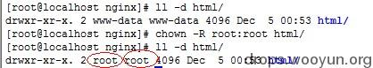
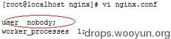
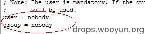

原文 by wooyun zhangsan  

## 0x00 测试环境

操作系统：CentOS6.5  
Web服务器：Nginx1.4.6  
Php版本：Php5.4.26  

## 0x01 Nginx介绍

nginx本身不能处理PHP，它只是个web服务器，当接收到请求后，如果是php请求，则发给php解释器处理，并把结果返回给客户端。nginx一般是把请求发fastcgi管理进程处理，fastcgi管理进程选择cgi子进程处理结果并返回被nginx。  

nginx涉及到两个账户，一个是nginx的运行账户，一个是php-fpm的运行账户。如果访问的是一个静态文件，则只需要nginx的运行账户对文件具有读取权限；而如果访问的是一个php文件，则首先需要nginx的运行账户对文件有读取权限，读取到文件后发现是一个php文件，则转发给php-fpm，此时则需要php-fpm账户对文件具有读取权限。  

## 0x02 研究发现的结论

1. linux下，要读取一个文件，首先需要具有对文件所在文件夹的执行权限,然后需要对文件的读取权限。 
2. php文件的执行不需要文件的执行权限，只需要nginx和php-fpm运行账户的读取权限。 
3. 上传木马后，能不能列出一个文件夹的内容，跟php-fpm的运行账户对文件夹的读取权限有关。 
4. 木马执行命令的权限跟php-fpm的账户权限有关。 
5. 如果木马要执行命令，需要php-fpm的账户对相应的sh有执行权限。 
6. 要读取一个文件夹内的文件，是不需要对文件夹有读取权限的，只需要对文件夹有执行权限。 

## 0x03 Nginx服务器涉及到的安全配置

1. Nginx.conf的配置 
2. php-fpm.conf的配置 
3. nginx和php-fpm的运行账户对磁盘的权限配置 
4. Php.ini的配置 

## 0x04 常见需要配置的操作方法

1. 禁止一个目录的访问  
示例：禁止访问path目录  
```
location ^~ /path { 
deny all; 
} 
```
可以把path换成实际需要的目录，目录path后是否带有"/"，带“/”会禁止访问该目录和该目录下所有文件。不带"/"的情况就有些复杂了，只要目录开头匹配上那个关键字就会禁止；注意要放在fastcgi配置之前。  

2. 禁止php文件的访问及执行
示例：去掉单个目录的PHP执行权限  
```
location ~ /attachments/.*\.(php|php5)?$ { 
deny all; 
} 
```
示例：去掉多个目录的PHP执行权限  
```
location ~  
/(attachments|upload)/.*\.(php|php5)?$ { 
deny all; 
} 
```
3. 禁止IP的访问  
示例：禁止IP段的写法：    
`deny 10.0.0.0/24;`   
示例：只允许某个IP或某个IP段用户访问，其它的用户全都禁止  
```
allow  
x.x.x.x;  
allow 10.0.0.0/24;  
deny all; 
```

## 0x05 需要解决的常见问题

1. 让木马上传后不能执行
针对上传目录，在nginx配置文件中加入配置，使此目录无法解析php。  

2. 让木马执行后看不到非网站目录文件
取消php-fpm运行账户对于其他目录的读取权限。  

3. 木马执行后命令不能执行
取消php-fpm账户对于sh的执行权限。  

4. 命令执行后权限不能过高
Php-fpm账户不要用root或者加入root组。  

## 0x06 Nginx安全配置方案

1. 修改网站目录所有者为非php-fpm运行账户，此处修改所有者为root。  
命令：`chown -R root:root html/` 
  

2. 修改nginx及php-fpm的运行账户及组为nobody  
nginx.conf    
  
Php-fpm.conf    
    

3. 取消nobody对所有目录的的读取权限，然后添加对网站目录的读取权限  
命令：  
```
chmod o-r –R  /
chmod o+r –R html/
```
4. 取消nobody对于/bin/sh 的执行权限   
`chmod 776 /bin/sh`

5. 确认网站目录对于nobody的权限为可读可执行，对网站文件的权限为可读  

6. 对于上传目录或者写入写文件的目录添加nobody的写入权限  

7. 配置nginx.conf 对于上传目录无php的执行权限

8. 配置nginx.conf禁止访问的文件夹，如后台，或者限制访问ip

9. 配置nginx.conf禁止访问的文件类型，如一些txt日志文件