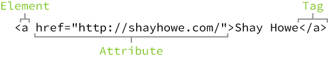
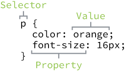
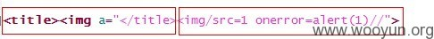

## 一、HTML/CSS/JavaScript
> Remember, HTML will define the content and structure of our web pages, while CSS will define the visual style and appearance of our web pages.

    
    

如上图所示，html 是一种文本标记语言，可以说决定了页面的骨架，而css 则决定了页面的可视化样式。  
selector 常见的就 type(tag), class(.), id(#)，注意的是 id 只能一个页面一个。 e.g `<div class=""  id=""></div>`  
在html 中引入css 一般有以下3种方式：  
* 行内式
`<p style="margin-left: 0.5in; margin-right:0.5in">`   
* 嵌入式；集中写在&lt;head&gt;和&lt;/head&gt;之间
``` html
<style type="text/css">
div{margin: 0;padding: 0;border:1px red solid;}     
</style>
```   
* 链入外部样式表文件 (Linking to a Style Sheet)
``` html
<head>
<title>title of article</title>
<link rel=stylesheet href="http://www.dhtmlet.com/rainer.css" type="text/css"> 
</head>
```

还有一些其他类似的文件类型，如 shtml, phtml, jhtml，这类可以算是动态网页，比如 shtml (ssi)可以 `<!--#include ../../1.html -->` 引入一个html，服务器会将其解析并填充在返回的页面中；phtml 即源码包含 `<?php ?>` 语句；jhtml 源码包含 jsp `<% %>` 语句。  

当我们浏览器访问一个站点的静态文件，会把文件内容都下载下来，当然如果遇到外联的css/js，会再发起请求得到，右键查看网页源代码可以看到下载的源代码。接着浏览器会开始渲染，包括执行js比如 `document.write()` 之类，就呈现出现在我们所看到的网页模样，可以使用firefox F12 查看 dom 树结构，也可以断点调试js。由于是下载到本地，所以可以自己尝试修改element 查看效果，这并不影响服务器上的原始文件。注意 js 是在客户端执行的，所谓的 dom 树操作就是一系列类似 getElementById 之类的函数，可以动态地改变 dom 树，通俗地说就是可以改变页面的html，人们从浏览器看见的页面也就变化了。  

html属性的特点：大小写不敏感，属性值引号不敏感（可以没有引号，也可以是单引号，双引号甚至反引号括起来），此外 标签与属性之间、属性名和等号之间、等号和属性值之间可以用空格、换行符(chr(13))、回车符(chr(10))、或者tab(chr(9))等，并且个数不受限制。
css 的语法特点与 html 标签和属性 的特点类似，这为我们做代码混淆带来很多便利之处。  
在html 语法中有标签优先级的概念，有些标签如 &lt;textarea&gt;、&lt;title&gt;、&lt;style&gt;、&lt;script&gt;、&lt;xmp&gt; 等具有非常高的优先级，使得其结束标签甚至可以直接中断其他标签的属性，在引号闭合的前提下。但如&lt;/script&gt; 是不能用来结束&lt;textarea&gt;的，还是需要&lt;/textarea&gt; 来终止后另起script 标签。  
  
``` html
<input type='text' value='aa '><ScRiPt >prompt(333)</ScRiPt>
<input type='text' value='aa '</script><ScRiPt >prompt(333)</ScRiPt>
<input id="key" name="key" type="text" value=""&gt;&lt;ScriPt&gt;alert(777)&lt;/ScriPt&gt; onmouseover='prompt(907965601)'bad="">
```
`//` 用于js 注释时只会注释掉 js 域的代码，如 `<input id="a" type="text" value="please input" onfocus="if(value == 'please input'){value='world&#039;;alert();}//'}"/>` 此时被注释掉的 只是 '} 两个字符。 `/* */` 可以用于注释多行 js。


## 二、编码与转义 ##
html 实体编码：  
如把尖括号编码[ < ] -----> html 实体：&#38;lt;  
html 10进制与16进制：    
如把尖括号编码[ < ] -----> html十进制： &#38;#60; &nbsp; html十六进制： &#38;#x3c;  
javascript 的八进制跟十六进制:
如把尖括号编码[ < ] -----> js八进制：\74 &nbsp; js十六进制：\x3c  
js unicode 编码：
如把尖括号编码[ < ] -----> js unicode：\u003c &nbsp;    中文等多字节字符只能用这种编码  
url 编码:
如把尖括号编码[ < ] -----> url： %3C &nbsp;	`+` 可以表示空格  
如"中文"使用UTF-8字符集得到的字节为0xE4 0xB8 0xAD 0xE6 0x96 0x87，经过Url 编码之后得到"%E4%B8%AD%E6%96%87"。  
css 编码
如把尖括号编码[ < ] -----> css：\3c \03c \00003c 都可以  

注意：反斜杠 `\` 在script域内会起转义作用，而在html 标签内就是表示的字符含义，从下面alert()出来的字符可以得知。  
``` html
<script> var test="a\""; alert(test); </script>
<script> var test='a\''; alert(test); </script>
<script> var test='a';   alert(test); </script>
<input type="text" value="a\" onmousemove=alert(/xss/) " />
```

## 三、url 编码
> "...Only alphanumerics [0-9a-zA-Z], the special characters "$-_.+!*'()," [not including the quotes - ed], and reserved characters used for their reserved purposes may be used unencoded within a URL."
"只有字母和数字[0-9a-zA-Z]、一些特殊符号 "$ - _ . + ! * ' ( ) ,"[不包括双引号]、以及某些保留字(例如 "# ? : / @ ="等，译者注)，才可以不经过编码直接用于URL。"  

### 1. Javascript函数：escape()
Javascript 语言用于编码的函数，一共有三个，最古老的一个就是escape()。虽然这个函数现在已经不提倡使用了，但是由于历史原因，很多地方还在使用它，所以有必要先从它讲起。  
实际上，escape()不能直接用于URL编码，它的真正作用是返回一个字符的Unicode编码值。比如“春节”的返回结果是%u6625%u8282，也就是说在Unicode字符集中，“春”是第6625个（十六进制）字符，“节”是第8282个（十六进制）字符。  
它的具体规则是，除了ASCII字母、数字、标点符号 "@ * _ + - . /"以外，对其他所有字符进行编码。在\u0000到\u00ff之间的符号被转成%xx的形式，其余符号被转成%uxxxx的形式。对应的解码函数是unescape()。  
所以，"Hello World"的escape()编码就是"Hello%20World"。因为空格的Unicode值是20（十六进制）。  
还有两个地方需要注意。  
首先，无论网页的原始编码是什么，一旦被Javascript编码，就都变为unicode字符。也就是说，Javascipt函数的输入和输出，默认都是Unicode字符。这一点对下面两个函数也适用。  
其次，escape()不对 "+" 编码。但是我们知道，网页在提交表单的时候，如果有空格，则会被转化为+字符。服务器处理数据的时候，会把+号处理成空格。所以，使用的时候要小心。  
### 2. Javascript函数：encodeURI()
encodeURI()是Javascript 中真正用来对URL编码的函数。  
它着眼于对整个URL进行编码，因此除了常见的符号以外，对其他一些在网址中有特殊含义的符号"; / ? : @ & = + $ , #" 也不进行编码。编码后，它输出符号的utf-8形式，并且在每个字节前加上%。它对应的解码函数是decodeURI()。  
需要注意的是，它不对单引号 ' 编码。  
### 3. Javascript函数：encodeURIComponent()
最后一个Javascript编码函数是encodeURIComponent()。与encodeURI()的区别是，它用于对URL的组成部分进行个别编码，而不用于对整个URL进行编码。因此，"; / ? : @ & = + $ , #"，这些在encodeURI()中不被编码的符号，在encodeURIComponent()中统统会被编码。至于具体的编码方法，两者是一样。  
它对应的解码函数是decodeURIComponent()。  

## 四、JS 的错误中断 ##
js 的错误中断有两种。  
* 是解析时语法错误。解析时的错误会导致整个SCRIPT标签(&lt;script&gt; 以及 &lt;script src=xx.js&gt;)的代码不被解析，所以更不用说运行了，这也是为什么解析时的错误无法用try 语句屏蔽的原因。
* 是运行时错误。除了解析时的错误外还有运行时的错误，这种错误并不在解析时判断，而是在代码运行之后，但是这也并不简单，首先要搞明白JavaScript的消息机制。运行时的错误会使处理当前消息的代码中断，而在错误之前的代码是可以被执行到。ECMASCRIPT规范中的一句话： 当程序解析器从左至右解析程序的时候，如果遇到了输入文档流的结尾，而解析器无法正常解析文档流的时候，一个分号会被自动插入到输入流的结尾。无论解析时错误还是运行时错误，它们都不会影响其他消息的执行（即其他 script 标签内的流程）。
在调试程序错误的时候，我们可以先查看是否程序的语法有错误，在文档头部书写一个alert 语句，如果此语句无法运行就说明程序的语法有错误，这种错误基本都很容易发现（比如各种未定义的token）。解析时错误则显示在chrome里的console选项卡里一般显示为 SyntaxError，运行时错误比较多种如 Uncaught URIError。  
如果在一个函数内部发生了错误，它自身没有捕获，错误就会被抛到外层调用函数，如果外层函数也没有捕获，该错误会一直沿着函数调用链向上抛出，直到被JavaScript 引擎捕获，代码终止执行。  

## 五、JS 的名字空间
JavaScript 实际上只有一个全局作用域。任何变量（函数也视为变量），如果没有在当前函数作用域中找到，就会继续往上查找，最后如果在全局作用域中也没有找到，则报ReferenceError 错误。  

### 名字空间

全局变量会绑定到window上，不同的JavaScript文件如果使用了相同的全局变量，或者定义了相同名字的顶层函数，都会造成命名冲突，并且很难被发现。  
减少冲突的一个方法是把自己的所有变量和函数全部绑定到一个全局变量中。例如：  
``` javascript
// 唯一的全局变量MYAPP:
var MYAPP = {};

// 其他变量:
MYAPP.name = 'myapp';
MYAPP.version = 1.0;

// 其他函数:
MYAPP.foo = function () {
    return 'foo';
};
```
把自己的代码全部放入唯一的名字空间MYAPP中，会大大减少全局变量冲突的可能。  
许多著名的JavaScript库都是这么干的：jQuery，YUI，underscore等等。  
