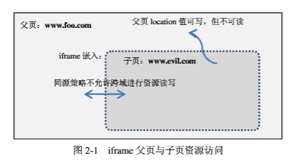

## 一、 什么是同源策略 ##
同源策略是浏览器上为安全性考虑实施的非常重要的安全策略，理解跨域首先必须要了解同源策略。    
何谓同源：URL由协议、域名、端口和路径组成，如果两个URL的协议、域名和端口相同，则表示他们同源。    
同源策略：  
> 浏览器的同源策略，限制了来自不同源的"document"或脚本，对当前"document"读取或设置某些属性。 （白帽子讲web安全）
从一个域上加载的脚本不允许访问或者设置另外一个域的文档属性。

举个例子：  
比如一个恶意网站的页面通过iframe嵌入了银行的登录页面（二者不同源），如果没有同源限制，恶意网页上的javascript脚本就可以在用户登录银行的时候获取用户名和密码。

在浏览器中，&lt;img&gt;、&lt;iframe&gt;、&lt;link&gt;、&lt;embed&gt;(flash)、&lt;object&gt;(flash) 等标签都可以加载跨域资源，而不受同源限制，但浏览器限制了JavaScript的权限使其不能读、写加载的内容。另外同源策略只对网页的HTML文档做了限制，对加载的其他站点的静态资源如javascript、css、图片等仍然认为属于同源。注意：嵌入外域flash 不算是同域。

代码示例（http://localhost:8080/ 和 http://localhost:8081 由于端口不同而不同源）：  
http://localhost:8080/test.html
```  html     
		 <html>
            <head><title>test same origin policy</title></head>
            <body>
                <iframe id="test" src="http://localhost:8081/test2.html"></iframe>
                <script type="text/javascript">
                    document.getElementById("test").contentDocument.body.innerHTML = "write somthing";
                </script>
            </body>
        </html>
```
http://localhost:8081/test2.html  
``` html
        <html>
            <head><title>test same origin policy</title></head>
            <body>
                Testing.
            </body>
        </html>
```
在Firefox中会得到如下错误：`Error: Permission denied to access property 'body'`

Document对象的domain属性存放着装载文档的服务器的主机名，可以设置它。  
例如来自"blog.csdn.net"和来自"bbs.csdn.net"的页面，都将document.domain设置为"csdn.net"，则来自两个子域名的脚本即可相互访问。出于安全的考虑，不能设置为其他主domain，比如 http://www.csdn.net 不能设置为sina.com
   

## 二、Ajax跨域 ##
Ajax (XMLHttpRequest)请求受到同源策略的限制。  
Ajax 通过XMLHttpRequest 能够与远程的服务器进行信息交互，另外XMLHttpRequest是一个纯粹的Javascript对象，这样的交互过程，是在后台进行的，用户不易察觉。   
举个例子：某网站因为存在漏洞导致XSS注入了javascript脚本，这个脚本就可以通过ajax获取用户信息并通过ajax提交给其他站点，这样就可以源源不断地收集信息。   
如果我们又想利用XMLHTTP的无刷新异步交互能力，又不愿意公然突破Javascript的安全策略，可以选择的方案就是给XMLHTTP加上严格的同源限制。这样的安全策略，很类似于Applet的安全策略。IFrame的限制还仅仅是不能访问跨域HTMLDOM中的数据，而XMLHTTP则根本上限制了跨域请求的读取。  

实际上 ajax 是可以跨域发起请求，但不可以读取返回的内容，ajax跨域请求不可以主动添加cookie、user-agent、referer、x_forward_for 等 http 头。服务端肯定返回数据了，只是没有返回Access-Control-Allow-Origin  header头，被浏览器识别为跨域请求而拦截掉。一般浏览器的报错：`XMLHttpRequest cannot load targetdomain. Origin origindomain is not allowed by Access-Control-Allow-Origin`。
默认情况下 ajax 发起的跨域请求无法带上**目标域的cookie**，这时需要设置 xhr 实例的 withCredentials 属性为 true（IE还不支持），若不希望浏览器报权限错误，目标域需要返回头 `Access-Control-Allow-Credentials: true`。另外，Access-Control-Allow-Origin不能设置为\*，不然cookie不会出现在http的请求头里，且会出现如下报错：
```
Access to XMLHttpRequest at '...' from origin '...' has been blocked by CORS policy: The value of the 'Access-Control-Allow-Origin' header in the response must not be the wildcard '*' when the request's credentials mode is 'include'. The credentials mode of requests initiated by the XMLHttpRequest is controlled by the withCredentials attribute.
```

主流浏览器中，当在一个页面通过&lt;img&gt;、&lt;iframe&gt;、&lt;script&gt;、&lt;link&gt; 等标签请求第三方站点资源时，都不会拦截 session cookie的发送，针对 persistent cookie，IE6~8, safari 会拦截， 而chrome, firefox, opera 等不会拦截；如果第三方站点返回给浏览器的http 头含有 P3P(Platform for Privacy Preferences Project)头，则在某种程度来说，将允许浏览器发送第三方的 persistent cookie。P3P 该字段用于标识是否允许目标网站的 cookie 被另一个域通过加载目标网站而设置或发送，仅 IE 执行了该策略。
假设 b 站点的 foo.php 代码如下  
``` php
<?php
//header('P3P: CP="CURa ADMa DEVa PSAo PSDo OUR BUS UNI PUR INT DEM STA PRE
COM NAV OTC NOI DSP COR"');
setcookie("test0", 'local', time()+3600*3650);
setcookie("test_mem0", 'memory');
var_dump($_COOKIE);
?>
```
我们通过 a 站点  &lt;iframe src="http://www.b.com/cookie/foo.php" &gt; &lt;/iframe &gt; 加载 foo.php，通过 fiddle 等代理工具可以看到 foo.php 尝试设置 cookie，由于没有返回 P3P 头，故设置失败。把注释打开，则 session cookie test_mem0 和 persistent cookie test0 都设置成功，此时他们都是具有P3P属性的cookie，这里示例了 设置 cookie 的情况。  
假设 header 注释掉，直接访问 foo.php，设置了两个类似的cookie, test_mem1 和 test1，此时这两个cookie 都不具备 P3P 属性，再通过 a 站点 iframe 加载 foo.php 时可以看到 test_mem1 被发送，而 test1 没有被发送出去。也就是说没有 P3P 属性的 persistent cookie 无法在通过 iframe 等方式加载第三方域时被发送出去。  

注意：Cookie中的同源只关注域名，忽略协议和端口。所以https://localhost:8080/ 和 http://localhost:8081/ 的Cookie是共享的。

## 三、浏览器特性和安全策略 ##
1. 同源策略   
如前面所述。

2.  沙盒框架（Sandboxed frame）    
是对常规&lt;iframe&gt;表现行为的扩展，它能让顶级页面对其嵌入的子页面及这些子页面的子资源设置一些额外的限制，
通过设置&lt;iframe&gt;的参数实现限制。
最原始的一些限制如下图：  


3. Flash安全沙箱    
分为本地沙箱与远程沙箱    
类似于同源策略，在同一域内的资源会被放到一个安全组下，称为安全沙箱    
Web站点通过crossdomain.xml文件配置可以提供允许的域跨域访问本域上内容的权限（放置于站点根目录）    

4. Cookie 的安全策略     
如 [http协议](./HTTP协议.md) 所述  

5.  内容安全策略（Content Security Policy，CSP）     
通过编码在HTTP响应头中的指令来实施策略  
http 响应的扩展头部都以 X- 打头，用于区分标准的头部字段，比如  
X-Frame-Options 用于防御 ClickJacking  
X-XSS-Protection  用于是否开启xss filter  
X-Content-Security-Policy（即CSP 策略），例如  
`X-Content-Security-Policy : default-src 'unsafe-inline' 'self'`   即不允许任何外部的资源加载，且允许内嵌脚本执行。

## 四、WebSocket 协议  
WebSocket 作为 HTML5 的新特性之一格外吸引着开发人员的注意，因为它的出现使得客户端（主要指浏览器）提供对 Socket 的支持成为可能，从而在客户端和服务器之间提供了一个基于单 TCP 连接的双向通道。该技术被广泛应用到了实时性要求比较高的各类应用，譬如在线证券、在线游戏，以及不同设备之间信息同步。    
不幸的是，WebSocket 相关的安全漏洞也逐步被披露出来，其中最容易发生的就是跨站点 WebSocket 劫持漏洞。    
譬如，某个用户已经登录了应用程序，如果他被诱骗访问某个社交网站的恶意网页，恶意网页在某元素中植入一个 WebSocket 握手请求申请跟目标应用建立 WebSocket 连接。一旦打开该恶意网页，则自动发起如下请求。请注意，Origin 和 Sec-WebSocket-Key 都是由浏览器自动生成，Cookie 等身份认证参数也都是由浏览器自动上传到目标应用服务器端。如果服务器端疏于检查 Origin，该请求则会成功握手切换到 WebSocket 协议，恶意网页就可以成功绕过身份认证连接到 WebSocket 服务器，进而窃取到服务器端发来的信息，抑或发送伪造信息到服务器端篡改服务器端数据。
```
GET ws://echo.websocket.org/?encoding=text HTTP/1.1
Host: echo.websocket.org
Connection: Upgrade
Pragma: no-cache
Cache-Control: no-cache
Upgrade: websocket
Origin: http://www.malicious
website.com
Sec-WebSocket-Version: 13
Accept-Encoding: gzip, deflate, sdch
Accept-Language: en-US,en;q=0.8,zh-CN;q=0.6
Cookie: _gat=1; _ga=GA1.2.290430972.14547651; JSESSIONID=1A9431CF043F851E0356F5837845B2EC
Sec-WebSocket-Key: 7ARps0AjsHN8bx5dCI1KKQ==
Sec-WebSocket-Extensions: permessage-deflate; client_max_window_bits
```
读到这里，熟悉 JavaScript 跨域资源访问的读者可能会怀疑以上观点。如果 HTTP Response 没有指定“Access-Control-Allow-Origin”的话，浏览器端的脚本是无法访问跨域资源的啊，是的这就是众所周知的跨域资源共享 Cross-Origin Resource Sharing（CORS），这确实也是 HTML5 带来的新特性之一。但是很不幸，跨域资源共享不适应于 WebSocket，WebSocket 没有明确规定跨域处理的方法。    
### 如何检测跨站点 WebSocket 劫持漏洞  
明白跨站点 WebSocket 劫持漏洞原理后，大家就很容易联想到这个漏洞的检测方法了，重点就在于重播 WebSocket 协议升级请求。简单来说就是使用能拦截到 WebSocket 握手请求的工具，修改请求中的 Origin 头信息，然后重新发送这个请求，看看服务器是否能够成功返回 101 响应。如果连接失败，那么说明这个 WebSocket 是安全的，因为它可以正确拒绝来自不同源（Origin）的连接请求。如果连接成功，通常就已经证明服务器端没有执行源检查，为了严谨起见，最好进一步测试是否可以发送 WebSocket 消息，如果这个 WebSocket 连接能够发送/接受消息的话，则完全证明跨站点 WebSocket 劫持漏洞的存在。  

除了在服务端校验 Origin 之外，最好使用csrf 一样的防御机制token，因为如果 WebSocket 的客户端不是浏览器，非浏览器的客户端发来的请求根本就没有 Origin。  

## Reference ##
[同源策略和跨域访问](http://blog.csdn.net/qgw_2000/article/details/8882051)


