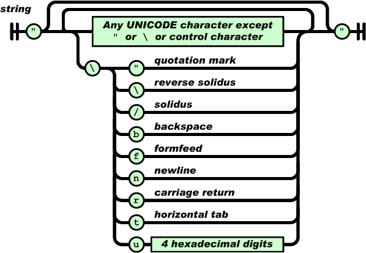

## 一、php: addslashes()、mysql_escape_string()
SQL注入攻击是黑客攻击网站最常用的手段。如果你的站点没有使用严格的用户输入检验，那么常容易遭到SQL注入攻击。  
SQL注入攻击通常通过给站点数据库提交不良的数据或查询语句来实现，很可能使数据库中的纪录遭到暴露，更改或被删除。    

为了防止SQL注入攻击，PHP自带一个功能可以对输入的字符串进行处理，可以在较底层对输入进行安全上的初步处理（ 它主要是对所有的GET、POST和COOKIE数据自动运行addslashes()），也即Magic Quotes。(php.ini magic_quotes_gpc)。如果 magic_quotes_gpc 选项启用，那么输入的字符串中的`'` , `"` ,`\`, `NULL` 前将会被自动加 上反斜杠 `\`。  

不要对已经被 magic_quotes_gpc 转义过的字符串使用 addslashes()，因为这样会导致双层转义，遇到这种情况时可以使用函数 `get_magic_quotes_gpc()`进行检测。但Magic Quotes 并不是一个很通用的解决方案，没能屏蔽所有有潜在危险的字符，并且在许多服务器上Magic Quotes 并没有被启用。所以，我们还需要使用其它多种方法来防止SQL注入。  

许多数据库本身就提供这种输入数据处理功能。例如PHP的MySQL操作函数中有addslashes()、 mysql_real_escape_string()、mysql_escape_string()等函数，可将特殊字符和可能引起数据库操作出错的字符转义。那么这三个功能函数之间有什么区别呢？  
下面我们就来详细讲述下。  

虽然国内很多PHP程序员仍在依靠 addslashes 防止SQL注入，还是建议大家加强中文防止SQL注入的检查。addslashes 的问题在于黑客 可以用在单引号前面加上一个大于127的值如 `%ae`，这样虽然单引号变成了`\'`，但`%ae\` 在字符集为gbk时会被认为是一个字符导致单引号闭合， 所以addslashes 无法成功拦截。当然 addslashes 也不是毫无用处，它是用于单字节字符串的处理，多字节字符还是用mysql_real_escape_string吧。  

另外对于php手册中 get_magic_quotes_gpc 的举例：  
``` php
<?php
//如果启用了魔术引号
$lastname = "O\'reilly";     // 这里用双引号括起来表示有两个字符 \ 和 '，如果用单引号括起来，表示只有一个字符 '     
                            // 注意与js 不同，var nick = "我是\'天才\'";   \ 还是表示转义，表示只有一个字符 '
echo $lastname."\n";      // O\'reilly
echo addslashes($lastname)."\n"; // O\\\'reilly

// 适用各个 PHP 版本的用法
if (get_magic_quotes_gpc()) {
    $lastname = stripslashes($lastname);
}
else {
    $lastname = $lastname;
}

echo $lastname."\n"; // O\'reilly
// 如果使用 MySQL
$lastname = mysql_real_escape_string($lastname);

echo $lastname."\n"; // O\\\'reilly
$sql = "INSERT INTO lastnames (lastname) VALUES ('$lastname')";
// 插入到数据库为 O\'reilly
?>
```
最好对magic_quotes_gpc 已经开放的情况下，还是对$lastname 进行检查一下。  
再说下mysql_real_escape_string 和 mysql_escape_string 这2个函数的区别：  
mysql_real_escape_string 必须在(PHP 4 >= 4.3.0, PHP 5)的情况下才能使用，否则只能用 mysql_escape_string ，两者的区别是：  mysql_real_escape_string 考虑到连接的当前字符集，而mysql_escape_string 不考虑。  
转义字符有：`\x00` , `\n` , `\r` , `\` , `'` , `"` and `\x1a`  
总结一下：  
* addslashes() 是强行加 `\`；
* mysql_real_escape_string()  会判断字符集，但是对PHP版本有要求，调用前需要连接上数据库；
* mysql_escape_string 不考虑连接的当前字符集；
* 两个escape 函数都不转义 `%` 和 `_`

依靠mysql_real_escape_string 这样的函数来防御 sql 注入是远远不够的，因为有些 payload 可以完全不用引号、括号、空格等字符，防御SQL 注入的最佳方式，就是使用预编译语句，绑定变量。当然检查数据类型能在很大程度上对抗sql 注入，最后从数据库自身的角度来说，应该使用最小权限原则，避免web 应用直接使用 root 等高权限账户直接连接数据库。  

## 二、php:htmlspecialchars()
htmlentities() <--> htmlentities_decode()  
>This function is identical to htmlspecialchars() in all ways, except with htmlentities(), all characters which have HTML character entity equivalents are translated into these entities.  

htmlspecialchars() <--> htmlspecialchars_decode()   

预定义的字符是：  

* & （和号） 成为 &#38;amp;
* " （双引号） 成为 &#38;quot;
* ' （单引号） 成为 &#38;#039; &nbsp;&nbsp;   // 注意不是 &#38;apos;
* < （小于） 成为 &#38lt;
* &gt; （大于） 成为 &#38gt;


* ENT_COMPAT &nbsp;&nbsp;- 默认，仅编码双引号
* ENT_QUOTES &nbsp;&nbsp;- 编码双引号和单引号
* ENT_NOQUOTES &nbsp;&nbsp;- 不编码任何引号
	
## 三、php:json_encode()


JSON 定死了字符集必须是UTF-8，表示多语言就没有问题了。为了统一解析，JSON的字符串规定必须用双引号" "，Object的键也必须用双引号" "  

json_encode() 
JSON_HEX_TAG => 1 // \u003C  \u003E  
JSON_HEX_AMP => 2  
JSON_HEX_APOS => 4  
JSON_HEX_QUOT => 8  
JSON_FORCE_OBJECT => 16  
JSON_NUMERIC_CHECK => 32  
JSON_UNESCAPED_SLASHES => 64  
JSON_PRETTY_PRINT => 128  
JSON_UNESCAPED_UNICODE => 256  

json_decode(string $json, bool $assoc=false, int $depth = 512) // $assoc 为 true 则返回 array 而非 object.  
php正常情况下只能通过 `->` 访问对象属性，当然静态属性的话是`::`  
对于嵌套过深的json 字符串，需要设置下 depth, 否则会 decode 失败。  
用于 decode 的字符串key 和 value 应该用 双引号括起来。  
json_decode( preg_replace('/[\x00-\x1F\x80-\xFF]/', '', $json_string), true ); # 去掉非可显示英文字符  
``` php
$arr = array();
$arr['name'] = 'simba\"s/\r';
$arr['passwd'] = "666";
echo json_encode($arr);
```
json_encode 默认会对某些特殊字符进行转义，上面输出为 `{"name":"simba\\\"s\/\\r","passwd":"666"}`，如果 `$arr['name'] = "simba\"s/\r"`; 则输出为 `{"name":"simba\"s\/\r","passwd":"666"}`，在单引号里面 \r 表示两个字符，在双引号里面 \r 表示一个字符即回车。  

使用PHP的 json_encode()函数返回json数据时，默认会将`/`进行转义成`\/`。  
如果使用的是PHP 5.4以上版本，可以添加参数`JSON_UNESCAPED_SLASHES` 解决。  
echo json_encode("2014/08/06", JSON_UNESCAPED_SLASHES);  
否则可以使用str_replace来替换：  
`str_replace('\\/', '/', json_encode("2014/08/06"));`  

进行 json_decode 时会把对应的转义过的字符去掉 `\`，还原成原来的字符串形式，比如 `'simba\"s/\r'`  和 `"simba\"s/\r"`  

为了表示字符串的文本形式，可以使用 <<<EOD   ....   EOD;  的方式。比如  
``` php
$s1 = "aasimbarsimban";
$s1 = str_replace("simbar", "\\r", $s1);
$s1 = str_replace("simban", "\\n", $s1);
$content = <<<EOD
input = "$s1";
EOD;
echo $content;
```
此时输出  input = "aa\r\n";  
如果 中间两行是  
``` 
$s1 = str_replace("simbar", "\r", $s1);
$s1 = str_replace("simban", "\n", $s1);
```
这时候输出 input = "aa  
"; 


## 四、js:JSON.parse()

一个对象原封不动的转化为字符串后，这个字符串竟然不能还原为对象：  
``` javascript
// 原始object对象
var obj = { key: '\"Hello World\"'} 
var str = JSON.stringify(obj); // 转化为字符串console.log(str)
// {"key":"\"Hello World\""} 
var o = JSON.parse(str) // 还原为object 时出错
```
因为传递给 parse 之前，脚本引擎先处理了一下，`\"` 与 `"` 是一样的，故 str 成了 `{"key": ""Hello World""}`，再进行 parse 时会出错。故可以多加一个 \ 以解决问题    
&gt; `JSON.parse('{"key":"\\"Hello World\\""}')`    
&lt; Object {key: ""Hello World""}    
故以下的形式也是没有语法错误，可以执行的   
&gt; `JSON.parse('{"giftText":"aaaaa","friendsStr":"123123xxx\"}')`  
&lt; Object {giftText: "aaaaa", friendsStr: "123123xxx"}  
假设 friendStr 由 url 传递参数，返回时会将双引号前面加 `\`，但并没有转义单引号，则会造成 xss 漏洞：  
`JSON.parse('{"giftText":"aaaaa","friendsStr":"123123xxx\"}');(alert)(1)//`  

需要注意的是，编码后的数据长度可能会发生改变，从而影响某些功能，在写代码时需要注意这个细节，以免产生不必要的bug。  

## 五、jsencode、HtmlEncode
php 版本的代码：
``` php 
function jsencode($str)
{
    $arr = array();
    $str_len = strlen($str);
    $need_encode = "<>\"&#`()[]';";
    for($i = 0; $i < $str_len; $i++)
    {
        if (strpos($need_encode, $str[$i]))
        {
            $arr[$i] = "\\u00" . bin2hex($str[$i]);
        }
        else
        {
            $arr[$i] = $str[$i];
        }
    }
    return join("", $arr);
 }
        
function HtmlEncode($str)
{
    $str = str_replace("&","&amp;", $str);
    $str = str_replace(">","&gt;", $str);
    $str = str_replace("<","&lt;", $str);
    $str = str_replace("\"","&quot;", $str);
    $str = str_replace("'","&#39;",  $str);
    $str = preg_replace("/\s+/","&#32;", $str);
    return $str;
}
```

javascript 的代码：
``` javascript
function jsencode(str) {
    var arr = [];
    var need_encode = "<>\"&#`()[]';";
    for (var i = 0; i < str.length; i++) {
 
        if (need_encode.indexOf(str[i]) != -1)
        {
            arr[i] = ("\\u00" + str.charCodeAt(i).toString(16)).slice(-6);
        }
        else
        {
            arr[i] = str[i];
        }
    }
    return arr.join("");
}

function HtmlEncode(sStr)
{
	sStr = sStr.replace(/&/g,"&amp;");
	sStr = sStr.replace(/>/g,"&gt;");
	sStr = sStr.replace(/</g,"&lt;");
	sStr = sStr.replace(/"/g,"&quot;");
	sStr = sStr.replace(/'/g,"&#39;");
	sStr = sStr.replace(/\s+/g,"&#32;");
	return sStr;
}

```

