原文　by [先知社区](https://xianzhi.aliyun.com/forum/topic/1140/)  

## 文件分析
1. 开机启动有无异常文件  
2. 各个盘下的temp(tmp)相关目录下查看有无异常文件  
3. 浏览器浏览痕迹、浏览器下载文件、浏览器cookie信息  
4. 查看文件时间，创建时间、修改时间、访问时间。对应linux的ctime mtime atime，通过对文件右键属性即可看到详细的时间（也可以通过dir /tc 1.aspx 来查看创建时间），黑客通过菜刀类工具改变的是修改时间。所以如果修改时间在创建时间之前明显是可疑文件。  
5. 查看用户recent相关文件，通过分析最近打开分析可疑文件
	a) C:\Documents and Settings\Administrator\Recent  
    b) C:\Documents and Settings\Default User\Recent  
    c) 开始,运行   %UserProfile%\Recent  

根据文件夹内文件列表时间进行排序，查找可疑文件。当然也可以搜索指定日期范围的文件及文件夹  
Server 2008 R2系列  
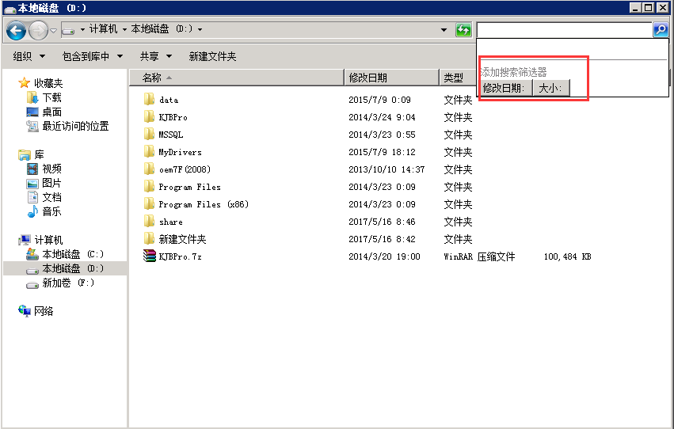  

 
Win10 系列    
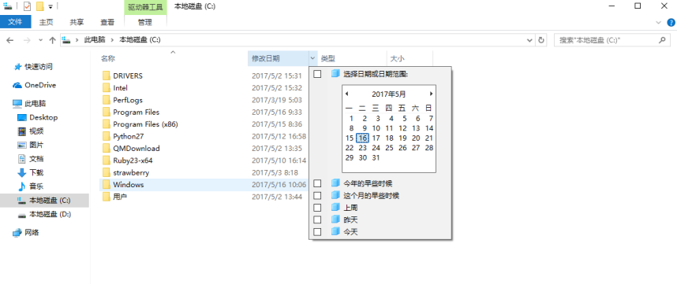   

关键字匹配，通过确定后的入侵时间，以及webshell或js文件的关键字（比如博彩类），可以在IIS 日志中进行过滤匹配，比如经常使用:  
1. 知道是上传目录，在web log 中查看指定时间范围包括上传文件夹的访问请求  
`findstr /s /m /I “UploadFiles” *.log`
2. 某次博彩事件中的六合彩信息是six.js
`findstr /s /m /I “six.js” *.aspx`    
3. 根据shell名关键字去搜索D盘spy相关的文件有哪些
`for /r d:\ %i in (*spy*.aspx) do @echo %i`  
  
## 进程命令

1. netstat -ano 查看目前的网络连接，定位可疑的ESTABLISHED  
2. 根据netstat 定位出的pid，再通过tasklist命令进行进程定位  
3. 通过tasklist命令查看可疑程序
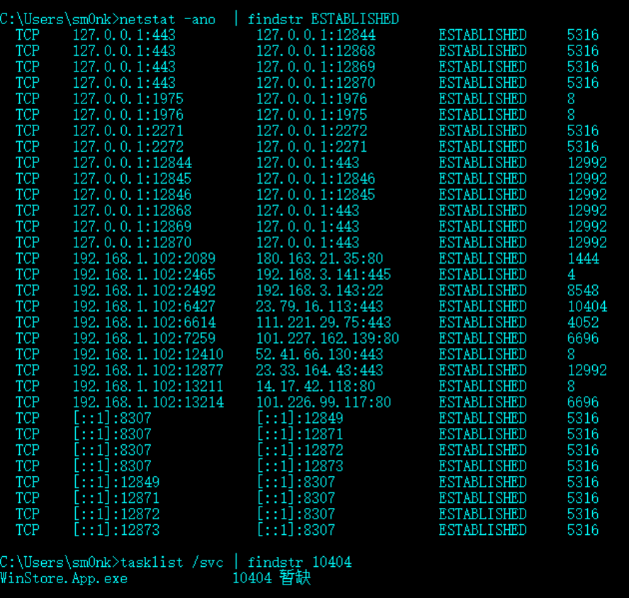    

## 系统信息

1. 使用set命令查看变量的设置
2. Windows 的计划任务；
3. Windows 的帐号信息，如隐藏帐号等
4. 配套的注册表信息检索查看，SAM文件以及远控软件类
5. 查看systeminfo 信息，系统版本以及补丁信息

例如系统的远程命令执行漏洞MS08-067、MS09-001、MS17-010（永恒之蓝）…  
若进行漏洞比对，建议使用Windows-Exploit-Suggester  
https://github.com/GDSSecurity/Windows-Exploit-Suggester/    

## 后门排查

PC Hunter是一个Windows系统信息查看软件  
http://www.xuetr.com/  
功能列表如下：  

1. 进程、线程、进程模块、进程窗口、进程内存信息查看，杀进程、杀线程、卸载模块等功能
2. 内核驱动模块查看，支持内核驱动模块的内存拷贝
3. SSDT、Shadow SSDT、FSD、KBD、TCPIP、Classpnp、Atapi、Acpi、SCSI、IDT、GDT信息查看，并能检测和恢复ssdt hook和inline hook
4. CreateProcess、CreateThread、LoadImage、CmpCallback、BugCheckCallback、Shutdown、Lego等Notify Routine信息查看，并支持对这些Notify Routine的删除
5. 端口信息查看，目前不支持2000系统
6. 查看消息钩子
7. 内核模块的iat、eat、inline hook、patches检测和恢复
8. 磁盘、卷、键盘、网络层等过滤驱动检测，并支持删除
9. 注册表编辑
10. 进程iat、eat、inline hook、patches检测和恢复
11. 文件系统查看，支持基本的文件操作
12. 查看（编辑）IE插件、SPI、启动项、服务、Host文件、映像劫持、文件关联、系统防火墙规则、IME
13. ObjectType Hook检测和恢复
14. DPC定时器检测和删除
15. MBR Rootkit检测和修复
16. 内核对象劫持检测
17. WorkerThread枚举
18. Ndis中一些回调信息枚举
19. 硬件调试寄存器、调试相关API检测
20. 枚举SFilter/Fltmgr的回调
PS：最简单的使用方法，根据颜色去辨识——**可疑进程，隐藏服务、被挂钩函数：红色**，然后根据程序右键功能去定位具体的程序和移除功能。根据可疑的进程名等进行互联网信息检索然后统一清除并关联注册表。  
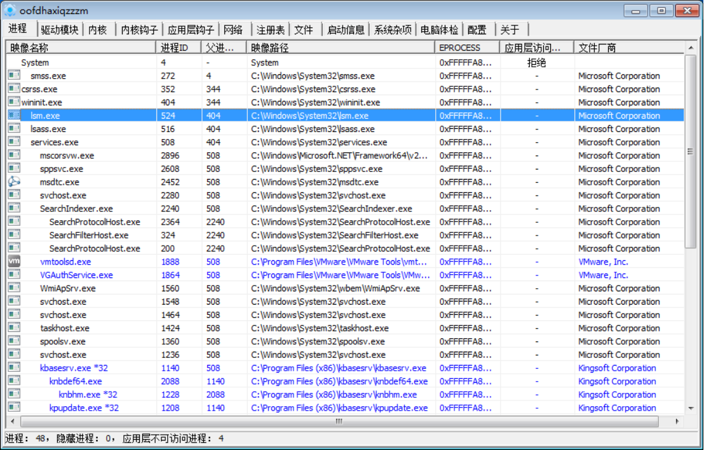   

## Webshell 排查

可以使用hm  
   
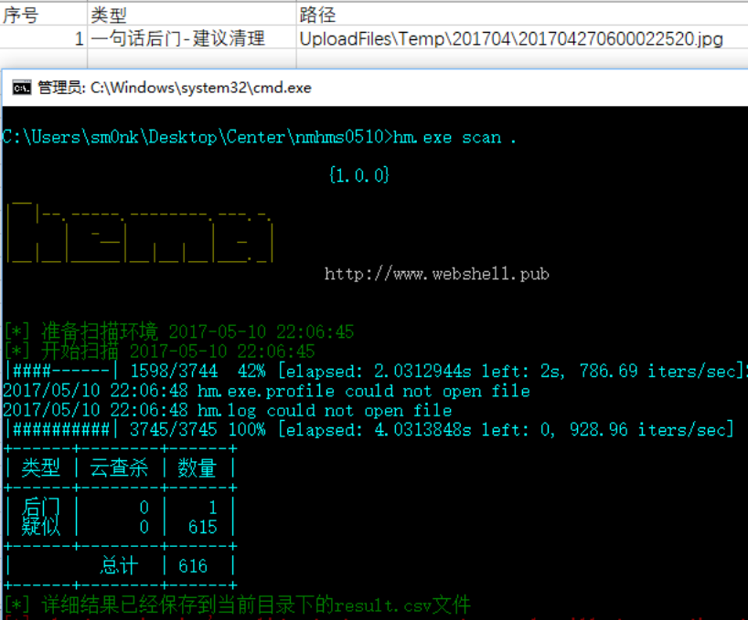   
也可以使用盾类（D盾、暗组盾），如果可以把web目录导出，可以在自己虚拟机进行分析    

## 日志分析

打开事件管理器（开始—管理工具—事件查看/开始运行eventvwr）  
主要分析安全日志，可以借助自带的筛选功能  
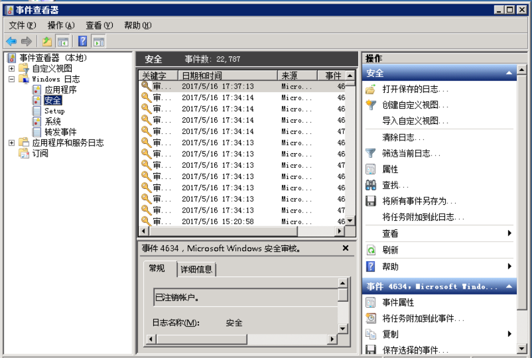    
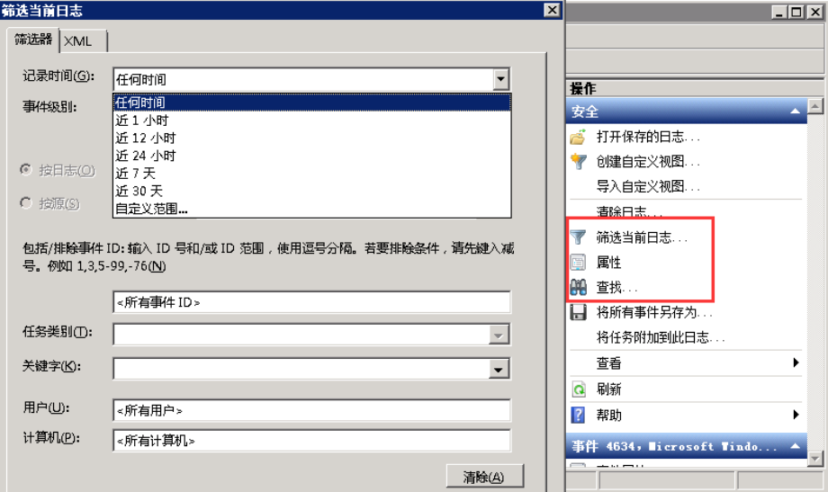    
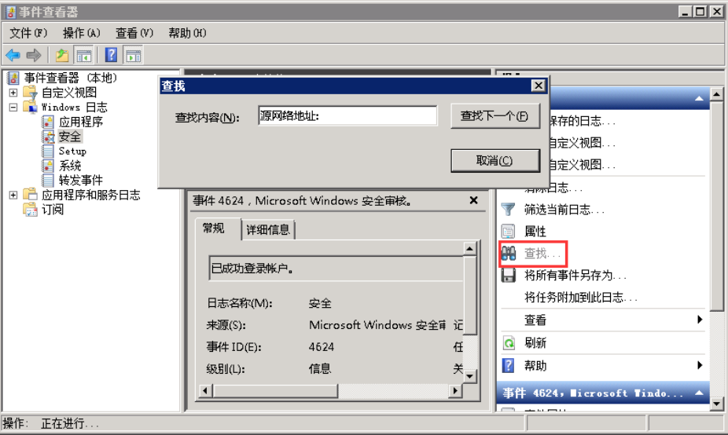   

可以把日志导出为文本格式，然后使用notepad++ 打开，使用正则模式去匹配远程登录过的IP地址，在界定事件日期范围的基础，可以提高效率正则是：`((?:(?:25[0-5]|2[0-4]\d|((1\d{2})|([1-9]?\d))).){3}(?:25[0-5]|2[0-4]\d|((1\d{2})|([1-9]?\d))))`  
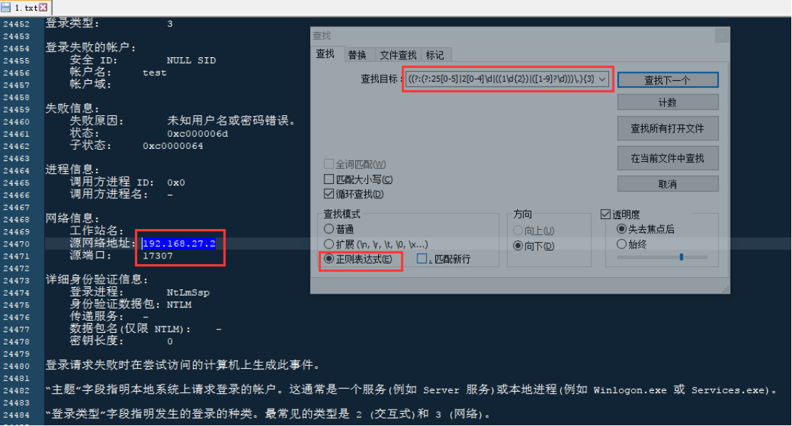     

强大的日志分析工具[Log Parser](https://www.microsoft.com/en-us/download/confirmation.aspx?id=24659)    
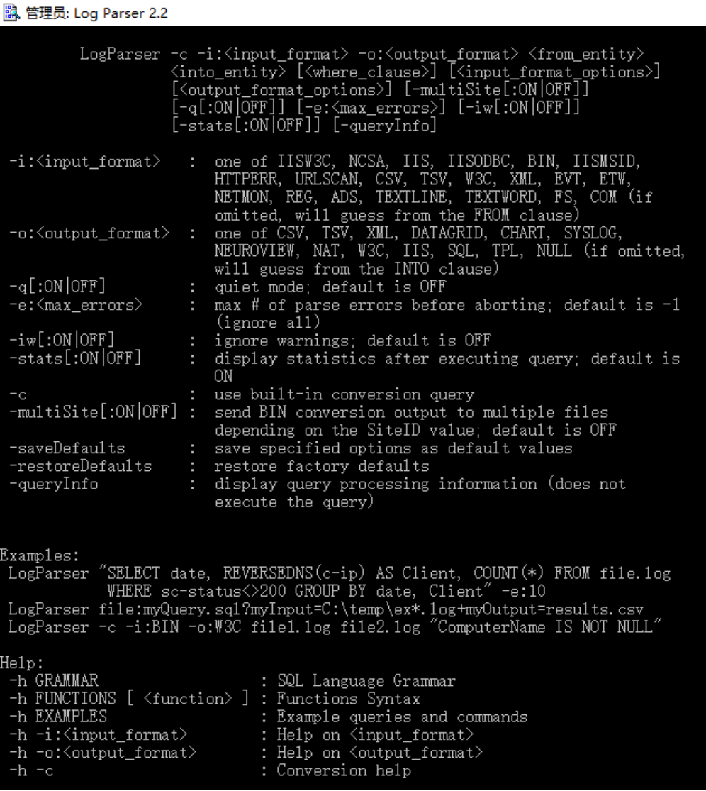       

### 分析IIS日志
`LogParser.exe "select top 10 time, c-ip,cs-uri-stem, sc-status, time-taken from C:\Users\sm0nk\Desktop\iis.log" -o:datagrid `  
   
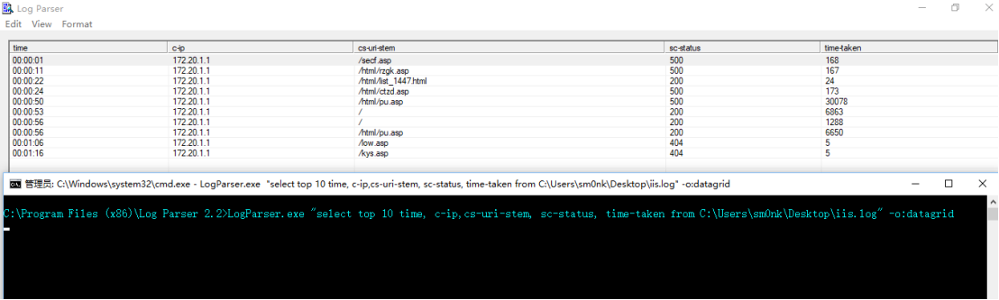   

有了这些我们就可以对windows日志进行分析了。比如我们分析域控日志的时候，想要查询账户登陆过程中，用户正确，密码错误的情况，我们需要统计出源IP，时间，用户名时，我们可以这么写（当然也可以结合一些统计函数，分组统计等等）：  
`LogParser.exe -i:EVT "SELECT TimeGenerated,EXTRACT\_TOKEN(Strings,0,'|') AS USERNAME,EXTRACT\_TOKEN(Strings,2,'|') AS SERVICE\_NAME,EXTRACT\_TOKEN(Strings,5,'|') AS Client_IP FROM 'e:\logparser\xx.evtx' WHERE EventID=675"`  
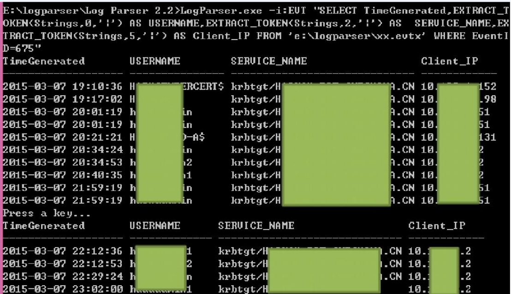    

事件ID是很好的索引  

Windows server 2008系列参考event ID：  
4624 - 帐户已成功登录  
4625 - 帐户登录失败  
4648 - 试图使用明确的凭证登录（例如远程桌面）  
## 相关处置  

通过网络连接锁定的可疑进程，进行定位恶意程序后删除(taskkill)  

木马查杀，可配合pchunter 进行进一步专业分析，使用工具功能进行强制停止以及删除  

最后清理后，统一查看网络连接、进程、内核钩子等是否正常。  

## Reference
