原文 by [阿里先知](https://xz.aliyun.com/t/2524)  

## 1. Windows 的应急事件分类

Windows 系统的应急事件，按照处理的方式，可分为下面几种类别：

* 病毒、木马、蠕虫事件
* Web 服务器入侵事件或第三方服务入侵事件
* 系统入侵事件，如利用 Windows 的漏洞攻击入侵系统、利用弱口令入侵、利用其他服务的漏洞入侵，跟 Web 入侵有所区别，Web 入侵需要对 Web 日志进行分析，系统入侵只能查看 Windows 的事件日志。
* 网络攻击事件（DDoS、ARP、DNS 劫持等）

## 2. 通用排查思路

> 入侵肯定会留下痕迹，另外重点强调的是不要一上来就各种查查查，问清楚谁在什么时间发现的主机异常情况，异常的现象是什么，受害用户做了什么样的紧急处理。问清楚主机异常情况后，需要动脑考虑为什么会产生某种异常，从现象反推可能的入侵思路，再考虑会在 Windows 主机上可能留下的痕迹，最后才是排除各种可能，确定入侵的过程。  

获取 Windows 的基本信息，如机器名称、操作系统版本、OS 安装时间、启动时间、域名、补丁安装情况，使用systeminfo命令获取。运行msinfo32也可以查看计算机的详细信息。  

### 2.1 直接检查相关日志

任何操作（人、程序、进程）都会导致产生相关日志  
#### 2.1.1 Windows 日志简介

日志记录了系统中硬件、软件和系统问题的信息，同时还监视着系统中发生的事件。当服务器被入侵或者系统（应用）出现问题时，管理员可以根据日志迅速定位问题的关键，再快速处理问题，从而极大地提高工作效率和服务器的安全性。    
Widdows 通过自带事件查看器管理日志，使用命令eventvwr.msc打开，或者 Windows 10 搜索框直接搜索事件查看器，或者使用开始菜单-Windows 管理工具-事件查看器打开。    
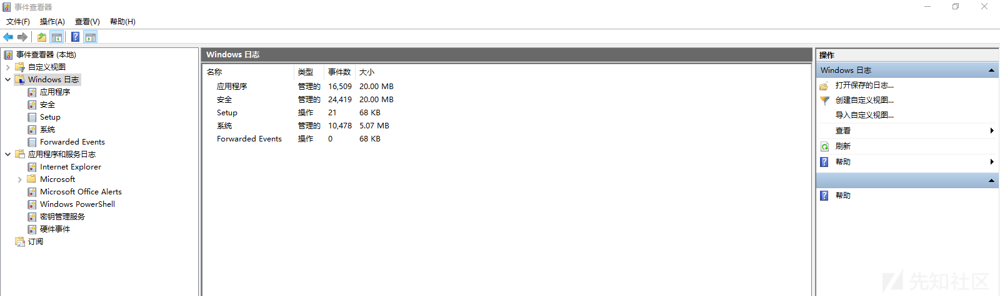  


Windows 日志位置  
Windows 2000/Server2003/Windows XP  

`\%SystemRoot%\System32\Config\*.evt`
Windows Vista/7/10/Server2008:  

`\%SystemRoot%\System32\winevt\Logs\*.evtx`  
日志审核策略，使用命令`auditpol /get /category:* `   
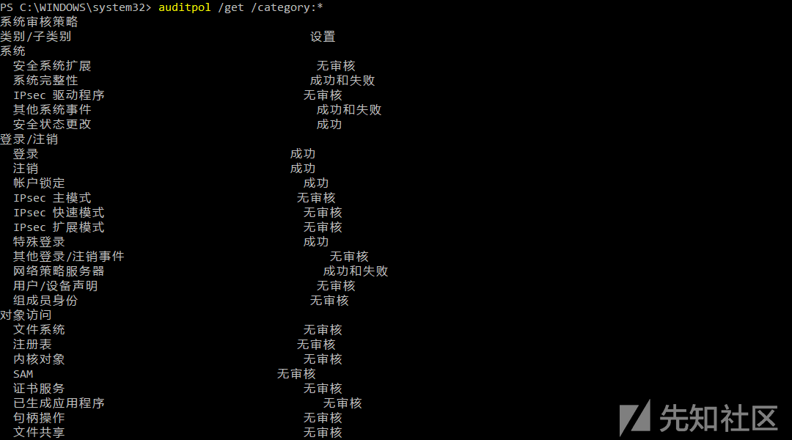      


其他一些可能会用到的事件日志的位置：  

C:\Windows\System32\WDI\LogFiles  
* BootCKCL.etl
* ShutdownCKCL.etl
* SecondaryLogOnCKCL.etl
* WdiContext.etl.<###>

```
C:\Windows\System32\WDI\<guid>\<guid> 
 snapshot.etl
</guid></guid>
```
C:\Windows\System32\LogFiles\WMI  
* Wifi.etl
* LwNetLog.etl

C:\Windows\System32\SleepStudy  
```
UserNotPresentSession.etl
abnormal-shutdown-<yyyy>-<mm>-
-<hh>-<mm>-<ss>.etl</ss></mm></hh>
</mm></yyyy>
 user-not-present-trace-<yyyy>-<mm>-
-<hh>-<mm>-<ss>.etl</ss></mm></hh>
</mm></yyyy>
 ScreenOnPowerStudyTraceSession-<yyyy>-<mm>-
-<hh>-<mm>-<ss>.etl</ss></mm></hh>
</mm></yyyy>
```

#### Windows 日志

* 系统日志
系统日志包含Windows系统组件记录的事件。例如，系统日志中会记录在启动过程中加载驱动程序或其他系统组件失败。系统组件所记录的事件类型由Windows预先确定。  

* 应用程序日志
应用程序日志包含由应用程序或程序记录的事件。例如，数据库程序可在应用程序日志中记录文件错误。程序开发人员决定记录哪些事件。  

* 安全日志
安全日志包含诸如有效和无效的登录尝试等事件，以及与资源使用相关的事件，如创建、打开或删除文件或其他对象。管理员可以指定在安全日志中记录什么事件。例如，如果已启用登录审核，则安全日志将记录对系统的登录尝试。  

关于安全日志登录部分的事件 ID 和登录类型代码的含义见下面 2 个表。  
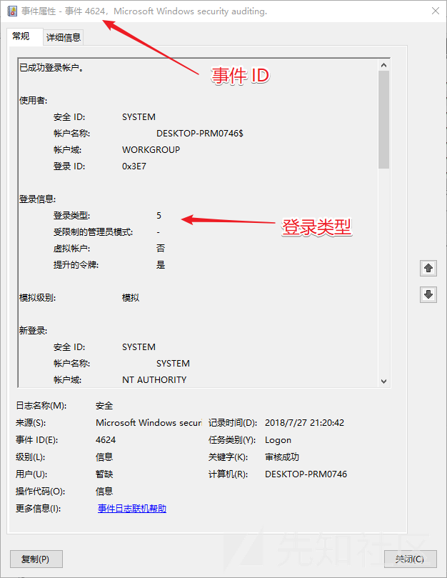    


常用事件 ID 含义  
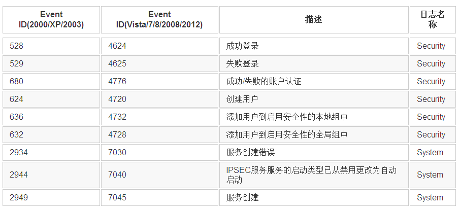  


登录类型 ID  

成功/失败登录事件提供的有用信息之一是用户/进程尝试登录（登录类型），但 Windows 将此信息显示为数字，下面是数字和对应的说明：
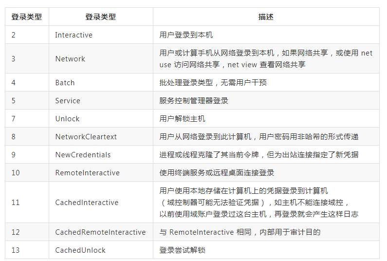   

账户类型  

* 用户账户
* 计算机账户：此帐户类型表示每个主机。 此帐户类型的名称以字符“$”结尾。 例如，“DESKTOP-SHCTJ7L $”是计算机帐户的名称。
* 服务账户：每个服务帐户都创建为特定服务的所有者。 例如，IUSR是IIS的所有者，而krbtgt是作为密钥分发中心一部分的服务的所有者。

#### 应用程序和服务日志  

应用程序和服务日志是一种新类别的事件日志。这些日志存储来自单个应用程序或组件的事件，而非可能影响整个系统的事件。   

查看 PowerShell 的日志 
Microsoft->Windows->PowerShell->OPtions  

#### 2.1.2 远程登录事件

攻击者可能造成的远程登录事件  

**RDP**  
攻击者使用 RDP 远程登录受害者计算机，源主机和目的主机都会生成相应事件。  

重要的事件 ID（安全日志，Security.evtx）  

* 4624：账户成功登录
* 4648：使用明文凭证尝试登录
* 4778：重新连接到一台 Windows 主机的会话
* 4779：断开到一台 Windows 主机的会话

远程连接日志（应用程序和服务日志->Microsoft->Windows->-TerminalServices->RemoteConnectionManager->Operational），重要事件 ID 和含义：  

* 1149：用户认证成功
* 21：远程桌面服务：会话登录成功
* 24：远程桌面服务：会话已断开连接
* 25：远程桌面服务：会话重新连接成功

远程连接日志关注 RemoteInteractive（10） 和CachedRemoteInteractive（12）表明使用了 RDP ，因为这些登录类型专用于RDP使用。  

**计划任务和 AT**
关注的事件 ID  

* 4624：账户成功登录

计划任务事件 Microsoft-Windows-TaskScheduler/Operational.evtx，计划任务 ID 含义：  

* 100：任务已开始
* 102：任务完成
* 106：已注册任务（关注点）
* 107：在调度程序上触发任务
* 110：用户触发的任务
* 129：创建任务流程（推出）
* 140：任务已更新
* 141：任务已删除
* 200：运行计划任务
* 325：启动请求排队

统一后台进程管理器（UBPM）  

* 服务控制管理器 - 管理 Windows 服务
* 任务计划程序 - 管理 Windows 任务
* Windows Management Instrumentation - 管理 WMI 供应商
* DCOM Server Process Launcher - 管理进程外 COM 应用程序

**PSExec**  
PSExec是系统管理员的远程命令执行工具，包含在“Sysinternals Suite”工具中，但它通常也用于针对性攻击的横向移动。  
PsExec的典型行为 

* 在具有网络登录（类型3）的远程计算机上将 PsExec 服务执行文件（默认值：PSEXESVC.exe）复制到％SystemRoot％。
* 如果使用-c选项，则通过 $Admin 共享将文件复制到 ％SystemRoot％ 执行命令。
* 注册服务（默认值：PSEXESVC），并启动服务以在远程计算机上执行该命令。
* 停止服务（默认值：PSEXESVC），并在执行后删除远程计算机上的服务。

PSExec选项的重要选项：  

* -r
	* 更改复制的文件名和远程计算机的服务名称
（默认值：％SystemRoot％\ PSEXESVC.exe和PSEXESVC）  
* -s
	* 由SYSTEM帐户执行。
* -C
	* 将程序复制到远程计算机
	* 被复制到Admin$（％SystemRoot％）
* -u
	* 使用特定凭据登录到远程计算机
	* 生成登录类型2和登录类型3 的事件

可以从System.evtx中查找事件 ID 7045 发现 PSExec，相关的事件 ID  

* Security.evtx
	* 4624：帐户已成功登录
* Ssystem.evtx
	* 7045：系统中安装了服务

PsExec在执行命令时在远程主机上创建服务，默认服务名称为PSEXESVC，配合检测系统 7045 事件可以确定。 
如果使用-r参数更改了默认的服务名称，通过以下特征可以检测 PSExec 的执行：  

* PSExec服务执行文件（默认值：PSEXESVC.exe）被复制到远程计算机上的“％SystemRoot％”目录中
* 服务名称与没有“.exe”扩展名的执行名称相同
* 服务以“用户模式”执行，而不是“内核模式”
* “LocalSystem”帐户用于服务帐户
* 实际帐户用于执行服务执行文件，而不是“SYSTEM”

#### 2.1.3 GUI 的日志工具介绍

Widnows 自带事件管理器就是很不错的日志工具，其他可以了解下Event Log Explorer　　
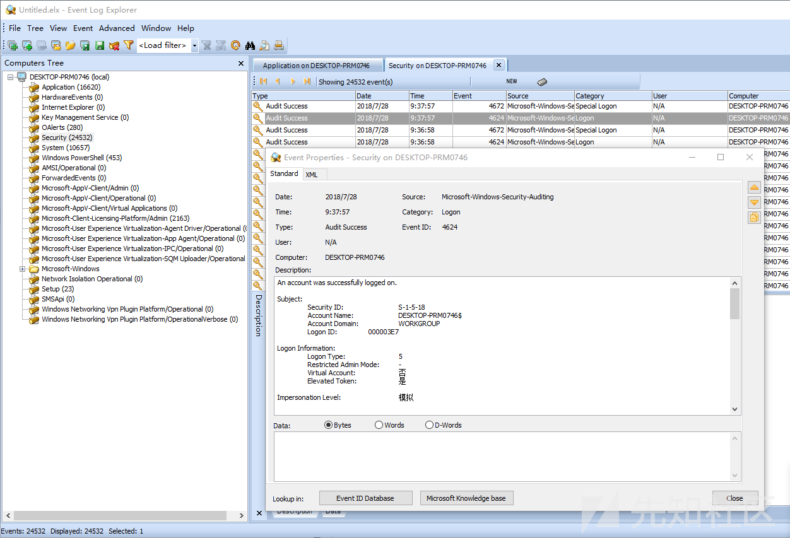    


可以将目标 IP 的所有日志文件复制出来，然后在其他电脑上使用 Event Log Explorer 进行分析。  
其他一些工具：  
 
* Microsoft Message Analyzer
* ETL Viewer
* Log Parser
	* 使用示例：https://mlichtenberg.wordpress.com/2011/02/03/log-parser-rocks-more-than-50-examples/

#### 2.2.4 PowerShell 日志操作

使用Get-WinEvent  

`Get-WinEvent @{logname='application','system'} -MaxEvents 1`  
一些常见日志操作  
```
# Get-WinEvent帮助命令
get-help Get-WinEvent

# 列出所有事件日志
Get-WinEvent -ListLog *

# powershell管理员权限下获取安全事件日志
Get-WinEvent -FilterHashtable @{LogName='Security'}

# 过滤安全事件ID 4624
Get-WinEvent -FilterHashtable @{LogName='Security';ID='4624'}

# 查询今天的应用和系统日志，显示前2条
Get-WinEvent @{logname='application','system';starttime=[datetime]::today } -MaxEvents 2
```
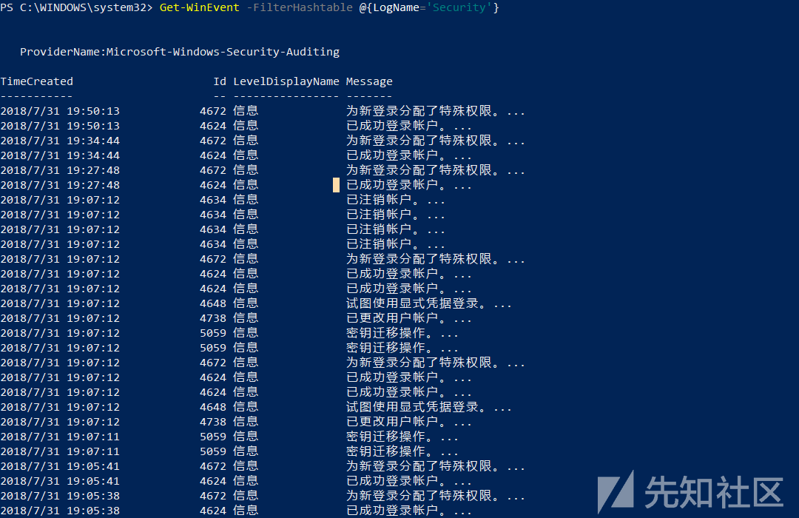   

```
# 根据ID查询事件
Get-WinEvent -LogName Microsoft-Windows-PowerShell/Operational | Where-Object {$_.ID -eq "4100" -or $_.ID -eq "4104"}

# 查询指定时间内的事件
$StartTime=Get-Date  -Year  2017  -Month  1  -Day  1  -Hour  15  -Minute  30
$EndTime=Get-Date  -Year  2017  -Month  2  -Day  15  -Hour  20  -Minute  00

Get-WinEvent -FilterHashtable @{LogName='System';StartTime=$StartTime;EndTime=$EndTime}
```
Get-EventLog 的使用可以参考：https://docs.microsoft.com/en-us/powershell/module/microsoft.powershell.management/get-eventlog?view=powershell-5.1  

#### 2.2.5 Windows 日志删除和日志集中化

攻击者入侵系统后，很可能会删除日志，比较粗暴的手法是直接删除所有日志和停止日志服务，对于应急来说删除掉的日志本身就是就是入侵的明显特征，根据文件创建时间也能大概判断入侵时间。另外有工具可以删除单条日志，这样只是分析 Windows 日志时对分析人员来说很难找到攻击痕迹，单条日志删除工具 https://github.com/360-A-Team/EventCleaner 另外可以参考  https://github.com/3gstudent/Eventlogedit-evtx--Evolution。   

对抗删除的的措施是实施日志集中化，从 Windows 7 开始，Windows 记录日志为 XML 格式，可以使用    

### 2.2 检查账户

检查账户的几种方式：  

1. 在本地用户和组里查看，运行lusrmgr.msc
2. 使用net user列出当前登录账号，使用wmic UserAccount get列出当前系统所有账户
3. 检查注册表 HKEY_LOCAL_MACHINE\SOFTWARE\Microsoft\Windows NT\CurrentVersion\ProfileList，HKLM\SAM\Domains\Account\（默认是 SYSTEM）权限，需要配置成管理员权限查看。

SID 位于HKU\和 HKEY_LOCAL_MACHINE\SOFTWARE\Microsoft\Windows NT\CurrentVersion\ProfileList两个密钥中。 用户SID可以在值“Profilelist”下找到Subkeys（在用户登录系统时创建）。 值“ProfileImagePath”将列出该特定用户的配置文件的路径。 在操作系统级别，SID可识别无疑问题的帐户。 多用户系统看起来像这样  
```
HKU\.DEFAULT
HKU\S-1-5-18
HKU\S-1-5-19
HKU\S-1-5-20
HKU\S-1-5-21-1116317227-3122546273-4014252621-1000
HKU\S-1-5-21-1116317227-3122546273-4014252621-1000_Classes
HKU\S-1-5-21-1116317227-3122546273-4014252621-1003
HKU\S-1-5-21-1116317227-3122546273-4014252621-1003_Classes
```
前四个密钥是系统帐户，从计算机到计算机通常是相同的。 HKU\.DEFAULT包含全局用户信息。 HKU\S-1-5-18属于“LocalSystem帐户”。HKU\S-1-5-19用于运行本地服务，是“本地服务帐户”。HKU\S-1-5-20 是用于运行网络服务的“NetworkService帐户”。 其他子键是唯一的SID，它们与已登录系统的各个用户相关联。 他们的解释如下：  
 
* “S”将字符串标识为SID。
* “1”是SID规范的版本。
* “5”是标识符权限值。
* “21-1116317227-3122546273-4014252621”是域或本地计算机标识符，因计算机与计算机不同，因为它对应于唯一的个人用户帐户。
* “1000”是相对ID（RID）。 默认情况下未创建的任何组或用户的RID均为1000或更高。
* “1000_Classes”包含每用户文件关联和类注册。
* “1003”是同一系统上另一个用户的相对ID（RID）。
* “1003_Classes”包含第二个用户的文件关联和类注册。

### 2.3 检查网络连接

检查网络监听和连接的端口和应用程序  

`netstat -anob`  
输出主机上的所有侦听和活动连接，包括 PID 和连接到每个连接的程序的名称。 这也告诉 Netstat返回连接的 IP 地址，而不是试图确定它们的主机名。  

* -a ：显示所有连接和侦听端口。
* -b ：显示在创建每个连接或侦听端口时涉及的可执行程序。在某些情况下，已知可执行程序承载多个独立的组件，这些情况下，显示创建连接或侦听端口时涉及的组件序列。在此情况下，可执行程序的名称位于底部 [] 中，它调用的组件位于顶部，直至达到 TCP/IP。注意，此选项可能很耗时，并且在你没有足够权限时可能失败。
* -n ：以数字形式显示地址和端口号。
* -o ：显示拥有的与每个连接关联的进程 ID。
*-r ：显示路由表。

路由　　

`netstat -rn`  　　
结合findstr命令查找特定的端口或程序。　　
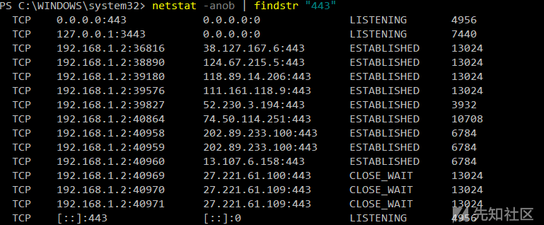   


发现的感觉异常的 IP 地址可以在威胁情报平台上查询，如果是已知的恶意 IP，可以比较快速的确认攻击方式。　　  

防火墙配置  

`netsh firewall show all`  
Windows 10 自带的网络连接可以参考：  
https://betanews.com/2018/07/31/all-the-websites-windows-10-connects-to-clean-install/  

### 2.4 检查进程

进程通常结合网络查看异常，先检查异常的网络连接，再获取由哪个进程生成的网络连接  

`netstat -abno | find "port number"`  

`tasklist | findstr PID` 
使用 wmic 命令获取进程信息    
```
wmic process | find "Proccess Id" > proc.csv

Get-WmiObject -Class Win32_Process

Get-WmiObject -Query  "select * from win32_service where name='WinRM'" -ComputerName Server01, Server02 | Format-List -Property PSComputerName, Name, ExitCode, Name, ProcessID, StartMode, State, Status
```
PowerShell 的其他关于进程和网络的命令  
```
Get-Process

Get-NetTCPConnection
Get-NetTCPConnection -State Established

# 进程跟服务的对应关系
tasklist /svc
```
使用 SysinternalsSuite 的 procexp 可以获取进程比较详细的信息，比如真实路径、加载的 DLL 文件等、CPU 和内存使用情况等。    

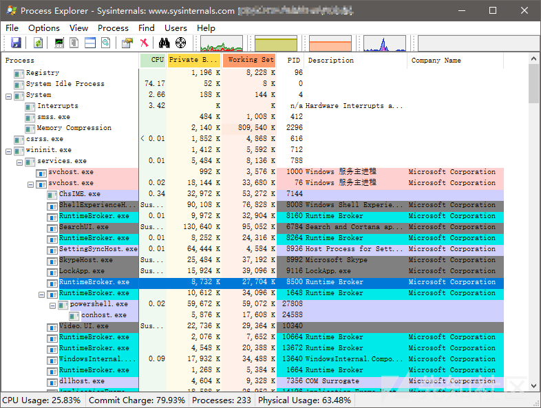   

当然也可以使用内存管理器。  

查看可疑的进程及其子进程。可以通过观察以下内容：  

* 没有签名验证信息的进程
* 没有描述信息的进程
* 进程的属主
* 进程的路径是否合法
* CPU或内存资源占用长时间过高的进程  

可以获取进程关联的文件 MD5 值，然后发送到威胁情报平台上辅助检查。进程关联的文件也可以使用在线病毒检测平台上直接检测。  

#### 2.4.1 内存 dump

有 2 种比较方便的方法：  
第一种是使用系统自带功能，在计算机属性，系统属性，高级选项卡中选择“启动和故障恢复设置”，选择完全转储内存，然后点击确定，系统会提示重启。    
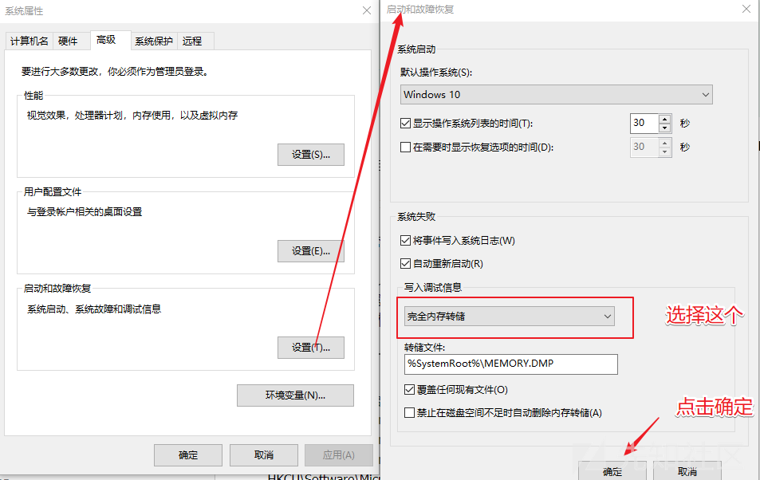     


重启后在配置的文件位置可以找到上次转储的内存文件。  

另外一种方法，使用 SysinternalsSuite 工具集的 notmyfault64 工具，在使用管理员权限的命令行模式下（cmd、PowerShell），运行

`NotMyFault64.exe /crash`  

#### 2.4.2 内存分析

利用 Volatility 进行内存取证，分析入侵攻击痕迹，包括网络连接、进程、服务、驱动模块、DLL、handles、检测进程注入、检测Meterpreter、cmd历史命令、IE浏览器历史记录、启动项、用户、shimcache、userassist、部分rootkit隐藏文件、cmdliner等。    

参考：https://xz.aliyun.com/t/2497    

### 2.5 检查开机启动和运行服务

#### 2.5.1 开机启动

关于开机启动需要分析的位置：  

* 注册表中的关于开机启动的位置  
	* HKLM\Software\Microsoft\Windows\CurrentVersion\Runonce
	* HKLM\Software\Microsoft\Windows\CurrentVersion\policies\Explorer\Run
	* HKLM\Software\Microsoft\Windows\CurrentVersion\Run
	* HKCU\Software\Microsoft\Windows NT\CurrentVersion\Windows\Run
	* HKCU\Software\Microsoft\Windows\CurrentVersion\Run
	* HKCU\Software\Microsoft\Windows\CurrentVersion\RunOnce
(ProfilePath)\Start Menu\Programs\Startup
* 开始菜单，启动项里（C:\ProgramData\Microsoft\Windows\Start Menu\Programs\Startup）
* 任务管理器，启动选项卡，或者运行 msconfig，查看启动选项卡
* 运行gpedit.msc在本地组策略编辑器里查看开机运行脚本，包括计算机配置和用户配置的。
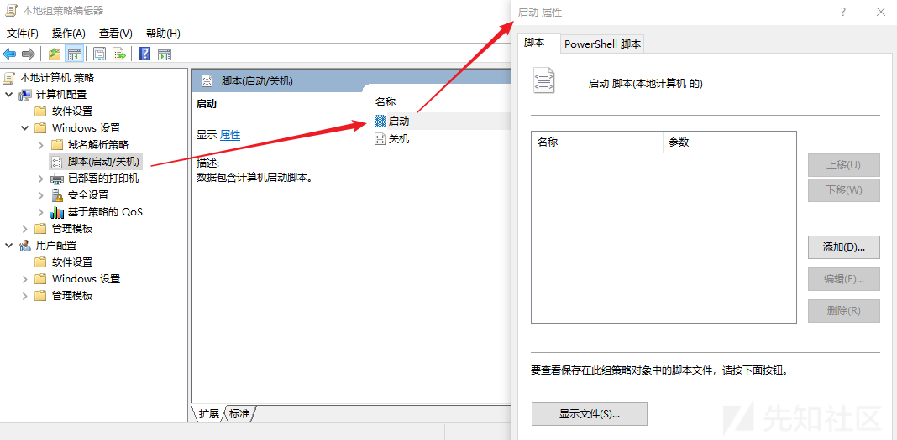      
* 使用 SysinternalsSuite 工具集的 Autoruns 工具查看开机启动项目    
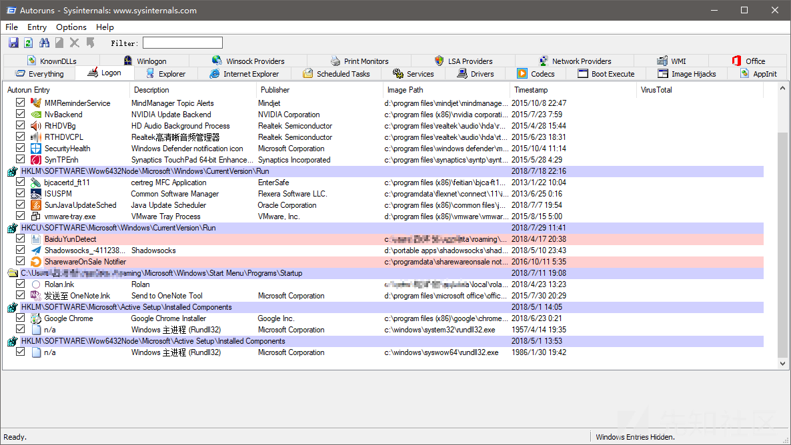    

#### 2.5.2 查看服务状态

服务状态，自动启动配置，在 PowerShell 下可以运行：  
```
Get-Service 

# 运行service命令
service
```
运行services.msc可以打开 Windows 服务工具，常见的 GUI 界面。  
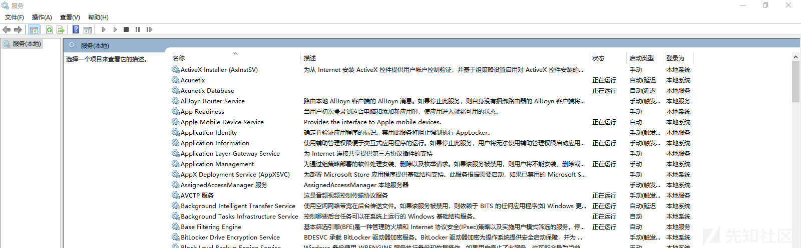   


### 2.6 检查计划任务

存放计划任务的文件  

* C:\Windows\System32\Tasks\
* C:\Windows\SysWOW64\Tasks\
* C:\Windows\tasks\
* *.job（指文件）

使用命令查看计划任务  

`schtasks` 
运行taskschd.msc打开计划任务面板，或者从计算机管理进入，直接查看计划任务。  
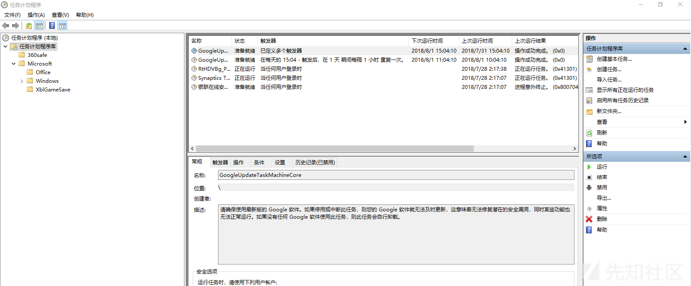   


也可以使用 SysinternalsSuite 工具集的 Autoruns 工具查看计划任务。  

### 2.7 检查文件

检查可疑文件的思路，一种是通过可疑进程（CPU 利用率、进程名）关联的文件，一种是按照时间现象关联的文件，文件大小也可以 作为辅助的判断方法，文件的操作可以使用Get-ChildItem命令查看。需要关注的文件位置：  

* 下载目录
* 回收站文件
* 程序临时文件
* 历史文件记录
* 应用程序打开历史
* 搜索历史
* 快捷方式（LNK）
* 驱动
`driverquery`
* 进程 DLL 的关联查询
`tasklist -M`
* 共享文件
* 最近的文件（%UserProfile%\Recent）
* 文件更新
* 已安装文件
	* hklm:\software\Microsoft\Windows\CurrentVersion\Uninstall\
* 异常现象之前创建的文件

### 2.8 检查注册表

注册表目录含义：  

1. HKEY_CLASSES_ROOT（HKCR）：此处存储的信息可确保在Windows资源管理器中执行时打开正确的程序。它还包含有关拖放规则，快捷方式和用户界面信息的更多详细信息。
2. HKEY_CURRENT_USER（HKCU）：包含当前登录系统的用户的配置信息，包括用户的文件夹，屏幕颜色和控制面板设置。HKEY_USERS中特定于用户的分支的别名。通用信息通常适用于所有用户，并且是HKU.DEFAULT。
3. HKEY_LOCAL_MACHINE（H​​KLM）：包含运行操作系统的计算机硬件特定信息。它包括系统上安装的驱动器列表以及已安装硬件和应用程序的通用配置。
4. HKEY_USERS（HKU）：包含系统上所有用户配置文件的配置信息，包括应用程序配置和可视设置。
5. HKEY_CURRENT_CONFIG（HCU）：存储有关系统当前配置的信息。


一些重要的注册表键  
```
hklm:\Software\Microsoft\Windows\CurrentVersion\policies\system
hklm:\Software\Microsoft\Active Setup\Installed Components
hklm:\Software\Microsoft\Windows\CurrentVersion\App Paths
hklm:\software\microsoft\windows nt\CurrentVersion\winlogon
hklm:\software\microsoft\security center\svc
hkcu:\Software\Microsoft\Windows\CurrentVersion\Explorer\TypedPaths
hkcu:\Software\Microsoft\Windows\CurrentVersion\explorer\RunMru
hklm:\Software\Microsoft\Windows\CurrentVersion\explorer\Startmenu
hklm:\System\CurrentControlSet\Control\Session Manager
hklm:\Software\Microsoft\Windows\CurrentVersion\explorer\ShellFolders
hklm:\Software\Microsoft\Windows\CurrentVersion\ShellExtensions\Approved
hklm:\System\CurrentControlSet\Control\Session Manager\AppCertDlls
hklm:\Software\Classes\exefile\shell\open\command
hklm:\BCD00000000
hklm:\system\currentcontrolset\control\lsa
hklm:\Software \Microsoft\Windows\CurrentVersion\Explorer\BrowserHelper Objects
hklm:\Software\Wow6432Node\Microsoft\Windows\CurrentVersion\Explorer\Browser Helper Objects
hkcu:\Software\Microsoft\Internet Explorer\Extensions
hklm:\Software\Microsoft\Internet Explorer\Extensions
hklm:\Software\Wow6432Node\Microsoft\Internet Explorer\Extensions
```
活用注册表编辑器的搜索功能，根据进程名称、服务名称、文件名称搜索注册表。  

## 3. 特定事件痕迹检查

### 3.1 挖矿病毒应急

#### 3.1.1 传播方式

通常可能的传播方式：    

1. 通过社工、钓鱼方式下载和运行了挖矿程序（邮件、IM 等）
2. 利用计算机系统远程代码执行漏洞下载、上传和执行挖矿程序
3. 利用计算机 Web 或第三方软件漏洞获取计算机权限，然后下载和执行挖矿程序
4. 利用弱口令进入系统，下载和执行挖矿程序
5. 执行 Web 页面的挖矿 JS 脚本

#### 3.1.2 挖矿程序特点

1. CPU、GPU、内存利用率高；
2. 网络会连接一些矿工 IP，可以通过威胁情报获取。

#### 3.1.3 挖矿程序应急目的

1. 找出入侵原因
2. 找到挖矿程序，并删除
3. 挖矿事件应急可能需要对样本进行分析，需要二进制的一些分析能力，通过提取样本后确认样本分类、行为、危害。

### 3.2 勒索病毒事件应急

#### 3.2.1 传播方式

通常可能的传播方式：  

1. 通过社工、钓鱼方式下载和运行了勒索程序（邮件、IM 等）
2. 利用计算机系统远程代码执行漏洞下载、上传和执行勒索病毒
3. 利用计算机 Web 或第三方软件漏洞获取计算机权限，然后下载和执行勒索病毒
4. 利用弱口令进入计算机系统，下载和执行勒索病毒

#### 3.2.2 勒索病毒特点

1. 各种数据文件和可执行程序生成奇怪的后缀名；
2. 明显的提示，要交赎金

#### 3.3.3 勒索病毒应急目的

1. 如果是重要数据，交付赎金恢复数据；
2. 找到入侵的原因，排查同类漏洞，并进行加固（一般是重装）
3. 确认勒索病毒后要立即拔掉网线，限制传播范围。


## 4. Sysinternals Utilities

工具中有些是命令行工具，有些是有 GUI 界面，作用：  

* 使用Process Explorer显示详细的流程和系统信息
* 使用Process Monitor捕获低级系统事件，并快速过滤输出以缩小根本原因
* 列出，分类和管理在您启动或登录计算机时运行的软件，或运行Microsoft Office或Internet Explorer时运行的软件
* 验证文件，正在运行的程序以及这些程序中加载的模块的数字签名
* 使用可以识别和清除恶意软件感染的Autoruns，Process Explorer，Sigcheck和Process Monitor功能
* 检查文件，密钥，服务，共享和其他对象的权限
* 使用 Sysmon 监控整个网络中与安全相关的事件
* 当进程满足指定条件时生成内存转储
* 远程执行进程，并关闭远程打开的文件
* 管理Active Directory对象并跟踪LDAP API调用
* 捕获有关处理器，内存和时钟的详细数据
* 对无法启动的设备，文件使用中的错误，无法解释的通信以及许多其他问题进行故障排除
* 了解其他地方没有详细记录的Windows核心概念

下载：https://docs.microsoft.com/en-us/sysinternals/downloads/  

### 4.1 常用工具介绍

#### 4.1.1 autoruns

可以方便的查看自启动、计划任务和运行服务，通过关联右键菜单可以获取更详细的内容。  
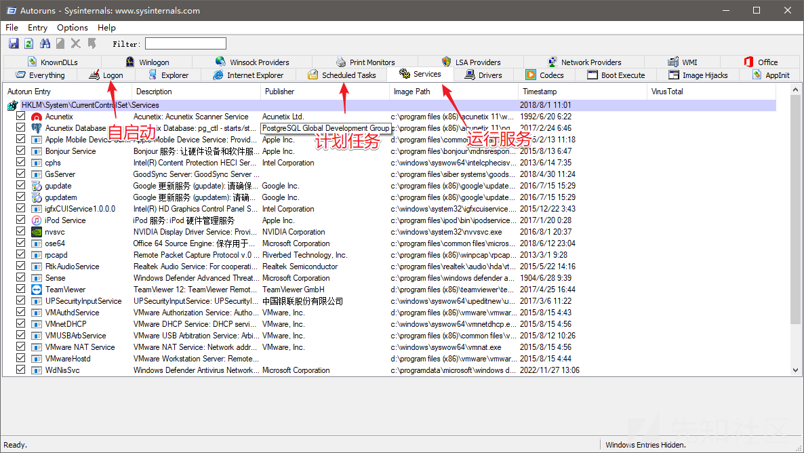 


#### 4.1.2 procexp

查看进程的工具。  
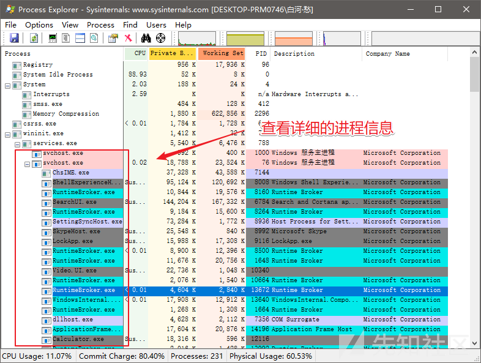   

   


#### 4.1.3 ADExplorer

Active Directory Explorer（AD Explorer）是一种高级Active Directory（AD）查看器和编辑器。 您可以使用AD Explorer轻松导航AD数据库，定义收藏位置，查看对象属性和属性，而无需打开对话框，编辑权限，查看对象的架构，以及执行可以保存和重新执行的复杂搜索。  

AD Explorer还包括保存AD数据库快照以进行脱机查看和比较的功能。 加载已保存的快照时，您可以像实时数据库一样导航和浏览它。 如果您有两个AD数据库快照，则可以使用AD Explorer的比较功能查看它们之间更改的对象，属性和安全权限。  
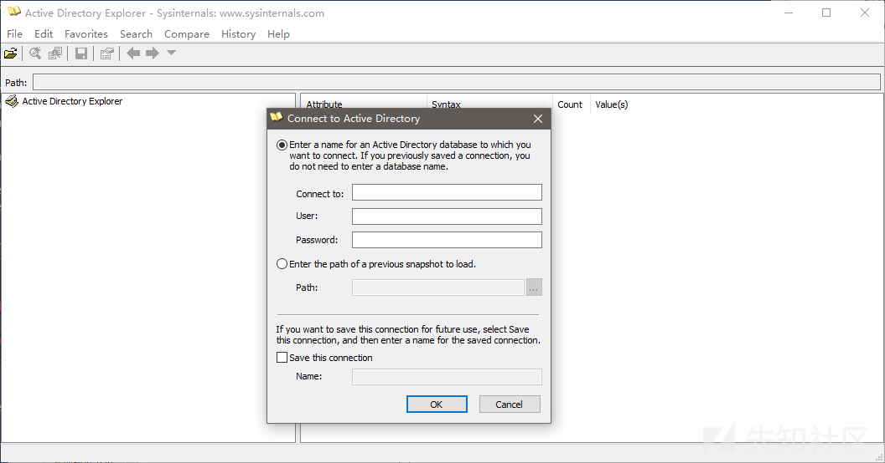   


#### 4.1.4 TCPView

查看网络连接情况  
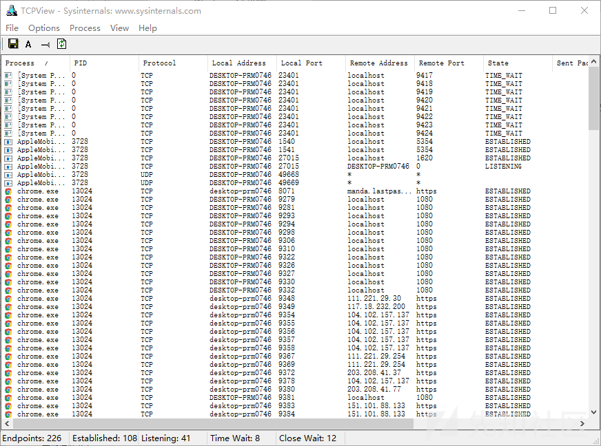   


#### 4.1.5 PSExec

像Telnet这样的实用程序和Symantec的PC Anywhere等远程控制程序允许您在远程系统上执行程序，但是设置起来很麻烦，并且要求您在要访问的远程系统上安装客户端软件。 PsExec是一种轻量级的 telne t替代品，可让您在其他系统上执行进程，完成控制台应用程序的完全交互，而无需手动安装客户端软件。 PsExec最强大的用途包括在远程系统上启动交互式命令提示和IpConfig等远程启用工具，否则它们无法显示有关远程系统的信息。  

使用可以参考：https://www.itprotoday.com/management-mobility/psexec  

#### 4.1.6 LogonSessions

列出了当前活动的登录会话，如果指定-p选项，则列出每个会话中运行的进程。  
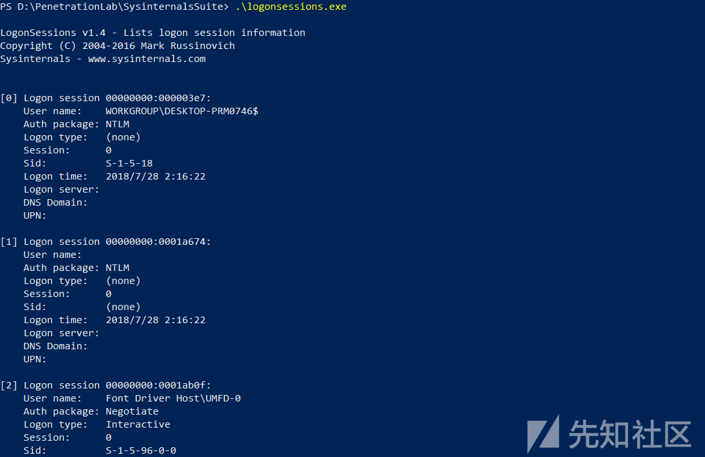   


### 4.2 Troubleshooting with the Windows Sysinternals Tools 2nd Edition

这是一本书，介绍 Sysinternals 工具集的使用。  

## 5. 其他

* 关注近期的安全事件趋势，定期查看 CNCERT 的安全报告，其他一些杀毒软件公司的论坛也要关注；
* 结合近期的应急，对每次应急出现的新状况进行总结分析，一段时间内的应急需求基本是一致的；
* 关注几个威胁情报中心，可以分析域名、IP、文件 MD5，比较方便判断攻击方式；
* 准备好杀毒盘和 Live 盘，可以利用 U 盘做一个专用的应急响应工具包
* Webshell 查杀
	* D盾_Web查杀：http://www.d99net.net/index.asp
	* 河马webshell查杀：http://www.shellpub.com
	* 深信服Webshell网站后门检测工具：http://edr.sangfor.com.cn/backdoor_detection.html
* 勒索软件基本没有办法，重要数据只能交赎金，不过也是有些特定的勒索病毒能恢复文件
* 如果未作 Windows 的日志集中化 ，如果入侵删掉所有日志， 大部分情况下只能呵呵，查一下可能的入侵链路上的其他设备、同网段设备有什么日志；
* 弱口令是很常见的入侵事件原因；
* 眼见为实，证据说话，不要被客户诱导；
* Windows 的攻击方式可以了解一下 [ATT&CK](https://attack.mitre.org/wiki/Windows_Technique_Matrix) 矩阵
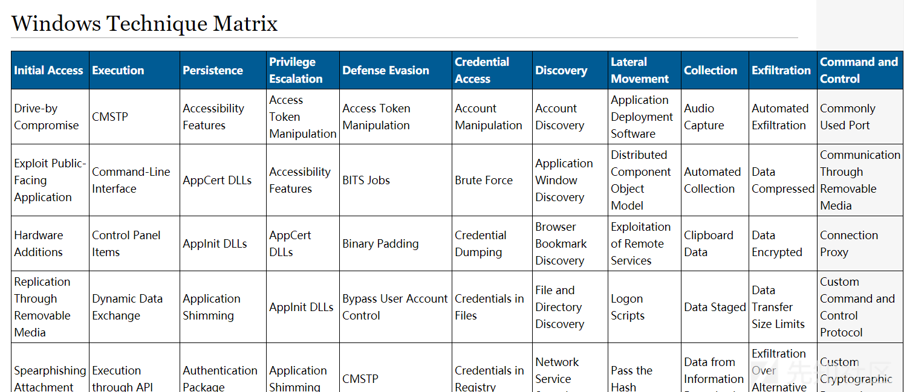   


## 参考

https://mp.weixin.qq.com/s/17L_fQJ1qjSvt8UL7VSemg  
https://sect.iij.ad.jp/d/2018/05/044132/training_material_sample_for_eventlog_analysis.pdf  
https://www.sans.org/course/windows-forensic-analysis  
https://www.sans.org/reading-room/whitepapers/forensics/live-response-powershell-34302  