原文 By Mark4z5

## 一、XML基础知识
  

  
 XML用于标记电子文件使其具有结构性的标记语言，可以用来标记数据、定义数据类型，是一种允许用户对自己的标记语言进行定义的源语言。XML文档结构包括XML声明、DTD文档类型定义（可选）、文档元素。
  
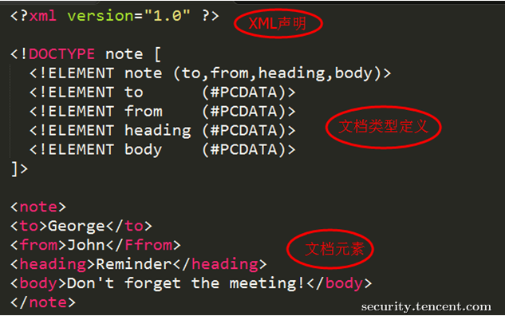
  
 
  
DTD（文档类型定义）的作用是定义 XML 文档的合法构建模块。DTD 可以在 XML 文档内声明，也可以外部引用。
  

  
内部声明DTD
  

  
<!DOCTYPE 根元素 [元素声明]>
  

  
引用外部DTD
  

  
<!DOCTYPE 根元素 SYSTEM "文件名">
  

  
或者
  

  
<!DOCTYPE 根元素 PUBLIC "public_ID" "文件名">
  

  
DTD实体是用于定义引用普通文本或特殊字符的快捷方式的变量，可以内部声明或外部引用。
  

  
内部声明实体
  

  
<!ENTITY 实体名称 "实体的值">
  

  
引用外部实体
  

  
<!ENTITY 实体名称 SYSTEM "URI">
  

  
或者
  

  
<!ENTITY 实体名称 PUBLIC "public_ID" "URI">
  
 
  
## 二、XML外部实体注入(XML External Entity)
  

  
当允许引用外部实体时，通过构造恶意内容，可导致读取任意文件、执行系统命令、探测内网端口、攻击内网网站等危害。
  
 
  
引入外部实体方式有多种，比如：
  

  
恶意引入外部实体方式1：
  

  
XML内容：
  
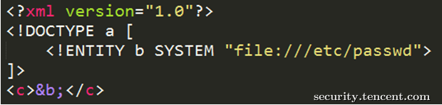
  

  
恶意引入外部实体方式2：
  
XML内容：
  

  

  
DTD文件(evil.dtd)内容：
  

  

  
恶意引入外部实体方式3：
  
XML内容：
  

  
DTD文件(evil.dtd)内容：
  

  

  
另外，不同程序支持的协议不一样，
  
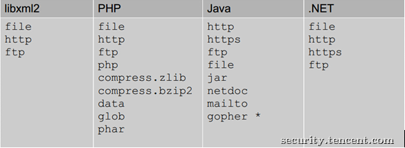
  

  
上图是默认支持协议，还可以支持其他，如PHP支持的扩展协议有
  
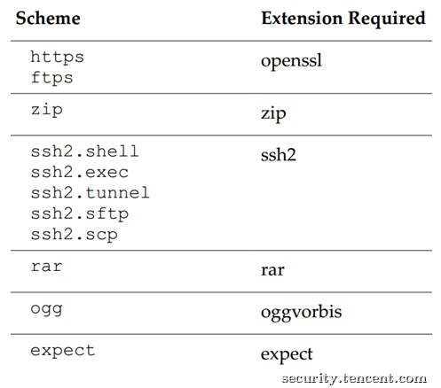
  

  

  
以下举例说明XXE危害，当然XXE不止这些危害。
  

  

  
XXE危害1：读取任意文件
  
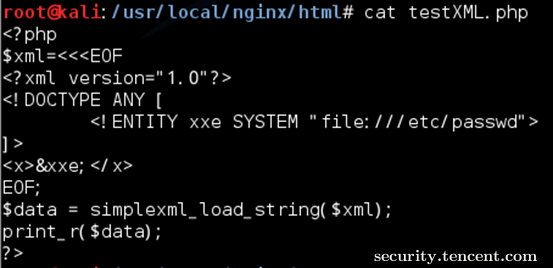
  

  
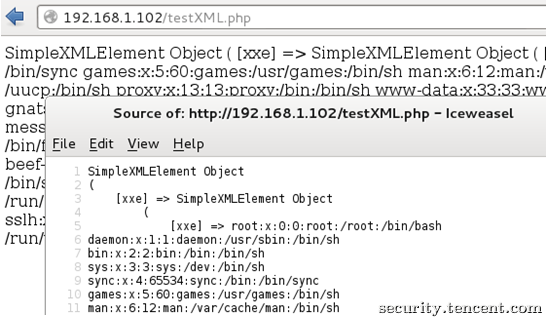
  

  
该CASE是读取/etc/passwd，有些XML解析库支持列目录，攻击者通过列目录、读文件，获取帐号密码后进一步攻击，如读取tomcat-users.xml得到帐号密码后登录tomcat的manager部署webshell。
  

  
另外，数据不回显就没有问题了吗？如下图，
  
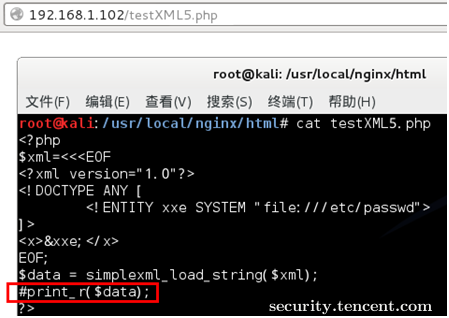
  

  
不，可以把数据发送到远程服务器，
  
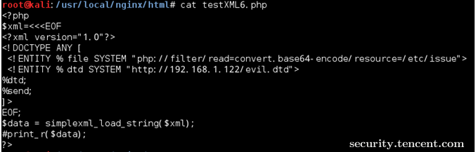
  

  
远程evil.dtd文件内容如下：
  

  

  
触发XXE攻击后，服务器会把文件内容发送到攻击者网站
  
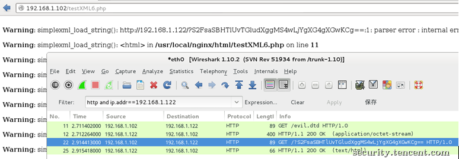
  

  

  
 
  
XXE危害2：执行系统命令
  
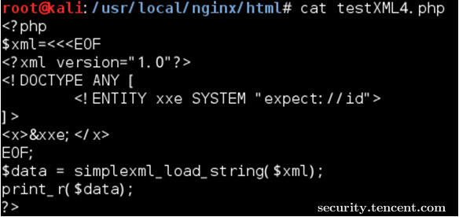
  

  
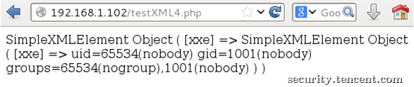
  

  
该CASE是在安装expect扩展的PHP环境里执行系统命令，其他协议也有可能可以执行系统命令。
  
 
  
XXE危害3：探测内网端口
  
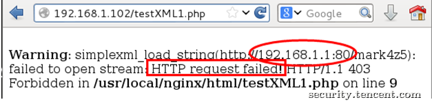
  

  
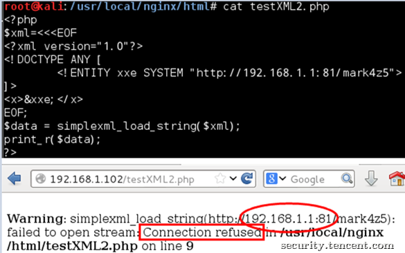
  

  

  
该CASE是探测192.168.1.1的80、81端口，通过返回的“Connection refused”可以知道该81端口是closed的，而80端口是open的。
  
 
  
XXE危害4：攻击内网网站
  
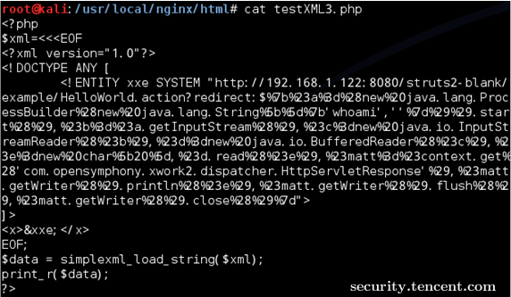
  

  

  

  
该CASE是攻击内网struts2网站，远程执行系统命令。
  
 
  
## 三、客户端XXE案例
  

  
日前，某office文档转换软件被爆存在XXE漏洞（PS:感谢TSRC平台白帽子Titans`报告漏洞），某一应用场景为：Web程序调用该office软件来获取office文档内容后提供在线预览。由于该软件在处理office文档时，读取xml文件且允许引用外部实体，当用户上传恶意文档并预览时触发XXE攻击。详情如下：
  

  
新建一个正常文档，内容为Hi TSRC，
  

  
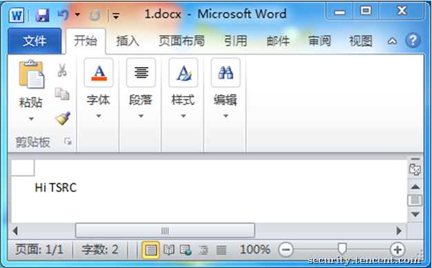
  

  
使用该软件转换后可以得到文本格式的文档内容，
  

  
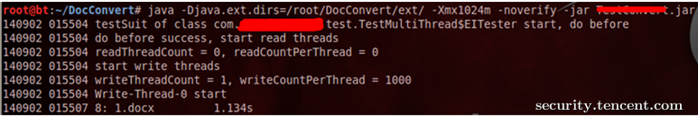
  

  

  

  
当往该docx的xml文件注入恶意代码（引用外部实体）时，可进行XXE攻击。
  

  
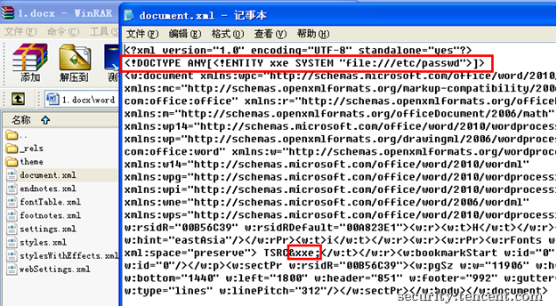
  

  
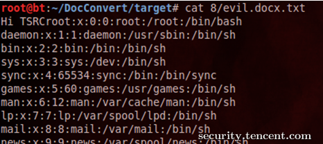
  

  

  
## 四、防御XXE攻击
  

  
方案一、使用开发语言提供的禁用外部实体的方法
  

  
PHP：
  
libxml_disable_entity_loader(true);
  

  
JAVA:
  
DocumentBuilderFactory dbf =DocumentBuilderFactory.newInstance();
  
dbf.setExpandEntityReferences(false);
  

  
Python：
  
from lxml import etree
  
xmlData = etree.parse(xmlSource,etree.XMLParser(resolve_entities=False))
  
 
  
方案二、过滤用户提交的XML数据
  
      
  
 关键词：<!DOCTYPE和<!ENTITY，或者，SYSTEM和PUBLIC。
  
 
  

  
【最后】
  

  

  
无论是WEB程序，还是PC程序，只要处理用户可控的XML都可能存在危害极大的XXE漏洞，开发人员在处理XML时需谨慎，在用户可控的XML数据里禁止引用外部实体。
  

  
文中涉及到的代码和技术细节，只限用于技术交流，切勿用于非法用途。欢迎探讨交流，行文仓促，不足之处，敬请不吝批评指正。
  
 
  

  
## Reference
  
[未知攻焉知防——XXE漏洞攻防](https://security.tencent.com/index.php/blog/msg/69)  

[XMLDTDEntityAttacks](http://www.vsecurity.com/download/papers/XMLDTDEntityAttacks.pdf)
  
[WhatYouDidntKnowAboutXXEAttacks](http://2013.appsecusa.org/2013/wp-content/uploads/2013/12/WhatYouDidntKnowAboutXXEAttacks.pdf)
  
[XML_Exteral_Entity_Attack](https://www.owasp.org/images/5/5d/XML_Exteral_Entity_Attack.pdf)
  
