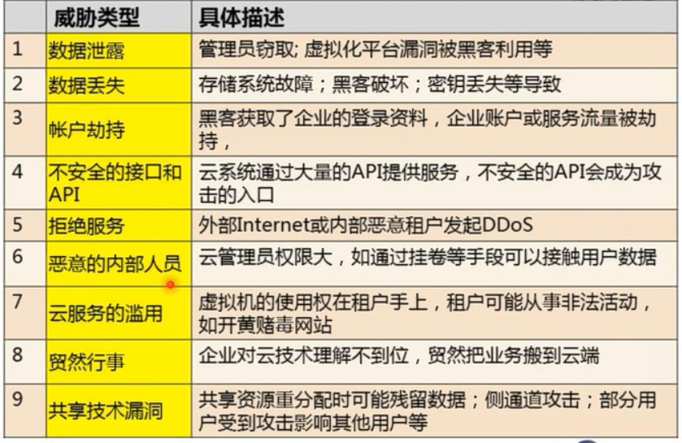
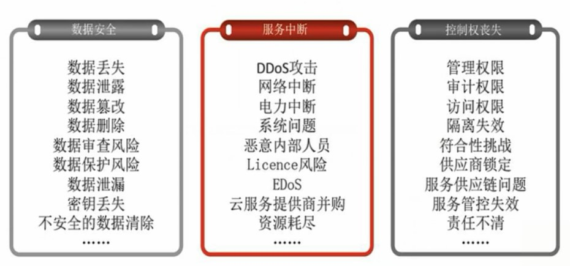
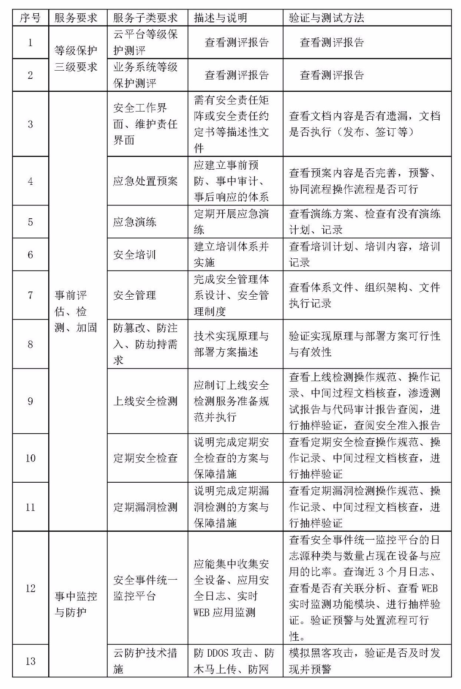
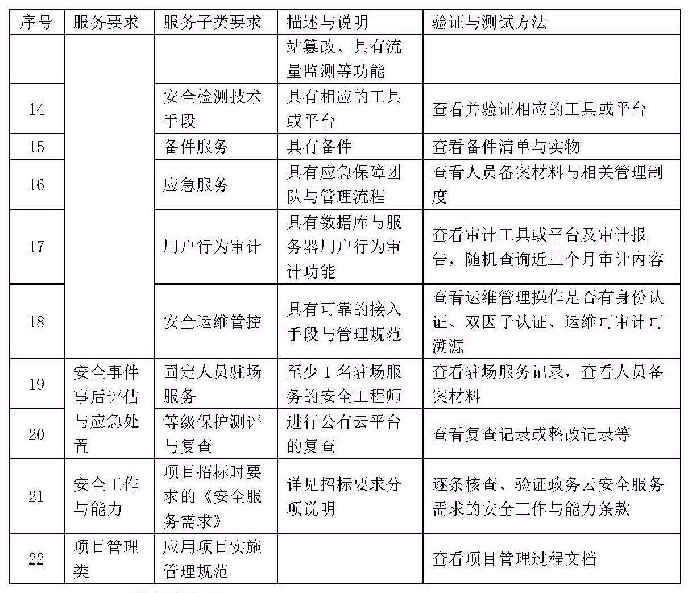
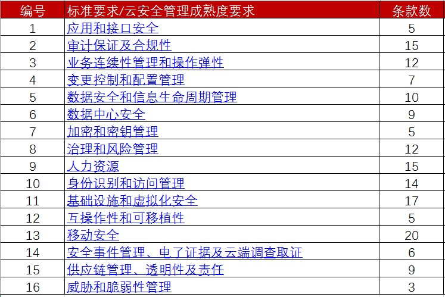
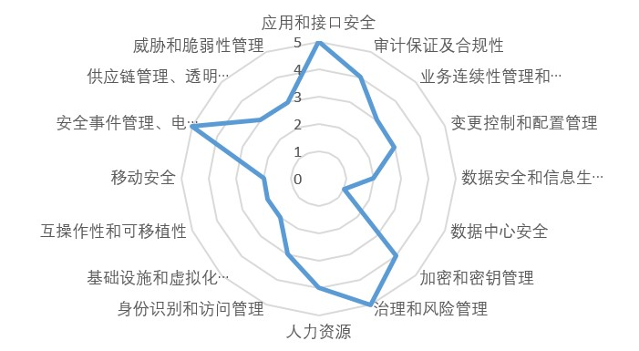

原文 by [网络安全老兵座谈：云安全审计（评估）应该怎么做？](http://www.4hou.com/info/news/6161.html?from=groupmessage&isappinstalled=0)  

最近国内的云建设如火如荼，且看1元、0.01元甚至0元中标的千万级云平台建设项目一个接一个冲击着我们的视野。作为一个有10多年网络安全从业经验的老兵，最近也常常被客户、友商问及如何去评估一个云建设和运维项目抑或是如何评估一个云平台、云服务提供商的服务内容与质量。其实，国际、国内早有了对云安全评估的详细的建设指南、评估矩阵、资质认证体系，很多资料也躺在笔者的电脑里多年，没有机会发挥这些资料的价值。所以一个想法突然出现：将我拥有的这些资料加上我的一些理解，梳理思路后进行分享，让更多刚投入到网络安全领域的新人或刚接触到某一领域的同行能有一定的帮助，这样就能和大家一起为网络安全行业发展做一点努力。  

## 云上风险趋势
**数据库类服务端口风险高**。端口就是服务器的入口，入侵者往往使用扫描器对目标机器进行端口扫描，然后实施攻击和入侵。在去年和今年年初，爆出了多起企业数据库服务被加密勒索事件，需要支付比特币才可以获得数据解密；今年3月1号，我们云鼎实验室发布的《MySQL 成勒索新目标，数据服务基线安全问题迫在眉睫》就对这些事件进行了分析，主要是企业在在公网上开放了MySQL、Redis、Eelasticsearch等数据服务端口，同时由于存在弱密码或者没有密码，黑客可以直接访问，导致被黑客入侵勒索。      
 
**漏洞是造成入侵的主要途径**。根据我们对被入侵机器的入侵原因分析结果来看，漏洞是造成服务器被入侵的主要途径，约超过60%的入侵事件跟漏洞有关。而国内企业，对漏洞的修复情况是非常不理想的。方程式漏洞被公布以后，我们针对MS17-010漏洞的修复进展进行监测发现，某企业在爆发一个月后只对其中约60%的漏洞机器进行了修复，两个月后，还有24%的漏洞机器并未修复，这样就给入侵者提供了可乘之机。而在小型企业，整体修复比例往往还要低得多。    
 
**密码破解攻击呈现常态化**。相对于Web应用漏洞，暴力破解的利用方式比较简单，成功后可以直接获得目标服务器权限，从而进一步进行植入木马、后门等操作，整个过程通过自动化程序实现，是一种成本极低的攻击方式。而据公开资料说，某IDC上日均遭受破解攻击5万次左右，腾讯云上每台机器日均被攻击2759次。云主机相对遭受的破击攻击次数少，这主要归功于云平台厂商在网络出口对一些恶意的破解行为做了自动化拦截。   
 
**高危漏洞的出现，容易造成木马病毒感染高峰**。NSA漏洞包公开Windows漏洞期间，木马检出量先后发生了两次爆发。当前云上监测到的木马文件主要分为两大类型，Shell（占比80%）及二进制木马（占比20%）。Shell主要通过Web应用漏洞上传写入，主要在入侵过程起到跳板的作用，方便进一步进行提权、植入恶意文件等操作；而二进制木马主要带有挖矿、端口扫描、DDoS等恶意行为，是整个入侵的最终目标植入。目前，利用NSA漏洞包漏洞传播的病毒最多的并不是WannaCry，而是挖矿病毒。而WebShell已经具有很强的免杀特性，建站工具弱口令问题则是WebShell的上传主要来源。    
 
**服务器上安全软件使用率偏低**。目前，云上只有约7%的服务器使用了安全软件，整体使用比例偏低，这里面，其中有很大一部分的用户使用了PC安全防护软件来解决服务器安全防护需求，说明目前国内的服务器安全防护软件在市场上影响力不大，也在一定程度上反映国内的服务器安全软件市场值得继续大力投入。    

## 云安全评估

当前，云租户无法知道处在公有云上的信息资产是否真的安全，缺乏独立的第三方安全审计，在出现权责纠纷时，云服务提供商“既是运动员又 是裁判员”，租户处于绝对弱势。另一方面，由于云服务提供商得不到权威的审计和认证，导致合规性要求高的业务系统无法选择公有云模式，成为了公有云发展的阻碍。  

当前的云安全审计，审计主体和审计标准还不够权威，也缺乏权威的审计标准，审计的主体和审计的范围也不够全面、完整。笔者认为未来成熟的审计模型必定是具有第三方机构参与的涵盖“行为”、“状态”两个维度的安全审计模型，最终实现全面性、权威性、实时性和审计报告披露的科学性。  

先看看云服务的网络安全风险排名：  
  

  再看看云用户的关注点：  
 

针对上述内容，相关的组织与部门其实都考虑到了。国际上NIST或ISO都有相关的标准规范，最有名的是云安全联盟CSA，CSA发布过《云计算关键领域安全指南》、《云计算控制矩阵（CCM）》（这些都有中文版，如有需要可通过关注“赛博朔方”公众号后留下邮箱和索取资料名称的方式获取）并推出了一个CSA-STAR认证体系。国内呢，已发布了《云计算服务安全能力要求》（GBT31168-2014，面向云服务商）、《云计算服务安全指南》（GBT31167-2014，面向政府部门），新的网络安全等级保护标准征求意见稿里也扩展了云计算部分（有基本要求、设计要求、测评要求三册），国内也有基于CSA-STAR的C-STAR认证体系、工信部的“可信云服务认证”等。  

那么如何进行云安全评估呢？以下是一个以评估云服务商为主及评估云平台相关为辅的案例，供参考。  

1.  确定评估方法 
拟以安全服务招标需求为依据，通过文档审核、访谈、审计验证、抽样测试等手段进行评估。评估内容包括：等级保护三级（云平台、业务系统等）、事前评估检测与加固、事中监控与防护、安全事后评估与应急处置、安全工作与能力、项目管理等方面。  
 
2. 确定评估框架
根据项目实际，确定具体的评估框架如下表所示：  
   
   

3.  评估操作指南
本文不针对文档审核、渗透测试等环节提供操作指南，这部分各家公司都有自己的一套方法。针对云安全评估部分，是以C-STAR评估体系（此体系综合了等同参考或修订的CSA标准、ISO27001、CSA_CCM对应的中国国家标准与规范）为主（如需相关的评估操作指导文档，可通过关注“赛博朔方”公众号后留下邮箱和索取资料名称的方式获取）。  

C-STAR评估体系，包括应用和接口安全、审计保证及合规性、业务连续性管理和操作弹性、变更控制和配置管理、数据安全和信息生命周期管理、数据中心安全、加密和密钥管理、治理和风险管理、人力资源、身份识别和访问管理、基础设施和虚拟化安全、互操作性和可移植性、移动安全、安全事件管理与电了证据及云端调查取证、供应链管理与透明性及责任、威胁和脆弱性管理16个领域164个条款，具体分布如下表所示：  
   

  根据上述164个评估条款进行评估/测试后或形成整体的云平台安全管理成熟度雷达图。  
   

4. 输出评估报告 
按照上述的评估框架，最终输出《验证与测试报告》、《安全服务评估总结报告》。  

最后，说一点关于云平台建设、运营过程中各方最为关注的重点，就是云平基础设施提供者、云平台建设者、云平台管理者、云平台运营者、第三方安全服务商（有受雇于云平台方或云租户方）云租户、云上业务的用户等各方之前的关于网络安全的责任边界问题，下次有机会再与大家分享。    