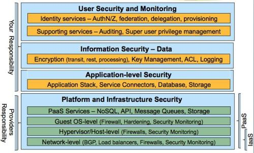
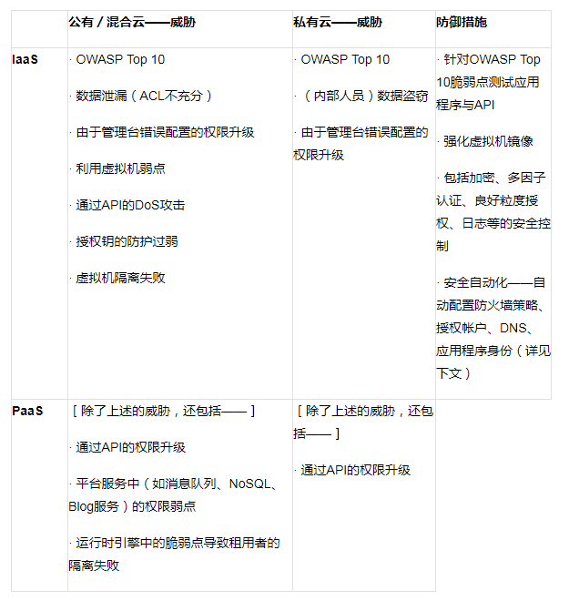
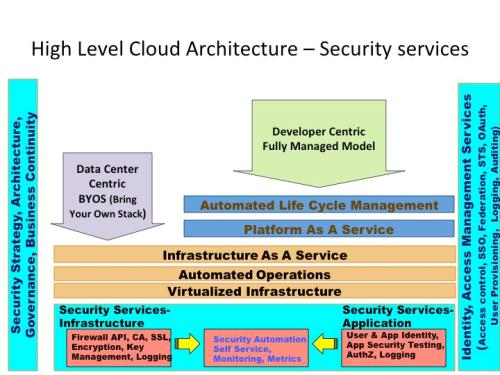
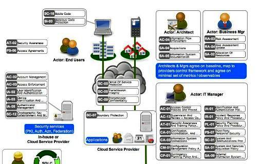
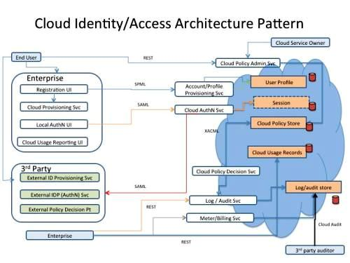

原文 by [infoq](http://www.infoq.com/cn/articles/cloud-security-architecture-intro)  

## 简介

云应用开发者以及DevOps人员已经针对IaaS（Amazon AWS、Rackspace等）和PaaS（Azure、Google App Engine、Cloud Foundry等）平台成功开发了数以万计的应用。这些平台提供了基本的安全机制，诸如认证、DoS攻击防御、防火墙策略管理、日志、基本用户与帐户管理等，但是安全顾虑依然是企业级云实施的首要障碍。对云的安全顾虑，从安全配置部署于IaaS平台之上的虚拟机到在PaaS云上管理用户权限，不可谓不广泛。  

鉴于云服务能够以多种方式进行提供，例如服务交付模型（SaaS、PaaS以及IaaS（SPI））与运维模型（公有、私有以及混合）的任意混合形式，云安全顾虑与解决方案都是依赖于上下文（模式）。因此，解决方案架构应该基于云应用架构去适配这些顾虑、并构建安全护卫（控件）。  

如此，在云应用架构师与DevOps人员在针对IaaS和PaaS平台开发应用之时，他们有哪些架构框架和工具可以使用？在本文中，我将讨论如何将“足够的”安全性植入到部署于IaaS和PaaS云上的应用。  

## 云安全－共同的职责

首先，让我们讨论云安全的运维模型。由定义来看，公有云的云安全是在云消费者（你的企业）和云服务提供商共同的职责，然而在私有云里面，消费者自身需要管理云平台的各个方面。云服务提供商负责确保公用的基础设施，其中包括路由器、交换机、负载均衡、防火墙、虚拟层管理程序（hypervisor）、存储网络、管理平台、DNS、目录服务以及云API。  

下图描绘了云服务中各个层次的安全职责由提供商与消费者共同承担。  

（点击图片查看更大尺寸）
  

在与某提供商签下合约之前，对云的服务能力做一次峰值分析非常重要。这一练习能给云平台的成熟度、透明度以及与企业安全标准（如ISO 27001）和通用标准（如PCI DSS、HIPAA与SOX等）的遵从度提供指标。云安全成熟度模型可以帮助加快应用向云移植的战略。下面是你在评测云服务提供商的安全成熟度之时可以使用的一组原则：  

* 公开安全策略、遵从性与实践：云服务提供商应该展示其与行业标准框架（诸如ISO 27001、SS 16以及CSA云控件矩阵等）的遵从度。由提供商授证的控件应该满足你的企业数据保护标准所要求的控件标准。当云服务满足ISO 27001或者SSAE 16的要求时，控件的范围应该被公示。托管受管数据的云必须遵守诸如PCI DSS、Sarbanes-Oxley和HIPAA的规定。
* 在被要求时公开：云服务提供商在由于法律或管理需要必须公开之时应该公开相关的数据。
* 安全架构：云服务提供商应该公开安全架构细节——它们可能帮助或者会阻碍企业标准要求的安全管理。例如，保证租用者之间互相隔离的虚拟化架构应该被公开。
* 安全自动化： 云服务提供商应该通过发布支持下述操作的API（HTTP／SOAP）支持安全自动化：
	* 以XML或者企业日志标准格式导出和导入安全事件日志、修改管理日志、用户授权（权限）、用户帐户、防火墙策略、访问日志。
	* 持续安全监控，包括对如云审计（Cloud Audit）等演化中标准的支持。
* 监理与安全职责：云消费者与提供商的监理与安全管理职责应该被表述清晰。

## 云安全威胁与防御

云计算是否给你的应用加重了安全威胁？哪些相关的新威胁？哪些传统的威胁增强了或者减弱了？这些问题的答案都依赖于实际所使用的云服务部署与运维模型的结合方式。下图展示了在对部署到云的应用架构设计时，对安全控件应该考量的依赖：  
    

除了上述对信息保密性和完整性的威胁，对服务可用性的威胁也需要被作为设计时应该考量的因素。请记住安全架构的基本宗旨就是设计控件保护信息与服务的保密性、完整性和可用性（Confidentiality、Integrity、Availability，以下缩写为CIA）。  

**针对云服务可用性的威胁**——云服务（SaaS、PaaS、IaaS）可以通过DDoS攻击或者由云服务操作人员或者消费者错误的配置破坏。这些错误可能会蔓延到整个云，破坏托管云应用的整个网络、系统和存储。为了达到持续可用性，云应用的架构应该可以能够承受处于单个数据中心或者某个地理地区（Geographic Region）的破坏。最近的亚马逊服务不可用事件——某个弹性块存储（Elastic Block Storage，EBS）导致了部署于US东部地区（east region）整个可用区（Availability Zone）的客户应用不可用——就极好地解释了这一弱点。然而，架构可以容忍整个地区（Region）出错的应用则极大地避免了这次服务不可用的影响，并且继续向用户提供服务。作为设计原则，假设云中的所有事物都会失败，并且针对失败去设计。应用应该能够承受地理地区的底层物理硬件的失败以及服务崩溃。应用与组件的松耦合在后一种情形下可以起到作用。  

## 云安全架构——计划

作为第一步，架构师必须理解云平台（PaaS、IaaS）提供了哪些安全能力。下图解释了云服务安全性的架构。  

   

云提供商的安全服务与能力不断演化，而且互相不同。因此你经常会发现安全机制，如钥（key）管理和数据加密，将不可用。譬如对于加密安全制物的AES 128位加密服务的需要，又譬如存管于钥管理服务的钥。对于这些关键服务，你需要继续依赖内部的安全服务。对于如此依赖于内部服务的应用，“混合云”部署架构模式或许是唯一可行的选择。另一常见的使用场景是单点登陆（SSO）。企业内部实现的SSO也许无法扩展到云应用，除非它基于云服务提供商支持的SAML 1.1或者2.0使用了联邦式（federation）架构。  

下面是防御云服务风险的云安全最佳实践：  

* 针对安全即服务（Security-as-a-service）设计架构——云上的应用部署包括了多种服务的编排（orchestraion），其中包括DNS、负载均衡、网络QoS等服务的自动化。与安全自动化属于同一范畴的还包括云安全区之间的防火墙策略、（SSL）证书供应（provision）、虚拟机系统配置、帐户权限以及日志配置的自动化。依赖于防火墙策略创建、证书供应、钥分发和应用入侵测试（pen testing）等的部署流程应该被迁移到自服务模型。这种方式将终止人工接触，也将使安全即服务的场景变得可能。最终，这将消灭因为人类错误导致的威胁、提升运维效率，并将安全控制嵌入到云应用。  
* 实现声音识别、访问管理架构与实践——可扩展的基于云的集中式与弹性的架构对基于网络的访问控制将会更少依赖，并确保很强的用户访问管理架构。云访问控制架构应该给最终用户以及授权用户解决用户与访问管理生命周期的所有方面：用户权限设置（user provisioning）与取消（deprovisioning）、认证、联盟、授权和审计。声音架构将使身份与访问服务在公有云、私有云和混合云中的所有场景下的可重用性成为可能。同时采用安全令牌服务以及合适的用户与权限设置、审计跟踪是好的实践。联邦式架构是将企业内SSO扩展到云服务的第一步。这里，你可以参阅云安全联盟[第12卷](https://cloudsecurityalliance.org/guidance/csaguide-dom12-v2.10.pdf) 获取更多信息。  
* 利用API自动化防护——任何新的安全服务都应该拥有API（REST／SOAP）以支持自动化。API可以帮助自动化防火墙策略、配置强化  （configuration hardening）以及应用部署时的访问控制。这可以通过使用开源工具例如puppet结合云服务提供商提供的API来实现。  
* 总是加密或者遮掩敏感数据——今天的私有云应用明天都可能会部署在公有云。因此无关乎未来的运维模型，应用架构应该加密所有的敏感数据。
* 不要依赖于IP地址做认证服务——云上的IP地址本就是朝三暮四，所以为了管理网络的访问控制，你不能仅仅依赖于它们。采用证书（自签名或者来自于可信的CA）以使部署在云上的服务之间通过SSL连接成为可能。  
* 日志、日志、日志——应用应该集中式记录所有安全事件的日志，它会帮助创建端到端的事务视图，而且天生无可置否。对于安全事故事件，日志和审计跟踪使唯一可靠的数据，由取证工程师用以调研和弄清楚应用是如何被滥用的。云是弹性的，日志则是瞬息万变，因此周期性将日志文件迁移到不同的云或者企业的数据中心是非常关键的。  
* 持续监视云服务——鉴于防卫控制可能无法满足所有的企业标准，监视是非常重要的功能。安全性监视应该利用云服务产生的日志、API和托管的云应用以执行安全事件关联。由CSA提供的云审计（cloudaudit.org）可以被用来完成这个任务。  

## 云安全原则

每个企业都有不同层次的风险容忍，这可以从产品开发文化、新技术采纳、IT服务交付模型、技术战略以及在安全工具与能力方面的投入上看出来。当企业的业务部门决定利用SaaS产生商业收益，技术架构应该能够支撑这个模型。此外，安全架构应该与技术架构和原则一致。下面是企业安全架构师应该考虑和定制的云安全原则示例：  

* 运行在云上的服务应该遵循最小权限原则。
* 多个安全区之间的隔离应该通过使用分层防火墙得以保证——云防火墙、虚拟层管理程序（hypervisor）防火墙、客居系统（guest）防火墙以及应用程序容器。云上的防火墙策略应该遵守基于数据敏感性的可信任区隔离标准。
* 应用程序应该使用端到端的传输层的加密（SSL、TLS、IPSEC）以确保数据在部署于云上的应用程序之间以及到部署于企业内部的应用程序之间的传输是安全的。
* 应用程序应该将认证与授权扩展到可信任的安全服务。基于SAML 2.0，应该支持单点登陆。
* 数据遮掩和加密应该基于数据的敏感性而采用，并且与企业数据净化标准相一致。
* 位于可信任区的应用程序应该被部署于经过授权的企业标准虚拟机镜像上。
* 在部署虚拟私有云（virtual private cloud, VPC）时，应该使用行业标准的VPN协议，诸如SSH、SSL和IPSEC。
* 云上的安全监控应该与既有的企业安全监控工具通过API集成在一起。

## 云安全架构模式

在架构时加入适当的保护云上信息CIA的安全控制可以防御云安全威胁。安全控制可以被作为与提供商、企业或者第三方提供商提供的服务交付（安全即服务，Security-as-a-Service）。安全架构模式通常从安全控制的角度（安全护卫）——技术与流程——进行阐述。这些安全控制和服务来源（企业、云提供商、第三方）应该在安全模式中突出强调。  

安全架构模式宛如北极星，可以加速应用往云上的迁移，而又管理了安全风险。此外，云安全架构模式应该强调不同的服务与部署于云服务之上的组件的可信任边界。这些模式也应该指出标准接口、安全协议（SSL、TLS、IPSEC、LDAPS、SFTP、SSH、SCP、SAML、OAuth、Tacacs、OCSP等）以及认证、令牌管理、授权、加密方法（哈希、对称式、非对称式）、加密算法（三重DES、128位AES、448位加密（Blowfish）、RSA等）、安全事件日志、对于策略与用户属性的真相来源（source-of-truth）及耦合模型（紧耦合或是松耦合）等机制。最终，模式应该可以被用以创建安全检查列表，需要用配置管理工具（如puppet）自动化起来。  

通常，对于被云应用消费的每项安全服务，其模式都应该强调下面的属性（但是不局限于此）：  

* 逻辑位置——本地到云服务、内部云、第三方云。位置可能会受到性能、可用性、防火墙策略以及服务监理的限制。
* 协议——调用服务的协议是什么？例如基于X.509证书的REST风格的服务请求。
* 服务功能——服务的功能是什么？例如加密制物、日志、认证以及机器指纹。
* 输入／输出——输入（包含控制的方法）、从安全服务得到的输出是什么？例如，输入＝XML文件，输出＝包括加密属性的XML文件。
* 控制描述——安全服务提供了什么安全控制？例如，防卫信息保密性、用户认证和应用认证。
* 执行者——谁是服务的用户？例如，终端（End Point）、终端用户、企业管理员、IT审计员和架构师。

下图是由开放安全架构组（open security architecture group，opensecurityarchitecturegroup.org）发布的云安全架构模式的子集。  

   

该模式展示了执行者（架构师、终端用户、业务经理、IT经理）与系统（终端、云、托管于云上的应用程序、安全服务）的交付，以及为了防护执行者与系统（访问管理、DoS防御、边界防护、钥加密与管理等）而采用的控制。让我们仔细看看本模式描述的细节。   

## 云服务提供商方的基础设施安全服务（控制）  

正如本模式所展示，云服务提供商应该提供对DoS防护以及针对由手机与PC发起的会话的保密性与完整性防护的安全控制。通常，这些会话由浏览器或者客户端应用程序发起，并使用SSL／TLS进行传输，直到由云服务提供商管理的负载均衡为止。云服务提供商通常并不共用DoS防护机制，因为黑客们可以很容易地滥用它。   

##（内部或云服务提供商）的应用程序安全服务  

安全服务，诸如用户身份识别、认证、访问管理、设备识别、加密服务以及钥管理，既可以位于云服务提供商、企业数据中心，这两者也可以结合起来。 

下图的第二种模式展示了源自CSA身份域的身份与访问模式。  
   

本模式展示了一组常见的云访问控制用例，诸如用户注册、认证、帐户权限设置、策略管理（policy enforcement）、日志、审计与计量。它强调了执行者（终端用户、企业业务用户、第三方身技人员、云服务所有者）与托管在云、企业内部或者第三方的服务的交付。  

本模式阐述了下述方面：

## 云服务提供商方的身份安全服务（控制）  

云上面运行着下述的服务：  

* **认证服务**支持由企业门户（本地AuthN界面）发起的、常常使用SAML协议传输的用户认证。经认证的会话在云上的会话存储之中维护。
帐户与用户资料设置服务支持创建新帐户和用户资料——常常是通过调用SPML（Service Provisioning Markup Language）或者云服务提供商的特定API。用户资料存储与用户资料存储。
* **云策略管理服务**被用以管理策略，比如指示云上的哪个资源可以被终端用户访问。使用这项服务，云服务所有者（企业）就可以执行管理功能，而终端用户可以请求对云资源的访问。云策略都存储于云策略存储。
* **认证服务日志与审计服务**支持双重功能，首先是云上事件（包括安全事件）的日志，其次是审计之用。访问这项服务时可以采用云审计协议和API。
* **计量服务**跟踪了云资源的使用。财务部门可以将这项服务用于收费，也可以用于费用对账。

## 企业的身份安全服务

在本模式中，应用程序的子集被托管于企业内部：  

* **云注册界面**提供了用户注册、管理和设置新的云资源的界面服务。认证和授权是通过云服务管理的。
* **云使用报表界面**可以由终端用户用来声称使用报表。
* **云配置（provisioning）服务**被用来配置云资源（计算、存储、网络、应用程序服务）。访问控制（AuthN、AuthZ）和会话管理在云服务端管理了。

## 位于第三方的身份安全服务

在本模式下,云应用程序依赖于第三方提供并托管于第三方的身符识别服务。这些服务支持第三方用户访问云资源，代表企业执行业务功能。例如备份和应用监控服务。在该模型中,用户设置、认证和访问管理功能被委托给了第三方服务。 

## 结论

通过了解可以利用哪些来自于云平台或服务提供商的服务，你可以将安全构建进入你的程序，而不用在你应用程序的边界之内再去重新创造这些能力——因此避免了昂贵的“附加”保障。一个良好的实践是创造可以运用在设计阶段的安全原则和架构模式。架构模式可以帮助在设计阶段就弄清楚了在哪里（云，抑或第三方，抑或企业）实施了控制，这样，适当的安全控制就被融入进了应用程序的设计中去。在创造云安全模式的时候，记住相关的威胁与“风险适当”原则。最终，云安全架构应该支持开发的需要，以保护处理和储存在云端的数据的保密性、完整性和可用性。  