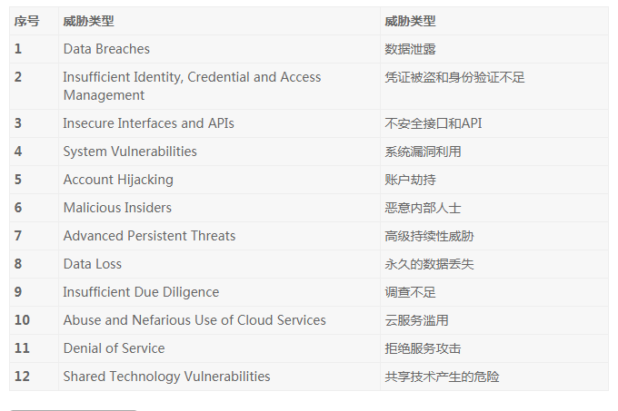
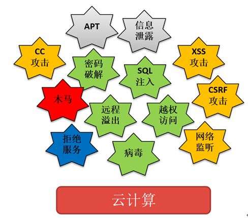

原文 by [浅析云计算环境下的安全风险](http://blog.nsfocus.net/analysis-security-risk-cloud-computing-environment/)    
 
随着互联网的迅猛发展，云计算、SDN、区块链等新型互联网技术日益被人们所熟知并接收。其中，云计算解决方案以其高可伸缩性、成本低廉、运维便利等优点被越来越多的企业采纳。在云计算技术大规模普及的互联网背景下，地下黑色产业链也随着互联网大潮不断发展完善，因而云计算供应商的技术可靠性以及云计算服务的安全性也成为了众多云计算供应商和企业IT管理人员关注的重点。  

根据CSA（Cloud Security Alliance，云安全联盟）报告公布的《The Treacherous 12 – Cloud Computing Top Threats in 2016》[1]显示数据泄露、凭证被盗、身份验证不足等12个安全问题已经成为云计算服务面临最核心的威胁。本文将针对云计算环境下目前面临的安全问题进行分析和总结。 
<li>CSA-The Treacherous 12 – Cloud Computing Top Threats in 2016[1]</li>  
  

## 云计算安全威胁分析
### 传统威胁不容忽视
虽然云计算给用户提供了一种新型的计算、网络、存储环境，但是在系统和应用与传统部署方式在提供的服务等方面却并未发生革命性的改变。在云计算平台上，认证和授权类、逻辑攻击类、客户端攻击类、命令执行类、信息泄露类威胁仍然是不可忽视的，需要云计算供应商和企业IT管理人员引起足够重视并及时加固。

    
图2.1 云计算服务与传统威胁  

### 云上新的挑战

相对于传统服务器架构，云计算技术引入了虚拟化、多租户等概念，这些都在一定程度上给信息系统带来了相关的风险点。  

### 虚拟化安全威胁
虚拟化是目前云计算供应商使用最广泛的技术之一，服务器、存储、网络等虚拟化技术为云计算服务提供了基础技术支持，解决了资源利用率、资源提供的自动扩展等问题，其中服务器的虚拟化技术支持将单台物理服务器虚拟为多台虚拟服务器，进而大幅提高有限计算资源的利用率。虚拟化技术在提供便利的同时也带来了大量安全风险，比如虚拟化自身的安全漏洞、虚拟机间流量交换等问题。  

### 虚拟化自身的安全漏洞风险
目前，在主流虚拟化技术(KVM、Xen、VMware等)中虚拟化漏洞广泛存在。Hypervisor（虚拟化管理软件）作为虚拟机的底层，一旦存在漏洞，将危及运行其上的所有虚拟机本身，甚至将影响虚拟化以下的宿主机本身的安全。攻击者主要从三个方面利用虚拟化漏洞：  

1. 对宿主机进行破坏，导致宿主机以上的所有虚拟机崩溃、业务中断；
2. 虚拟机逃逸，在获取宿主机控制权后，利用宿主机对云计算平台进行深入渗透；
3. 利用宿主机控制权对同一宿主机下其他虚拟机的敏感信息进行获取。

同时，在云计算环境中，有多种不同的虚拟化管理组件，比如虚拟机监视器、网络策略控制器，存储控制器等等，这些都是实现多租户共享硬件并隔离业务和数据的核心组件，一旦这些虚拟化管理软件类的漏洞被恶意人员所利用，那么租户的安全就无法得到有效保障。  

### 虚拟机流量交换的安全风险
在虚拟化环境下，单台物理服务器上的各虚拟机之间可能存在二层流量交换，而这部分流量对于管理员来说是不可见的。在这种情况下，管理员需要判断虚拟机之间的访问是否符合预定的安全策略，或者需要考虑如何设置策略以便实现对虚拟机之间流量的访问控制。  

### 多租户安全威胁
云计算中的多租户架构（Multi-Tenancy Technology）通过共享系统或电脑运算资源的方式提升了资源利用率，同时云计算供应商根据租户对于共享资源使用量来进行计费。多租户架构结合虚拟化技术形成了云计算的基础。  

在多租户的云计算环境里，由于云计算平台的开放性，平台上租户繁杂，不能排除一些心怀不轨的恶意租户，租户间也可能存在一定的利益竞争关系，让云计算资源滥用、租户间的攻击等成为可能，传统安全防护措施在应付这些来自云环境内部的安全挑战时显得捉襟见肘。  

### 云服务滥用
云计算服务由于租用成本低廉，租户可利用云计算供应商提供的计算、网络、存储资源，目前由于供应商管控不严导致的服务滥用现象屡见不鲜。如果供应商不对使用者的目的进行审核，很可能导致被攻击者利用进行破解密钥、发起分布式拒绝服务(DDoS)攻击、发送垃圾邮件和钓鱼邮件、托管恶意内容等。  

### 租户未得到有效隔离
目前在多租户隔离的技术上，各云计算供应商已经提供了完善的VPC（Virtual Private Cloud）多租户虚拟化网络解决方案。就在17年初, 阿里云多租户隔离问题在网上引起了激烈讨论[3]。虽然目前VPC解决方案相对完善，但并不能排查在云计算技术发展过程中被攻击者寻找到可被利用的漏洞进而跨越通过VPC技术实现的租户隔离。租户间若因为未得到有效隔离而造成租户间的攻击将极大影响云计算服务用户的使用体验，同时也极大的增加了信息系统被渗透的可能性。    

### 数据残留
在云环境下，存储介质由云计算供应商拥有，租户无法对存储介质进行直接操作。当租户退出云计算服务时，云计算供应商按照《网络安全等级保护基本要求 云计算安全扩展要求》中“剩余信息保护”要求：应保证虚拟机所使用的内存和存储空间回收时得到完全清除。云计算供应商应该完全删除租户的数据，包括备份数据和运行过程中产生的租户数据。    

目前，国内针对云计算供应商还缺乏有效的审核机制和工具对“剩余信息保护”要求的落实情况进行验证。租户在退出平台后，数据仍然有可能残留在云计算平台的存储设备中。  

## 小结
根据以上云计算安全的威胁分析，我们不难发现云计算环境下的安全形势非常严峻，攻击者可以从云计算平台本身、租户租用的资源等各个方面实施攻击渗透。无论公有云还是私有云环境下，用户有必要选择合适的云计算供应商，并针对云计算平台和业务系统做出合理的安全防护。  

在公有云的环境下，租户可通过选配云计算供应商在平台中集成的安全模块来对租户拥有的各虚拟机进行传统安全防护。  
在私有云的环境下，企业IT管理者可通过购置专业信息安全厂商提供的云安全平台来对私有云平台进行传统安全防护。  
    
绿盟安全资源池  