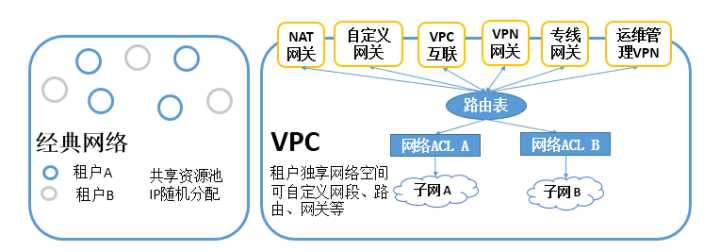
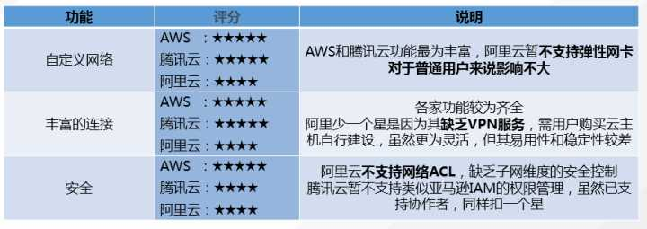
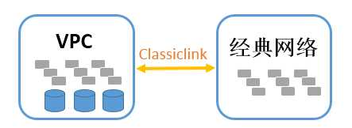

原文 by [经典网络与VPC]( https://www.zhihu.com/question/56524172/answer/149475760)    

## 1、VPC是什么？

VPC（Virtual Private Cloud）是公有云上自定义的逻辑隔离网络空间，与用户在数据中心运行的传统网络相似，托管在VPC内的是用户在私有云上的服务资源，如云主机、负载均衡、云数据库等。用户可以自定义网段划分、IP地址和路由策略等，并通过安全组和网络ACL等实现多层安全防护。同时也可以通过VPN或专线连通VPC与用户的数据中心，灵活部署混合云。  

## 2、VPC与经典网络的区别

经典网络：公有云上所有用户共享公共网络资源池，用户之间未做逻辑隔离。用户的内网IP由系统统一分配，相同的内网IP无法分配给不同用户。  

VPC：是在公有云上为用户建立一块逻辑隔离的虚拟网络空间。在VPC内，用户可以自由定义网段划分、IP地址和路由策略，安全可提供网络ACL及安全组的访问控制，因此，VPC有更高的灵活性和安全性。  

经典网络和VPC的架构对比图：  
  
对比可以看到，VPC优势明显，通过VPC，用户可以自由定义网段划分、IP地址和路由策略；安全方面，VPC可提供网络ACL及安全组的访问控制，VPC灵活性和安全性更高。可适用于对安全隔离性要求较高的业务、托管多层web应用、弹性混合云部署等使用场景中，符合金融、政企等行业的强监管、数据安全要求。  

## 3、各家VPC对比

目前，VPC也是各大云厂商正在力推的网络方案。AWS、阿里云、腾讯云等官网对VPC都有详细的介绍：  
    
总的来说，AWS和腾讯云的评分最高，能支持弹性网卡、VPN服务、网络ACL等多项服务，很大程度上降低了用户使用VPC时的技术门槛，让复杂的VPC配置变得更加简便、安全、灵活。  

同时，从腾讯云的官网说明看，腾讯云还支持外网IP直通、子网广播和组播、专线NAT功能，这些是目前公有云市场的独家服务。  

## 4、经典网络用户如何平滑迁移 

以上较多篇幅介绍了VPC的优势，那么对于已经在经典网络内有较多云主机的客户如何实现经典网络和VPC之间的平滑迁移呢？  
    
AWS（classiclink）和腾讯云（基础网络互通）都提供了平滑过渡方案，可以将经典网络内的云服务器关联至指定VPC，使经典网络中的云服务器可以与VPC内的云服务器、数据库等云服务通信。  

## 5、Vlan,VxLan,VPC

实际上在某公有云的时候这是个很无奈的选择，当时的技术本来是高级网络，也就是多租户物理隔离，但是物理隔离的方式是使用VLAN，要知道VLAN的数量只有4094个（0和4095是保留的），真正能保留给用户的也就一两千，而公有云许多用户只订一台机器，如果真的每个用户给一个隔离网络的话VLAN分分钟就不够用了，最后业务那边想出来的办法就是一个VLAN放50台虚拟机，一个人订的都在一个VLAN里，但是可能多个用户会被放到同一个VLAN里面去。    
而且不幸的是连安全组隔离都没有……（当时也提供VPC，VPC就是单个用户独立VLAN）    
实际上安全组这个技术并不安全，它仅仅是通过网桥上加iptables过滤的方式进行3层隔离，但实际上各个虚拟机之间二层仍然是互通的，也就是说各个虚拟机之间可以互相响应ARP，那就是说如果一个人故意将别人的IP配在自己的虚拟机上，即使三层流量收不到，也完全有可能干扰别人的虚拟机的使用。再加一些细致的ARP过滤规则有可能能改善，但只要不是彻底的物理隔离，实际上就是有隐患的。  
在现在这个时代，实际上VXLAN隔离技术已经相当成熟了，没有以前VLAN数量的问题，而且隔离的成本其实很低廉，如果配合SDN技术的话管理上也非常灵活。我觉得各个公有云商应该考虑将架构完全迁移到SDN上面去，抛弃以前的经典架构。在SDN结构下面实际上VPC还是非VPC成本是完全一致的。既然说到SDN，最后强推一波 [开源控制器](https://github.com/hubo1016/vlcp)  。     

以下文字引用自云舒：  
> 现在的VPC一般都是基于VXLAN实现的，VLAN的VLAN ID字段只有12 bit，最多支持4094个VLAN，这对于海量租户而言肯定是不够的，VXLAN则扩展成24bit，能够支持1600万个VPC区域，基本够用了。VXLAN是将原始报文封装成UDP包，可以很方便的跨域三层网络传输二层的内容，能够让用户组建跨地区的VPC。并且，VXLAN将内部VM的MAC地址等信息屏蔽掉了，由VTEP处理，让交换机专注物理机方面的事情，减轻压力。 
对我而言，最喜欢的是VTEP可以形成service chain。其实现在VXLAN和SDN已经不太能去分得开了，至少我不太能分得开，也许可以基于openflow协议来控制VTEP的行为吧。  
在阿里期间，我一直对现有割裂的安全厂商和产品耿耿于怀，大约是2011年我在owasp讲过我的安全产品虚拟化思路，将不同厂商的硬件盒子抽象成统一的VM，不同的功能就是不同的image，然后基于SDN或者VXLAN的能力，软件的方式定义网络结构，将平面的vm变成具有立体结构。这样，用户就可以绘制自己的网络拓扑图，在对应的地方，选择对应的产品，可能是安全，也可能是负载均衡，然后再选择供应商，点生成，整个网络就生成好了。这也许就是云计算安全最后的终局，但是不知道要多少年才能发展得到。  

