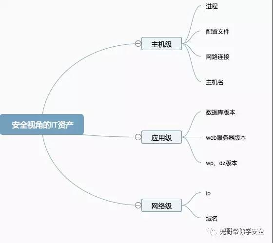
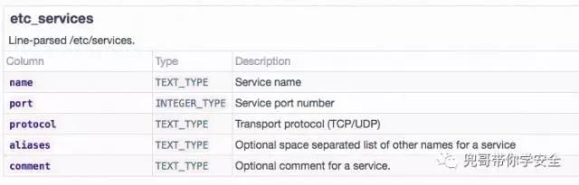
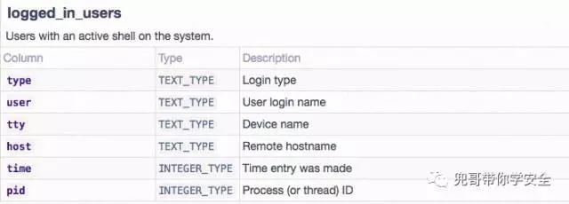
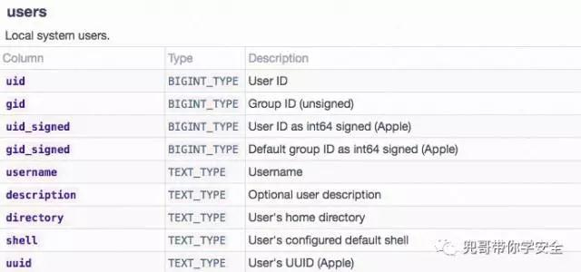
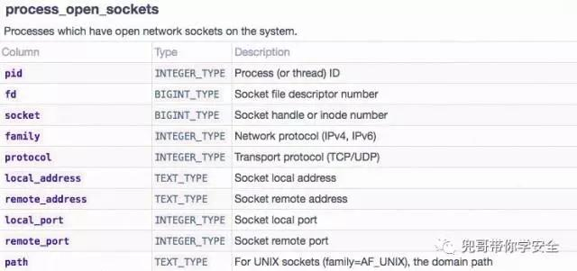
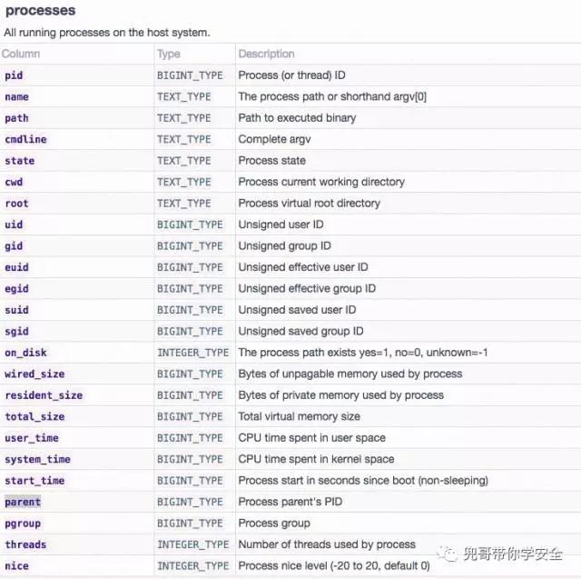
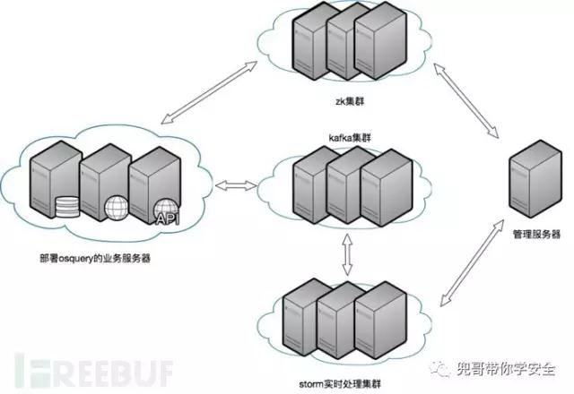
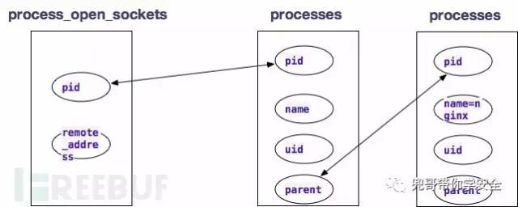

原文 by [兜哥](http://mp.weixin.qq.com/s/hXKjKY8pLJmD-f-NmBJlUw)  

## 前言
通常认为企业安全视角的资产包括网络级、应用级、主机级。本文重点讲解如何利用开源软件获取主机级资产以及入侵检测和主机审计。网络级、应用级请看下文。  

企业安全视角的主机级资产  
   
主机级资产重点关注的是进程、网络连接、账户等主机层面或者说OS级别的信息。    
## 需求
我认为搜集主机级资产主要是达到两个目的：  
* 事中的入侵检测
* 事后的审计与事故排查

## 数据搜集
主机级数据的搜集可以使用开源软件osquery。osquery是Facebook开源的一款基于SQL的操作系统检测和监控框架，目前它只实现了本地的数据搜集以及SQL交互式查询，没有实现数据的统一上传和集中存储分析，所以我们可以基于它来开发。  
### 安装
osquery支持操作系统较为丰富，常见的linux、window系统都支持。安装包下载地址为：https://osquery.io/downloads/  
以centos6为例：  
```
rpm -ivh https://osquery-packages.s3.amazonaws.com/centos6/noarch/osquery-s3-centos6-repo-1-0.0.noarch.rpm
yum install osquery
```
### 配置
osquery的配置非常简单，使用默认配置文件即可  
`cp /usr/share/osquery/osquery.example.conf /etc/osquery/osquery.conf`  
### 启动
`osqueryctl restart`  
### 数据查询
osquery的数据查询使用的是交互式SQL查询，搜集上的数据已经结构化存储在本地的数据库中。  
```
[root@instance-vijcg7zo osquery]# osqueryi
Using a virtual database. Need help, type '.help'
osquery> select version  from kernel_info;
+----------------------------+
| version                    |
+----------------------------+
| 2.6.32-642.11.1.el6.x86_64 |
+----------------------------+
osquery>
```
几个比较典型的表为：  
/etc/services  
  
当前登录用户  
   
本地用户列表  
   
具有网络连接的进程列表  
   
进程列表  
   
更多信息请参考：https://osquery.io/docs/tables/    

## 架构设计
最简化整个系统设计，优先满足事后审计的需要，作为HIDS的事后补充。  
   
业务服务器上需要部署osquery以及一个负责在zookeeper订阅命令的脚本，并将查询的结果发送给kafka集群。管理服务器负责想zk下发需要执行的SQL命令以及搜集storm集群计算的结果，storm处理服务器osquery查询的结果，根据规则讲处理结果发送给管理服务器。完整控制流程为：  
   
其中客户端的核心python伪码为：  
``` python
#创建zookeeper节点 >>> zookeeper.create(zk,"/zk_osquery_sql")
#获取节点信息 >>> zookeeper.get(zk,"/zk_osquery_sql")
#定义一个监听器,订阅配置 >>> def myWatch(zk,type,state,path): ...     
print "zk:",str(type),str(state),str(path) ...     
zookeeper.get(zk,path,myWatch) ... 
>>> data=zookeeper.get(zk,"/zk_osquery_sql",myWatch)
```
## 典型应用
场景一：发现某黑客在服务器上建立了一个叫douge的账户，需要全机房排查  
```
osquery> select * from users where username="douge";
osquery>
```
场景二：发现某木马会将常见杀毒软件升级域名设置为127.0.0.1，需要全机房排查  
```
osquery>
osquery> select * from etc_hosts where address="127.0.0.1";
+-----------+--------------------------------------------------------------------+
| address   | hostnames                                                          |
+-----------+--------------------------------------------------------------------+
| 127.0.0.1 | localhost localhost.localdomain localhost4 localhost4.localdomain4 |
+-----------+--------------------------------------------------------------------+
osquery>
```
场景三：发现某木马上线ip为61.135.169.8，需要全机房排查  
```
osquery> select * from process_open_sockets where remote_address="61.135.169.80";
+------+----+--------+--------+----------+---------------+----------------+------------+                           -------------+------+
| pid  | fd | socket | family | protocol | local_address | remote_address | local_port |                            remote_port | path |
+------+----+--------+--------+----------+---------------+----------------+------------+                           -------------+------+
| 4102 | 3  | 84602  | 2      | 6        | 172.16.0.5    | 61.135.169.80  | 22         |                            13547       |      |
| 4921 | 3  | 94472  | 2      | 6        | 172.16.0.5    | 61.135.169.80  | 22         |                            48420       |      |
+------+----+--------+--------+----------+---------------+----------------+------------+                           -------------+------+
osquery>
```
场景四：审计反弹shell，疑似反弹shell特征为某有外部连接的进程uid=0且其父进程是nginx  
   
获取进程名为nginx的pid列表  
```
osquery> select pid  from processes where name="nginx";
+-------+
| pid   |
+-------+
| 15617 |
| 2587  |
+-------+
```
获取父进程为nginx的pid列表  
```
osquery> select pid from processes  where parent in ( select pid  from processes where name="nginx" )  ;
+------+
| pid  |
+------+
| 2587 |
+------+
```
获取父进程为nginx且uid为0的pid列表  
`osquery> select pid from processes  where parent in ( select pid  from processes where name="nginx" )  and uid=0 ;`
获取外部连接的进程中uid=0且其父进程是nginx的列表  
`osquery> select * from process_open_sockets where pid in ( select pid from processes  where parent in ( select pid  from processes where name="nginx" )  and uid=0  );`  
场景五：审计反弹shell，疑似反弹shell特征为某有外部TCP连接的bash进程其父进程不是sshd  
获取进程名为sshd的pid列表  
```
osquery> select pid  from processes where name="sshd";
+------+
| pid  |
+------+
| 2042 |
| 5382 |
| 5405 |
+------+
```
获取进程名为bash的pid列表  
```
osquery> select pid  from processes where name="bash";
+------+
| pid  |
+------+
| 5387 |
| 5409 |
+------+
```
获取具有外部连接的进程名为bash的pid列表  
`osquery> select * from process_open_sockets where pid in ( select pid  from processes where name="bash"  );`  
获取具有外部TCP连接的进程名为bash的且父进程不为sshd的列表  
`osquery> select * from process_open_sockets where pid in ( (  select pid  from processes where name="bash" )  and (  select pid from processes where parent not in    ( select pid  from processes where name="sshd"  ) ) ) and protocol=17 ;`  

## 总结
生产环境中，有如下需要注意的问题和可以优化的点：  
1. osquery的数据搜集频率要根据实际性能表现调节
2. osquery自身配置文件的管理也可以使用zk进行
3. osquery在linux下稳定性较好，window下的没有实际验证过，需谨慎
4. osquery的数据采集是定时采集，所以存在瞬时状态漏采的可能
5. 客户端适当修改就可以做到定期上传数据，后台可以进行准实时计算，做到接近实时的入侵检测
6. 需要有其他程序监控osquery的运行状况
