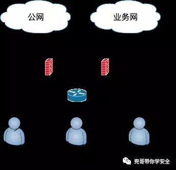
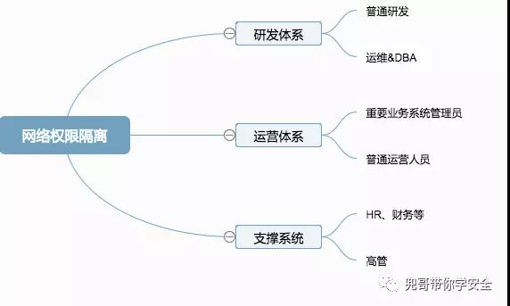
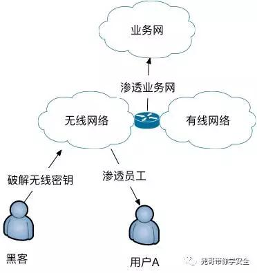

原文 by [兜哥](http://mp.weixin.qq.com/s/XRkK6lFWqUsppNiKiFFFMA)  

## 前言
在大多数互联网公司，安全建设的主要精力都投入在业务网安全上，办公网往往成为短板。为避免教科书式的理论说教，本文以攻防的角度，以中型互联网公司为例，讨论下办公网安全建设。这里的办公网是狭义的办公网，仅包括员工办公的网络区域，支撑办公的erp、邮件等系统不包含在内。  
## 办公网渗透思路
办公网通常是黑客入侵的一大突破口，究其原因我认为主要为：  
* 办公网安全投入相对业务网不足，入侵成本较低  
* 办公网的主体是人，人有七情六欲，上网行为千奇百怪，攻击面大于业务网  
* 业务网往往信赖办公网，可以成为战略迂回进攻业务网的绝好跳板  
* 研发、运营等重要资料往往高度集中在办公终端，数据价值甚至超过业务网  

渗透办公网的思路很多，以下是一个举例：    
  
渗透办公网的思路举例   
从入口的角度讲，恶意链接、文件是常见手段。    
从黑客行为讲，主要分为：   
* 水平横向渗透
* 纵向提权

从黑客目的角度讲，主要分为：  
* 以办公网为跳板攻击业务网
* 窃取HR、财务、高管等手中的重要资料

## 网络安全
下图为常见的办公网拓扑结构  
  

### 防火墙  
防火墙作为抵御攻击的第一道防护，责任重大，但是他又肩负着NAT上网的重要职责，性能和稳定性又要求很高。我认为从纯安全角度讲，选择防火墙时需要考虑下列几个功能：  
* 恶意网站过滤
* 恶意文件过滤

### IPS/IDS
IPS/IDS在这里有个非常重要的作用就是识别使用Nday的软件尤其是浏览器、办公网套件漏洞攻击员工的行为。有很多厂商宣称自己的IPS/IDS可以识别0day，我个人认为目前比较成熟的0day识别技术主要依赖沙箱和机器学习，真要识别0day还是需要专业的APT设备来做。  

### 邮件安全网关
这个话题内容太多，可以单独写一篇，本文先省略。  

### APT设备
APT设备通过分析邮件、流量中的文件和流量行为识别APT行为，我知道国外fireeye、趋势、pa、mcafee等都做这块在。  
安全隔离
安全隔离的主要目的有两个：
* 按需提供网络访问权限，避免权限滥用
* 减小黑客在办公网横向渗透以及纵向提权的攻击面，提高攻击成本

出于这两个目的，所以安全隔离通常和准入或者vlan划分结合在一起，不同的地方主要在于准入可以根据用户身份动态调整网络权限，vlan划分相对不够灵活。  
     

### 网络权限隔离
上图是一个简单的分类，其中有几类同学需要重点关注：  
* 运维&DBA，系统权限特别大，纵向提权的最佳目标，有种开玩笑的说法，黑掉一个运维的电脑，把所有文本文件翻个遍，找不到一个密码才是见鬼了。应当尽量限制其他人群对他们的访问。  
* 重要业务系统的管理员，这些同学负责对公司核心业务进行运营管理，对重要后台系统具有很高的权限，一旦他们电脑被入侵，后果会很严重。比如游戏公司充值系统的后台、广告公司的客户广告投放管理系统、招聘公司的后台简历管理系统、电商的订单物流管理系统，出点事都是大事。应当尽量限制其他人群对他们的访问，同时严格限制他们的外网访问权限。  
* 高管、HR、财务，这些同学对办公系统的访问需求比较单一，主要网络访问需求在外网，通常不懂技术，安全防护意识也最弱，也最得罪不起。他们的办公电脑集中大量公司重要数据，一旦被入侵就直接产生损失了。这部分同学可以严格限制跟办公网其他区域以及对内部系统的访问。  

## 无线安全
    
无线情况就特别复杂了，这里讨论比较常见的情况。不少公司的无线依靠静态密码保护，认证通过后即可以访问办公网络。这里有两个甲方常见误区：
* 我无线只覆盖公司内部，黑客咋搜到？  
黑客如果真打算黑你，真可以到你公司附近，现在的AP发射能力都很强，黑客如果使用专用设备，接受信号能力也很强。  
* 我无线密码好复杂，黑客不可能暴力破解  
本本上装个kali，买个好点的usb网卡，wpa/wpa2密码破解只是时间问题。另外现在不少wifi助手有记住密码功能，内部员工一旦误点了记住免费wifi，其他人使用wifi助手连接这个wifi就会自动认证，破解都不用了。所以无线网络最好可以限制仅能访问外网，并且加上类似准入的二次认证机制，也可以使用域密码或者证书认证，降低静态密码被泄露和破解的风险。  

## 终端安全
终端安全是办公网安全的重点，涉及面非常广，核心诉求至少包括一下方面：  
* 提高终端安全基线，减小攻击面
* 基础防病毒能力，具备抵御常见Nday病毒木马的能力，提高攻击成本
* 基础的终端系统、应用软件资产搜集以及管理能力，针对常见的Nday系统、应用软件漏洞具有发现、修复的能力，提高攻击成本
为了达到以上要求，需要借助一定的商业解决方案。

### 终端安全加固
终端安全加固的目的是提高安全基线，减小攻击面，事半功倍的方法是让PC终端统一加入window域，通过域控策略统一管理终端的安全策略，介绍域策略的文章很多，这里只提下几个比较重要的点：  
* 开启屏保以及锁屏时间
* 域账户密码复杂度，密码更换时间
* 禁用guest账户
* 开启主机防火墙
* 禁止administror账户远程登录（员工自己域账户是本地管理员，可以正常登录，很多公司喜欢用ghost预装电脑，administror账户的密码绝对是个大坑）
* 禁止域管理员远程登录（一定要把域控和一般PC放在不同组策略下，不然这个策略害死人）
* 删除IPC$ C$ D$ admin$（木马经常利用）
* 开启审计策略，记录登录、账户相关事件
* 调整事件日志的大小及覆盖策略
* 关机清理虚拟内存页面文件

### 终端防病毒
终端防病毒肩负着具备抵御常见Nday病毒木马的能力，提高攻击成本的重任，不过传统解决方案基本就是纯粹的黑名单和基于病毒特征，似乎这一领域也是红海中的红海。可喜的是最近两年终端安全又被各大安全厂商重视起来，因为越来越多的有针对性的攻击行为被揭露，跳板都是办公终端，大家对这块越来越重视；另外新的检测技术以及解决思路落地实现，安全厂商提出了EDR的概念，即终端检测与响应。基本思路是默认攻击者始终会渗漏公司网络，让安全人员利用IoC和终端行为来快速检测任何入侵，减小攻击者造成的损害。  

### 终端管理
终端管理主要解决两个安全问题：  
* 系统、应用软件版本的管理
* 系统、应用软件漏洞的自动化修复
微软的WSUS以及SCCM虽然只能搞定微软系软件以及flash的问题，但是已经可以解决大部分问题了，针对类似java、chrome这类常用第三方软件的升级，就需要专业的终端管理解决方案了。  

## 准入系统
准入系统可以基于员工身份做到灵活的网络权限限制，保障主机安全基线的强制执行。

## 数据安全
数据安全是个非常复杂的话题。  

## 系统安全
办公网的系统安全，出了加固手段，还需要通过漏洞扫描器定期自动化发现。我理解这里的扫描器至少需要解决几方面问题：  
* 各种弱密码
* 系统级漏洞，比如ms08-067、MS12-020
* 第三方软件漏洞，比如Cisco WAG120N多个远程命令执行漏洞

## 其他
### 蜜罐
部署一定数量的蜜罐，可以起到事半功倍的效果，最简单的就是用类似honeyd之类开源的伪装成window终端即可。  
### siem
办公网数据量基本不大而且商业产品居多，使用ossim就可以很好解决数据搜集、展现、自定义报警、关联分析的功能了。  

## 建设步骤
通过以上努力，我们基本建设起了办公网的纵深防御系统，整个办公网具有了一定的安全防护以及感知能力。公司的预算总是有限，人力也是捉襟见肘，从无到有建设这么个安全防护体系不是一年半载的事，需要拍优先级，下面是一个建议：  
第一步，安全边界建设，风险初步可控，比如IPS、NGFW  
第二步，细化终端安全建设，进一步提高防护能力  
第三步，提高安全感知能力，锦上添花  
每个公司安全现状不一样，业务情况也不一样，具体实施步骤和策略需要因地制宜。安全意识教育也是非常重要的一个环节，尤其针对社工，技术防护手段效果一般。  