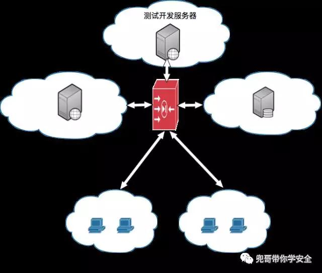
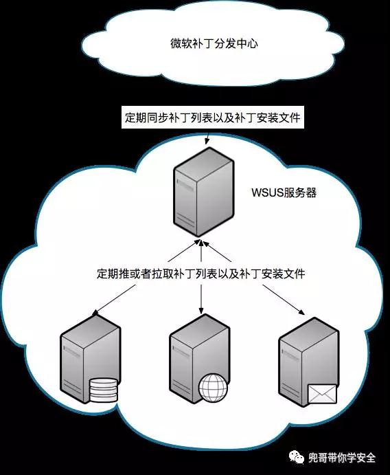
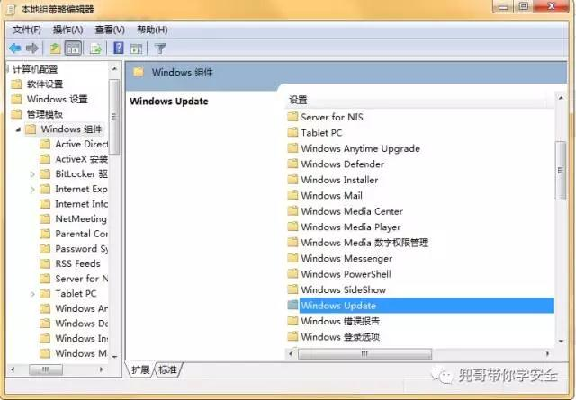
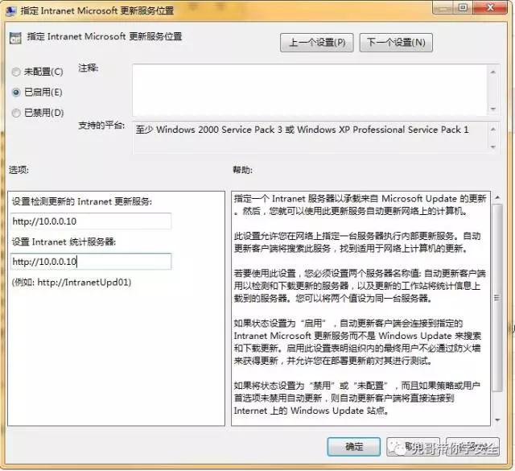

原文 by [兜哥](http://mp.weixin.qq.com/s/m76aVZRhJ-9rrZGkJZ_ajg)  

## 摘要
本文结合实战经验，和大家讨论下互联网公司的基础安全建设中十分重要的安全区域划分以及主机加固。  

##  互联网公司特点
乱，业务发展快而难以预期，拥抱变化是应该的，主动求变是鼓励的。  
新，各种新技术被广泛使用，虚拟化、容器技术、NOSQL、DEVOPS等都是先在互联网公司流行起来的。  
快，快速迭代，快鱼吃慢鱼，一天上线几十次是正常。  
这些特点就决定了安全区域划分需要有可扩展性，同时不能过于细致，否则难以落地。安全的本职是保护业务，而不是成为业务发展的绊脚石，照搬传统公司的做法，不结合公司实际很容易出问题。  
## 安全域
安全域是边界防护的基础，所谓安全域，我个人理解就是具有相同安全级别并且可以用统一的边界访问策略控制的服务集合。所以划分为同一安全域的要素有两个：  
* 相同安全级别
* 可以用统一的边界访问策略控制

十分典型的安全域划分为，办公区、业务区、外网、办公服务区、开发测试服务区。  
办公区：员工办公的区域，主要组成是办公终端，容易被入侵后成为跳板  
业务区：对外提供服务的区域，主要组成是业务服务器  
外网：主要组成是黑客和用户  
办公服务区：支撑员工办公的服务，主要组成是邮件、erp、crm等办公服务服务器，特别要强调的是这部分的员工、运营相关数据有时比线上数据还要敏感和重要  
开发测试服务区：支撑员工开发测试的服务，主要组成是开发测试服务器，这部分服务属于灯下一片黑，也非常容易被入侵后成为跳板  
安全区域划分后，通过边界访问控制，可以达到以下目的：  
* 最小化各个安全区域的攻击面
* 单安全区域被攻陷后，控制影响范围，风险可控

## 安全区域划分
### 典型传统中企业安全区域划分  
这是一个非常典型的传统区域划分模型，基于DMZ区域的划分，针对业务更变不频繁且相对稳定的互联网公司也可以参考下这个模型。    
  
### 中型互联网企业安全区域划分  
最简化的模型如下图，业务服务器区也可以细化成数据库区、前端区、中间件区等，这个取决具体公司的实施成本。    
  
假定所有服务器都部署在IDC或者公有云上。员工和用户访问所有服务都需要通过外网。安全域内的主机互相信任，跨安全区域互相不信任，严格限制访问，我们的基本假设是，每个区域都可能被入侵。区域划分就是为了这个时候提供黑客进一步入侵的成本，为后面的入侵检测和应急响应争取时间。
业务服务器区：强烈建议仅通过负载均衡对外发布服务，业务服务器区对外网仅暴露堡垒机和负载均衡设备的端口，这样可以最小化攻击面，类似mongodb勒索事件可以有效避免。业务服务器会有各种管理后台，包括但不限于：  
* 业务管理后台
* tomcat管理后台
* zabbix等运维管理后台
* hadoop、docker等开源软件的管理后台

可以限定管理后台的端口段，仅允许办公区的公网IP访问，这样可以有效提高黑客攻击管理后台的成本。当然部分业务的管理后台会给大量代理商、外包使用，无法限制源IP，这个就没失效了。  

### 内部服务区域
这个区域包含大量运营、人事、研发相关的重要企业数据，安全等级甚至比业务区域还要高，但是往往容易被甲方忽略，成为入侵的重灾区。原则上这个区域也只允许来自办公区域的访问。  

### 测试开发区域
与内部服务器区域类似，这个区域大量开发中的产品，安全基线最差，最容易被入侵，原则上这个区域也只允许来自办公区域的访问。  
业务区域、内部服务区域、测试开发区域难免业务上有需要，部分服务需要互通，这个以白名单形式开放。  
各个区域针对SSH和远程桌面的访问仅信任堡垒机IP。  
混合云模式其实也类似就不再赘述。  

## 主机加固
主机加固相关文章非常多，各家实际情况又特别复杂，这里主要列举比较重要的几个点，实际落地的策略还需要大家自行完善。  
### linux主机OS层面加固
* 禁止root登录    
```
vi /etc/ssh/sshd_config
PermitRootLogin no
```
* 禁用LKM  
LKM的全称为Loadable Kernel Modules，中文名为可加载内核模块，主要作用是用来扩展linux的内核功能。LKM的优点在于可以动态地加载到内存中，无须重新编译内核。由于LKM具有这样的特点，所以它经常被用于一些设备的驱动程序，例如声卡，网卡等等。当然因为其优点，也经常被骇客用于rootkit技术当中，强烈建议默认关闭，除非必要，不要使用。  
`echo 1 > /proc/sys/kernel/modules_disabled`  
需要写到开机启动项里面，这个比直接内核编译时禁用LKM具有可操作性，因为一旦手工关闭LKM应用异常后，只需要开启即可。  
* 开启ASLR  
ASLR，即Linux 内存地址随机化机制，可以在linux服务器遭受缓冲区溢出攻击时提高攻击成本。  
分为三个级别  
0 - 表示关闭进程地址空间随机化  
1 - 表示将mmap的基址，stack和vdso页面随机化  
2 - 表示在1的基础上增加栈（heap）的随机化  
echo 2 >/proc/sys/kernel/randomize_va_space  
需要写到开机启动项里面  

### window主机OS层面加固
* 开启window防火墙
默认只开放web服务以及远程桌面端口。window最容易出事的就是139、445、135这三个端口的服务，除非万不得已，默认一定要干掉这些端口。  
* 补丁管理
window操作系统层面的漏洞比较多而且国内外安全人员跟进也特别快，各种POC利用工具特别多，稍不留神就被黑了，所以window下的补丁管理尤其重要。微软自带就有免费的很简单可依赖的补丁管理软件，WSUS。  
WSUS（Windows Server Update Services），它在以前Windows Update Services的基础上有了很大的改善。目前的版本可以更新更多的Windows补丁，同时具有报告功能和导向性能，管理员还可以控制更新过程。WSUS是典型的CS架构，也支持分布式部署，不过单台WSUS服务生产环境负责一千台以内的window服务器的补丁管理与分发没有任何问题。  
  
WSUS服务器使用默认安装即可，window服务器自带WSUS客户端，即自动更新服务，只要配置下内部WSUS地址即可：  
打开更新服务配置界面  
  
配置WSUS地址  
  
当服务器个数超过10台，手工配置将是十分繁琐的过程，如果你的window服务器都是用域控管理的话，还可以用组策略直接下发WSUS的配置；但是多数情况window服务器都是没有加入域的，这个可以通过下发reg脚本来实现，下面是比较重要的几个点：  
```
[HKEY_LOCAL_MACHINE\SOFTWARE\Policies\Microsoft\Windows\WindowsUpdate]
"WUServer"="http://你的IP"
"WUStatusServer"="http://你的IP"
"ElevateNonAdmins"=dword:00000001
"TargetGroupEnabled"=dword:00000001
[HKEY_LOCAL_MACHINE\SOFTWARE\Policies\Microsoft\Windows\WindowsUpdate\AU]
"NoAutoUpdate"=dword:00000000
'设置为0，表明自动升级
"AUOptions"=dword:00000004
'设置为4，表示下载后自动安装。3是提醒安装
"ScheduledInstallDay"=dword:00000000
'设置为0，表示每天都检测升级
"UseWUServer"=dword:00000001
'启用内部WSUS
```

比较折中的方案，自动下载自动安装，但是管理员手工重启，我确实遇到过打补丁蓝屏和重启后服务起不来的，自动重启风险太大。  

## 总结
区域划分也可以基于VLAN来实现，这样更灵活，访问控制在三层进行。当然三层控制也可以绕过，不过会有一定攻击成本。docker技术的引入带来了新挑战，比较简单的方案是不同区域建立不同的docker集群，比如业务区域docker集群、测试开发区域dcoker集群等。SDN环境下可以基于SDN来实现隔离。总之，实现方案有很多，需要结合实际，但是中心思想是减小攻击面，提高攻击成本，抑制跳板攻击。  