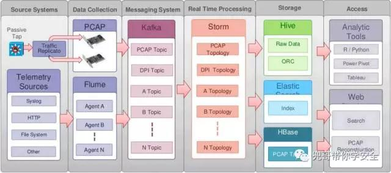
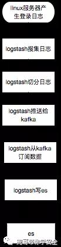
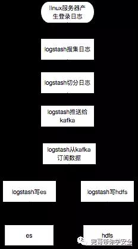
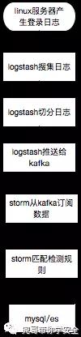
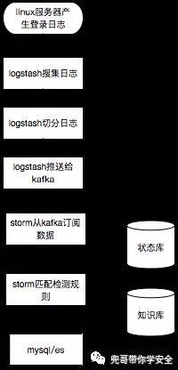
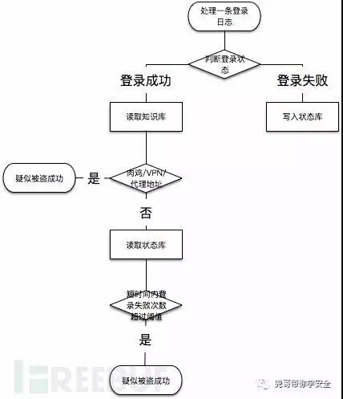
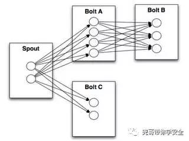

原文 by [兜哥](https://mp.weixin.qq.com/s/5CBRcFkAeYdcB5eKlX0JXA)  

## 前言
SIEM（security information and event management），顾名思义就是针对安全信息和事件的管理系统，针对大多数企业是不便宜的安全系统，本文结合作者的经验介绍下如何使用开源软件搭建企业的SIEM系统，数据深度分析在下篇。  

## SIEM的发展
对比Gartner2009年和2016年的全球SIEM厂商排名，可以清楚看出，基于大数据架构的厂商Splunk迅速崛起，传统四强依托完整的安全产品线和成熟市场渠道，依然占据领导者象限，其他较小的厂商逐渐离开领导者象限。最重要的存储架构也由盘柜（可选）+商业数据库逐渐转变为可横向扩展的大数据架构，支持云环境也成为趋势。  


开源SIEM领域，比较典型的就是ossim和Opensoc，ossim存储架构是mysql，支持多种日志格式，包括鼎鼎大名的Snort、Nmap、 Nessus以及Ntop等，对于数据规模不大的情况是个不错的选择，新版界面很酷炫。  

完整的SIEM至少会包括以下功能：
* 漏洞管理
* 资产发现
* 入侵检测
* 行为分析
* 日志存储、检索
* 报警管理
* 酷炫报表

其中最核心的我认为是入侵检测、行为分析和日志存储检索，本文重点集中讨论支撑上面三个功能的技术架构。  

## Opensoc简介
Opensoc是思科2014年在BroCon大会上公布的开源项目，但是没有真正开源其源代码，只是发布了其技术框架。我们参考了Opensoc发布的架构，结合公司实际落地了一套方案。Opensoc完全基于开源的大数据框架kafka、storm、spark和es等，天生具有强大的横向扩展能力，本文重点讲解的也是基于Opensoc的siem搭建。  
  
上图是Opensoc给出的框架，初次看非常费解，我们以数据存储与数据处理两个纬度来细化，以常见的linux服务器ssh登录日志搜集为例。  

### 数据搜集纬度
数据搜集纬度需求是搜集原始数据，存储，提供用户交互式检索的UI接口，典型场景就是出现安全事件后，通过检索日志回溯攻击行为，定损。  
 
logtash其实可以直接把数据写es，但是考虑到storm也要数据处理，所以把数据切分放到logstash，切分后的数据发送kafka，提供给storm处理和logstash写入es。数据检索可以直接使用kibana，非常方便。数据切分也可以在storm里面完成。这个就是大名鼎鼎的ELK架构。es比较适合存储较短时间的热数据的实时检索查询，对于需要长期存储，并且希望使用hadoop或者spark进行大时间跨度的离线分析时，还需要存储到hdfs上，所以比较常见的数据流程图为：  
   
### 数据处理纬度
这里以数据实时流式处理为例，storm从kafka中订阅切分过的ssh登录日志，匹配检测规则，检测结果的写入mysql或者es。  
   
在这个例子中，孤立看一条登录日志难以识别安全问题，最多识别非跳板机登录，真正运行还需要参考知识库中的常见登录IP、时间、IP情报等以及临时存储处理状态的状态库中最近该IP的登录成功与失败情况。比较接近实际运行情况的流程如下：  
   
具体判断逻辑举例如下，实际中使用大量代理IP同时暴力破解，打一枪换一个地方那种无法覆盖，这里只是个举例：  
   

### storm拓扑
storm拓扑支持python开发，以处理SQL日志为例子：  
假设SQL日志的格式为  
`"Feb 16 06:32:50 "	"127.0.0.1" "root@localhost" "select * from user where id=1"`  
一般storm的拓扑结构为：  
   
简化后spout是通用的从kafka读取数据的，就一个bolt处理SQL日志，匹配规则，命中策略即输出"alert":"原始SQL日志"
核心bolt代码doSQLCheckBolt伪码为：  
``` python
import stormclass 
            SplitSentenceBolt(storm.BasicBolt):    
            def process(self, tup):        
                words = tup.values[0].split(" ")
                sql = word[3]      
                  if re.match（规则,sql）：
                storm.emit（["sqli",tup.values[0]]）
    SplitSentenceBolt().run()
```

### logstash
在本文环节中，logstash的配置量甚至超过了storm的拓扑脚本开发量，这里讲下比较重点的几个点：  
#### 从文件读取
```
input    file {        
                    path => ["/var/log/*.log", "/var/log/message"]                        
				 type => "system"
                 start_position => "beginning"    } }
```
#### 从kafka中订阅
```
input {    kafka {        
                zk_connect => "localhost:2181"
                group_id => "logstash"
                topic_id => "test"
                reset_beginning => false # boolean (optional)， default: false        
				consumer_threads => 5  # number (optional)， default: 1        
				decorate_events => true # boolean (optional)， default: false        }    }
```
#### 写kafka
```
output {    kafka {        
                broker_list => "localhost:9092"
                topic_id => "test"
                compression_codec => "snappy" # string (optional)，
                 one of ["none"， "gzip"， "snappy"]， default: "none"    } }
```
#### 写hdfs
```
output {    hadoop_webhdfs {        
            workers => 2
            server => "your.nameno.de:14000"
            user => "flume"
            path => "/user/flume/logstash/dt=%{+Y}-%{+M}-%{+d}/logstash-%{+H}.log"
            flush_size => 500
            compress => "snappy"
            idle_flush_time => 10        
            retry_interval => 0.5    } }
```
#### 写es
```
output {    
    elasticsearch {
            host => "192.168.0.2"
            protocol => "http"
            index => "logstash-%{type}-%{+YYYY.MM.dd}"                        
		    index_type => "%{type}"   
             workers => 5      
              template_overwrite => true    } }

```
### 扩展数据源
生产环境中，处理安全事件，分析入侵行为，只有ssh登录日志肯定是不够，我们需要尽可能多的搜集数据源，以下作为参考：  
* linux/window系统安全日志/操作日志
* web服务器访问日志
* 数据库SQL日志
* 网络流量日志

简化后的系统架构如下：  
   
## 后记
如何在离线数据中，通过行为分析和攻击建模识别出深入的入侵行为呢？请看下篇。  
