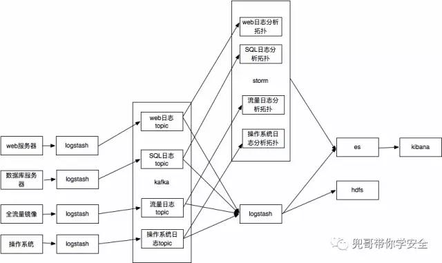
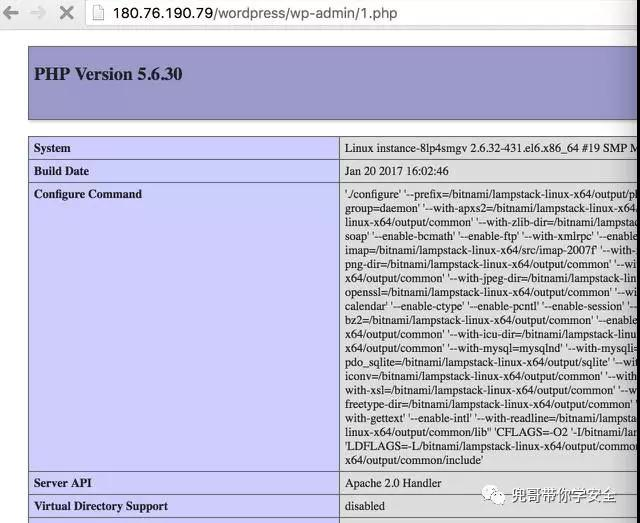
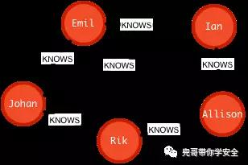
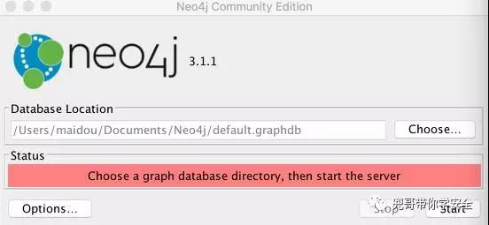
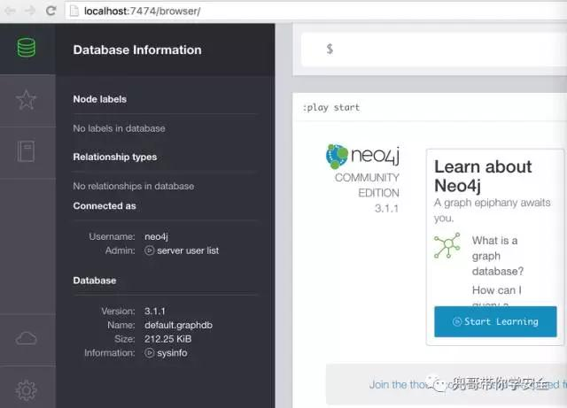
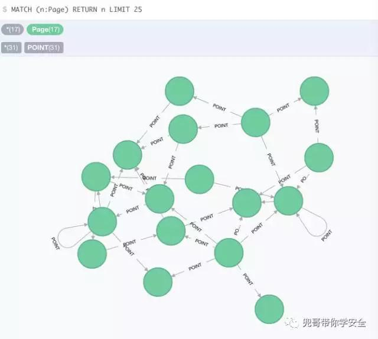
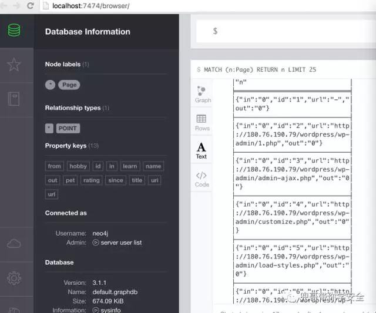
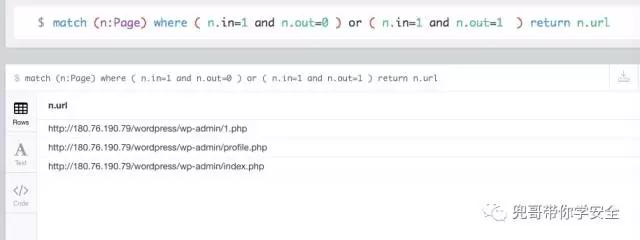

原文 by  [兜哥](http://mp.weixin.qq.com/s/Qjad1V-boE-YAO8W4ZXtxA)  

## 前言
SIEM（security information and event management），顾名思义就是针对安全信息和事件的管理系统，针对大多数企业是不便宜的安全系统，本文结合作者的经验介绍如何使用开源软件离线分析数据，使用算法挖掘未知攻击行为。  
回顾系统架构  
    
以WEB服务器日志为例，通过logstash搜集WEB服务器的查询日志，近实时备份到hdfs集群上，通过hadoop脚本离线分析攻击行为。  
## 自定义日志格式
开启httpd自定义日志格式，记录User-Agen以及Referer  
```
<IfModule logio_module>
# You need to enable mod_logio.c to use %I and %O
LogFormat "%h %l %u %t \"%r\" %>s %b \"%{Referer}i\" \"%{User-Agent}i\" %I %O" combinedio
</IfModule>
CustomLog "logs/access_log" combined
```
## 日志举例
```
180.76.152.166 - - [26/Feb/2017:13:12:37 +0800] "GET /wordpress/ HTTP/1.1" 200 17443 "http://180.76.190.79:80/" "Mozilla/5.0 (Windows NT 6.1; WOW64) AppleWebKit/537.21 (KHTML, like Gecko) Chrome/41.0.2228.0 Safari/537.21"
180.76.152.166 - - [26/Feb/2017:13:12:37 +0800] "GET /wordpress/wp-json/ HTTP/1.1" 200 51789 "-" "print `env`"
180.76.152.166 - - [26/Feb/2017:13:12:38 +0800] "GET /wordpress/wp-admin/load-styles.php?c=0&dir=ltr&load[]=dashicons,buttons,forms,l10n,login&ver=Li4vLi4vLi4vLi4vLi4vLi4vLi4vLi4vLi4vLi4vZXRjL3Bhc3N3ZAAucG5n HTTP/1.1" 200 35841 "http://180.76.190.79:80/" "Mozilla/5.0 (Windows NT 6.1; WOW64) AppleWebKit/537.21 (KHTML, like Gecko) Chrome/41.0.2228.0 Safari/537.21"
180.76.152.166 - - [26/Feb/2017:13:12:38 +0800] "GET /wordpress/ HTTP/1.1" 200 17442 "http://180.76.190.79:80/" "Mozilla/5.0 (Windows NT 6.1; WOW64) AppleWebKit/537.21 (KHTML, like Gecko) Chrome/41.0.2228.0 Safari/537.21"
```
## 测试环境
在wordpress目录下添加测试代码1.php，内容为phpinfo  
     
针对1.php的访问日志  
```
[root@instance-8lp4smgv logs]# cat access_log | grep 'wp-admin/1.php'
125.33.206.140 - - [26/Feb/2017:13:09:47 +0800] "GET /wordpress/wp-admin/1.php HTTP/1.1" 200 17 "-" "Mozilla/5.0 (Macintosh; Intel Mac OS X 10_12_3) AppleWebKit/537.36 (KHTML, like Gecko) Chrome/50.0.2661.102 Safari/537.36"
125.33.206.140 - - [26/Feb/2017:13:11:19 +0800] "GET /wordpress/wp-admin/1.php HTTP/1.1" 200 17 "-" "Mozilla/5.0 (Macintosh; Intel Mac OS X 10_12_3) AppleWebKit/537.36 (KHTML, like Gecko) Chrome/50.0.2661.102 Safari/537.36"
125.33.206.140 - - [26/Feb/2017:13:13:44 +0800] "GET /wordpress/wp-admin/1.php HTTP/1.1" 200 17 "-" "Mozilla/5.0 (Macintosh; Intel Mac OS X 10_12_3) AppleWebKit/537.36 (KHTML, like Gecko) Chrome/50.0.2661.102 Safari/537.36"
127.0.0.1 - - [26/Feb/2017:13:14:19 +0800] "GET /wordpress/wp-admin/1.php HTTP/1.1" 200 17 "-" "curl/7.19.7 (x86_64-redhat-linux-gnu) libcurl/7.19.7 NSS/3.14.0.0 zlib/1.2.3 libidn/1.18 libssh2/1.4.2"
127.0.0.1 - - [26/Feb/2017:13:16:04 +0800] "GET /wordpress/wp-admin/1.php HTTP/1.1" 200 107519 "-" "curl/7.19.7 (x86_64-redhat-linux-gnu) libcurl/7.19.7 NSS/3.14.0.0 zlib/1.2.3 libidn/1.18 libssh2/1.4.2"
125.33.206.140 - - [26/Feb/2017:13:16:12 +0800] "GET /wordpress/wp-admin/1.php HTTP/1.1" 200 27499 "-" "Mozilla/5.0 (Macintosh; Intel Mac OS X 10_12_3) AppleWebKit/537.36 (KHTML, like Gecko) Chrome/50.0.2661.102 Safari/537.36"
[root@instance-8lp4smgv logs]#
```
## hadoop离线处理
hadoop是基于map，reduce模型  
map脚本  
`localhost:work maidou$ cat mapper-graph.pl`  
``` perl
#!/usr/bin/perl -w
#180.76.152.166 - - [26/Feb/2017:13:12:37 +0800] "GET /wordpress/ HTTP/1.1" 200 17443 "http://180.76.190.79:80/" "Mozilla/5.0 (Windows NT 6.1; WOW64) AppleWebKit/537.21 (KHTML, like Gecko) Chrome/41.0.2228.0 Safari/537.21"
my $line="";
while($line=<>)
{
if( $line=~/"GET (\S+) HTTP\/1.[01]" 2\d+ \d+ "(\S+)"/ )
{
my $path=$1;
my $ref=$2;
if( $path=~/(\S+)\?(\S+)/  )
{
$path=$1;
}
if( $ref=~/(\S+)\?(\S+)/  )
{
$ref=$1;
}
if( ($ref=~/^http:\/\/180/)||( "-" eq $ref  )  )
{
my $line=$ref."::".$path."\n";
#printf("$ref::$path\n");
print($line);
}
}
}
```
reducer脚本  
`localhost:work maidou$ cat reducer-graph.pl`  
``` perl
#!/usr/bin/perl -w
my %result;
my $line="";
while($line=<>)
{
if( $line=~/(\S+)\:\:(\S+)/ )
{
unless( exists($result{$line})  )
{
$result{$line}=1;
}
}
}
foreach $key (sort keys %result)
{
if( $key=~/(\S+)\:\:(\S+)/ )
{
my $ref=$1;
my $path=$2;
#这里是举例，过滤你关注的webshell文件后缀，常见的有php、jsp，白名单形式过滤存在漏报风险;也可以以黑名单形式过滤你忽略的文件类型
if( $path=~/(\.php)$/  )
{
my $output=$ref." -> ".$path."\n";
print($output);
}
}
}
```
生成结果示例为：  
`localhost:work maidou$ cat r-graph.txt`
```
- -> http://180.76.190.79/wordpress/wp-admin/1.php
- -> http://180.76.190.79/wordpress/wp-admin/admin-ajax.php
- -> http://180.76.190.79/wordpress/wp-admin/customize.php
- -> http://180.76.190.79/wordpress/wp-admin/load-styles.php
- -> http://180.76.190.79/wordpress/wp-admin/post-new.php
- -> http://180.76.190.79/wordpress/wp-login.php
http://180.76.190.79/wordpress/ -> http://180.76.190.79/wordpress/wp-admin/edit-comments.php
http://180.76.190.79/wordpress/ -> http://180.76.190.79/wordpress/wp-admin/profile.php
http://180.76.190.79/wordpress/ -> http://180.76.190.79/wordpress/wp-login.php
http://180.76.190.79/wordpress/ -> http://180.76.190.79/wordpress/xmlrpc.php
http://180.76.190.79/wordpress/wp-admin/ -> http://180.76.190.79/wordpress/wp-admin/edit.php
http://180.76.190.79/wordpress/wp-admin/ -> http://180.76.190.79/wordpress/wp-login.php
http://180.76.190.79/wordpress/wp-admin/customize.php -> http://180.76.190.79/wordpress/wp-admin/load-scripts.php
http://180.76.190.79/wordpress/wp-admin/customize.php -> http://180.76.190.79/wordpress/wp-admin/load-styles.php
http://180.76.190.79/wordpress/wp-admin/edit-comments.php -> http://180.76.190.79/wordpress/wp-admin/load-scripts.php
http://180.76.190.79/wordpress/wp-admin/edit-comments.php -> http://180.76.190.79/wordpress/wp-admin/post-new.php
http://180.76.190.79/wordpress/wp-admin/edit.php -> http://180.76.190.79/wordpress/wp-admin/index.php
http://180.76.190.79/wordpress/wp-admin/edit.php -> http://180.76.190.79/wordpress/wp-admin/post-new.php
http://180.76.190.79/wordpress/wp-admin/index.php -> http://180.76.190.79/wordpress/wp-admin/customize.php
http://180.76.190.79/wordpress/wp-admin/post-new.php -> http://180.76.190.79/wordpress/wp-admin/load-scripts.php
http://180.76.190.79/wordpress/wp-admin/post-new.php -> http://180.76.190.79/wordpress/wp-admin/post.php
http://180.76.190.79/wordpress/wp-admin/post.php -> http://180.76.190.79/wordpress/wp-admin/admin-ajax.php
http://180.76.190.79/wordpress/wp-admin/post.php -> http://180.76.190.79/wordpress/wp-admin/edit.php
http://180.76.190.79/wordpress/wp-admin/post.php -> http://180.76.190.79/wordpress/wp-admin/load-scripts.php
http://180.76.190.79/wordpress/wp-admin/post.php -> http://180.76.190.79/wordpress/wp-admin/post.php
http://180.76.190.79/wordpress/wp-admin/profile.php -> http://180.76.190.79/wordpress/wp-admin/load-scripts.php
http://180.76.190.79/wordpress/wp-login.php -> http://180.76.190.79/wordpress/wp-admin/load-styles.php
http://180.76.190.79/wordpress/wp-login.php -> http://180.76.190.79/wordpress/wp-login.php
http://180.76.190.79:80/ -> http://180.76.190.79/wordpress/wp-admin/load-styles.php
http://180.76.190.79:80/ -> http://180.76.190.79/wordpress/wp-login.php
http://180.76.190.79:80/ -> http://180.76.190.79/wordpress/xmlrpc.php
```
## 图算法
讲生成数据导入图数据库neo4j，满足webshell特征的为：  
* 入度出度均为0
* 入度出度均为1且自己指向自己

## neo4j
neo4j是一个高性能的,NOSQL图形数据库，它将结构化数据存储在网络上而不是表中，因其嵌入式、高性能、轻量级等优势，越来越受到关注。  
     
### neo4j安装
https://neo4j.com/ 上下载安装包安装，默认配置即可  
### ne04j启动
以我的mac为例子，通过gui启动即可，默认密码为ne04j/ne04j，第一次登录会要求更改密码  
     
### GUI管理界面
     
### python api库安装
`sudo pip install neo4j-driver`  
下载JPype  
`https://pypi.python.org/pypi/JPype1`  
安装JPype 
``` 
tar -zxvf JPype1-0.6.2.tar.gz
cd JPype1-0.6.2
sudo python setup.py install
```
将数据导入图数据库代码如下：  
`B0000000B60544:freebuf liu.yan$ cat load-graph.py`  
``` python
import re
from neo4j.v1 import GraphDatabase, basic_auth
nodes={}
index=1
driver = GraphDatabase.driver("bolt://localhost:7687",auth=basic_auth("neo4j","maidou"))
session = driver.session()
file_object = open('r-graph.txt', 'r')
try:
for line in file_object:
matchObj = re.match( r'(\S+) -> (\S+)', line, re.M|re.I)
if matchObj:
path = matchObj.group(1);
ref = matchObj.group(2);
if path in nodes.keys():
path_node = nodes[path]
else:
path_node = "Page%d" % index
nodes[path]=path_node
sql = "create (%s:Page {url:\"%s\" , id:\"%d\",in:0,out:0})" %(path_node,path,index)
index=index+1
session.run(sql)
#print sql
if ref in nodes.keys():
ref_node = nodes[ref]
else:
ref_node = "Page%d" % index
nodes[ref]=ref_node
sql = "create (%s:Page {url:\"%s\",id:\"%d\",in:0,out:0})" %(ref_node,ref,index)
index=index+1
session.run(sql)
#print sql
sql = "create (%s)-[:IN]->(%s)" %(path_node,ref_node)
session.run(sql)
#print sql
sql = "match (n:Page {url:\"%s\"}) SET n.out=n.out+1" % path
session.run(sql)
#print sql
sql = "match (n:Page {url:\"%s\"}) SET n.in=n.in+1" % ref
session.run(sql)
#print sql
finally:
file_object.close( )
session.close()
```
生成有向图如下  
       
      
查询入度为1出度均为0的结点或者查询入度出度均为1且指向自己的结点，由于把ref为空的情况也识别为"-"结点，所以入度为1出度均为0。  
     

## 优化点
生产环境实际使用中，我们遇到误报分为以下几种：  
* 主页，各种index页面
* phpmyadmin、zabbix等运维管理后台
* hadoop、elk等开源软件的控制台
* API接口

这些通过短期加白可以有效解决，比较麻烦的是扫描器对结果的影响，这部分需要通过扫描器指纹或者使用高大上的人机算法来去掉干扰。  

## 后记
使用算法来挖掘未知攻击行为是目前非常流行的一个研究方向，本文只是介绍了其中比较好理解和实现的一种算法，该算法并非我首创，不少安全公司也都或多或少有过实践。篇幅有限，我将陆续在企业安全建设专题其他文章中由浅入深介绍其他算法。算法或者说机器学习本质是科学规律在大数据集集合上趋势体现，所以很难做到精准报警，目前阶段还是需要通过各种规则和模型来辅助，不过对于挖掘未知攻击行为确实是一支奇兵。  