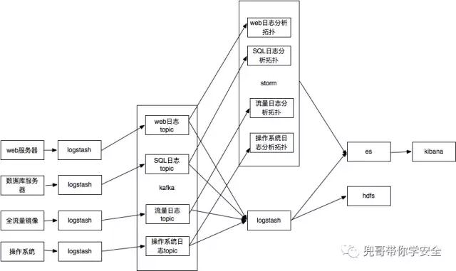
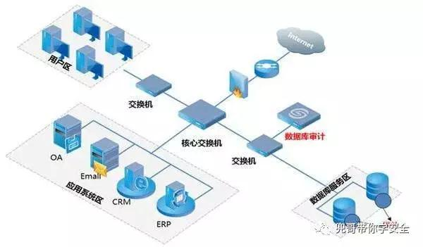
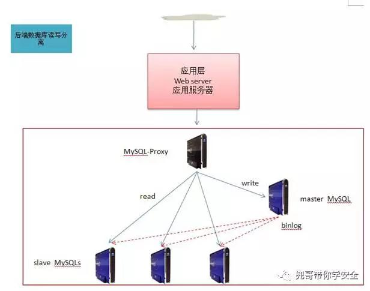
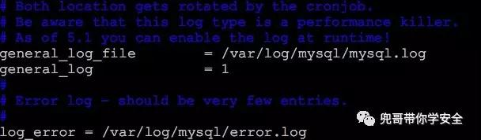
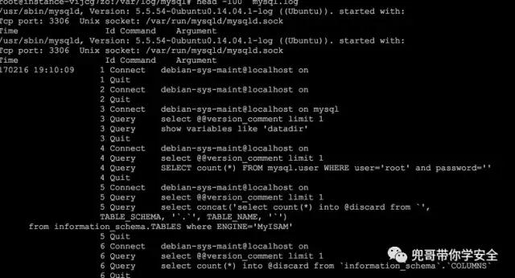
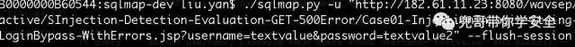
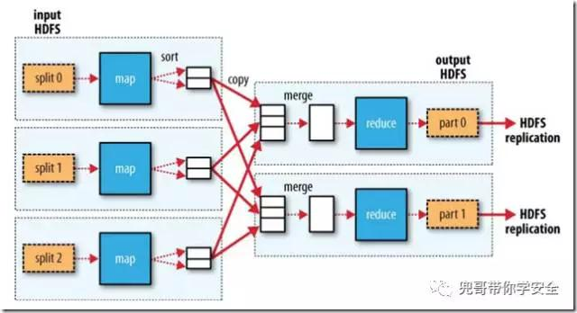

原文 by [兜哥](http://mp.weixin.qq.com/s/u1pblACvBdGLxOl9_0X8Dw0)  

## 前言
SIEM（security information and event management），顾名思义就是针对安全信息和事件的管理系统，针对大多数企业是不便宜的安全系统，本文结合作者的经验介绍如何使用开源软件离线分析数据，使用攻击建模的方式识别攻击行为。  

## 回顾系统架构
   
以数据库为例，通过logstash搜集mysql的查询日志，近实时备份到hdfs集群上，通过hadoop脚本离线分析攻击行为。  
## 数据库日志搜集
常见的数据日志搜集方式有三种：  
### 镜像方式
大多数数据库审计产品都支持这种模式，通过分析数据库流量，解码数据库协议，识别SQL预计，抽取出SQL日志  
    
### 代理方式
比较典型的就是db-proxy方式，目前百度、搜狐、美团、京东等都有相关开源产品，前端通过db-proxy访问后端的真实数据库服务器。SQL日志可以直接在db-proxy上搜集。  
    
### 客户端方式
通过在数据库服务器安装客户端搜集SQL日志，比较典型的方式就是通过logstash来搜集，本文以客户端方式进行讲解，其余方式本质上也是类似的。  

## logstash配置

### 安装  
下载logstash https://www.elastic.co/downloads/logstash  目前最新版本5.2.1版  
### 开启mysql查询日志  
    
mysql查询日志  
    
### 配置logstash
```
localhost:work maidou$ cat mysql.conf
input {
file {
type => "mysql_sql_file"
path => "/var/log/mysql/mysql.log"
start_position => "beginning"
sincedb_path => "/dev/null"
}
}
output {
kafka {        broker_list => "localhost:9092"        
		topic_id => "test"        
	compression_codec => "snappy" # string (optional)， one of ["none"， "gzip"， "snappy"]， default: "none"    }
}
```
### 运行logstash
`bin/logstash -f logstash.conf`  

### 日志举例
```
2017-02-16T23:29:00.813Z localhost 170216 19:10:15         37 Connect
debian-sys-maint@localhost on
2017-02-16T23:29:00.813Z localhost                 37 Quit
2017-02-16T23:29:00.813Z localhost                 38 Connect   debian-sys-maint@localhost on
2017-02-16T23:29:00.813Z localhost                 38 Query     SHOW VARIABLES LIKE 'pid_file'
```
### 切词
最简化操作是不用进行切词，如果喜欢自动切分出数据库名，时间等字段，请参考：    
#### grok语法
https://github.com/elastic/logstash/blob/v1.4.2/patterns/grok-patterns  
#### grok语法调试
http://grokdebug.herokuapp.com/  

### 常见攻击特征
以常见的wavsep搭建靶场环境，使用SQL扫描链接  
    
分析攻击特征，下列列举两个，更多攻击特征请大家自行总结  
#### 特征一  
```
2017-02-16T23:29:00.993Z localhost 170216 19:19:12   46 Query SELECT username, password FROM users WHERE username='textvalue' UNION ALL SELECT NULL,NULL,NULL,NULL,NULL,NULL,NULL,NULL,NULL,NULL,NULL,NULL,NULL,NULL,NULL,NULL,NULL,NULL,NULL,NULL,NULL,NULL,NULL,NULL,NULL,NULL,NULL,NULL,NULL,NULL,NULL,NULL,NULL,NULL,NULL,NULL,NULL,NULL,NULL,NULL,NULL,NULL,NULL,NULL,NULL,NULL,NULL,NULL,NULL,NULL,NULL,NULL,NULL,NULL,NULL,NULL,NULL,NULL,NULL,NULL,NULL,NULL,NULL,NULL,NULL,NULL,NULL,NULL,NULL,NULL,NULL,NULL,NULL,NULL,NULL,NULL,NULL,NULL,NULL,NULL,NULL,NULL,NULL,NULL,NULL,NULL,NULL,NULL,NULL,NULL,NULL,NULL,NULL,NULL,NULL,NULL,NULL,NULL#' AND password='textvalue2'
```
使用联合查询枚举数据时会产生大量的NULL字段  
#### 特征二、三
枚举数据库结构时会使用INFORMATION_SCHEMA，另外个别扫描器会使用GROUP BY x)a)  
```
2017-02-16T23:29:00.998Z localhost    46 Query SELECT username, password FROM users WHERE username='textvalue' AND (SELECT 7473 FROM(SELECT COUNT(*),CONCAT(0x7171716271,(SELECT (CASE WHEN (8199= 8199) THEN 1 ELSE 0 END)),0x717a627871,FLOOR(RAND(0)*2))x FROM INFORMATION_SCHEMA.PLUGINS GROUP BY x)a)-- LFpQ' AND password='textvalue2'
```
### hadoop离线处理
hadoop是基于map，reduce模型  
    
简化理解就是：  
`cat data.txt | ./map | ./reduce`  
最简化期间，我们可以只开发map程序，在map中逐行处理日志数据，匹配攻击行为。  
以perl脚本开发，python类似  
```
#!/usr/bin/perl -w
my $rule="(null,){3,}|information_schema|GROUP BY x\\)a\\)";
my $line="";
while($line=<>)
{
if( $line=~/$rule/i )
{
printf($line);
}
}
```
在hadoop下运行即可。  

### 生产环境
* 生产环境中的规则会比这复杂很多，需要你不断补充，这里只是举例  
* 单纯只编写map会有大量的重复报警，需要开发reduce用于聚合  
* 应急响应时需要知道SQL注入的是那个库，使用的是哪个账户，这个需要在logstash切割字段时补充  
* 应急响应时最好可以知道SQL注入对应的链接，这个需要将web的accesslog与SQL日志关联分析，比较成熟的方案是基于机器学习，学习出基于时间的关联矩阵  
* 客户端直接搜集SQL数据要求mysql也开启查询日志，这个对服务器性能有较大影响，我知道的大型公司以db-prxoy方式接入为主，建议可以在db-proxy上搜集。  
* 基于规则识别SQL注入存在瓶颈，虽然相对web日志层面以及流量层面有一定进步，SQL语义成为必然之路。  

## 后继
基于沙箱以及算法挖掘攻击，请见下文。  
