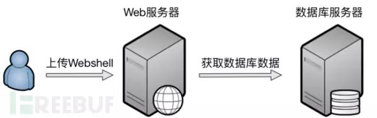
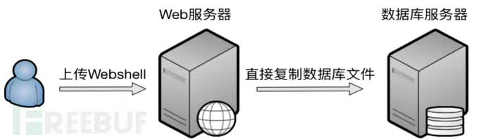
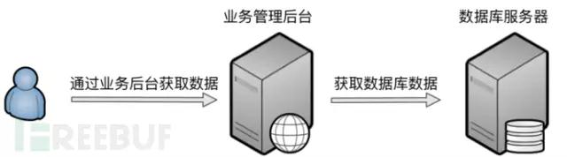
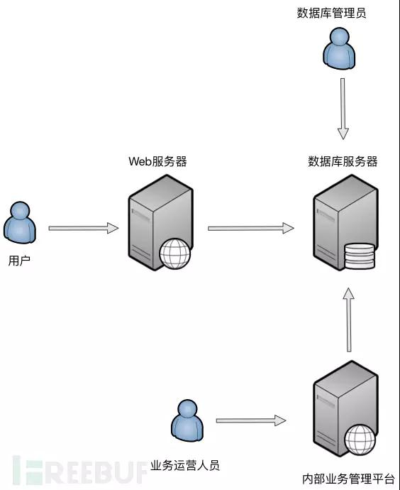
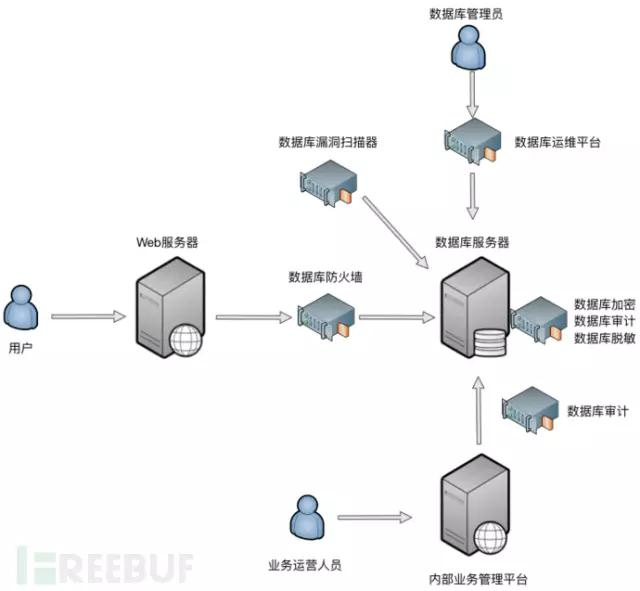
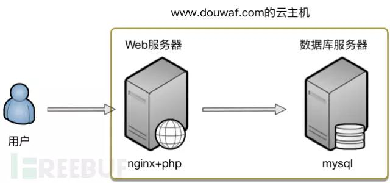
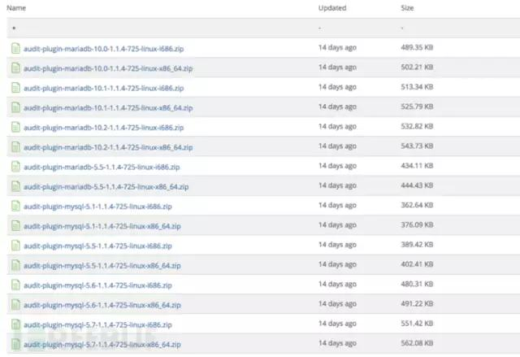
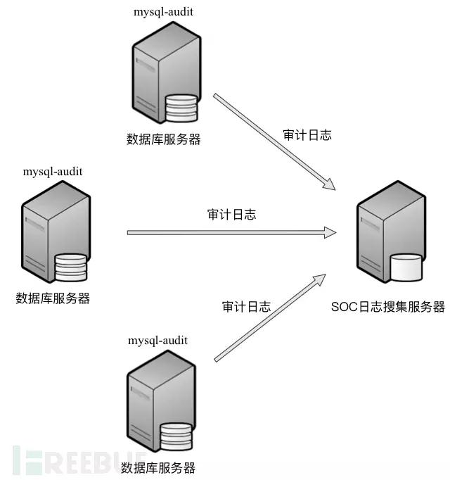
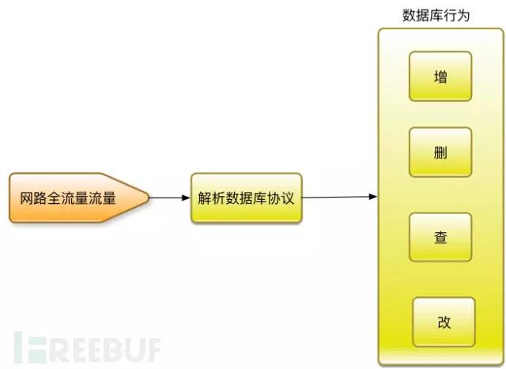
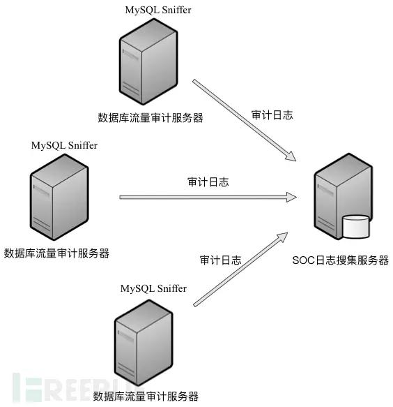

原文 by [兜哥](https://mp.weixin.qq.com/s/EZ71SU21tOa35VQayH8Hfw)  

数据库作为绝大多数互联网公司核心用户数据的存储方式，直接或者间接的成为黑客攻击的重点。伴随倒卖个人信息的黑色产业链的迅猛发展，利用Web漏洞、内外勾结等方式窃取互联网公司的个人数据用于黑市交易的事件屡见不鲜。数据库安全成为甲方安全不可回避的一个重要的工作。本章将以开源数据库MySQL为例，介绍数据库安全的基础知识以及相对完整的数据库安全纵深防御体系，最后重点介绍基于开源软件的数据库流量审计、数据库防火墙。  
## 数据库安全风险概述

在互联网公司中，数据库中大多存储着重要的个人数据，主要面临的威胁来自以下几个方面。  

### 黑客通过Web漏洞直接拖库

黑客如图10-1 所示通过SQL注入漏洞直接拖库或者如图10-2所示通过上传漏洞利用Webshell获取数据库数据，这都是常见的数据库被盗途径。还有一种方式如图10-3所示，直接把数据库文件复制走。  


  
10-1通过SQL注入漏洞直接拖库


 
10-2利用Webshell获取数据库数据


 
10-3利用Webshell等直接获取数据库文件

### 内鬼盗取数据

内鬼盗取数据通常也分为两种，一种是如图10-4所示直接通过数据库管理员权限，从数据库层面直接dump数据，还有一种如图10-5所示是通过内部的业务管理平台获取数据库数据。  


   
10-4直接从数据库层面直接dump数据


   
10-5通过内部的业务管理平台获取数据库数据

## 数据库安全概述

### 数据库安全纵深防御体系

数据库安全是个非常复杂的问题，彻底解决数据安全需要建立起一个纵深防御体系，在不同层面做不同的管控，确保万无一失。图10-6展现了相对完整的互联网公司数据库访问的全景图。  


   
10-6互联网企业的数据库访问全景图

事实上每个公司都可能有特殊情况，全景图中只能覆盖比较通用的几种数据库访问方式。为了尽量覆盖各种攻击场景，我们需要建立一个相对全面的防御体系，如图10-7所示。  

* 数据库防火墙，用于直接阻断基于数据库协议的攻击行为
* 数据库审计，审计数据库的操作行为，发现针对数据库的入侵行为以及违规操作
* 数据库运维平台，提供给数据库管理员管理数据库的平台，使管理员无法直接接触数据库服务器，全面控制、审计管理员的操作行为
* 数据库脱敏，针对流出数据库的敏感数据进行脱敏处理
* 数据库漏洞扫描，扫描数据库常见漏洞

数据库安全相关的商业产品很多，我们下面将介绍国内主要的厂商，另外我们将重点介绍针对MySQL的开源解决方案。测试环境如图10-8所示，依然使用我的douwaf网站，douwaf基于nginx+php+mysql，数据库和Web服务安装在同一台云主机上，其中数据库版本为：  
```
[root@instance-ubtsv90g bin]# ./mysql -V

./mysql.bin Ver 14.14 Distrib 5.6.36, for linux-glibc2.5 (x86_64) usingEditLine wrapper
```


   
10-7数据库安全纵深防御体系  


   
10-8测试环境拓扑图  

## 开源数据库主机端审计mysql-audit

数据库端安装审计软件，可以从最底层审计针对数据库的任何操作。全球著名安全公司Mcafee开源了一款数据库主机端审计软件mysql-audit。mysql-audit以mysql插件的形式提供，它可以完全融入MySQL服务器的运行进程中去，从底层审计针对MySQL的操作行为。  

### 下载与安装

mysql-audit对应的GitHub地址为：  

https://github.com/mcafee/mysql-audit  

可以通过源码编译直接获得最新的插件。  
```

git clone https://github.com/mcafee/mysql-audit  

cd mysql-audit/

yum install aclocal

yum install automake

yum install libtool

sh bootstrap.sh

make

./configure
```

如图10-11所示，也可以在下载页面^2直接下载对应的插件压缩包，解压，获得插件libaudit_plugin.so。  
```
unzip audit-plugin-mysql-5.6-1.1.4-725-linux-x86_64.zip

cd audit-plugin-mysql-5.6-1.1.4-725/

cd lib/
```

   

10-9 libaudit_plugin.so下载页面

mysql-audit的安装相对麻烦点，安装步骤如下。  

查看MySQL插件安装目录  
```
mysql> show global variables like ‘plugin_dir’;

+—————+——————————————–+

| Variable_name | Value |

+—————+——————————————–+

| plugin_dir | /opt/nginxstack-1.12.1-0/mysql/lib/plugin/ |

+—————+——————————————–+

1 row in set (0.00 sec)

mysql>
```

复制插件到MySQL插件安装目录
```
cp libaudit_plugin.so /opt/nginxstack-1.12.1-0/mysql/lib/plugin/

[root@instance-ubtsv90g lib]# cd/opt/nginxstack-1.12.1-0/mysql/lib/plugin/

[root@instance-ubtsv90g plugin]# ls

adt_null.so

connection_control.so

libaudit_plugin.so
```
修改my.cf配置插件  
修改my.cf，在 [mysqld] 增加如下内容  

`plugin-load=AUDIT=libaudit_plugin.so`  

执行安装插件命令  
```
mysql> INSTALL PLUGIN AUDIT SONAME ‘libaudit_plugin.so’;

Query OK, 0 rows affected (0.04 sec)

mysql>
```
查看安装效果  
```
mysql> show plugins;

| AUDIT | ACTIVE | AUDIT | libaudit_plugin.so | GPL |

查看插件版本
mysql> show global status like ‘AUDIT_version’;

+—————+———–+

| Variable_name | Value |

+—————+———–+

| Audit_version | 1.1.4-725 |

+—————+———–+

1 row in set (0.00 sec)

mysql>
```

mysql-audit支持非常丰富的配置内容，并且配置内容均集中在my.cf，完整介绍请参考官方文档^3，本章主要介绍常见配置。  

audit_json_file表明是否开启日志记录，选项为ON或者OFF。audit_json_log_file配置日志文件路径，需要是一个MySQL进程可以写的路径，测试期间可以和MySQL的日志放在一起。  
```

audit_json_file=ON

audit_json_log_file=/opt/nginxstack-1.12.1-0/mysql/data/audit.log
```

### 记录SQL语句

默认会记录MySQL运行启动以及全部SQL操作，处于性能考虑可以配置白名单用户和命令不记录。  

audit_whitelist_users  

audit_whitelist_cmds  

比如在终端查看插件安装情况。  

`mysql> show plugins;`  

日志记录内容如下：  
```
{“msg-type”:”activity”,”date”:”1501055849936″,”thread-id”:”1″,”query-id”:”3″,”user”:”root”,”priv_user”:”root”,”ip”:”",”host”:”localhost”,”connect_attrs”:{“_os”:”linux-glibc2.5″,”_client_name”:”libmysql”,”_pid”:”13616″,”_client_version”:”5.6.36″,”_platform”:”x86_64″,”program_name”:”mysql”},”pid”:”13616″,”os_user”:”root”,”appname”:”./mysql.bin”,”rows”:”43″,”cmd”:”show_plugins”,”objects”:[{"db":"information_schema","name":"/opt/nginxstack-1.12.1-0/mysql/tmp/#sql_34c8_0","obj_type":"TABLE"}],”query”:”showplugins”}
```
查看目前数据库用户名列表。  

`mysql> select * from user;`  

日志记录内容如下：  
```
{“msg-type”:”activity”,”date”:”1501056680458″,”thread-id”:”1″,”query-id”:”36″,”user”:”root”,”priv_user”:”root”,”ip”:”",”host”:”localhost”,”connect_attrs”:{“_os”:”linux-glibc2.5″,”_client_name”:”libmysql”,”_pid”:”13616″,”_client_version”:”5.6.36″,”_platform”:”x86_64″,”program_name”:”mysql”},”pid”:”13616″,”os_user”:”root”,”appname”:”./mysql.bin”,”rows”:”8″,”cmd”:”select”,”objects”:[{"db":"mysql","name":"user","obj_type":"TABLE"}],”query”:”select* from user”}
```

### 审计SQL语句

如图10-12所示可以把审计日志发送给SOC系统，在SOC系统中按照策略进行审计。关于SOC系统的介绍请参考本书第九章。  

常见的审计策略归纳如下：  

* 用户创建/删除以及权限变更
* 数据备份操作
* 高危命令执行
* 登录认证信息
* 敏感库表的访问以及备份
* 超过阈值数量的数据导出和访问


    

10-10mysql-audit把审计日志发送给SOC系统 

## 开源数据库流量审计MySQL Sniffer

我最推崇的数据库安全产品就是基于流量的数据库审计，因为它不需要更改网络结构，并且也是最关键的是，不影响数据库服务器性能，不用苦口婆心的劝数据库管理员安装监控软件。它可以比较好的发现通过Web漏洞的拖库行为，以及基于数据库通讯协议的数据库管理过程中的违规行为。本质上基于流量的数据库审计就是一种特殊的流量审计，或者说针对数据库的IDS，如图10-11所示，通过从网络全流量中解析数据库协议，进一步还原成数据库常见的增删查改操作，然后在根据预定义的规则进行审计。  


     

图10-11基于流量的数据库审计原理图  

这里介绍一款国内安全公司开源的可用于基于流量的数据库审计软件，MySQL Sniffer。MySQLSniffer是一个基于MySQL协议的抓包工具，实时抓取请求，并格式化输出。输出内容包括访问时间、访问用户、来源IP、访问 Database、命令耗时、返回数据行数、执行语句等。  

### 下载与安装

MySQL Sniffer对应的GitHub地址为：  

https://github.com/Qihoo360/mysql-sniffer  

安装方法如下所示。  
```
yum install glib2-devel libpcap-devel libnet-devel

git clone https://github.com/Qihoo360/mysql-sniffer

cd mysql-sniffer

mkdir proj

cd proj

cmake ../

cd ..

make
```

### 审计MySQL流量

MySQL Sniffer支持的常见参数如下所示。  

`Usage ./mysql-sniffer [-d] -i eth0 -p 3306,3307,3308 -l/var/log/mysql-sniffer/ -e stderr`  

由于我们Web和MySQL部署在一台机器上，所以eth0上是没有MySQL流量的，我们需要监听lo接口。  

`./mysql-sniffer -i lo -p 3306`  

使用pig账户登录MySQL。  

`./mysql -h127.0.0.1 -upig –p`  

显示审计信息如下所示。  

`2017-07-26 17:06:36 pig 127.0.0.1 NULL 0ms 1 select @@version_commentlimit 1`  

查看插件安装情况。  

`mysql> show plugins;`  

显示审计信息如下所示，其中2ms表示查询消耗时间，43表示查询返回的数据行数。  

`2017-07-26 17:10:28 pig 127.0.0.1 NULL 2ms 43 show plugins`  

查询MySQL用户详细信息。  
```
mysql> use mysql;

Reading table information for completion of table and column names

You can turn off this feature to get a quicker startup with -A

Database changed

mysql> select * from user;
```
显示审计信息如下所示。  
```
2017-07-26 17:12:32 pig 127.0.0.1 mysql 0ms 0 use mysql

2017-07-26 17:12:32 pig 127.0.0.1 mysql 0ms 5 show databases

2017-07-26 17:12:32 pig 127.0.0.1 mysql 0ms 28 show tables

2017-07-26 17:12:44 pig 127.0.0.1 mysql 1ms 8 select * from user
```
MySQL Sniffer也支持保存日志，如图10-12所示可以把日志发送给SOC系统进一步分析。  


     

图10-12MySQL Sniffer把审计日志发送给SOC系统

