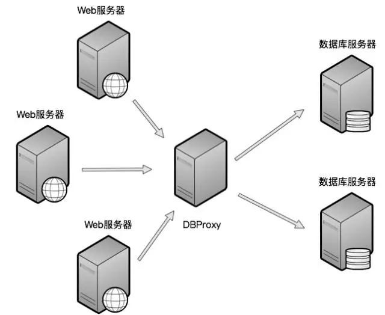

原文 by [兜哥](http://mp.weixin.qq.com/s/QhHblVConKGVxdUyYlNztQ)  

数据库作为绝大多数互联网公司核心用户数据的存储方式，直接或者间接的成为黑客攻击的重点。伴随倒卖个人信息的黑色产业链的迅猛发展，利用Web漏洞、内外勾结等方式窃取互联网公司的个人数据用于黑市交易的事件屡见不鲜。数据库安全成为甲方安全不可回避的一个重要的工作。本文将介绍数据库规模较大时，如何基于DBProxy进行数据库审计以及简单的防护。  

当数据库规模较小时，比如10台以内，可以通过镜像数据库流量或者在数据库上安装审计客户端来进行数据库操作审计以及SQL注入检测。但是当数据库规模较大时，分布式的架构下，镜像数据库流量难以实施；部署审计客户端虽然受分布式影响较小，但是说服DBA在数据库服务器上安装软件本身就是一个慢工细活。于是基于DBProxy进行数据库审计以及SQL注入检测成为一个不错的选择。所谓的DBProxy，可以理解为一个支持数据库协议的代理服务，Web前端通过DBProxy访问数据库服务器，审计和各种控制手段都是在DBProxy上进行。目前360、美团、京东和百度都有对应的解决方案，本文以美团开源的DBProxy为例介绍相关使用，有兴趣的同学也可以搜索其他公司的DDBProxy方案。  
  


本文介绍的DBProxy在美团点评广泛应用，开源和内部使用保持一致。目前只支持MySQL 5.5和5.6，DBProxy其主要功能[1]：  
* 读写分离
* 从库负载均衡
* IP过滤
* 分表
* DBA可平滑上下线DB
* 自动摘除宕机的DB
* 监控信息完备
* SQL审计与过滤

其中可以作为数据库防火墙功能使用的是IP过滤和SQL审计与过滤。

### 下载与安装
DBProxy对应的GitHub地址为： 
https://github.com/Meituan-Dianping/DBProxy 
安装方法如下所示。  
```
yum install -y Percona-Server-devel-55.x86_64Percona-Server-client-55.x86_64 Percona-Server-shared-55  jemalloc jemalloc-devel libeventlibevent-devel openssl openssl-devel lua lua-devel bison flex libtool.x86_64libffi-devel libffi glib2.x86_64 glib2-devel.x86_64 glib2-fam.x86_64 git
git clonehttps://github.com/Meituan-Dianping/DBProxy.git
cd DBProxy/
sh autogen.sh
./configure --prefix=/home/maidou/opt/DBProxy --enable-maintainer-mode
make
make install
```
### 配置
为了演示方便，我们继续在我的www.douwaf.com的云主机上测试。拓扑结构如下所示，DBProxy监听本地的3307端口，真实数据库服务MySQL监听3306端口，Web服务器以及数据库管理员均通过DBProxy访问数据库服务。  
    

1)       创建配置文件目录和日志目录  
```
cd /home/maidou/opt/DBProxy/
mkdir log conf
cp /home/maidou/DBProxy/script/source.cnf.samplesconf/douwaf.cnf
```
2)       编辑配置文件  
DBProxy的配置文件默认为conf/start.cnf，DBProxy启动时根据实例名称加载对应的配置文件，比如本例中实例名称为douwaf，DBProxy启动时会自动加载配置文件conf/douwaf.cnf。DBProxy可以配置的内容比较多，我们这里介绍几个常见的配置内容。  
l  后端连接的MySQL主库的IP和端口，可设置多项，用逗号分隔  
`proxy-backend-addresses=127.0.0.1:3306`  
l  连接数据库服务的用户名与其对应的加密过的MySQL密码，密码使用PREFIX/bin目录下的加密程序encrypt加密。  
`pwds=pig:7O7YJJEK`  
l  设置运行方式，设为true时为守护进程方式，设为false时为前台方式，一般开发调试时设为false，线上运行时设为true  
`daemon=false`  
l  日志存放的路径  
`log-path=/home/maidou/opt/DBProxy/log`  
l  实例名称，用于同一台机器上多个dbproxy实例间的区分  
`instance=douwaf`  
l  监听的工作接口IP和端口  
`proxy-address=0.0.0.0:3307`  
l  后台MySQL版本号，默认为5.5，我们的环境是5.6  
`mysql-version=5.6`  

### 启动服务
DBProxy提供了启动脚本，文件路径为bin/mysql-proxyd，编辑启动脚本，设置需要根据具体情况配置的环境变量，主要需要配置的就是安装路径。
`proxydir=/home/maidou/opt/DBProxy/`  
启动DBProxy服务，调试阶段强烈建议使用终端运行模式，正式运行使用后台运行模式。  
`bin/mysql-proxyd douwaf start`  

### 案例：使用DBProxy审计SQL语句  
测试期间，我们使用MySQL命令行模拟Web程序访问MySQL。  
1)       直接访问数据库  
通过3306端口直接连接数据库，默认使用root账户登录。  
```
./mysql -h127.0.0.1 --port 3306 -p
Enter password:
Welcome to the MySQL monitor.  Commands end with ; or \g.
Your MySQL connection id is 125
Server version: 5.6.36 MySQL Community Server (GPL)
```
查询全部数据库实例名称。
```  
mysql> show databases;
+--------------------+
| Database          |
+--------------------+
| information_schema |
| kippo             |
| mysql             |
| performance_schema |
| test              |
| wordpress         |
+--------------------+
6 rows in set (0.01 sec)
```
2)       通过DBProxy访问数据库  
通过3307端口直接连接数据库，发现root账户已经无法登录。  
```
[root@instance-ubtsv90g bin]# ./mysql -h127.0.0.1--port 3307 -p
Enter password:
ERROR 1045 (28000): Access denied for user'root'@'127.0.0.1' (using password: YES)
```
使用DBProxy上配置的pig账户连接DBProxy，连接成功，细心的同学估计会发现，回显的数据库版本为5.6.22-71.0-log，而我们真实MySQL是5.6.36。 
```
[root@instance-ubtsv90g bin]# ./mysql -upig   -h127.0.0.1 --port 3307 -p
Enter password:
Welcome to the MySQL monitor.  Commands end with ; or \g.
Your MySQL connection id is 2
Server version: 5.6.22-71.0-log MySQL CommunityServer (GPL)
Copyright (c) 2000, 2017, Oracle and/or itsaffiliates. All rights reserved.
```
查询全部数据库实例名称，与直接连接数据库查询的内容一致。  
```
mysql> show databases;
+--------------------+
| Database          |
+--------------------+
| information_schema |
| kippo             |
| mysql             |
| performance_schema |
| test              |
| wordpress         |
+--------------------+
6 rows in set (0.01 sec)
```
查看DBProxy douwaf实例的连接日志douwaf.log，记录下了root和pig账户的登录情况。  
```
2017-07-28 10:22:48.707429:(warning)proxy-plugin.c:1188(proxy_read_auth) event_thread(1) C:127.0.0.1:51766S:127.0.0.1:3307(thread_id:0) Usr:root Db: Access denied for user'root'@'127.0.0.1' (using password: YES)
2017-07-28 10:22:48.707487: (warning)network-mysqld.c:1647(network_mysqld_con_handle):event_thread(1) C:127.0.0.1:51766 C_usr:root CON_STATE_READ_AUTH process authpacket failed
2017-07-28 10:23:05.162088:(message)network-conn-pool-lua.c:425(self_connect): event_thread(2)C:127.0.0.1:51788 C_usr:pig C_db: S:127.0.0.1:3306(thread_id:292) createbackend connection success
```
查看DBProxy douwaf实例的SQL审计日志sql_douwaf.log，记录下了相应的查询行为。  
```
[root@instance-ubtsv90g sql]# tail -fsql_douwaf.log
2017-07-28 10:23:05.164223: C_begin:2017-07-2810:23:05.161541 C:127.0.0.1:51788 C_db: C_usr:pigS:127.0.0.1:3306(thread_id:292) S_db: S_usr:pig inj(type:4 bytes:33 rows:1)2.612(ms) OK Query:select @@version_comment limit 1
2017-07-28 10:26:49.353570: C_begin:2017-07-2810:26:49.352848 C:127.0.0.1:51788 C_db: C_usr:pig S:127.0.0.1:3306(thread_id:292)S_db: S_usr:pig inj(type:4 bytes:89 rows:6) 0.639(ms) OK Query:show databases
```

### 案例：使用DBProxy进行SQL过滤  
DBProxy本身的功能是做数据库代理，透明实现读写分析，主从负载，之所以我们也使用它作为数据库防火墙，主要就是因为它强大的SQL过滤功能。配置文件中与SQL过滤功能相关的功能如下所示。  
```
#设置黑名单文件所在的路径
blacklist-file=/home/maidou/opt/DBProxy/conf/sqlblacklist.conf 
#设置手动添加的拦截语句是否生效，默认是不生效 ON:生效 OFF:不生效                                               
manual-filter-flag=ON                
#设置自动添加的拦截语句是否生效，默认是不生效 ON:生效 OFF:不生效 
auto-filter-flag=OFF   
```                 
测试期间，我们假设要限制使用命令show databases，编辑sqlblacklist.conf文件，其中blacklist_0表示规则的序列号，filter表示限制的SQL语句，is_enabled表示是否是能，1为使能，0为不使能。  
```
[blacklist_0]
filter=show databases
is_enabled=1
```
使用DBProxy上配置的pig账户连接DBProxy。  
```
[root@instance-ubtsv90g bin]# ./mysql -upig   -h127.0.0.1 --port 3307 -p
Enter password:
Welcome to the MySQL monitor.  Commands end with ; or \g.
Your MySQL connection id is 2
Server version: 5.6.22-71.0-log MySQL CommunityServer (GPL)
Copyright (c) 2000, 2017, Oracle and/or itsaffiliates. All rights reserved.
```
查询全部数据库实例名称，查询失败，我们的过滤策略生效。  
```
mysql> show databases;
ERROR 1105 (07000): Proxy Warning - BlacklistForbidden
mysql>
```
查看DBProxy douwaf实例的连接日志douwaf.log，记录下了SQL过滤的日志。  
```
2017-07-28 11:33:04.143579:(warning)proxy-plugin.c:4103(filter_pre)event_thread(1) C:127.0.0.1:53206Query:show databases fobidden by filter:show databases
2017-07-28 11:33:04.143641:(critical)proxy-plugin.c:2137(proxy_read_query) event_thread(1)C:127.0.0.1:53206 S:127.0.0.1:3307(thread_id:0) Usr:pig Db: Proxy Warning -Blacklist Forbidden
``` 
通过3306端口直接连接数据库，默认使用root账户登录。  
```
./mysql -h127.0.0.1 --port 3306 -p
Enter password:
Welcome to the MySQL monitor.  Commands end with ; or \g.
Your MySQL connection id is 125
Server version: 5.6.36 MySQL Community Server (GPL)
```
查询全部数据库实例名称，命令正常执行。  
```
mysql> show databases;
+--------------------+
| Database          |
+--------------------+
| information_schema |
| kippo             |
| mysql             |
| performance_schema |
| test              |
| wordpress         |
+--------------------+
6 rows in set (0.01 sec)
```
## Reference
[1] http://www.cnblogs.com/olinux/p/6626347.html  
[2] https://github.com/Meituan-Dianping/DBProxy/blob/master/doc/USER_GUIDE.md#3.1.1  
[3] https://github.com/Meituan-Dianping/DBProxy/blob/master/doc/USER_GUIDE.md#3.1.1  