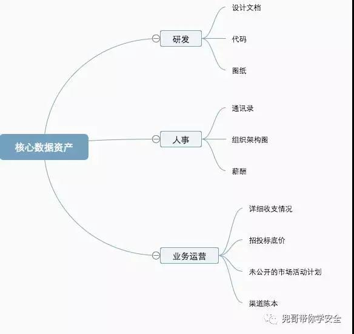
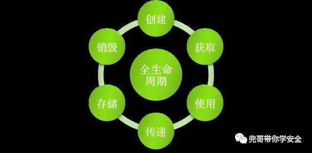
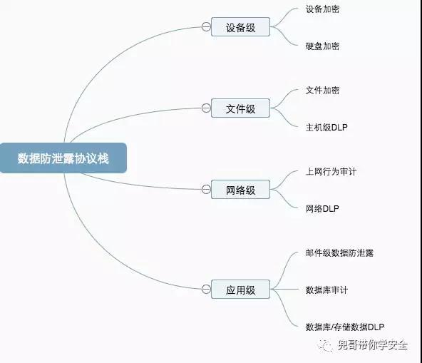

原文 by [兜哥](http://mp.weixin.qq.com/s/vbTxrkLXu1ES4mqetNuY_Q) 

## 前言
数据防泄露在每个公司都是很头疼的事情，大大小小的泄露事件也总是不期而至。本文结合我的使用经验从使用的层面介绍常见的数据防泄露技术手段。  
## 核心数据资产的定义
数据防泄露是一个非常复杂的工程，投入再多人力也不为过，但是互联网公司的安全人力多是非常有限，所以大蛇打七寸，我们需要先定义清楚什么是核心数据资产。通常理解会包含以下几大类：  
  
以上只是举例，具体公司情况都不太一样，需要结合自生实际。比如招聘类公司，简历就是十分重要的资产。  
## 数据保护的生命周期
数据防泄露需要针对定义的核心数据的全生命周期进行保护。  
  
数据防泄露的协议栈为：  
    
这并非一个严格的划分，只是便于把不同的数据防泄露产品和方案进行划分。  

## 设备级
### 0x01设备加密
设备防丢失，主要是预防设备丢失后造成的数据泄露，最常见的就是U盘等移动存储，京东上一搜一大片。  
密码保护的、指纹保护的都有。    

虽然保护方式不一样，但是底层数据加密基本都是AES128或者256，可以提高设备丢失后数据泄漏的门槛，对于高手来说还是可以搞定的。  
对于硬盘，也有一些解决方案。    
硬盘密码：  可以在bios里面设置硬盘密码，这样每次开机都需要输入硬盘密码。    

### 0x02硬盘加密
mac自带的硬盘加密  
硬盘加密技术非常成熟了，商用产品非常多，不得不提的还有truecrypt，据说国内安全传统四强之一就要求员工用这个。    

truecrypt同时支持Windows Vista,7/XP, Mac OS X, Linux 等操作系统。TrueCrypt不需要生成任何文件即可在硬盘上建立虚拟磁盘，大家可以按照盘符进行访问，所有虚拟磁盘上的文件都被自动加密，需要通过密码来进行访问。TrueCrypt 提供多种加密算法，包括：AES-256, Blowfish (448-bit key), CAST5, Serpent, Triple DES, and Twofish，其他特性还有支持FAT32和NTFS分区、隐藏卷标、热键启动等，最关键它免费。    

### 0x03移动设备数据擦除
微软邮件系统自带一个十分强悍的功能，对于配置接受公司exchange邮件的移动终端，可以通过登录OWA页面直接远程擦除整个设备的内容并完全恢复设备出厂化配置。    

    
## 文件级 
### 0x01文件加密
文件加密产品目前国内产品就非常强悍了，一搜一大把，我这里介绍一款微软提供的免费文件加密产品RMS。RMS跟微软的AD集成，可以针对邮件组进行授权读写打印权限控制，坦率讲针对微软的文件类型支持挺不错，比如word  电子表格 ppt等，而且还有mac版，不过对于非微软等文件类型就比较遗憾了，不过满足正常办公需要基本够用，最强悍的是与邮件系统的集成，可以在发邮件的时候直接设置哪些邮件组的人才能看（收件人和可以加密看邮件的人恨可能是子集关系）。    
### 0x02端点级DLP
本质上是网络级DLP的端点级实现，支持拦截功能。   

## 网络级
### 0x01网络DLP
狭义的数据防泄漏产品就是指网络DLP，这是一个经久不衰的安全领域。

网络级DLP的未来趋势是与云访问安全代理 (CASB) 功能集成，将敏感数据的发现范围进一步扩大到云应用程序。  
扩展了 DLP 覆盖范围到云应用程序中的内容，包括 Office 365、Box、Dropbox、Google Apps 或 Salesforce  
利用全部的 CASB 功能，持续监控云应用程序中内容的增加、修改和访问权限  

## 应用级
应用级DLP主要是指邮件DLP，本质上是扫描邮件的内容和附件，与设定的数据安全策略匹配，这里就不展开了。 

## 总结
数据防泄漏是个非常复杂的系统工程，任何技术手段都不能确保不备绕过，必要的技术手段可以提高门槛，最后的落地强依赖于公司相关数据安全管理策略的执行，常说的七分管理三分技术在这里非常何时。  