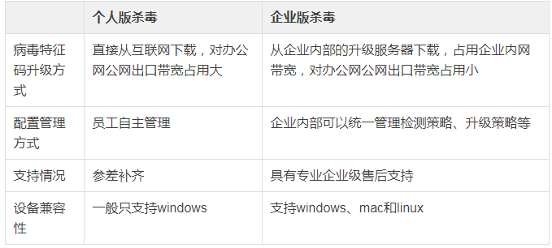
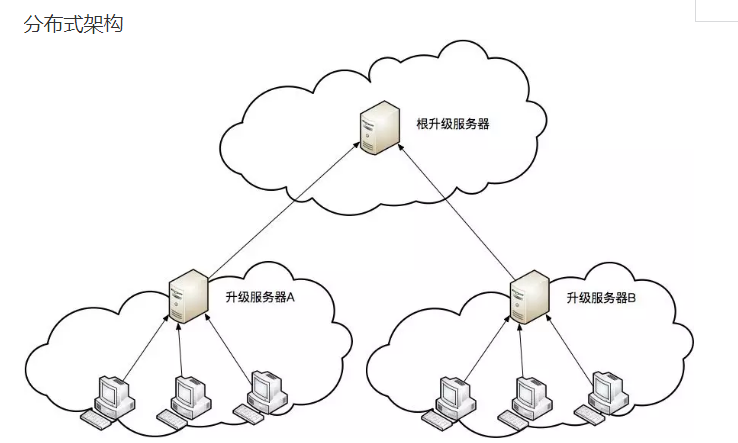

2007年一款名为熊猫烧香的病毒肆虐互联网，它主要通过下载的文件传染，是一款拥有自动传播、自动感染硬盘能力和强大的破坏能力的病毒，它不但能感染系统中exe，com，pif，src，html，asp等文件，它还能中止大量的反病毒软件进程并且会删除GHOST的备份文件。熊猫烧香在办公网也大肆传播，造成了大量企业数据损坏且无法恢复。当时相当一部分办公终端没有安装杀毒，所以虽然杀毒软件很快就通过升级病毒库具备了查杀熊猫烧香的能力，但是熊猫烧香依然传播了很长时间。部署终端杀毒是办公网安全中非常基础的一个防护手段。终端杀毒可以给办公终端提供基础的病毒木马查杀能力，当发生大面积传染的蠕虫病毒时，终端杀毒几乎是唯一的查杀手段。终端杀毒通常使用都是免费或者商业解决方案。  

## 个人版杀毒和企业版杀毒的区别
终端杀毒通常可以区分为个人版和企业版，两者的主要区别在企业级管理上。  
  
（个人版和网络版杀毒区别）  
## 选择企业版杀毒的注意事项  
企业级杀毒的详细功能非常多，下面将介绍选择企业级杀毒中需要特别重视的几点。  
### 准确率和召回率
杀毒软件的基本功能就是病毒查杀，需要重点考核的就是准确率和召回率，常见的检测方式就是在互联网上搜集常见的病毒样本和常见的办公软件进行测试，实际使用中这两个指标都非常重要，如果非要二选一的话，企业网更看重准确率，毕竟狼来了喊多了就没有权威性了。这块也可以参考比较权威的评测机构的数据，比如AV-Comparatives、AV-TEST、WestCoastLabs和Virus Bulletin。  
1. AV-Comparatives
AV-Comparatives是一家国际性独立测试机构，于2003年成立，测试报告详细，等级分明。AV-Comparatives每年4个季度会更新报告，给通过AV-Comparatives测试的杀毒软件授予认证。AV-Comparatives提供一个4个级别的认证系统：TESTED, STANDARD, ADVANCED 和ADVANCED+。AV-Comparatives本着公平公正的原则，所有测试项目均不接受任何赞助，一直保持着良好的信誉。参加测试门槛很高。只有高水准的反病毒软件才可以参加AV-Comparatives的常规测试，加入其测试,需要产品的病毒检测率在很长一段时间保持在世界前18位;测试过程十分严谨。具有高病毒检出率，拥有自己的或者是得到许可的引擎，保证在指定的时间，在最高安全配置下不发生重大错误完成对整个数据库的扫描。  
2. AV-TEST
AV-TEST总部位于德国马德堡，成立至已有近20年历史，AV-Test测试是世界权威的第三方独立测试之一，一直以海量病毒库检测、独立客观的检测过程和严格的标准著称，是业界公认的世界级杀软的对决平台。AV-TEST测试完全基于病毒样本库自动进行，最大限度的减少了人为因素对测试结果的影响，其测试结果被国际安全业界公认为独立客观。  
3. WestCoastLabs
WestCoastLabs 的Checkmark认证始于1996年，是国际上信息安全类产品的最高认证之一。发展到今天，其认证标准已被全球认可为最值得信赖的指标之一。WestCoastLabs的权威认证，包括Checkmark一级(Level1)、二级(Level2)和木马(Trojan) 三项内容，其中木马认证要求最高。Checkmark木马认证要求被评测的产品能够100%查出西海岸实验室所有测试木马样本，并且扫描误报测试专用样本时的误报率为0。全球范围内的安全专业人士都相信持有Checkmark证书的任何信息安全产品。认证的通过意味着杀毒软件的品质得到国际权威检测机构的认可，其核心技术达到了世界一流水平。其严格的测试程序充分表明了Checkmark认证专业性和权威性。  
4. Virus Bulletin
Virus Bulletin1989 年于英国成立。Virus Bulletin 其中一个最大成就，就是提出VB100认证，以独立公正而严谨的态度，定期对各大防毒品牌产品进行测试，其报告备受全世界防毒业界所公认与推崇。VB100认证开设于1998年，距今已有10多年的历史，发展至今，已成为了全球性反病毒产品的金牌认证。Virus Bulletin是最严格，历史最悠久，可以称为杀毒软件认证中的“奥斯卡”。非商业性组织，不收取任何费用，不受任何非技术性因素的影响;Virus Bulletin于1989年成立，至今已有20年历史。从上个世纪90年代开始，VB100测试就广泛被业界所认识接受。很多国际、国内上知名的杀毒软件厂商都有曾被斩落马下的历史，由于所有参评厂商的成绩都会公开发布，所以缺乏信心的厂商一般都望而却步;测试过程极其严格，Virus Bulletin要求参加该认证的反病毒产品必须完全杀除"WildList(最大病毒库)"里登记的所有病毒样本，诊断率100%、误诊率0%，并在扫描过程中没有任何误判情况。在Virus Bulletin看来只有两个结果：通过或者不通过。  

### 性能
杀毒软件进行文件扫描的时候非常消耗性能，尤其是CPU、内存和磁盘IO这三个指标。测试阶段要非常重视这三个指标，目前SSD硬盘尚未完全普及，对磁盘IO的消耗要格外重视。  
### 黑白名单
杀毒软件的黑白名单管理非常重要，至少需要支持文件名和文件夹，而且需要支持正则。在企业环境，容易遇到某些办公软件误报或者与杀毒不兼容的情况，这个可以通过添加白名单暂时规避。  
### 分组与升级
企业内网环境下，终端杀毒软件升级病毒库需要从内网的升级服务器下载。虽然这种机制可以有效减少企业网出口的带宽压力，可以充分利用企业内网相对充裕的带宽资源，但是在部分环境下也会带来意想不到的麻烦。比如大型企业环境下，分支机构通过专线访问总部资源，如果也从总部同步病毒库，非常容易堵塞专线带宽。这个时候就需要合理对终端杀毒客户端进行分组，分布式部署升级服务器，保证杀毒客户端可以从最近的升级服务器进行病毒库同步。  
### 病毒文件的隔离与恢复
正常文件被识别为病毒虽然是一个小概率事件，但是一旦发生并且文件不能恢复，很可能带来无法弥补的损失。因此终端杀毒必须具备病毒隔离和恢复的功能，这点非常实用。  
### 报表以及SIEM集成
企业级杀毒软件的报表功能，有利于管理员迅速掌握整个企业办公终端的安全状况，需要支持按照不同分组、不同时间、不同病毒类型跨度查看病毒感染情况，并能定期以邮件形式发送报告。另外，杀毒终端也是非常重要的一个数据搜集源，可以作为SIEM系统的数据源。  
## 典型部署架构
### 集中式架构
    
（集中式部署架构）    
当办公区域高度集中或者专线带宽非常充裕时，可以选择使用集中式架构，全部杀毒终端从同一台升级服务器同步最新病毒库。  
### 分布式架构
   
（分布式部署架构）    
当办公区分散或者有大量分支机构需要接入时，需要使用分布式架构，典型的方式是在总部部署根升级服务器，然后各个办公区或者分支机构部署各自的升级服务器，各升级服务器统一从根升级服务器同步病毒库，杀毒终端从各自办公区的升级服务器同步病毒库。升级服务器性能消耗主要集中在磁盘IO、内存和带宽。  
## 参考文献
http://all.aqniu.com/index.php?m=yp&c=index&a=list_company&catid=298  
http://news.sina.com.cn/c/l/p/2007-03-03/002212414259.shtml  
http://www.newhua.com/2010/1216/111109.shtml  
http://finance.chinanews.com/it/2015/03-25/7158518.shtml  