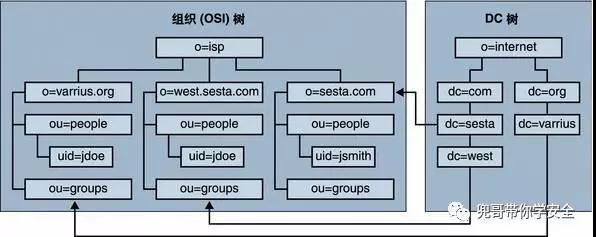
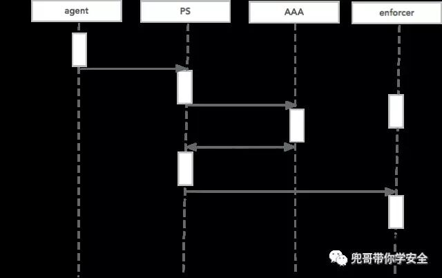

原文 by [兜哥](http://mp.weixin.qq.com/s/MzF0Bsjo6zWSjAurCqJxXg)  

## 摘要
本文介绍了下自建准入系统的经历，该系统在某互联网公司稳定运行了5年。  

## 准入系统简介
网络准入控制 (NAC) 是一项由思科发起、多家厂商参加的计划，其宗旨是防止病毒和蠕虫等新兴黑客技术对企业安全造成危害。借助NAC，企业可以只允许合法的、值得信任的终端设备（例如PC、服务器、PDA）接入网络，而不允许其它设备接入。  
## 亡羊补牢
互联网公司除了美国上市基本就没有安全合规压力，一切以业务发展和工作效率为第一驱动力，所以费钱费人力的安全的建设主要依赖事件驱动，我们上准入前就遇到这么几个倒霉事：  
* 办公网大量PC杀毒被员工卸载，又没及时打补丁，结果中了当时都觉得非常low的arp病毒，几层办公区网断了，影响了小一千RD开发。  
* 愤青小员工发帖，叔叔上门查水表，我们差点没查出是谁。  

## 痛点
基于历史教训，我们上准入系统想解决的痛点简单归纳就是：  
* 身份认证：wifi和有线接入到情况下能设备／IP与人绑定，调查安全事件可以定位到人
* 权限限制：不同职能的人群网络权限不一样，权限最小化
* 安全加固：满足公司安全基线要求的设备才能接入内网，没装杀毒没打补丁就禁止接入

这上面任何一个问题，其实都有别的解决方案，例如绑定mac之类，但是当时我们北京四个楼，两千RD，大量使用wifi移动办公，有线网络有的大楼接入都是傻hub，有的是华三31，有的是思科29，目测也就上准入才能搞定了。  
## 三人行必有我师

语文老师说三人行必有我师，历史老师说师夷长技以制夷，总之我们根据当时gartner的排名，调研了国外几家准入厂商的产品，总结了下它们的优点：  
* 认证授权与微软域SSO集成
* 有线无线切换时自动认证
* 网络控制在三层减少对网络基础设施的依赖

## 系统架构
初步评估了下，感觉两个人干半年可以搞定，于是我们开工了。整个系统分为以下组件：  
PS：策略服务器，负责用户认证，权限下发  
AAA：3A服务器，存储用户信息，这里就是微软的AD域控  
enforcer：执行器，负责控制网络权限  
agent：客户端程序，安装了办公PC上，负责上传用户认证信息，执行主机检查策略  
下图是个简化的网络拓扑层，其中接入层基本就是一个C段。接入层交换机器，enforcer，聚合层交换机，核心交换机直接跑三层，走OSPF。   
  


## 权限模型
权限模型是个非常基础但是非常重要的模型。我们先来看下公司的组织模型：  
   
员工的网络权限往往和他的工作内容相关，对应的就是部门属性，所以最简化的模型就是直接从组织模型转化，用户对应到不同的角色，角色对应一个或者多个部门。角色的定义就是具有相同网络访问权限的员工的集合。对应的微软域控也是这种层次结构：uid对应用户名，ou对应部门  
   

## 准入流程
简化的准入流程如下：  
   
其中主机安全合规检测在认证之前，不满足主机安全策略的连认证都不会发起。  

## 主机检查策略
主机检测策略需要结合公司实际情况，我简单描述下比较通用的几个：  
   
强烈建议PC都加入域，这样主机检查可以非常简化，大量的安全加固策略可以通过域的组策略强制下发给终端。  

## 性能
整个系统的性能瓶颈其实是在enforcer上，enforcer需要承载数十万级别的ACL策略，传统的iptable根本无济于事。假设一个enforcer下面挂了四个C段，近一千台终端，每个终端ACL规则100条，那么需要承载的ACL总量就是10万，iptables在acl达100-200条时转发性能就下降50%了。推荐一个开源项目 http://www.hipac.org/  
安装过程也非常简单，使用 `Linux 2.6.x kernel sources between 2.6.11 and 2.6.13`
```  
cd /usr/src/linux
patch -p1 -F3 < /usr/src/nf-hipac-0.9.1/nf-hipac-0.9.1.patch
make install PREFIX=/usr/local IPT_LIB_DIR=/lib/iptables
```
nf-hipac提供了命令行工具nf-hipac，语法格式与iptable兼容，拿个例子看就懂了，比如，只要是来自于172.16.0.0/16网段的都允许访问我本机的172.16.100.1的SSHD服务，iptable的命令为：  
```
iptables -t filter -A INPUT -s 172.16.0.0/16 -d 172.16.100.1 -p tcp --dport 22 -j ACCEPT
iptables -t filter -A OUTPUT -s 172.16.100.1 -d 172.16.0.0/16 -p tcp --dport 22 -j ACCEPT
iptables -P INPUT DROP
iptables -P OUTPUT DROP
iptables -P FORWARD DROP
```
你只需要开发一个linux下的守护进程，接受PS下发指令，翻译成对应的shell命令执行即可。  
iptable使用链式过滤所以性能伴随规则增加而迅速下降，nf-hipac使用的是树结构，性能不会因为规则增加而迅速下降，我们参考网站性能测试环境如下：  

配置为：  
```
AMD Thunderbird 1.333 Ghz
512 MB DDR Ram CL2
Debian woody system with 2.4.18 kernel (kernel optimized for athlon arch)
100 MBit full duplex direct connection to the packet generating computer via crossover cable
only absolutely necessary processes running
```
网站上测试的性能结果为：25600条规则，28 bytes字节报文可以打到100M全双工线速。我们当时实际测试使用的dell 2950，128字节，100w条规则可以打到1个G线速。  