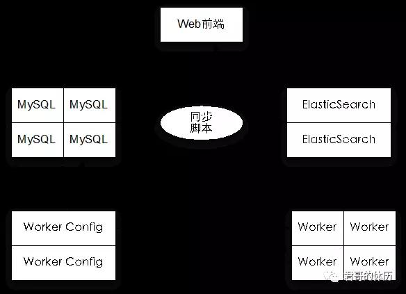

原文 by [聂君](http://mp.weixin.qq.com/s/_6jpR74JShWdCQl0sIKfdQ)  

按：本文为热心读者xysky投稿，授权“君哥的体历”公众号转载。

## 一、问题分析
 
APT（AdvancedPersistent Threat），搞安全的同学肯定对这个概念不会陌生，但都会存在一些侥幸心理，不会发生在自己身上。笔者想说的是，既然是Advance，肯定不那么容易被发现。笔者曾有幸参与过某大型公司一起APT攻击事件的调查与分析工作，通过将各种安全事件回溯，初步定位最源头的机器。在该机器上，我们发现有系统刚安装时(2009年)就种下的木马文件以及后面多次升级后的新文件。通过分析及网上搜索资料，发现该木马后门曾经在2012年初被某杀毒厂商发现过，后面该木马不断进行升级改造，在该公司的某台不重要的服务器上潜伏长达N年都未被杀毒软件发现，直到最近才有动作才被分析出来。有趣的是，我们发现案发前天晚上，木马作者将编译好的木马文件还上传到国外某多杀毒引擎网站进行过一次测试。事后该公司还联系外部某安全公司（这家公司非常低调，不写名字了）进行了更深入的分析，入侵了被对方控制的某台服务器，发现还有不少公司被这个团队持续控制中。由于其它方面比较复杂的原因，我们也不方便透露太多细节。笔者想说的是，APT离我们并不遥远。  
 
针对APT的防护，说到底，其实是资源的比拼。舍得在安全上投入人力、物力、财力，才能把安全做好。而现实是，在企业做安全的朋友们更多的是想快速出成绩，而搞APT防护是最不容易出成绩的。华为公司在防护APT方面投入了大量资源，其不少思路值得我们学习。今天我要讲的是一套定制开发的安全客户端系统在某金融企业APT防护中的一些应用。  
 
## 二、思路探讨
 
APT攻击难防，因为黑客能用的招太多了，系统漏洞、业务漏洞、社会工程等等，得先有个优先级，孰轻孰重得仔细掂量掂量，先得找出该金融企业哪些是最重要的资产？这些资产在那儿？怎么访问共享这些资产？那些访问途径是正常的？都是通过那些程序访问，哪些是正常哪些是不正常？  
 
定制的木马文件依靠传统的杀毒软件是无法发现的，有没有其它方法？文件，可执行文件，总得在机器上保存或者执行吧？可否通过黑白名单库来实现？被控制或者控制总会有网络流量吧？可否通过网络异常访问来发现？一般进来之后都会在本地翻翻看有没价值的文件，然后再探测一下其它机器，这中间我们可以做什么？放置一些文件诱惑别人？部署密灌或IPS？在我们发现的真实案例中，还有我们常见的自动扫描弱口令产生的windows安全事件。收集这些信息到SOC平台统一关联告警处理？恩，我们得控制终端，在终端上有自己的程序，才能最接近攻击发生的地方，于是我们定制开发了自己的安全客户端系统，并进行大面积实施，内部称之为“天眼”项目。  
 
## 三、设计与实现
 
通过在Windows、Linux机器上部署自行开发的安全客户端，实现对系统层行为的实时监控，并通过SOC安全总控中心进行关联分析和报警处理，安全客户端能够接收和响应来自SOC平台的安全控制指令，执行相关安全处理操作。　  　
 
### 1.APT方向：
 
服务端的安全监测，进程、注册表、用户、驱动等的安全监测（该功能适用于服务器部署）；  
 可执行文件、Dll等的黑白名单检测（其它企业也在尝试做，可以尝试与腾讯、360合作共享）；   
  异常行为的监测（如访问重点服务器的特殊端口，非白IP列表访问特定服务器等），异常连入连出等；  
 利用蜜罐技术做些陷阱（蜜文件、蜜网站、蜜FTP等），锁定可疑人员。  
 
### 2.数据安全方面：
 
 敏感数据扫描和发现功能。根据预先定义的敏感数据规则和定义，自动在后台上进行周期性扫描，能否发现符合规则和定义的敏感数据，发现内容包括文件名，规则名、IP地址、主机名等详细信息。  
特定文件定位功能。能够对指定的文件进行定向搜索和定位，确定该文件在哪些电脑上进行存储。  
外发监控，对外发渠道进行监控。  
实现自动抓屏功能。  
 
### 3.架构
 
设计之初，我们考虑以下几个因素：  
 
异构终端数据的信息上报：包括Win客户端、Win服务器、Linux服务器、蜜罐系统等具备不同安全属性与策略的上报程序；  
海量日志的快速关联检索能力：日志量的增长必然会让普通关系数据库无法快速检索；  
 前端日志上报的负载均衡架构：极端情况下，同时上报数据的终端可能会有数万个，什么样的架构可以支撑(lvs、nginx、mysql分表、读写分离等各种技术)？  
客户端不影响工作：每个用户都要安装客户端，如果不稳定，这个项目将很难推广下去。  
 

  
安全客户端系统架构图

 简要说明如下：  

Worker：各种异构终端，用于产生、采集日志；  
Worker Config：对各种终端进行配置的服务器，这些配置服务器可以集中也可以分离；  
MySQL：Worker的数据首先入进关系数据库MySQL中，并设置冷数据的过期处理策略 ；
ElasticSearch：高效数据搜索引擎，用于直接与Web前端、SOC交互；
Web前端：智能策略的结果展示，策略可以不断持续优化；  
SOC集中事件管理：SOC会同步安全客户端的所有数据，根据预设的事件条件，实时提供预警事件报告。  
 
### 4.存储
 
根据经验分析，我们设计的数据存储配置为：  

最近两周的数据作为热数据；  
6个月数据作为冷数据；  
 
通过对预研客户端进行数据分析，单客户端每天大约产生4.35MB数据， 假定以5万终端为部署目标，则：  

单日日志数量约为2亿条，占据212GB存储空间；  
14天的热数据约为28亿条，占据3T存储空间；  
3个月的冷数据约为180亿条，占据19T存储空间；  
6个月冷数据约为360亿条，占据38T存储空间。  
 
### 5.自身安全性
 
作为数万终端的管理中心，自身的安全性保障极为重要。近期韩国的银行、电视台发生过安全系统管理端被入侵，黑客通过管理中心下发“定时炸弹”，导致业务瘫痪的事故。因此系统自身安全性的设计也非常重要。  

### 6.客户端
 
因为这个项目不需要用户来操作使用，所以基本不用和用户进行界面交互，不影响用户使用是最优先考虑的需求，其次才考虑功能。客户端因为部署在大量的终端电脑上，而要监控进程与网络还得对系统的一些关键函数做一些hook处理，所以与各种应用软件做兼容性测试是很有必要的（在实际测试过程中我们就发现其与深信服的lsp模块存在冲突，后面进行了修复）。  
 
## 四、系统如何运维
 
我们在两年时间内部署了总部和三个分支机构，后期会推广到全公司。在这两年时间内，我们边开发边上线的方式，遇到问题随时解决，每更新一个版本之前都想好回退方案，目标就是对用户影响最小。  
 
目前系统发现预警事件基本上是实现自动化了，客户端采集原始的日志事件，结过系统过滤录入到数据库，系统的分析系统和该金融企业的SOC系统根据预设的事件条件预报事件报告。那么我们运维需要考虑的事大概是这些：  

策略是否准确，会不会产生误报、漏报？  
针对海量日志，大数据怎么分析？预警事件该如何定义？  
事件汇报后该采取什么措施和行动？  
产生误报、漏报该怎么办？  
怎么确保客户端是正常工作的？  
 
针对这些问题我们是这样做的：  

策略准确与否是和实际使用过程有很大关系，加强上线前的测试和上线后改进优化，会打磨得越来越好；  
大数据分析我们一般采用先易后难，先单纯再复杂，先单个条件进行分析，再组合条件进行分析，再进行多维关联分析，定义出预警事件模板；  
事件后的措施和行动一定要联合一切可以联合的力量，才能有效果，有成就；  
产生误报、漏报不可怕，及时改进，把误报和漏报降到最低；  
我们增加了试车的功能，每天会定期进行测试，看整个系统是否在正常工作。  
 
## 五、实际效果
 
该项目部署终端数量截止现在有5300台左右，每天在SOC风险展示系统上产生的高风险事件达40条左右（刚上线时每天300多条事件，后面经过不断优化与调整优先级，目前是40条左右）。  
 
黑白名单库功能(收集所有机器的可执行文件md5值并放到后台进行关联分析，同时与外部对接)上线后，我们收集了260多万条信息，经过与外部接口联动，得到100多万条可信程序记录，343个高危程序，其余是还没有来得及分析的未知程序及分析出来不是可信也不是高危的可疑程序。343个文件，通过文件定位功能，很容易定位在哪些机器上分布这些文件，接下来的动作就是清理了（自动删除文件还是属于比较危险的操作，我们实际是通知相关人员处理）。这些数据还需要优化，需要有一套有效的运维机制来保证数量会越来越少，否则效果比较难体现。  
 
随机蜜罐功能（即安装有安全客户端的机器会随机的运行http或ftp一段时间然后自动退出，看这期间是否有人恶意连接，有连接就记录日志到后台）上线后，我们发现有个分支机构配置错了扫描器，从A分支机构扫描到了B分支机构，还发现有个IP通过sql注入扫描我们的蜜罐，经调查该IP为外包人员使用，该外包人员向相关领导的解释是最近在学习sql注入知识，于是尝试了一下。相关部门领导对该外包进行了开除处理，可惜了啊。  
 
最后说点令人意外的，由于我们对敏感文件进行了监控，在这个项目实施过程中，我们发现了某外包人员拷贝大量源代码到U盘的行为，经通报相关领导后，该份代码被及时拿回，该外包人员直接被开除处理。这个事件也进一步推进了该项目的部署实施范围，从上往下强制安装，比我们去做工作效果来的实在好太多了。  
 
## 总结
 
在该项目实施过程中，我们花费了非常多的精力在功能优化与策略实施中，而且随着部署范围的扩大，后台的性能优化也花费了不少功夫。系统与SOC对接，在SOC上开发出针对性的case并纳入常态化运维，才确保该项目通过验收。  
 
APT防护，不是单靠一套软件就能实现的，不要以为想办法搞到一套FireEye或类似产品就牛了，其实要做的工作远远不止。  