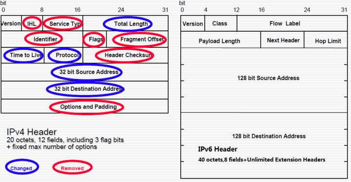

原文 by [阿里聚安全](https://zhuanlan.zhihu.com/p/31795470?group_id=922141315996553216)  
 
## 0x00 引言
近日，中共中央办公厅、国务院办公厅印发了《推进互联网协议第六版（IPv6）规模部署行动计划》，加快推进IPv6规模部署，构建高速率、广普及、全覆盖、智能化的下一代互联网。  

随着计划实施推行以及移动互联网、物联网的大力发展，我国整个网络环境将发生翻天覆地的变化，全产业链已蓄势待发，目前IPv6根服务器架设中国开始部署，IPv6城域网、政府网站IPv6双栈化改造、IPv6城市公共无线网络等均已开始试点和部署，互联网BAT部分内容已支持IPv6访问，流量增长迅速，新的网络环境以及新兴领域均将面临着新的安全挑战。  

按照部署计划，到2018年末，IPv6活跃用户数达到2亿，在互联网用户中的占比不低于20%，到2020年末，IPv6活跃用户数超过5亿，在互联网用户中的占比超过50%，新增网络地址不再使用私有IPv4地址，到2025年末，我国IPv6网络规模、用户规模、流量规模位居世界第一位，网络、应用、终端全面支持IPv6，全面完成向下一代互联网的平滑演进升级，形成全球领先的下一代互联网技术产业体系。  

针对IPv6安全，计划中重点要求升级安全系统，强化IPv6地址管理，增强IPv6安全防护，加强IPv6环境工业互联网、物联网、车联网、云计算、大数据、人工智能等领域的网络安全技术、管理及机制研究，构筑新兴领域安全保障能力。  

本文从IPv6安全威胁结合互联网网络安全运营视角进行了重点分析，同时探讨了互联网IPv6网络安全保障体系面临安全风险及加固建议。  

## 0x01 IPv6协议介绍

IPv6（Internet Protocol version 6，互联网通信协议第6版）是数据包交换互联网络的网络层协议，主要用于寻址和路由，是IETF（互联网工程任务小组Internet Engineering Task Force，简称IETF）设计用来替代IPv4协议的，在早期协议发展阶段，IPv6也叫做IPng。  

IETF自1990年开始，开始规划IPv4的下一代协议，除要解决IP地址短缺问题外，还要进行更多扩展。1994年,IETF会议中正式提议IPv6发展计划，并于1998年8月成为IETF的草案标准，最终IPv6在1998年底被IETF通过公布互联网标准规范（RFC 2460）的方式定义正式发布。  

目前随着移动互联网、物联网的大力发展，计算机网络已经与人们的生活密切相关，可能身边的每一样电子设备都需要连入网络，IP地址需求量剧增，同时IPv4地址越来越紧缺，IPv6的发展越来越迫切。  

IPv6发展的主要原因如下：  

a)128位的地址空间：IPv6由128比特位构成，单从数量级上来说，IPv6所拥有的地址容量是IPv4的约8×1028倍，达到2128个巨大的地址空间，不但解决了网络地址资源数量的问题，同时也为物联网的发展提供了基础。  

b)层次化的路由结构，而这是当前IPv4无法满足的：  

分层汇总（Public、Site、Interface）  

更为简单的ACL  

更少的路由条目  

c)实现真正的点到点通信，而不是NAT  

d)对安全传输的内在支持，提供更为安全的数据传输  

e)对数据报文进行简化，提供更快的数据包处理  

f)支持移动IPv6，提供稳定的移动网络服务  

g)自动配置、即插即用  

h)流标签提供更多的服务质量控制能力  

如下图1为IPv4和IPv6报文头结构，从报文头结构对比看，IPv6借鉴了IPv4的应用经验,大大简化了基本报头结构,仅包含8个字段，IPv6中所有非核心功能都由扩展报头实现。  
 
IPv4和IPv6报文头主要差异点如下：  

a)IPv6简化报头和数据长度计算：报头长度字段已经不在IPv6基本报头中使用,只使用一个字段来标示数据净荷的总长度；  

b)更好支持DiffServ QoS服务：IPv4报头的服务类型字段在IPv6中该字段被扩展为业务流类型、流标签2个独立的字段；  

c)取消中间分片：IPv4报头为数据分片提供了数据报文ID、分片标志、分片偏移值3个字段,目前有许多针对这3个字段的攻击手段, IPv6采用Path MTU发现机制,避免了中间路由器的分片处理,消除了一些安全隐患；  
 
d)取消校验和字段：许多IPv4后续报文头如ICMP、UDP和TCP中均含有同时覆盖基本报头和数据部分的检验和字段,因此IPv4报头中校验和字段是多余的,此字段在IPv6基础报头中已经取消；  

e)对选项功能的处理：IPv6采用扩展报头实现选项功能,解决了IPv4中带有选项内容的数据包不能被高效传输的问题,也使得IPsec以及未来可能出现的新的安全协议的采用更加方便。  

从报文头结构对比可见，IPv4协议报文头结构冗余，影响转发效率，同时缺乏对端到端安全、QoS、移动互联网安全的有效支持，而IPv6协议重点针对上述几个方面进行了改进，采用了更加精简有效的报文头结构，IPv6协议选项字段都放在扩展头中，中间转发设备不需要处理所有扩展报文头，提高数据包处理速度，并且通过扩展选项实现IPsec安全加密传输和对移动互联网安全的支持。  

  

图1 IPv4和IPv6报文头结构

从协议族来看，IPv6协议族相对于IPv4协议族，基本部分也发生了较大的变化，如ARP协议被邻居发现协议（NDP）代替，ICMPv6合并了IPv4中的ICMP（控制报文协议)，IGMP（组成员协议)、ARP（地址解析协议)、RARP（反向地址解析协议)和RA（路由广播)等多个协议的功能。  

## 0x02 IPv6协议设计的安全考虑

从协议的角度，IPv4协议诞生较早，前期设计几乎没有任何的安全考虑，因此特别是对报文地址的伪造与欺骗使得无法对网络进行很有效的监管和控制，而在IPv6协议设计之初，引入了AH（认证包头）、ESP（封装安全载荷）、SA（安全关联）、IKMP（密钥管理协议）等加密和认证机制，并强制实现了IPsec认证，IPsec协议族中的AH（AuthenticationHeader，报文认证头）和ESP（EncapsulationSecurity Payload，报文封装安全载荷）内嵌到协议栈中，作为IPv6的扩展头出现在IP报文中，提供完整性、保密性和源认证保护，从协议设计上较大地提升安全性。  

从IPv6协议安全设计上考虑，相比IPv4主要有如下增强：  
a) 可溯源和防攻击：IPv6地址资源丰富，不需要部署NAT，扫描困难  

b) IPv6的默认IPsec安全加密机制：IPv6协议中集成了IPsec，通过认证报头（AH）和封装安全载荷报头（ESP）两个扩展头实现加密、验证功能，中间转发设备只需要对带有IPsec扩展包头的报文进行普通转发，大大减轻转发压力  

c) 邻居发现协议（NDP）和SEND：采用NDP(neighbor discovery protocol)协议取代现有IPv4中ARP及部分ICMP控制功能如路由器发现、重定向等  

d) 真实源地址检查体系：真实源IPv6地址验证体系结构（SAVA）分为接入网（Access Network）、区域内（Intra-AS）和区域间（Inter-AS）源地址验证三个层次，从主机IP地址、IP地址前缀和自治域三个粒度构成多重监控防御体系。  

特别对于IPv4网络地址而言，数量非常有限，因此很多时候是一个地址被多台主机通过NAT等技术共用。使用IPv6之后，可以将每个地址指定给一个对象，每个地址唯一，IPv6的地址分配可采用逐级、层次化的结构，这将使得追踪定位、攻击溯源得到很大的改善，用户、报文和攻击关联对应，用户对自己的任何行为负责，并具有不可否认性。  

IPv6协议也定义了多播地址类型，而取消了IPv4下的广播地址，可有效避免IPv4网络中利用广播地址发起的广播风暴攻击和DDoS攻击。同时，IPv6协议规定了不允许向使用多播地址的报文回复ICMPv6差错消息，能有效防止ICMPv6报文造成的放大攻击。  
 

另外，IPsec协议族中的AH和ESP安全扩展包头为IPv6核心的安全机制和设计，提供了关键的加密和认证机制。  

AH 是IPv6的一个安全扩展包头，在RFC4302中定义，协议号为51。IPv6的认证主要由AH来完成。认证包头通过在所有数据包头加入一个密钥，通过AH使数据包的接收者可以验证数据是否真的是从它的源地址发出的，并提供密码验证或完整性测试。这种认证是IP数据包通过一定加密算法得出的编码结果，相当于对IP数据包进行数字签名，只有密钥持有人才知道的“数字签名”来对用户进行认证，同时接收者可通过该签名验证数据包的完整性。AH的验证范围与ESP有所区别，包括了整个IPv6数据包。  

AH位于IPv6头和一些上层协议头之间，如果存在扩展包头，则AH必须位于逐跳选项头、选路扩展头和分段扩展头之后。  

ESP也是IPv6的一个安全扩展包头，在RFC4303中定义，协议号为50。其对IPv6数据包的有效载荷部分加密，不包括IPv6包头部分，能为IP层提供机密性、数据源验证、抗重放以及数据完整性检验等安全服务，其中数据机密性是ESP的主要功能，其他均为可选。ESP头位于IPv6头和上层协议之间，如果存在扩展包头，则ESP头必须位于逐跳选项头、选路扩展头、分段扩展头和认证头之后。由于ESP只对ESP头之后的数据加密，所以通常将目的地选项头置于ESP头之后。  

ESP和AH各扩展包头可以单独使用，也可以一起使用。  

## 0x03 IPv6网络安全威胁分析

IPv6相对于IPv4，除了和IPv4相同的安全威胁外，新增部分主要来自于协议族、协议报文格式、自身设计实现、IPv4向IPv6的演进过程中新增或者变化引入的安全威胁。  

1. IPv6与IPv4共同的安全威胁

IPv6与IPv4同为网络层协议，有共同的安全威胁如下：  

a) 未配置IPsec可实施网络嗅探，可能导致信息泄露  

b) 应用层攻击导致的漏洞大多数在网络层无法消除  

c) 设备仿冒接入网络  

d) 未实施双向认证情况下可实施中间人攻击Man-in-the-Middle Attacks (MITM)  
  
e) 泛洪攻击  

2. IPv6协议族新增安全威胁

IPv6相对于IPv4在协议族上发生了较大的变化，新增安全威胁如下：  

a) 邻居发现协议（ND）攻击：针对ARP的攻击如ARP欺骗、ARP泛洪等在IPv6协议中仍然存在,同时IPv6新增的NS、NA也成为新的攻击目标，存在DoS攻击、中间人攻击等安全威胁。  

b) 新增ICMPv6协议作为IPv6重要的组成部分，存在DoS攻击、反射攻击等安全威胁；  

c) Pv6 支持无状态的地址自动分配，该功能可能造成非授权用户可以更容易的接入和使用网络，存在仿冒攻击安全威胁；  

d) IPv6 网络环境下由于网络扫描实施难度高，但仍可通过IPv6前缀信息搜集、隧道地址猜测、虚假路由通告及DNS查询等手段搜集到活动主机信息，通过DNS获取IPv6地址范围和主机信息可能会成为黑客优选攻击路径，针对DNS系统的攻击会更加猖獗；  

e) IPv6组播地址仍然支持，存在通过扫描、嗅探甚至仿冒关键DHCP Server、Router等安全威胁。  

f) IPv6路由协议攻击：RIPng/PIM依赖IPsec，OSPFv3协议不提供认证功能，而是使用IPv6的安全机制来保证自身报文的合法性，未配置IPv6安全机制，OSPFv3路由器存在仿冒的安全威胁；  

g) 移动IPv6仿冒伪造攻击：移动IPv6节点能够在不改变IP地址的情况下,在任何地方接入网络都能够直接与其他节点通信，在提供可移动性及方便通信的同时,由于移动节点的不固定性,也给不法分子提供了攻击的机会，存在伪造绑定更新消息等安全威胁；

h) MLD仿冒及泛洪攻击。  

3. IPv6协议报文格式新增安全威胁

IPv6 协议相关RFC标准在不断的发展更新，协议自身也存在漏洞，所有遵循IPv6协议的设备都会受到该漏洞的影响，新增安全威胁如下：  

a)协议自身存在漏洞，如IPv6协议Type0路由头拒绝服务漏洞，该漏洞已于2007年12月由RFC 5095修补，禁用了IPv6扩展头中的Type 0路由头；  

b) IPv6分片攻击   

c) IPv6扩展头攻击  
 
d) ND DAD攻击（Duplicate Address Detection）  

e) ND Router Advertisement仿冒、DoS、中间人攻击  

4. IPv6自身实现新增安全威胁

IPv6 和IPv4协议一样，设备与应用在实现对IPv6协议的支持时，不同的系统开发商因软件开发能力的不同，在IPv6协议软件开发、各种算法实现也会引入各种可能的安全漏洞。  

从下一代互联网国家工程中心全球IPv6测试中心11月份发布的《2017 IPv6支持度报告》来看：  

目前的操作系统中，75%左右都默认安装IPv6协议栈，65%左右支持DHCPv6，50%左右支持ND RNDSS。其中手机操作系统支持IPv6协议已经从实验室走向了应用阶段，Android 4.2、IOS 4.1、Windows Phone 6.5、Symbian 7.0都已经支持IPv6，并且默认安装IPv6，自以上各手机系统版本后推出的新版本均支持IPv6。在DHCPv6功能上，IOS支持得比较好，从V4.0开始支持stateless DHCPv6，V4.3.1支持Stateful DHCPv6。Windows Phone支持DHCPv6 Lite，Android系统不支持DHCPv6。在邻居发现(ND)选项RDNSS功能上，IOS目前已经支持ND RDNSS，Android 5.0以上已经支持ND RDNSS。若一个操作系统不支持DHCPv6和ND RDNSS，则无法在纯IPv6网络环境中自动配置查询域名服务器。  

各种应用软件也逐渐开始支持IPv6以应对广大用户的需求。但是目前并不普遍，只有一些基础应用软件已经支持IPv6。  

基础应用软件中有一小部分已可以支持IPv6，其中浏览器软件，如IE系列、Chrome、Firefox和Opera等都支持IPv6；下载软件和邮件客户端软件，如FileZilla3、SmartFTP4以及Outlook等都支持IPv6。但是国内自主研发的基础应用软件，除浏览器外，其他诸如下载软件、即时通讯软件等都尚无法在IPv6环境下正常使用。  

各类软件安全实现不当都可能引入IPv6协议安全漏洞，需要做好安全编码及质量保障活动。  

如下为典型的IPv6协议栈实现方面的漏洞。  

1、Python getaddrinfo() remote IPv6 buffer overflow  

2、Apache remote IPv6 buffer overflow  

3、Postfix IPv6 unauthorized mail relay vulnerability  

4、Openbsd remote code execution in IPv6 stack  

……

5. IPv4向IPv6演进过程中新增安全威胁

IPv4向IPv6的过渡是一个长期的过程，在IPv4与IPv6共存时期，为解决两者间互通所采取的各种措施将带来新的安全风险。例如，隧道方式下存在的拒绝服务攻击、中间人攻击，NAT-PT技术下存在的拒绝服务攻击等。  

IPv4向IPv6的演进过程中涉及到双栈、隧道以及翻译技术，主要安全威胁如下：  

a) 双栈技术：许多操作系统都支持双栈，IPv6默认是激活的，但并没有向IPv4一样加强部署IPv6的安全策略，支持自动配置，即使在没有部署IPv6的网络中，这种双栈主机也可能受到IPv6协议攻击。  

b) 隧道技术：几乎所有的隧道机制都没有内置认证、完整性和加密等安全功能，攻击者可以随意截取隧道报文，通过伪造外层和内层地址伪装成合法用户向隧道中注入攻击流量，存在仿冒以及篡改泛洪攻击安全威胁。  

c) 翻译技术：涉及载荷转换，无法实现端到端IPsec，存在受到NAT设备常见的地址池耗尽等DDoS攻击安全威胁。  

## 0x04 互联网IPv6网络安全保障体系及策略探讨

随着基于IPv6的下一代网络中应用的增加、速度的加快和规模的变大，IPv6网络面临着新的安全风险。  

对于互联网网络，安全是保证网络健康发展的重要因素，IPv6网络安全保障体系的配套建设作为IPv6网络建设的重要方面，在IPv6网络设计阶段对网络安全需要进行通盘考虑，提升网络架构的整体安全性。  

网络安全保障体系可分为静态安全防护体系以及动态安全运营体系两个层面。  

静态安全防护体系根据ITU-T X.805标准（端到端通信系统安全框架），网络可分为基础设施层、业务层和应用层，每个网络层次可以划分为管理、控制和数据三个平面。采用多种技术手段隔离管控，并在每个平面实施相应安全防护措施，从而使每个平面在安全方面都具备访问控制、鉴别、不可抵赖、数据保密性、通信安全、完整性、可用性和隐私性8个属性防护能力。  

动态安全运营体系通过安全检测和响应等安全基础设施和相关安全管理组织、制度和流程的配套建设，可实现对网络安全风险的动态发现和管理。  

与IPv4相比，可以共用相同的网络整体安全保障体系，但在IPv4基础网络的前提下需要确定升级演进到IPv6的策略，基于IPv6的特点和安全威胁分析，识别IPv6安全产品缺失的现状并补齐，确定改造节奏，包括LVS、DNS等各类型服务器、网络设备、DDoS设备、防火墙等，升级安全系统，结合业务实际利用好IPv6协议本身的安全增强技术手段，增强IPv6安全防护，同时加强IPv6环境各业务领域特别是新兴领域物联网、云计算、大数据、人工智能等的网络安全技术、管理及机制研究，促进新的安全业务和应用的开展，形成全球领先的下一代互联网技术产业体系。  

## 0x05 IPv6网络安全加固建议

虽然IPv6相对于IPv4来说增强了自身的安全机制，但一个新协议的引入必然会引入新的安全问题，对已有的网络安全技术体系造成影响，因此熟悉已有业务及网络、IPv6现状及其安全性并针对性部署安全加固非常重要。  

针对不同的IPv6网络安全风险，有不同的安全应对技术、措施和方法，需要采取合适自身的IPv6安全解决方案及措施，构筑IPv6网络安全及IPv6环境下新兴领域安全保障能力。  

如下典型的IPv6网络安全加固建议供参考。  

a) 做好IPv6网络各层各面和各安全域的隔离及访问控制，将安全影响控制到最小；  

b) 合理管控IPv6管理、控制和数据平面之间的资源互访，在各平面安全域根据各域的特点辅以相应的安全保护和控制措施，实施双栈的情况建议在IPv4/6双栈设备上采用严格的网络过滤和访问控制，防范IPv4和IPv6安全问题的相互影响；  

c) 做好管理和控制平面IPv6网络接入的认证与鉴权，制定完善的边界防护策略，防止恶意设备及用户的接入，结合业务实际情况有效利用IPv6协议的IPsec特性、源地址过滤技术等加强平面内的安全保护；  

d) 控制平面做好新增ICMPv6协议安全防护，建议根据实际情况选择合适的安全措施，例如配置ACL白名单，仅允许必须的ICMPv6等报文通过，接口关闭ICMPv6重定向、端口停止发送RA消息，关闭发送ICMP不可达信息，关闭源路由防止Type 0 Routing Header攻击等；  

e) 控制平面通过IPsec、认证以及白名单策略等做好IPv6网络路由等协议安全防护；  

f) 管理平面与IPv4网络类似，通过白名单策略、禁用不使用的IPv6服务等，确保攻击面最小；  
 
g) 数据平面与IPv4网络类似，配置ACL白名单策略，关闭不必要的服务、禁止源路由，部署IPv6 uRPF等；  

h) DNS做好IPv6扫描及嗅探的安全检测及防护；  

i) 建议严格限制IPv6同一片报文的分片数目，设置合理的分片缓冲超时时间；  

j) 建议配置端口的最大ND表项学习数量，限制扩展头的数量和同一类型扩展头实例的数目；  

k) IPv6网络涉及各类服务器、终端、网络设备及应用软件等，设计及开发需要遵从成熟的安全工程方法及规范，确保IPv6协议栈安全质量，同时做好已知漏洞的安全检测及修复；  

l) IPv6协议攻击的实施目前已有很成熟的开源安全工具套件，例如THC-IPv6、Si6 Networks ipv6-toolkit等，IPv6网络及协议上线运行时，需要提前做好网络中各部分IPv6协议栈健壮性测试、安全渗透测试及安全质量评估，及时削减安全风险；  

m) 基于IPv6的特点和安全威胁分析，确定IPv4升级演进到IPv6的策略，识别IPv6安全产品缺失的现状并补齐，确定改造节奏，升级安全系统。  

## 0x06 参考文档:

[1]IPv6的发展和安全性研究  

[2]Atlasis, IPv6 Extension Headers: New Features, and New Attack Vectors, IPv6 Security Summit,  

Troopers 13, Heidelberg, 11-15 March 2013  

[3]RFC 2460: Internet Protocol, Version 6 (IPv6) Specification  

[4]RFC 3756: IPv6 Neighbor Discovery (ND) Trust Models and Threats  

[5]RFC 4291: IP Version 6 Addressing Architecture  

[6]RFC 4443: Internet Control Message Protocol (ICMPv6) for the Internet Protocol Version 6 Specification  

[7]RFC 4941: Privacy Extensions for Stateless Address Autoconfiguration in IPv6  

[8]RFC 4942: IPv6 Transition/Coexistence Security Considerations  

[9]下一代互联网国家工程中心-全球IPv6测试中心-《2017 IPv6支持度报告》  