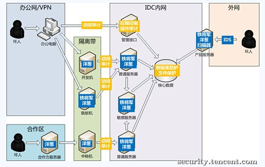
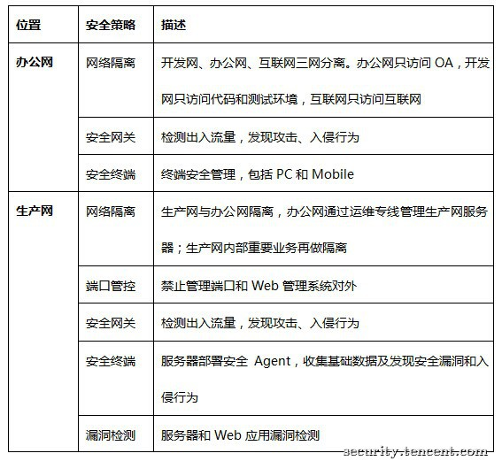

##【序章】   

本文其实是我们在2016年底为腾讯投后企业的相关同学进行主题为“如何防范黑客攻击”的安全培训（为投资企业提供全方位资源支持是腾讯投资的一个增值服务）的时候产生的副产物：部分初创企业安全团队规模较小（甚至没有专职的安全团队），但是却又实实在在地遭受到来自互联网的安全威胁，它们急需安全方面的指导，但是又苦于经验和资源的匮乏，所以当时我们答应下来将这部分工作后续以文章及服务的形式进行分享。   

由于我们几个人的能力和见识所限，成文仓促，难免会存在一些这样那样的错误，也欢迎大家批评指正，一起把指南工作修订好。 

##【理论篇】   

如培训现场所言，企业的网络安全是一个体系，方方面面都做的话是一个大工程，即使只是网络安全一个分支也需要较长时间建设，所以在早期需要解决当前主要矛盾（即“止血”，在关键位置先控制住大部分风险）。基于我们几个人过往的从业经验，我们建议各位在以下几个关键位置做好控制，则可以达到事半功倍立竿见影的效果：   

1）端口管控。所有服务器非业务端口全部对互联网关闭，管理端口只能通过内部堡垒机访问，必须要对互联网开启的端口要严格做好IP（或者帐号）白名单访问控制（对于Web层，更安全的做法是再增加一层短信或者微信之类的二次认证，参考OTP或者U2F）。做好之后，可以避免来自互联网的初级黑客和蠕虫病毒的攻击，比如不会受类似近期比较猖獗的MangoDB、ElasticSearch勒索事件影响；   
2）按区隔离。普通区与高危区网络隔离或者二者之间用DMZ做缓冲，比如安全形势复杂的办公环境与生产环境隔离，生产环境内部核心机器与普通机器隔开。如果黑客入侵了某个普通区，我们还有机会避免重要资产的损失；   
    

  
3）统一架构。参考微软提出的[SDL](https://www.microsoft.com/en-us/sdl/)（Security Development Lifecycle，安全开发生命周期），使用统一的研发和运维框架（这部分还要研发管理和运维的配合），并在框架的关键路径加入安全检查，如果出现漏洞只需要更改框架即可，避免到处漏水，可一劳永逸；   
4）严防出口。布控业务发布流程，将安全审核嵌入到上线前的发布流程并作为关键环节并具备高危漏洞一票否决权；   
5）安全接口。从业务团队找出一位同志担任安全接口人，由他来负责业务团队与安全团队的对接，协助推动安全工作；  
6) 内外网都消灭：弱口令、敏感文件/备份文件、高危app及其不安全配置、失效的安全（网络）策略、未鉴权的web如管理后台；    
7）上层支持。这个是决定性的因素，不多说。   

只要不折不扣地做到以上几点，基本上可以解决百分之九十以上的已知问题，等于是通过加固把攻击者的攻击点控制在了已知范围。但是，要时刻记住，以上措施只是缓解了外部的直接攻击（很多风险在内网仍然存在），并不能高枕无忧，毕竟黑客如果能够找到突破点进入到内网仍然可以长驱直入。       

大的面上控制住后就是对某个点的精细化运营，也就是建立纵深防御体系。这里需要投入大量资源，投入的资源视企业自身对信息安全的需求程度而定。近期谷歌发布的[谷歌基础设施安全设计概述](https://cloud.google.com/security/security-design/) （Google Infrastructure Security Design Overview）就全面阐述了谷歌的基础设计的安全设计思路以及实践，从硬件到应用层都做了防护，纵深防御层层相扣，几乎做到了企业安全的极致，也是我辈学习的典范（我们会在另外的文章深入分析学习谷歌基础安全）。   

##【工具篇】   

“工欲善其事必先利其器”，有工具的辅助会节约人力和提升效率。好在互联网是开放的，很多优秀的安全工具是免费甚至开源的，这里主要是整理一些常用的免费安全工具/在线服务，希望能够帮助到大家。有些工具有一些年头了——old，but not obsolete。       

### [ 扫描探测 ]   

Nmap（https://nmap.org/ ），不仅仅是端口扫描器，支持各种网络设备的探测，尤其对当今物联网环境特别有用；同时结合各种脚本，能够实现漏洞扫描，在安全漏洞应急中可用于评估漏洞影响范围，方便高效。   

Masscan （https://github.com/robertdavidgraham/masscan ），类似Nmap，但功能更聚焦于端口扫描，虽然没有Nmap功能强大，但速度快，号称“互联网最快的IP端口扫描器”。   

### [ 暴力破解 ]   

Hydra （https://www.thc.org/thc-hydra/ ），网络帐号破解工具，支持非常多的协议，是企业比较好的可以用于弱口令测试的工具（当然我认为你的这些端口都不应该开在互联网，但是总有例外）。   

John the Ripper（http://www.openwall.com/john/ ），开源免费的跨平台暴力破解工具，支持许多加密算法，比如MD5、DES等等，常被用于Unix/Linux系统登录弱口令探测。   

### [ Web漏洞检测 ]   

AWVS Acunetix Web Vulnerability Scanner（http://www.acunetix.com/vulnerability-scanner/ ），著名的商业化Web漏洞扫描器，集成了各种漏洞扫描与利用的工具，支持许多Web漏洞类型以及一些主流Web产品历史漏洞的扫描，是一款综合性较强的扫描器，可作为首选。腾讯自研的Web漏洞扫描器也拿它作为对标竞品之一。   

APPScan（http://www-03.ibm.com/software/products/en/appscan-standard ），IBM出品的Web漏洞扫描器，与AWVS齐名，也是腾讯自研Web漏洞扫描器的对标竞品。   

BugScan（https://old.bugscan.net ），四叶草安全出品的基于Python的Web漏洞扫描器。亮点是基于社区的扫描器，大家都可以编写插件，所以插件全面并且更新快。   

sqlmap（http://sqlmap.org/ ），基于Python开源的SQL注入工具，功能非常强大，常被用于SQL注入的漏洞渗透测试，也有很多厂商基于它做二次开发，增加了GUI界面、主被动式批量扫描等功能。同时它也支持自定义脚本，常被用于绕过WAF防护进行注入，可扩展性较强。   

Burp Suite（https://portswigger.net/burp/ ），著名的Web安全测试工具，可代理HTTP/HTTPS抓包，方便分析与重放请求包，再结合一些安全插件可以非常方便地挖掘Web漏洞。   

JSky，好用的Web应用安全检测工具，国内黑客zwell出品。   

Safe3 Web Vul Scanner，国内另一黑客safe3的Web漏洞检测工具。   

WPScan（https://wpscan.org/ ），专门针对WordPress程序的漏洞检测工具。WordPress是一个PHP开发的Blog系统，却有专门漏洞检测工具.......由此可见，没有特殊理由不要使用第三方开源Web程序（不知道当年的风靡一时的ASP论坛动网还在不在）。   

RIPS（http://rips-scanner.sourceforge.net/ ），一款开源的PHP代码审计工具，能够从代码级检测常见的Web漏洞，但需要人工去排查确认结果，存在一定误报，比较适合具备Web安全研究经验的PHP开发者。   

### [Web防火墙 ]   

ModSecurity（http://www.modsecurity.org/ ），开源的主机Web应用防火墙，支持Apache、Nginx、IIS等Web服务器，研究和体验WAF的首选参考。   

创宇盾（https://www.yunaq.com/cyd/ ），知道创宇出品的在线Web防护服务，是将DNS指向云服务商清洗的原理，免费版给小型用户作为常规攻击防护还是足够的。   

阿里云盾（https://cn.aliyun.com/product/waf ），阿里云提供的Web应用防火墙，属于收费服务。   

腾讯云WAF（https://www.qcloud.com/document/product/296/2227 ），由腾讯云提供的Web应用防火墙，支持Web漏洞防护以及虚拟补丁，可通过购买腾讯云主机直接使用。   

### [ 客户端安全检测] 

腾讯金刚（http://service.security.tencent.com/kingkong ），由腾讯安全平台部出品的免费终端安全审计服务，脱胎于内部使用的金刚系统，属于国内最早公开的Android APP漏洞检测系统。   

阿里聚安全（http://jaq.alibaba.com/ ），由阿里聚安全开发的移动APP在线审计系统，支持Android/iOS，属于收费项目。   

360显危镜（http://appscan.360.cn ），360信息安全部开发的Android APP安全风险在线扫描系统，免费服务。   

AFL-Fuzz（http://lcamtuf.coredump.cx/afl/ ），由Google开发的开源的著名Fuzzer，对于开源项目的Fuzzing效果尤其好，目前已发现数百个主流软件的漏洞，能够自动寻找执行路径并反馈驱动Fuzzing，算是漏洞挖掘界中的一颗明星。   

（目前移动客户端自动化检测工具主要用于上线前自动化安全审计，检测结果不一定准确，需要人工复查）   

### [ APP加固 ] 

腾讯云乐固（http://legu.qcloud.com ），腾讯云出品的在线APP加固服务，通过对APP进行加密混淆，可有效地防止APP被逆向分析，防止盗版。同时提供实时的渠道监控和安全SDK包。 

腾讯御安全（http://yaq.qq.com/ ），腾讯手机管家团队出品，主要解决应用安全加密、安全存储、安全加签、反调试、反篡改等难题。 

阿里聚安全（http://jaq.alibaba.com ），除提供APP漏洞检测外，它还提供有应用加固和持续监控的功能。 

360加固保（http://jiagu.360.cn ），360开发的Android应用加固服务，同时包括盗版检测、崩溃日志分析、数据分析等服务。 

（目前从技术上来说，应用加固只能提高应用破解难度，无法保证百分百的安全） 

### [ 入侵检测 ] 

OSSEC（http://ossec.github.io/ ），一款开源的多平台入侵检测系统，可以运行于Windows、Linux,、OpenBSD/FreeBSD以及MacOS等操作系统中。包括了日志分析、全面检测、rootkit检测。作为一款HIDS，它在业界是比较多见推荐的解决方案，不过在实践过程中，HIDS的核心功能是采集日志发送到后台，所以前端的解决方案用Nagios、Cacti或者任意Agent搭配自定义的脚本，也能实现模型，入侵检测的重点在于策略和运营。   

安全狗（https://www.safedog.cn/server_safedog.html ），支持Windows和Linux的服务器安全检测工具，能够检测网站后门，防网站篡改和系统提权，还可以帮助服务器进行安全配置。   

D盾（http://www.d99net.net/ ），国内著名黑客啊D（还记得啊D注入工具吗，就是那个啊D）出品，一款免费的Windows IIS防火墙，可用于检测服务器后门（效果很不错，实测比较精准），同时也具备WAF和防CC攻击的功能。   

### [ DDoS攻击防护 ] 

DDoS本质是资源的消耗，除了极少数的轻量级攻击，基本上没有主机层能够解决的，所以DDoS防护一般需要投入大量成本依靠商业或者自研设备。随着云服务的兴起，由云服务商来提供防护服务或许会比硬件采购/自研节约成本。   

腾讯云大禹（https://www.qcloud.com/product/ddd ），依托于腾讯自研的DDoS防护系统宙斯盾及CDN，通过动态调度组织腾讯云全网各冗余带宽和防护能力，为用户提供的DDoS防护服务。   

电信云堤（http://www.damddos.com/ ），由中国电信提供的DDoS攻击防护产品，具备异常流量监测、流量压制和流量清洗（近源清洗这种能力只有运营商具备）的功能。   

阿里云盾（https://www.aliyun.com/product/ddos ），阿里云提供的DDoS防护服务，也支持非阿里云主机。   

360网站卫士（http://wangzhan.360.cn/ ），360提供的免费防DDoS攻击的在线云服务平台，同时也支持Web漏洞防御能力。   

### [ 文件行为分析 ]   

腾讯哈勃（https://habo.qq.com/ ），由腾讯电脑管家出品的在线文件分析系统，存在在线版和APP版本，支持APK、EXE、PDF、SWF以及压缩包等多种文件格式，能够自动分析出文件存在的一些敏感行为，现在已经开源。   

火眼（https://fireeye.ijinshan.com/ ），金山出品的在线文件行为分析系统，支持多种文件格式，主要包括Windows和Android下的文件，完全免费，报告的展示效果很好，能够给出文件关键的敏感行为，以及是否为恶意文件的结论。   

VirusTotal（https://www.virustotal.com/ ），当前最流行的在线病毒扫描系统，支持各种文件格式，包括病毒和漏洞常利用的文件格式，如doc、pdf、swf等等，当前共有59个主流的病毒扫描系统支持同时扫描，使用方便，常作用优先的病毒检测工具。   

微步在线（https://x.threatbook.cn/ ），业界元老sowhat创办的安全威胁情报分析平台，除了文件行为分析，还有IP/域名分析、域名解析历史记录，功能强大。   

## 【知识篇】 

这里也推荐一些大牛的安全类著作以及部分安全知识站点供大家参考，同样由于我们学识有限，难免挂一漏万。   

《互联网企业安全高级指南》   
国内第一本系统讲解互联网企业安全体系建设的书籍，领衔作者是ayazero（曾经的安全组织Ph4nt0m成员，经验非常丰富）。这本书对互联网企业初建的安全团队具有很高的参考价值，书中的内容很多都是作者多年的经验总结。第二作者xti9er曾在腾讯安全平台部工作5年，也有丰富的实战经验。   

《网络渗透技术》   
这本书由安全焦点团队中的san、alert7、eyas、watercloud四位巨擘共同完成。这本书出版在2005年前后，在当时算是非常珍贵的网络攻防技术实战类著作。   

《白帽子讲Web安全》   
全方位讲解Web安全的著作，作者是Ph4nt0m创始人axis（又名刺、大风），现在是阿里云盾首席安全专家。这本书覆盖了客户端脚本安全、服务器端应用安全的各种常见问题。在具体漏洞介绍之外，这本书很多地方也体现了作者对互联网公司安全运营的思考。   

《Web前端黑客技术揭秘》   
同样是Web安全技术力作，更偏重于前端，作者是余弦（Web安全高手，前知道创宇404实验室负责人，现在好像创业去了）和xisigr（浏览器安全大牛，目前就职于腾讯玄武实验室）。   

《无线网络安全攻防实战进阶》   
ZerOne无线安全团队负责人杨哲（Longas）的力作，书如其名，是一本贴近无线安全攻防实战的书，涵盖了无线安全的方方面面。此系列有两本书，前一本名为《无线网络安全攻防实战》。   

《加密与解密》   
由看雪学院创始人段钢主持编著，软件安全分析领域的经典书籍，已经发行到第三版，预计2017年会发行第四版。   

《0day安全：软件漏洞分析技术》   
国内软件安全漏洞分析领域的经典著作，由failwest（对漏洞挖掘很有研究，2007年给我们提交的TT浏览器漏洞显示出非常深厚的技术功力）所著，内容专注于堆和栈溢出的原理分析、利用技术，同时在第2版中补充了Windows内核漏洞方面的分析，特别适合想入门软件漏洞分析领域的同学。   

《漏洞战争：软件漏洞分析精要》   
由腾讯安全应急响应中心的riusksk（泉哥）所著，本书系统地讲解软件漏洞分析与利用所需的各类工具、理论技术和实战方法，主要涉及Windows和Android系统平台。   

《Android软件安全与逆向分析》   
该书内容包括Android软件逆向分析和系统安全方面的必备知识及概念、如何静态分析Android 软件、如何动态调试Android 软件、Android 软件的破解与反破解技术的探讨，以及对典型Android 病毒的全面剖析。作者非虫是看雪论坛Android安全版版主，实力自然是不必说了。   

《Android安全攻防权威指南》   
国外Hacker’s Handbook系列安全书籍一直是业界经典，本书也是Android系统安全漏洞研究领域一步经典著作，由国际上6名知名黑客/安全研究员所著，系统而全面地介绍Android系统中的漏洞分析与利用技术，涉及面也比较广，包括应用、内核以及硬件安全等方面。   

《iOS应用逆向工程》   
iOS应用逆向分析的入门书籍，分为概念、工具、理论和实战4部分，介绍了iOS逆向中的常用工具和方法论，以及如何利用theos编写hook插件实现一些应用上的特殊功能。在iOS应用逆向分析（病毒分析、漏洞挖掘等等）领域具有一定的指导作用。   

《黑客攻防技术宝典：Web实战篇》   
也是属于国外Hacker’s Handbook系列安全书籍之一，由著名安全测试工具BurpSuite的作者所著，在Web安全领域书籍上的经典著作，重点推荐。 

《Web安全测试》   
介绍很多Web安全测试工具，讲述各种Web漏洞的测试与挖掘方法，很有实战价值。其中推荐的一些FireFox插件依然是当前Web测试中的常用工具。   

《游戏安全——手游安全技术入门》   
通过作者们丰富的实战经验，从移动端游戏逆向和外挂入手，由浅入深介绍手游安全领域的知识技能，腾讯游戏安全团队出品。另外，他们还提供手游反外挂安全服务MTP。   

《白帽子讲浏览器安全》   
比较全面介绍浏览器安全攻防对抗的书籍，是学习浏览器安全的必备读物，作者是腾讯浏览器团队的blast。   

##【社区篇】 

下面我们再介绍一些可以长期关注的网站平台和安全媒体，同样挂一漏万。   

Freebuf黑客与极客（http://www.freebuf.com/）   
国内办得比较好的安全资讯、安全技术网站，话说他们第一次作为媒体参与的就是TSRC第一届安全峰会报道，可以说大家是一起成长起来的。另外Freebuf的安全众测服务“漏洞盒子”、在线安全教育“Freebuf公开课”、互联网安全创新大会FIT等业务也做得有声有色。创始人袁劲松（树哥）和thanks都是圈内新锐。   

看雪学院（http://bbs.pediy.com ）   
国内著名的软件安全交流社区，培养出很多二进制安全方向的人才，也是国内少有的依然保持活跃度的技术论坛。站点上每年的精华集都是一份不错的学习资料，虽然后面这两年没整理，但精华帖依然可以查看，而且论坛也出版过不少软件逆向/漏洞分析的书籍。   

安全焦点（http://www.xfocus.net/）   
国内最老牌的安全站点，可惜现在已经不维护了。当年活跃在上面的人如今已成为安全圈的中流砥柱，致敬。   

乌云漏洞报告平台（http://www.wooyun.org/） 
曾经国内最大的漏洞报告平台，现在由于众所周知的原因关闭。是非成败转头空，青山依旧在，几度夕阳红。 

i春秋（http://www.ichunqiu.com/）  
在线的信息安全培训网站，创始人蔡晶晶（cjj）是安全圈老前辈。i春秋的企安殿视为企业提供网络安全培训的在线教育平台，中小企业安全团队的同学可以通过i春秋提供的平台提升技术能力。  

嘶吼（http://www.4hou.com）   
安全焦点呆神（casper）创建的安全媒体。凭借呆神的团队能力和业内资源，嘶吼肯定会成为一个值得关注的安全媒体。   

Seebug（https://www.seebug.org/） & ZoomEye（https://www.zoomeye.org/）   
知道创宇404实验室（现在的负责人是安全圈大牛、大名鼎鼎的“漏洞之王”SuperHei）运营的一个社区平台和漏洞搜索引擎，关注热点漏洞和新式攻击方法，另外还有安全技术社区paper、开源漏洞测试框架Pocsuit等多个平台，是学习安全技术的好地方。   

安全客（http://bobao.360.cn/）   
360主办的安全资讯、安全技术网站，前身叫360安全播报。   

腾讯安全应急响应中心（https://security.tencent.com/）   
TSRC官网，欢迎来这里报告漏洞和交流技术。   

SecTools（http://sectools.org/）   
这是安全领域里的经典工具排行榜，目前仍在维护和更新，多数业界的知名产品都会被纳入其中，包括本文的一部分推荐。   

##【作者】 

lake2/职业欠钱/riusksk/nicky/Gmxp/flyh4t   

## Reference
https://security.tencent.com/index.php/blog/msg/113  