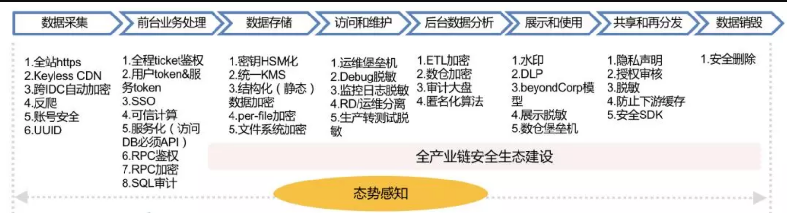

原文 by [美团点评技术团队](https://mp.weixin.qq.com/s?__biz=MjM5NjQ5MTI5OA==&mid=2651748020&idx=1&sn=f4ac7e4016cd8170053c7e121f060498&chksm=bd12aff98a6526ef96eecff3d22c4013ade8cbd783f4aec086ee2656879eddc070e92634ec73&mpshare=1&scene=1&srcid=0524iTCmPQqpcXIVUn5r4TSp#rd)  

## 一、背景

Facebook数据泄露事件一度成为互联网行业的焦点，几百亿美元市值瞬间蒸发，这个代价足以在地球上养活一支绝对庞大的安全团队，甚至可以直接收购几家规模比较大的安全公司了。  
虽然媒体上发表了很多谴责的言论，但实事求是地讲，Facebook面临是一个业界难题，任何一家千亿美元的互联网公司面对这种问题，可能都没有太大的抵抗力，仅仅是因为全球区域的法律和国情不同，暂时不被顶上舆论的浪尖罢了。但是全球的趋势是越来越重视隐私，在安全领域中，数据安全这个子领域也重新被提到了一个新的高度，所以笔者就借机来说一下数据安全建设。（按照惯例，本文涉及敏感信息的部分会进行省略处理或者一笔带过。）  

## 二、概念

这里特别强调一下，“隐私保护”和“数据安全”是两个完全不同的概念，隐私保护对于安全专业人员来说是一个更加偏向合规的事情，主要是指数据过度收集和数据滥用方面对法律法规的遵从性，对很多把自身的盈利模式建立在数据之上的互联网公司而言，这个问题特别有挑战。有些公司甚至把自己定义为数据公司，如果不用数据来做点什么，要么用户体验大打折扣，要么商业价值减半。GDPR即将实施，有些公司或将离场欧洲，就足见这件事的难度不容小觑。当然市场上也有一些特别推崇隐私保护的公司，他们很大程度上并不能真正代表用户意愿，而只是因为自家没有数据或缺少数据，随口说说而已。  

数据安全是实现隐私保护的最重要手段之一。对安全有一定了解的读者可能也会察觉到，数据安全并不是一个独立的要素，而是需要连同网络安全、系统安全、业务安全等多种因素，只有全部都做好了，才能最终达到数据安全的效果。所以本文尽可能的以数据安全为核心，但没有把跟数据安全弱相关的传统安全体系防护全部列出来，对于数据安全这个命题而言尽可能的系统化，又避免啰嗦。另外笔者也打算在夏季和秋季把其他子领域的话题单独成文，譬如海量IDC下的入侵防御体系等，敬请期待。  

## 三、全生命周期建设

尽管业内也有同学表示数据是没有边界的，如果按照泄露途径去做可能起不到“根治”的效果，但事实上以目前的技术是做不到无边界数据安全的。下图汇总了一个全生命周期内的数据安全措施： 
  
 

## 四、数据采集

数据泄露有一部分原因是用户会话流量被复制，尽管有点技术门槛，但也是发生频率比较高的安全事件之一，只是是很多企业没有感知到而已。下面从几个维度来说明数据采集阶段的数据保护。  

### 流量保护

全站HTTPS是目前互联网的主流趋势，它解决的是用户到服务器之间链路被嗅探、流量镜像、数据被第三方掠走的问题。这些问题其实是比较严重的，比如电信运营商内部偶有舞弊现象，各种导流劫持插广告（当然也可以存数据，插木马），甚至连AWS也被劫持DNS请求，对于掌握链路资源的人来说无异于可以发动一次“核战争”。即使目标对象IDC入侵防御做的好，攻击者也可以不通过正面渗透，而是直接复制流量，甚至定向APT，最终只是看操纵流量后达到目的的收益是否具有性价比。  

HTTPS是一个表面现象，它暗示着任何互联网上未加密的流量都是没有隐私和数据安全的，同时，也不是说有了HTTPS就一定安全。HTTPS本身也有各种安全问题，比如使用不安全的协议TLS1.0、SSL3，采用已经过时的弱加密算法套件，实现框架安全漏洞如心脏滴血，还有很多的数字证书本身导致的安全问题。  

全站HTTPS会带来的附带问题是CDN和高防IP。历史上有家很大的互联网公司被NSA嗅探获取了用户数据，原因是CDN回源时没有使用加密，即用户浏览器到CDN是加密的，但CDN到IDC源站是明文的。如果CDN到源站加密就需要把网站的证书私钥给到CDN厂商，这对于没有完全自建CDN的公司而言也是一个很大的安全隐患，所以后来衍生出了Keyless CDN技术，无需给出自己的证书就可以实现CDN回源加密。  

广域网流量未加密的问题也要避免出现在“自家后院”——IDC间的流量复制和备份同步，对应的解决方案是跨IDC流量自动加密、TLS隧道化。  

### 业务安全属性

在用户到服务器之间还涉及两个业务安全方向的问题。第一个问题是账号安全，只要账号泄露（撞库&爆破）到达一定数量级，把这些账号的数据汇总一下，就必定可以产生批量数据泄露的效果。  

第二个问题是反爬，爬虫的问题存在于一切可通过页面、接口获取数据的场合，大概1小时爬个几百万条数据是一点问题都没有的，对于没有彻底脱敏的数据，爬虫的效果有时候等价于“黑掉”服务器。账号主动地或被动地泄露+爬虫技术，培育了不少黑产和数据获取的灰色地带。  

### UUID

UUID最大的作用是建立中间映射层，屏蔽与真实用户信息的关系链。譬如在开放平台第三方应用数据按需自主授权只能读取UUID，但不能直接获取个人的微信号。更潜在的意义是屏蔽个体识别数据，因为实名制，手机号越来越能代表个人标识，且一般绑定了各种账号，更改成本很高，找到手机号就能对上这个人，因此理论上但凡带有个体识别数据的信息都需要“转接桥梁”、匿名化和脱敏。譬如当商家ID能唯一标识一个品牌和店名的时候，这个原本用于程序检索的数据结构也一下子变成了个体识别数据，也都需要纳入保护范畴。  

## 五、前台业务处理

### 鉴权模型

在很多企业的应用架构中，只有在业务逻辑最开始处理的部分设置登录态校验，后面的事务处理不再会出现用户鉴权，进而引发了一系列的越权漏洞。事实上越权漏洞并不是这种模型的全部危害，还包括各种K/V、RDS（关系型数据库）、消息队列等等，RPC没有鉴权导致可任意读取的安全问题。  

在数据层只知道请求来自一个数据访问层中间件，来自一个RPC调用，但完全不知道来自哪个用户，还是哪个诸如客服系统或其他上游应用，无法判断究竟对当前的数据（对象）是否拥有完整的访问权限。绝大多数互联网公司都用开源软件或修改后的开源软件，这类开源软件的特点是基本不带安全特性，或者只具备很弱的安全特性，以至于完全不适用于海量IDC规模下的4A模型（认证、授权、管理、审计）。  

外面防御做的很好，而在内网可以随意读写，这可能是互联网行业的普遍现状了。主要矛盾还是鉴权颗粒度和弹性计算的问题，关于这个问题的解决方案可以参考笔者的另外一篇文章《初探下一代网络隔离与访问控制》，其中提到Google的方法是内网RPC鉴权，由于Google的内网只有RPC一种协议，所以就规避了上述大多数安全问题。  

对于业务流的鉴权模型，本质上是需要做到Data和App分离，建立Data默认不信任App的模型，而应用中的全程Ticket和逐级鉴权是这种思想下的具体实现方法。  

### 服务化

服务化并不能认为是一个安全机制，但安全却是服务化的受益者。我们再来温习一下当年Bezos在Amazon推行服务化的一纸号令：  

1）所有团队今后将通过服务接口公开他们的数据和功能。  
2）团队必须通过这些接口相互通信。  
3）不允许使用其他形式的进程间通信：不允许直接链接，不允许直接读取其他团队的数据存储，不支持共享内存模式，无后门。唯一允许的通信是通过网络上的服务接口调用。  
4）他们使用什么技术并不重要。HTTP，Corba，Pubsub，自定义协议 - 无关紧要。贝索斯不在乎。  
5）所有服务接口无一例外都必须从头开始设计为可外部化。也就是说，团队必须规划和设计能够将接口展示给外部开发人员。没有例外。  
6）任何不这样做的人都会被解雇。  

服务化的结果在安全上的意义是必须通过接口访问数据，屏蔽了各种直接访问数据的途径，有了API控制和审计就会方便很多。  

### 内网加密

一些业界Top的公司甚至在IDC内网里也做到了加密，也就是在后台的组件之间的数据传输都是加密的，譬如Goolge的RPC加密和Amazon的TLS。由于IDC内网的流量比公网大得多，所以这里是比较考验工程能力的地方。对于大多数主营业务迭代仍然感觉有压力的公司而言，这个需求可能有点苛刻了，所以笔者认为用这些指标来衡量一家公司的安全能力属于哪一个档位是合理的。私有协议算不算？如果私有协议里不含有标准TLS（SHA256）以上强度的加密，或者只是信息不对称的哈希，笔者认为都不算。  

### 数据库审计

数据库审计/数据库防火墙是一个入侵检测/防御组件，是一个强对抗领域的产品，但是在数据安全方面它的意义也是明显的：防止SQL注入批量拉取数据，检测API鉴权类漏洞和爬虫的成功访问。

除此之外，对数据库的审计还有一层含义，是指内部人员对数据库的操作，要避免某个RD或DBA为了泄愤，把数据库拖走或者删除这种危险动作。通常大型互联网公司都会有数据库访问层组件，通过这个组件，可以审计、控制危险操作。  

## 六、数据存储

数据存储之于数据安全最大的部分是数据加密。Amazon CTO Werner Vogels曾经总结：“AWS所有的新服务，在原型设计阶段就会考虑到对数据加密的支持。”国外的互联网公司中普遍比较重视数据加密。  

### HSM/KMS

业界的普遍问题是不加密，或者加密了但没有使用正确的方法：使用自定义UDF，算法选用不正确或加密强度不合适，或随机数问题，或者密钥没有Rotation机制，密钥没有存储在KMS中。数据加密的正确方法本身就是可信计算的思路，信任根存储在HSM中，加密采用分层密钥结构，以方便动态转换和过期失效。当Intel CPU普遍开始支持SGX安全特性时，密钥、指纹、凭证等数据的处理也将以更加平民化的方式使用类似Trustzone的芯片级隔离技术。  

### 结构化数据

这里主要是指结构化数据静态加密，以对称加密算法对诸如手机、身份证、银行卡等需要保密的字段加密持久化，另外除了数据库外，数仓里的加密也是类似的。比如，在 Amazon Redshift 服务中，每一个数据块都通过一个随机的密钥进行加密，而这些随机密钥则由一个主密钥进行加密存储。用户可以自定义这个主密钥，这样也就保证了只有用户本人才能访问这些机密数据或敏感信息。鉴于这部分属于比较常用的技术，不再展开。 

### 文件加密

对单个文件独立加密，一般情况下采用分块加密，典型的场景譬如在《互联网企业安全高级指南》一书中提到的iCloud将手机备份分块加密后存储于AWS的S3，每一个文件切块用随机密钥加密后放在文件的meta data中，meta data再用file key包裹，file key再用特定类型的data key（涉及数据类型和访问权限）加密，然后data key被master key包裹。  

### 文件系统加密

文件系统加密由于对应用来说是透明的，所以只要应用具备访问权限，那么文件系统加密对用户来说也是“无感知”的。它解决的主要是冷数据持久化后存储介质可访问的问题，即使去机房拔一块硬盘，或者从一块报废的硬盘上尝试恢复数据，都是没有用的。但是对于API鉴权漏洞或者SQL注入而言，显然文件系统的加密是透明的，只要App有权限，漏洞利用也有权限。  

## 七、访问和运维

在这个环节，主要阐述防止内部人员越权的一些措施。  

### 角色分离

研发和运维要分离，密钥持有者和数据运维者要分离，运维角色和审计角色要分离。特权账号须回收，满足最小权限，多权分立的审计原则。  

### 运维审计

堡垒机（跳板机）是一种针对人肉运维的常规审计手段，随着大型IDC中运维自动化的加深，运维操作都被API化，所以针对这些API的调用也需要被列入审计范畴，数量级比较大的情况下需要使用数据挖掘的方法。  

### 工具链脱敏

典型的工具脱敏包括监控系统和Debug工具/日志。在监控系统类目中，通常由于运维和安全的监控系统包含了全站用户流量，对用户Token和敏感数据需要脱敏，同时这些系统也可能通过简单的计算得出一些运营数据，譬如模糊的交易数目，这些都是需要脱敏的地方。在Debug方面也出过Debug Log带有CVV码等比较严重的安全事件，因此都是需要注意的数据泄漏点。  

### 生产转测试

生产环境和测试环境必须有严格定义和分离，如特殊情况生产数据需要转测试，必须经过脱敏、匿名化。  

## 八、后台数据处理

### 数仓安全

目前大数据处理基本是每个互联网公司的必需品，通常承载了公司所有的用户数据，甚至有的公司用于数据处理的算力超过用于前台事务处理的算力。以Hadoop为代表的开源平台本身不太具备很强的安全能力，因此在成为公有云服务前需要做很多改造。在公司比较小的时候可以选择内部信任模式，不去过于纠结开源平台本身的安全，但在公司规模比较大，数据RD和BI分析师成千上万的时候，内部信任模式就需要被抛弃了，这时候需要的是一站式的授权&审计平台，需要看到数据的血缘继承关系，需要高敏数据仍然被加密。  

在这种规模下，工具链的成熟度会决定数据本地化的需求，工具链越成熟数据就越不需要落到开发者本地，这样就能大幅提升安全能力。同时鼓励一切计算机器化&程序化&自动化，尽可能避免人工操作。  

对于数据的分类标识、分布和加工，以及访问状况需要有一个全局的大盘视图，结合数据使用者的行为建立“态势感知”的能力。  

因为数仓是最大的数据集散地，因此每家公司对于数据归属的价值观也会影响数据安全方案的落地形态：放逐+检测型 or 隔离+管控型。  

### 匿名化算法

匿名化算法更大的意义其实在于隐私保护而不在于数据安全（关于隐私保护部分笔者打算另外单独写一篇），如果说对数据安全有意义，匿名化可能在于减少数据被滥用的可能性，以及减弱数据泄漏后的影响面。  

## 九、展示和使用

这个环节泛指大量的应用系统后台、运营报表以及所有可以展示和看到数据的地方，都可能是数据泄露的重灾区。  

### 展示脱敏

对页面上需要展示的敏感信息进行脱敏。一种是完全脱敏，部分字段打码后不再展示完整的信息和字段；另一种是不完全脱敏，默认展示脱敏后的信息，但仍然保留查看明细的按钮（API），这样所有的查看明细都会有一条Log，对应审计需求。具体用哪种脱敏需要考虑工作场景和效率综合评估。  

### 水印

水印主要用在截图的场景，分为明水印和暗水印，明水印是肉眼可见的，暗水印是肉眼不可见暗藏在图片里的识别信息。水印的形式也有很多种，有抵抗截屏的，也有抵抗拍照的。这里面也涉及很多对抗元素不一一展开。  

### 安全边界

这里的边界其实是办公网和生产网组成的公司数据边界，由于办公移动化程度的加深，这种边界被进一步模糊化，所以这种边界实际上是逻辑的，而非物理上的，它等价于公司办公网络，生产网络和支持MDM的认证移动设备。对这个边界内的数据，使用DLP来做检测，DLP这个名词很早就有，但实际上它的产品形态和技术已经发生了变化，用于应对大规模环境下重检测，轻阻断的数据保护模式。  

除了DLP之外，整个办公网络会采用BeyondCorp的“零信任”架构，对整个的OA类应用实现动态访问控制，全面去除匿名化访问，全部HTTPS，根据角色最小权限化，也就是每个账号即使泄露能访问到的也有限。同时提高账号泄露的成本（多因素认证）和检测手段，一旦检测到泄露提供远程擦除的能力。  

### 堡垒机

堡垒机作为一种备选的方式主要用来解决局部场景下避免操作和开发人员将敏感数据下载到本地的方法，这种方法跟VDI类似，比较厚重，使用门槛不高，不适合大面积普遍推广。  

## 十、共享和再分发

对于业务盘子比较大的公司而言，其数据都不会是只在自己的系统内流转，通常都有开放平台，有贯穿整个产业链的上下游数据应用。Facebook事件曝光其实就属于这类问题，不开放是不可能的，因为这影响了公司的内核—-赖以生存的商业价值。  

所以这个问题的解决方案等价于：1）内核有限妥协（为保障用户隐私牺牲一部分商业利益）；2）一站式数据安全服务。  

### 防止下游数据沉淀

首先，所有被第三方调用的数据，如非必要一律脱敏和加密。如果部分场景有必要查询明细数据，设置单独的API，并对账号行为及API查询做风控。  

其次如果自身有云基础设施，公有云平台，可以推动第三方上云，从而进行：  

1）安全赋能，避免一些因自身能力不足引起的安全问题；  

2）数据集中化，在云上集中之后利于实施一站式整体安全解决方案（数据加密，风控，反爬和数据泄露检测类服务），大幅度降低外部风险并在一定程度上降低作恶和监守自盗的问题。  

### 反爬

反爬在这里主要是针对公开页面，或通过接口爬取的信息，因为脱敏这件事不可能在所有的环节做的很彻底，所以即便通过大量的“公开”信息也可以进行汇聚和数据挖掘，最终形成一些诸如用户关系链，经营数据或辅助决策类数据，造成过度信息披露的影响。  

### 授权审核

设置专门的团队对开放平台的第三方进行机器审核及人工审核，禁止“无照经营”和虚假三方，提高恶意第三方接入的门槛，同时给开发者/合作方公司信誉评级提供基础。  

### 法律条款

所有的第三方接入必须有严格的用户协议，明确数据使用权利，数据披露限制和隐私保护的要求。像GDPR一样，明确数据处理者角色和惩罚条约。  

## 十一、数据销毁

数据销毁主要是指安全删除，这里特别强调是，往往数据的主实例容易在视野范围内，而把备份类的数据忽略掉。  

如果希望做到快速的安全删除，最好使用加密数据的方法，因为完整覆写不太可能在短时间内完成，但是加密数据的安全删除只要删除密钥即可。  

## 十二、数据的边界

数据治理常常涉及到“边界”问题，不管你承不承认，边界其实总是存在的，只不过表达方式不一样，如果真的没有边界，也就不存在数据安全一说。  

###  企业内部

在不超越网络安全法和隐私保护规定的情况下，法律上企业对内部的数据都拥有绝对控制权，这使得企业内部的数据安全建设实际上最后会转化为一项运营类的工作，挑战难度也无非是各个业务方推动落地的成本。但对规模比较大的公司而言，光企业内部自治可能是不够的，所以数据安全会衍生出产业链上闭环的需求。  

### 生态建设

为了能让数据安全建设在企业内部价值链之外的部分更加平坦化，大型企业可能需要通过投资收购等手段获得上下游企业的数据控制权及标准制定权，从而在大生态里将自己的数据安全标准推行到底。如果不能掌控数据，数据安全也无从谈起。在话语权不足的情况下，现实选择是提供更多的工具给合作方，也是一种数据控制能力的延伸。  

## 十三、ROI和建设次第

对于很多规模不大的公司而言，上述数据安全建设手段可能真的有点多，对于小一点公司即便什么事不干可能也消化不了那么多需求，因为开源软件和大多数的开发框架都不具备这些能力，需要DIY的成分很高，所以我们梳理一下前置条件，优先级和ROI，让数据安全这件事对任何人都是可以接受的，当然这种情况其实也对应了一些创业空间。  

### 基础

账号、权限、日志、脱敏和加密这些都是数据安全的基础。同时还有一些不完全是基础，但能体现为优势的部分：基础架构统一，应用架构统一，如果这两者高度统一，数据安全建设能事半功倍。  

### 日志收集

日志是做数据风控的基础，但这里面也有两个比较重要的因素：  

办公网络是否BeyondCorp化，这给数据风控提供了极大地便利。  
服务化，所有的数据调用皆以API的形式，给日志记录提供了统一的形式。  
### 数据风控

在数据安全中，“放之四海皆准”的工作就是数据风控，适用于各类企业，结合设备信息、账号行为、查询/爬(读)取行为做风控模型。对于面向2C用户类，2B第三方合作类，OA员工账号类都是适用的。具体的策略思想笔者打算在后续文章《入侵防御体系建设》中详细描述。  
