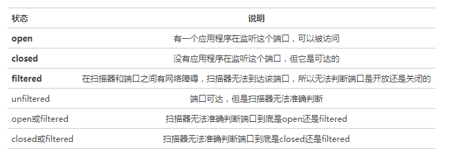
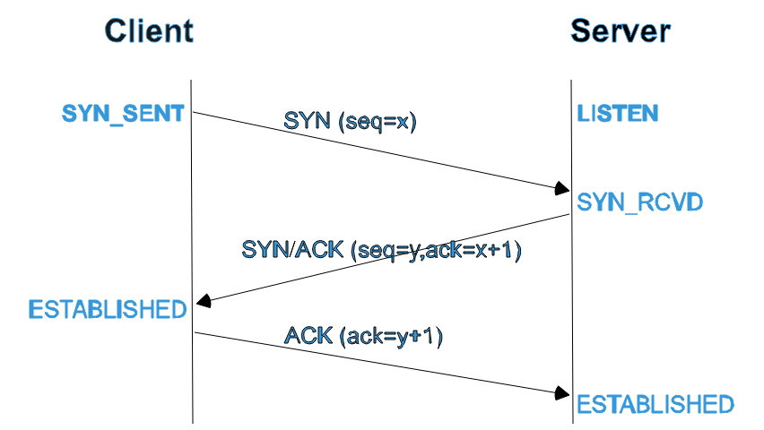
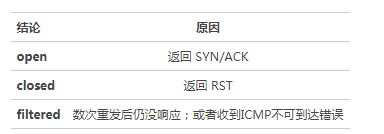
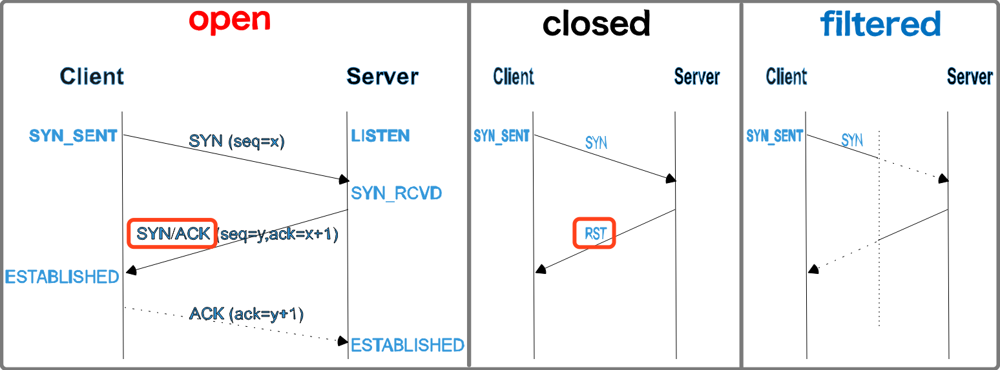
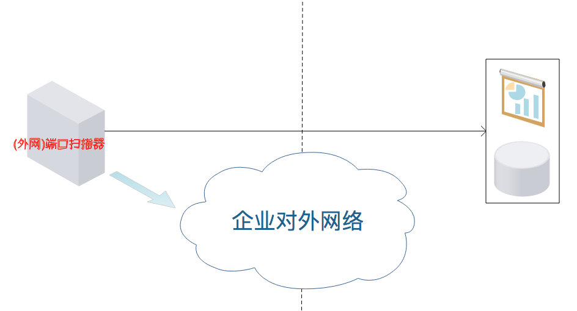
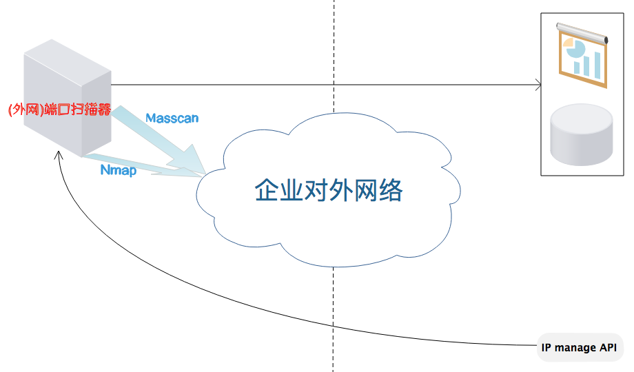
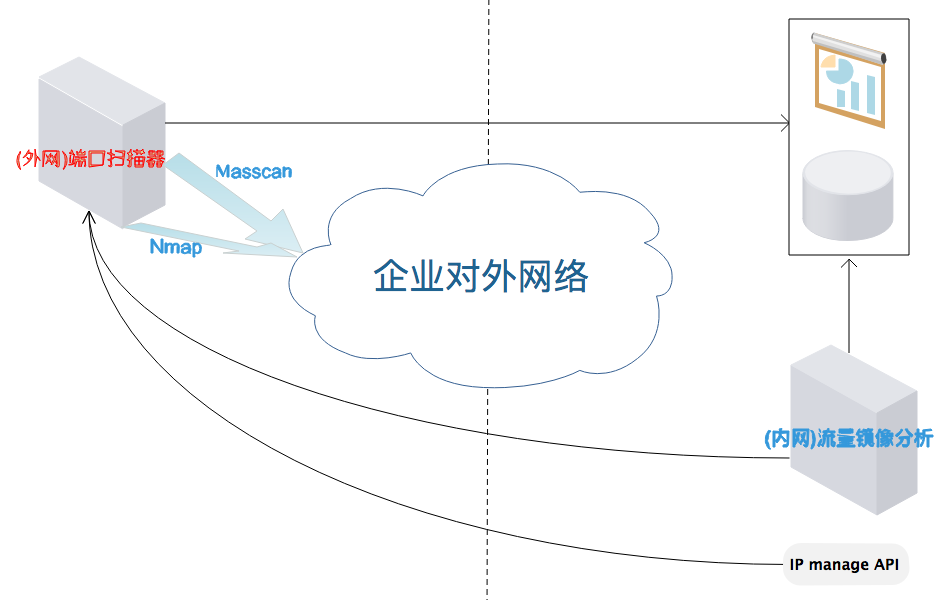

原文 by [美团点评技术团队](https://tech.meituan.com/security_port_monitor.html)  

## 背景
外网端口监控系统是整个安全体系中非常重要的一环，它就像眼睛一样，时刻监控外网端口开放情况，并且在发现高危端口时能够及时提醒安全、运维人员做出相应处理。  

对安全人员来说，互联网公司在快速发展壮大的过程中，外网边界的管控容易出现照顾不全的现象。最初我们用Python+Nmap开发的外网端口监控系统，在公司边界扩大的过程中已经无法满足要求了，所以出现过一例因为运维人员误操作将高危端口曝露至外网导致的入侵事件，为了避免再次出现类似由高危端口开放而不知情导致的入侵问题，我们开始重做外网端口监控系统。  

## 意义
要理解端口监控的意义，首先需要知道什么是 端口扫描 ，根据Wikipedia的定义：  

> 端口扫描的定义是客户端向一定范围的服务器端口发送对应请求，以此确认可使用的端口。虽然其本身并不是恶意的网络活动，但也是网络攻击者探测目标主机服务，以利用该服务的已知漏洞的重要手段。  

对于攻击者来说，端口扫描往往是他们从外网发起攻击的第一步。而对于企业安全人员来说，**端口监控则是我们预防攻击者从外部直接入侵的一条重要防线**，它可以帮助我们：    

* 以攻击者视角了解企业外网端口的开放情况，看我们是否存在容易被利用导致入侵的点
* 赶在攻击者发现外网新开放的高危端口之前发现并修补漏洞，降低系统被从外部直接入侵的概率

## 方法
对企业的外网开放端口进行监控不外乎两种方法，一种是类似于黑盒审计的外网端口扫描，另一种是类似于白盒审计的流量分析。从原理上来说流量分析的方式肯定是最准确的，但这对软硬件都有一定要求，一般的公司不一定有能力做好；外网端口扫描的方式比较直接，虽然也有一些环境上的依赖，比如网络带宽，但总体上来说要比流量分析的要求小得多，大部分公司都能满足。这里我们主要介绍一下外网端口扫描的方法，另一种流量分析的方法，以后请具体负责同学给大家分享。  

### 方法1：外网端口扫描
在这里我们先简单介绍一下端口扫描的原理，以帮助各位对这块不太了解的同学有个基本的认识。  

### 端口状态
下面以最知名的端口扫描器Nmap对端口状态的划分进行一个说明：  
  

但一般情况下我们不用分的这么细，这里为了方便起见，将一个端口的状态粗略分为3种：开放、限制性开放、关闭。其中「限制性开放」指的就是做了访问控制，只有指定白名单列表中的主机才能访问，其它的都无法访问，可以简单认为是上面的filtered状态。  

### 扫描方式
#### TCP SYN扫描

我们选择TCP SYN扫描的理由：  

* 执行得很快，在一个没有防火墙限制的快速网络中，每秒钟可以扫描几千个端口；
* 相对来说比较隐蔽，不易被注意到，因为它从来不完成TCP连接；
* 兼容性好，不像FinNullXmasMaimon和Idle扫描依赖于特定平台，而可以应对任何兼容的TCP协议栈；
* 明确可靠地区分open（开放的），closed（关闭的）和filtered（被过滤的）状态。

### 扫描原理
对于学过计算机网络的同学来说，TCPIP建立连接的3次握手过程想必应该不算陌生，大体流程如下：  
    

我们这里使用的TCP SYN扫描就是通过先主动发送一个SYN报文给指定端口（**之后并不回复任何报文，不完成TCP连接**），然后根据端口的返回信息做出判断，判断结论分为以下3种：  
    
图例如下：  
    

### 方法2：流量分析
> 源码面前，了无秘密。

技术同学估计对侯捷老师的这句话不会陌生，这里我想将这一句话改一改以适应我们这里的情景：  

> 流量面前，了无秘密。

通过流量分析，我们可以及时知道有哪些端口对外开放了，然后通过解包分析的方式获取它使用的协议以及提供的服务，对于无法准确判断的，我们可以再用外网扫描的方式进行补充判断。  

### 演进过程
#### Nmap
早期我们就是通过Python调用Nmap进行的扫描，但随着公司规模的不断扩大，网段的不断增加，Nmap扫描的弊端就逐渐凸现且无法弥补了——大网段全端口扫描周期太长，无法及时出结果（一个扫描周期可能长达2周），也就根本达不到外网端口监控的目的了。直到后来出现了Masscan。  

#### Masscan
大体架构如下：   
      

Masscan是大网段全端口扫描神器。  
就扫描速度来说应该是现有端口扫描器中最快的，同时准确性也比较高。在确定使用Masscan之前我们拿它和Zmap、Nmap一起做了对比测试，限于篇幅，具体的测试过程就不发出来了，这里只说测试结论：用TCP SYN扫描方式，对一个小型IP段进行全端口扫描，Masscan速度最快，准确性较高，可以满足需要。  

#### 经验分享
1. 扫描服务器的带宽是关键；
2. 扫描最好避开业务高峰期；
3. 扫描选项需要根据具体带宽、机器配置、扫描范围、扫描速度要求进行调优；
4. 只要是远程检测的方法，就存在一定的不确定性，检测结果的准确性只能接近100%，无法达到100%，所以不要完全依赖外网扫描的结果；
5. 实际情况中单IP的开放端口数是有限的，如果你发现扫描结果中有单个IP开放了大量端口，你就要注意该IP对应的设备是不是在「欺骗」你了；
6. 前期对扫描结果做一个完整的梳理，后期只需要处理新增的高危端口就行。

#### Masscan+Nmap
在Masscan版本上线了之后，全端口扫描的速度得到了大幅提升，外网端口的开放情况也了解的比较清楚了，但是对于Banner的获取以及具体服务的识别还达不到要求，而这也不是Masscan的强项，所以这时候我们就需要借助Nmap丰富的服务指纹库来提高我们监控数据的准确性了。
和之前相比，就是在Masscan全量扫描环节之后增加了一个只针对判断为开放的端口用Nmap进行增量扫描的环节，然后将结果更新至数据库方便展示、分析。大体架构如下：    
   

#### Masscan+Nmap & DPDK+Storm+Nmap
外网的扫描有它的优势——以攻击者视角获取当前外网安全状态，但是因为Masscan全端口扫描再快他也是需要时间的，特别是在网段较大、带宽有限的情况下。所以单独的周期性外网扫描就存在一个天然的真空期，如果在这段真空期内，内部员工因为大意将测试端口对外，且忘了关闭的情况下，就可能会被攻击者进行利用，为了应对这种情况（即便可能性比较小），我们决定从实时流量中进行分析，实时找出对外开放的新增异常端口，然后调用Nmap进行扫描，以解决单独外网扫描存在的真空期问题。大体架构如下：  
   

#### 经验分享
1. 联合相关兄弟团队全面梳理IP、设备资产信息，同时资产变更系统化（避免手工操作）势在必行；
2. 扫描范围最好（一定）通过API拉取，避免出现因为资产变动而导致漏扫的情况；
3. 这种情况下安全监控信息的时效性要高于准确性，但准确性也很重要（所以要先拿Masscan缩小范围，再拿Nmap获取细节）；
4. 发现典型高危案例要记得抄送双方老板，在有可能的情况下看能不能升级至更高层面，因为制度或政策的确立由高往低会比较好推动。

## 延伸扩展
端口监控系统除了可以起到监控外网开放的新增高危端口的作用之外，还可以考虑从以下几个方面扩展一下它的功能和效果，以实现效用的最大化：  

### 1. 系统漏洞扫描器联动
对于非安全的同学来说，他们会很难理解一个外网开放端口能造成多大的危害，所以经常会出现当安全人员找到他们的时候，他们不认为这是一个安全问题，因此沟通起来会有点麻烦。  
虽然问题最终都会得到解决，但如果能有一个直观的演示给到他们的话，他们也会更愿意配合我们去修复以及避免这类问题。所以和系统漏洞扫描器的联动对于推动问题的处理和漏洞的修复是有帮助的。  
注意事项：避免高风险性扫描操作；需要人工确认后主动触发。  

### 2. Web漏洞扫描器联动
通常情况下我们会认为，新增Web端口对外是可以接受的，但这是建立在对应的Web系统通过了完整的内部安全测试的前提下。当碰到类似于为了方便起见将Zabbix的Web系统对外，且为弱口令时，情况就不那么乐观了，这时就可以通过调用Web漏洞扫描器自动对暴露在外的Web系统进行扫描，并将结果及时通报，以减少这类问题带来的危害。  

### 3. 内部漏洞管理系统联动
可以获得的好处有：    

* 自动录入，由漏洞管理系统流程进行自动跟进，效率提升；
* 结果在漏洞管理系统中进行展示，风格统一。

## UDP 高危端口监控
上面介绍了常规服务器的TCP端口监控，意在提醒大家注意一下服务器的安全；但还有一类UDP端口安全的问题上面没有介绍，也容易被忽略——防火墙、交换机等网络设备的安全。在2016年8月份的时候The Shadow Brokers公布了一款针对思科Adaptive Security Appliance（ASA，实际涵盖了防火墙和路由器设备，PIX也在其列）产品的漏洞利用工具ExtraBacon，虽然漏洞利用有一定条件限制，但是一旦漏洞利用成功，攻击者就可在无需输入身份凭证的情况下建立起SSH或telnet连接。就是不需要输入有效用户名或密码，就能闯进ASA，危害巨大。  

针对这方面的问题，有以下几点建议：  

* 快速监控部分高危UDP端口的状态；
* 如无必要，关闭服务对外访问；
* 如有需要，尽早升级且限制访问IP来源。

## 结语
本文主要介绍美团点评安全团队对外网端口监控系统的开发演进过程，整理总结了其中的一些实践经验以及前景展望。欢迎大家批评指正，有好的建议也希望能提出来帮助我们改进。我们后续将不断优化，也将继续与大家保持讨论。耐心看到这里的读者，表示十二万分的感谢！  