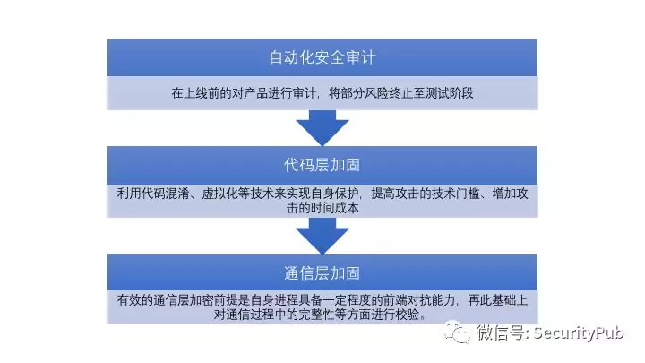
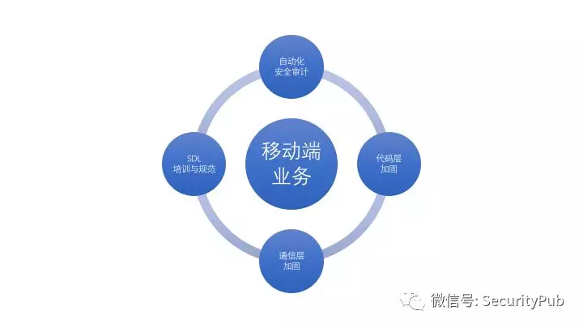
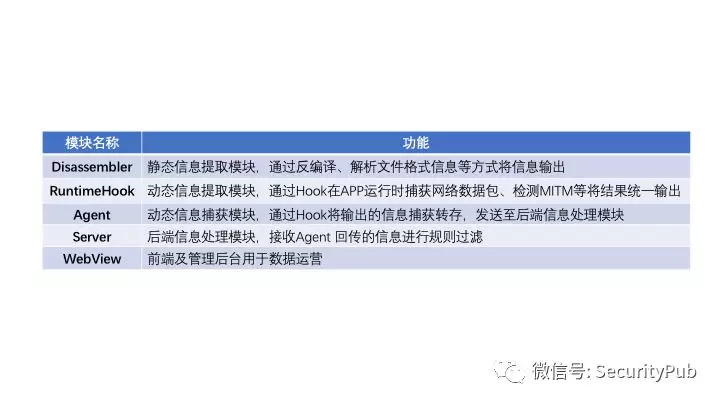
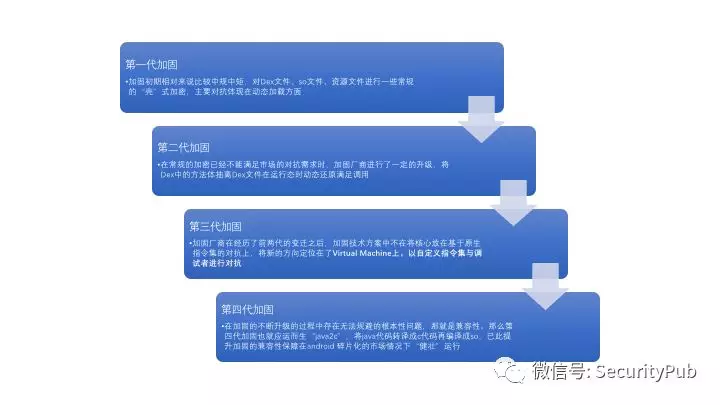
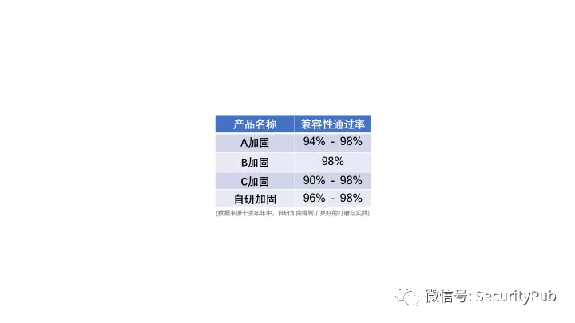

原文 by [掮客酒馆](https://mp.weixin.qq.com/s/5whLNkfSUpW6zQNxQf7HqQ)   
 
## 前言
由于移动互联网的普及，移动端应用已经取代传统的PC与Web端，覆盖了几乎所有的互联网业务。与此同时，行业内同类产品的竞争、黑色产业的视角也逐渐转移到了移动端的业务上，直接导致近几年移动端安全攻防愈演愈烈，在此基础上衍生出的攻击手段自然也是层出不穷。攻击方的技术方案在不断的攻防对抗中愈发精巧，攻击行为的隐蔽性的也在不断提高。  
移动端应用安全是整个复杂的移动安全生态中的重要层级，也是与企业业务安全性关联最紧密的层级。虽然系统级的安全漏洞可以造成防范的影响与重大危害，但是一方面由于系统漏洞带来的威胁发生几率较小，另一方面在此类漏洞实践发生时，企业往往能做的也只是布置临时的应急策略保障对应的业务不受侵害。所以，系统层级的安全问题我们暂且不论，将目光聚焦于互联网企业最应该关注的移动应用与业务安全。  
在如今的移动生态环境中，笔者所理解对业务影响较大的安全问题主要分为三类：  
* 产品被逆向分析后所衍生的薅羊毛、数据爬虫与外挂等
* 前后端接口鉴权不严格造成的数据泄露
* 由组件权限、输入边界模糊造成的或大或小的安全隐患

笔者对以上的问题结合自身安全从业经验进行了一些思考与探索，试图将如何保障移动业务安全这个复杂的问题逐步拆解。在过去的一年中进行了一些具体性的方案实践，在此分享一些在探索过程中不成熟的思考与体会。  

## 正文
在互联网企业中移动端业务相比较传统IT公司的占比大大增加，业务也更加复杂。为了能够及时、全面的的保障不同移动端业务的安全性，笔者将从三个方向入手，分析移动端安全威胁产生的原因与应对方案。  
  

在利用技术孵化产品对抗风险之外，往往容易被技术出身的我们忽略的一点是规范化的移动端安全要求以及科普性的移动端安全培训。目前除少数公司如Google、Amazon外，绝大部分公司安全风险的内外检出比例其实都不太乐观。在这其中也可以分为两类公司，其一是产品在发布时对风险缺乏感知能力、另一种则是发布时已知漏洞已经进行了修复。虽然产品在发布时已知漏洞已经修复，但随着时间推移在线上运行的版本扔会暴露出新的问题，如果对此类问题无法感知终将会成为威胁业务主体的安全风险。  
安全开发生命周期（Security Development Lifecycle），也就是我们俗称的SDL可以使产品在生命周期内的设计、代码和文档中与安全相关的漏洞减到最少，尽可能的在产品版本回归前尽早地清除漏洞。科普性的宣导、规范性的制度这些在日常工作中其实对业务研发人员的约束力及其有限，它仅能作为一种规范去指导与约束研发人员的日常代码迭代，但人员的不可靠性告诉我们必须有相应的监管手段，确保制度的落地执行，将风险尽可能多的转化为可控风险，所以我们需要一种“关门打狗”的能力，否则一切制度皆是空谈。 
     

那“关门打狗”的审计节点放入哪里更合适呢？这是个值得思考的问题。如果的产品是一款白盒审计的扫描器，那么在Git提交处看起来更合理，但笔者假设一种极端情况：如果公司内部并未统一编码规范、业务代码混乱不堪，那么将审计节点设置在此还是否真的合适。  
我更倾向于审计编译后的产物，黑盒审计也会有多个位置可以安置，哪怕是确定设置在CI平台(Continuous integration 持续集成)上具体应用时也需要思考初期的审计颗粒度是以APP还是SDK组件为单位。在运营思维下思考作为安全方服务于业务，首先要杜绝的情况就是对业务正常发展造成过度干扰，而上线审计节点后根据自身设定的SLA能否在预期之内不对业务造成困扰的情况下对整个APP进行审计，我觉得是不能的。按照金丝雀模式，我推荐将颗粒度设置到SDK组件层面，这样做的好处有几点：首先不会对业务侧造成过度干扰，其次在一定规模以上的公司中模块化开发已成常态化，并且可以预计算式对库存未审计完成全量清理后，再行将CI平台的审计节点开启阻断。  

## 自动化安全审计
对于移动端APP的安全审计完全通过堆人力人工进行审计的方式在我看来是不划算的。对于业务大版本更新时人工审计和Review自动化审计结果是有必要的，但对于绝大部分情况下日常的版本迭代依靠人工进行审计的意义其实并不大，所以针对这种情况自动化监测也就呼之欲出了。快速搭建一个自动化审计平台的话至少需要五个部分：  
    

Android 平台的应用我们对dex文件格式中的相关struct进行一些解析，并通过一定的规则进行匹配进而完成部分的审计工作。目前对于静态分析安卓程序有两种不同的方式，一类是通过java伪代码进行自动化审计，另外一种则是通过smali汇编进行自动化审计，这两种优缺点都很明显：  
第一种通过一些工具例如dex2jar此类的工具(当然也可以自研，实现难度也不是很大)将dex文件反编译为java伪代码，然后利用设定好的规则通过正则匹配的方式进行“伪白盒审计”得到存在安全风险的name.java文件，并且规则建立相对简单。听起来这似乎是一种优雅的实现方式但坑点在于有些函数没有办法被dex2jar还原为java伪代码，所以这样的方式终究是会存在一些“漏网之鱼”而且单个job的工作时间会因为转化java伪代码而大大延长。  
第二种是通过分析smali汇编，这种方式可以规避掉这样的问题，通过dex2smali类型的工具将dex文件反编译为smali汇编。整体的实现思路和设计一款反汇编引擎类似，在实现规则匹配或者其他功能前首先要完成一个最基本的功能那就是界定函数边界，值得高兴的是我们并不需要像设计反汇编引擎时界定函数边界那样麻烦，通过.method和.end method很容易的可以区分出函数代码块，然后同样是通过规则匹配的方式进行“伪黑盒审计”得到存在安全风险的name.smali以及行号，这种检测的方法相对前种方法颗粒度更细一些，可以快速定位到具体类下的具体方法，并且单个job的工作时间会因为不需要转化java伪代码而大大缩短，但相对来说规则的建立也相对复杂的多。  

iOS 平台的应用并不能像Android一样通过中间码转化成伪代码的形式进行审计，不过幸好目前市面上大部分iOS项目的开发语言还是基于objective-c，因其Runtime的实现机制在macho文件格式中类名、方法名、属性名得以保存，利用正则匹配的方式大部分情况下通过关键字符串可以检测例如不安全的函数、框架等。  
如果单单依靠ipa包中的macho文件和其他文件提取信息来说其实还不能够满足静态审计的需求，有相当一部分的匹配工作是基于ARM汇编的取点特征码进行判断，如果想在这部分做的相对深入些、不局限于特征码匹配的话，其实可以引入一套反汇编引擎来实现更多有趣并且实用的功能是个不错的选择。在反汇编引擎的选择上，推荐使用Capstone这套引擎，这套引擎是从LLVM项目的组件中移植拆分了部分出来，支持的指令集种类是目前已知的反汇编引擎中最为全面的，可惜的是因为从LLVM移植出来的原因(项目开发语言从C++移植C语言)项目十分“臃肿”，内存消耗会比一般的引擎高出许多，这也算是美中不足的瑕疵。  
动态审计这里其实没有什么太多可说的地方，普遍的来说可以分为几大类：输出信息、数据存储、网络请求、敏感数据使用还有iOS存在后台快照等等，大家的方式都是Hook钩住一些大同小异的点比如说通信收发包的API、一些开源框架从这些方面进行入手。  
这里面可能值得一聊的有两点，首先在于动态审计得到的数据可以二次利用到一些别的方向，例如网络请求的request、response可以对接给Web扫描器同步进行扫描一些后端的问题；另外要提的一点就是如果想把自动化审计做好要考虑的点其实不是如何从广度出发去增加检测范围，而是如何增加自动化的深度、可以调用到更多的业务代码逻辑路径，普遍的做法都是从UI控件的遍历入手但这个方法和Hook一样都存在一个无法规避的问题“埋点越深要处理的消息、事件就越多”，直观反馈出来就是一次job的周期很慢，目前来说也只能与可用性之间取除一个能接受的中间值而已；最后数据可视化与积累这很重要，这可以有效的缩短应急响应时间。  

## 代码层加固
利用自动化的方式去将常见的风险规避在产品上线前，但安全审计后仍然是会存在一些隐藏很深的安全问题。这部分隐患因为已经随着版本上线在用户设备上运作，我们能做的就是增加利用安全隐患或漏洞的成本，在APP上线后将直接面临着多方面的风险，除了前面提到的发布生命周期中未发现的问题外还会面临着被第三方分析、劫持、利用的风险，如何保护APP的代码也就成了问题的关键。  
    

对于Android加固的衍变大概可以分为上图所述的四代，当前其中有一些小插曲比如第一代从最初的解密后落地加载衍变成不落地动态加载、在移动端虚拟化保护在成型前的一二代加固混合加密，这些相对来说更细致的细节并没有在上图中所展示。  
从攻击的角度来说，第一代加固将Dex文件整体进行加密通过自实现DexClassLoader的方式来进行加载，后来各家厂商进行了升级不将Dex文件解密后落地加密，直接在内存中解密后使用自实现DexClassLoader进行加载，这样的思路与早期在windows平台内存加载dll的一致，所以我也更喜欢将这种改进称为内存加载。但不论如何这种第一代的加固脱壳相对来说都比较简单，通过Hook文件读写相关函数或者内存dump都可以达到脱壳目的。  
第二代加固后的app文件Dex文件其实可以说是“缺失”的，在运行态时将Dex中已经抽离的方法在动态开辟出来的内存里映射补全，以此满足函数调用时可正确调用。这种类型的加固需要在虚拟机处理时Hook部分函数得到具体执行的类与方法再进行内存dump并修正Dex文件结构来达到脱壳。  
我们是从虚拟化开始去设计的一期加固也就是上图所说的第三代加固产品，这种类型的加固产品需要去设计自己的指令集解释器，从设计实现的角度来说技术实现成本相对较高。结合上一代代码抽取的思路，将需要保护的方法从Dex文件中抽取按照自研虚拟机解释器的指令集规则转译成VOPCode(Virtual Operation Code)转至native层通过java的jni接口进行调用，未被保护的方法将继续运行在Android原生的虚拟机上执行。  
在我们研发加固的第一期后对自研加固及几家知名加固进行了一次兼容性测试对比，测试的方式是依托于第三方测试平台随机抽取50台热门机型进行兼容性测试，具体数据如下：    
    

我们最终得到的测试数据显示，自研产品及商业加固产品都存在一个对Android 4.x系统的部分机型适配不当的情况(在研发过程当中我们发现在一些机型上即使是原生未加固的apk文件也是会发生无法安装或者运行失败的状况)。为了解决这一问题提升安全产品的可用性，我们团队将加固产品向java2c等更加稳定的方向研发，java2c即通过指令集转译的方式将java逻辑转换为c代码，再用特定的编译器和改造过的NDK(Native Development Kit)将其编译成so文件，使用时通过jni接口进行调用，这样既可以提高适配的兼容性同时也解决掉了传统java2c后强度变弱的情况，经过QA的数据对比我们团队自研加固的性能耗损大概为业界同强度商业产品的十分之一。  
至于iOS上可以通过LLVM框架打造工具链，在前端编译不同语言的代码文件做词法分析以形成抽象语法树AST，然后将分析好的代码转换成LLVM IR（intermediate representation）；再通过Pass优化器模块对中间层IR进行优化混淆，通过一系列的Pass对IR做优化；后端负责将优化好的IR解释成对应平台的机器码。LLVM的优点在于不同的前端语言最终都转换成同一种的IR最终对应平台的汇编指令集，且项目结构中的任意部分都可独立拆分使用。  
因为App Store上架审核的关系，我们并不能像在其他平台做加固、壳一样进行动态解码的操作。有一个开源项目叫做OLLVM，是瑞士一所大学实验室的开源项目，该项目基于LLVM编译器框架提供一套在编译期进行代码混淆的安全编译器，以增加对逆向工程的难度。我们同样选择基于LLVM框架研发iOS加固产品，但因为OLLVM项目的优秀，许多的逆向工程从业者也会去通过代码相关文档(wiki、注释)去了解其功能的实现原理，所以我们不得不重构了其中虚假控制流 (bugosConstolFlow)、平坦流控制化(Flattening)和等价指令替换(substitution)功能，并新添了字符串加密及一些辅助检测的PASS（本文写于去年年中，时至今日我们已经完成了对LLVM后端的改造，不在仅限于前端）。  
除了代码混淆以外还需要注意的就是符号混淆，我们团队研发符号混淆的时间早于MT-OLLVM项目，在研发符号混淆的过程当中我们进行了几次产品升级，最初我们致力于linker后对macho文件进行patch，这种方式没那么优雅且修正兼容性问题很耗时最终弃用。恰好在准备升级改造时我及我的团队正在研发MT-OLLVM项目索性将这个功能合并入MT-OLLVM项目当中，但这种实现方案在产品可用性上会存在两个问题，在公司中必然会存在大量的内部pod库用于跨团队使用，基于编译期混淆无法支持pod库并且我们在编译期无法优雅的修改xlib和storyboard文件。为了解决这两个问题增强产品的可用性我们将前两次的设计思想进行了整合从编译后的macho文件进行符号提取，再介入预编译阶段重新编译完成混淆以此来支持pod项目与动态修改xib和storyboard文件。我们在去年推广产品覆盖的过程当中反思一些实际投入使用后的发现项目弊端，在较大的项目当中编译时间翻倍是比较困扰业务方的一个问题，最终我们确定的新的改进方案基于源码文件做语法分析提取符号，替代了从macho文件中提取的原有方案极大的提升了可用性。  

## 通信层加固
代码混淆技术是对抗逆向分析最直接、有效的方式之一，但往往人们在只对二进制进行加固后，却忽略了客户端与服务端之间的通信也是攻击的薄弱点，从而提供了攻击行为的切入点。我所见到的情况中往往都是对二进制进行加固后就觉得高枕无忧了，但这种认知存在“认知盲区”。例如如果分析者所关心的是如何通过APP进行数据爬取，又恰好APP在通信时的request和response中没有需要算法加密或解密的字段，分析者轻而易举就可以得到自己想要的东西。不过幸好现在的企业中移动端APP绝大部分重要接口或普通通信接口都会存在一些需要使用算法计算而出的字段，而这部分的保护就取决于APP自身所用加固产品的安全对抗能力是否足以挡掉初级、中级的分析者。  
在客户端向服务端发起请求时对request进行校验生成校验值并添加到request中向后端进行传输，位于Nginx层有相应的校验脚本对从客户端发送过来的request进行校验，失败将终止本次请求、成功则将request放行至业务Server上。  
设计一款产品时我们通常会需要设计一套或多套兜底方案来保障其足以应对一些突发情况，而通信层的加固与代码层加固之间的关系我觉得同理，即“互为兜底”。不论多么优秀的通信层加固也无法解决自身很容易被分析hook的弱点，而不论多么优秀的代码层加固也无法完全解决外部对其进行协议分析的隐患，但如果你的公司恰好有两个优秀的产品那么让它们互为犄角之势是最好的选择，同时也将极大的提升移动端产品的安全性。当然也可以增加一些安全对抗、环境检测以及一些自校验的相关功能，以此增加更多的防御策略，更好的保障数据完整、机密的传输。  

## 后记
攻防之间无绝对，在移动产品的生命周期内哪怕我们经过了基于客户端做了完善的攻防对抗、上线前的安全检测、业务运行中基于网络通信层的完整性校验、标准化的SDL检测，但这一系列的防御可以也只能帮我们挡住八成、九成的攻击行为，最后仍然会有一部分经验老道的攻击者可以去进行一些不可描述的事情。在互联网企业移动端业务发展到一定规模后，移动安全方向所输出的解决方案也需要更加贴合到保障公司业务的层面上，而非将自身及团队局限在传统意义的攻防对抗困境中。所以，在将上文所述的移动安全基础组件上线完毕后，我们除了在已有领域的深耕之外，会持续进行一些与业务安全紧密贴合的探索。  