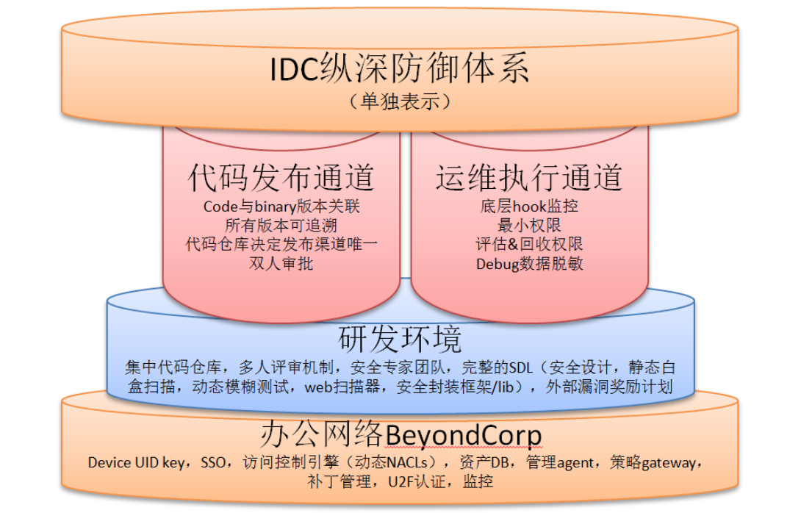
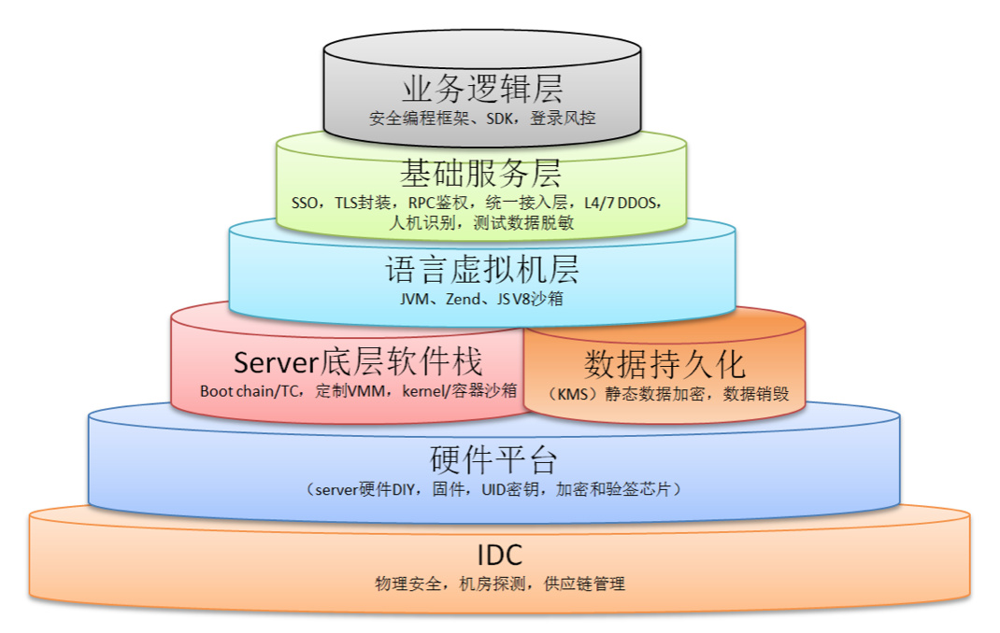
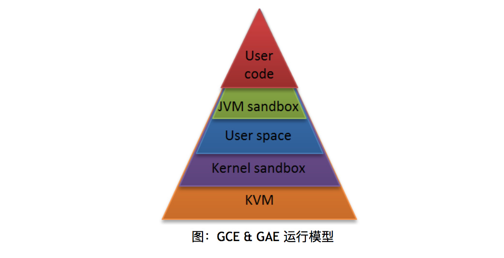

原文 by [美团技术博客](https://tech.meituan.com/GoogleSecurity_ayazero.html)    

此前Google在安全领域披露的信息一直很少，适逢其大力发展云计算业务，需要展示云安全方面的实力，才有了这份白皮书。它从系统的角度描述了自己安全体系的设计与实现，对广大互联网、云计算公司的安全小伙伴而言可谓一大福利。本文中，笔者将从一个企业安全建设者的角度，说说自己的感想，并做一些解读。    

## 几点感想
1. 国内很多公司的安全团队都是游离在产品研发、基础架构和SRE团队之外的，HIDS、WAF、大数据的SOC，说到底这些东西安全团队自己就可以搞定，基本不需要其他部门的支援和介入，这和乙方安全公司提供的一套外科手术般的解决方案的思路是一脉相承的。而Google的安全体系给人的感觉是跟基础设施深度融合，完全内置于产品设计和研发过程之中，从顶层设计的视角看完全是两种流派：内置的安全机制vs外挂的防护体系。  
2. 没有业界安全大会上那些花俏的概念和名词，全都是正统的安全设计思路，以既有的简单的安全手段解决复杂的问题，有如教科书般的绅士风格。  
3. 工程化大于单点技术突破。尽管Google有Project Zero、有不少牛人，不过似乎没有特别强调单点技术，更多体现的是在一个海量的规模下解决安全问题的工程化能力。  
4. 在产品服务基础架构层面可以看到Google有一个清晰的顶层架构设计，例如全局的IAM和Borg服务。尽管可能这个看似完整的体系也是一路迭代而来，但至少从现有的积累看，从全局的层次抽象，全局资源鉴权，收敛统一用户和流量入口，收敛分散的认证&鉴权点，在每一个对应的抽象层次上做纵深防御，全局的访问控制模型等等看上去更像是精心规划和设计出来的。  
5. 得益于Google自研的技术栈范围实在太广，因为一切皆自研，所以一切安全皆可DIY，对其他公司而言这反而是一个封闭的王国，因为不太可复制。
6. 能否追的上这个安全体系，已经不取决于单点技术亦或是攻防技术是否ready，甚至不取决于安全团队的强弱，而是取决于公司所处的阶段和整体技术实力。  

## 整体安全体系图解
Google原来的图有点类似于ISO27001，框架性很好，但也终归是一个对外的版本，信息披露上比较粗线条，对于更想在实践层面模仿的同学来说比较抽象，所以笔者以自己的理解重新归纳了两张图。第一张图展示了Google的整体IT环境，包括办公网络、生产网络以及交互通道的整体安全视图：  
  

假如一开始不好理解也没关系，先有个框架性认识。总体上可以抽象为办公网络和IDC都有纵深防御体系，研发环境属于办公网络之上的一个特殊子集（这里并没有披露内部IT的其它系统怎么建设的），办公网络和IDC生产环境之间有限的数据通道都做了风险控制，采用“2+2结构（2个纵深防体系+2个数据通道）”。  

第二张图再单独分解一下IDC的纵深防御体系：  
    

更具体的实现在后面的章节里展开，最后可以再回过头来看这张图。  

接下来，我们按照白皮书原文的顺序一一解读。  

## CIO视角（宏观）
关于CIO视角，我们要Get几个点：  

1. Google有一个全球范围的基础架构，除了表达IDC基础设施的广泛程度外，也暗含了拥有全球范围的合规性。国内有少数比较大的互联网公司正在国际化的进程中，海外的合规性可能会成为一大挑战，国内公司中拥有成熟的全球合规性及全球化安全运营经验的大约只有华为和联想，其中华为又因为云计算和海外的手机云服务在这方面积累了其它国内公司暂时不可比拟的经验。Google有很多细微之处都提到了隐私保护，国内的因为法制不太成熟，没有太多的强制合规性以及公民隐私数据保护的压力，所以接下去对很多业务开始向海外扩展的公司，这些都会成为安全部门日历表上的待办事项。题外话：笔者在《互联网企业安全高级指南》一书中“隐私保护”一章写的其实是数据保护，意义有所偏差，打算第二版重写，有可能在美团点评技术博客先发表，敬请关注。   
2. 安全设计覆盖全生命周期，别提那些连SDL都没有实施的公司了，G厂显然是比SDL更高级的版本，强调“设计”二字。而国内拥有安全设计能力的从业者比较稀少，所以业界的话题和氛围上这方面都相对欠缺。   
3. 成本：500个专职工程师，其它方面也都是大手笔，但不确定在安全的投入上是不是“不计成本”的态度。  

## 物理安全  
Google自有IDC的物理安全手段：生物识别、金属检测、摄像头、路障、激光入侵检测，同时Google要求使用的第三方IDC的物理安全措施对其完全可控。  

物理安全这件事哪怕在很多安全从业者心里也不过是ISO27001的一些章节和控制点，并非是很多人对于安全体系建设发自肺腑的真实需求，很多人对安全建设的认知往往是对抗线上入侵者。然而这也暗示了，不同的人、不同的厂商所建立的安全体系用来对抗的目标和范畴是完全不一样的。类似Google、Amazon、Apple这类公司他们的安全体系用来对抗的几大场景可以归纳为：黑客、第三方、雇员、IDC/云服务提供商、商业间谍、政府机构，对抗的强度依次上升。换言之，可以举例翻译为：即便我使用第三方的云服务，仍然可以保证自己的数据不被偷窥。对于成为国家基础设施的服务而言，实际上另一种不能明说的需求就是介于民用领域和军用领域之间的对抗需求。  

大量公司的安全体系主要是用来御外而不是防内的，所以供应链安全、数据泄露这等事情都很头疼。基于此推断，即便修完了所有的漏洞，做了入侵检测，也不足以对抗很多威胁，安全这件事做的好不好，更多的还是看你拿什么尺子来衡量。看完Google安全体系，笔者推测大多数人的反应是还是它做的已经远超出一般意义上的防黑客。  

## 硬件安全
对绝大多数公司而言都不会涉及这个章节，因为大多数公司也就顶多白牌服务器，而不是从主板到芯片全都自研。以前觉得华为、Apple这类公司用TC（可信计算）的概念还是用的比较多，但是感觉BAT都不玩这些，到后来分析iOS就一下明白了这个其实是由产品和服务所涉及的技术栈深度决定的，因为华为、Apple这类公司的产品线横跨硬件、OS和上层应用，而BAT等公司造轮子（自研）的范畴大多止于软件，所以很少涉及，甚至在这些公司早期的安全团队里大多数是由Web安全技能的人组成的业务驱动使然。  

从描述上看，Google硬件到底层软件栈的安全设计跟iOS基本是一致的，都是基于可信的思路，上一层（软件）验证下一层（硬件/固件）的完整性，并区分唯一标识。用唯一标识+信任链来鉴别是否合法的硬件来源（而不是IDC提供商在机房里偷梁换柱换了台服务器）。  

更上层的部分，例如引导程序、内核、启动镜像的完整性都是启动信任链的一般实现，有兴趣的同学可以参考一下iOS的设计与实现。硬件唯一标识会成为后面提到的全局访问控制体系的前提之一。  

这里还有一条很重要的信息：Google在自己的生产网络引入了NAC（网络接入控制）机制，这个安全手段本来是为OA办公网络的终端管理场景设计的，目的是区分不信任的终端不能接入（相对可信）的公司网络。这样做可以想象几个场景：假如机房管理员从回收垃圾那儿找到了废弃的服务器，数据也没被删除，即便进入了机房重新插网线也接入不了网络；甚至进一步推测，第三方供应商跑到IDC接上自己的MacBook想用Nmap扫描一把估计也不行。  

## 服务部署
Google在IDC内部服务治理上最大的不同是：不信任IDC内网（注明：尽管思路上可能有相似之处，但与G厂自家在办公网络的安全解决方案BeyondCorp不是一件事）。很多公司的IDC生产服务网络被设计为私有云模式（单租户），在安全上相对的信任IDC内网通信，通过2层/3层隔离或者类似IP白名单的方式来建立IDC内网的弱访问控制体系和信任模型。而Google则是天生设计成多租户（公有云）模式，把原本用于对终端用户（2C端）的认证鉴权机制完全用于IDC内网的服务间通讯，服务间通讯有完整的双向鉴权，是一个强访问控制体系。笔者推测这样做可能是有几方面的原因：  

* 同一个服务的不同实例可能被部署为跨物理机、跨机架甚至跨IDC，与其它的服务实例混合部署，原来相对集中的通过IP的访问控制模型已经不太适用于完全分布式的架构，过于分散的多点对多点的ACL规则想象一下就头疼，于是就出现一个情况：要么访问控制很粗很大条效果不明显，要么很细但是规则几乎没法写。  
* 第二个原因可能是由于server和服务实例规模数巨大引起的海量ACL条目难以维护的问题，干脆扔了，用完全的鉴权。  
* 如果用传统的访问控制手段，例如VXLAN隔离、交换机ACL、主机iptables规则会无法维持一个巨大的弹性内部网络，服务扩容时都会受到阻碍，监控、调试和诊断都会更难。之前有同学提出通过主机安全agent动态生成白名单的内网隔离思路，现在Google则在这个问题上给出了自己的解，这也揭开了我在《互联网企业安全高级指南》中没有写出来的部分:)。本质上这是由规模量变到质变引发的问题，如果你的IDC内网只有几台机器真没必要那么做。Google也强调了自己有做网络隔离和防止IP欺骗，但没有把这个当成主要手段。    

发布安全：Google的所有代码存储于一个集中的代码仓库，同时保留当前和过去的版本，每一个发布的二进制文件都能关联到构建时的源代码版本，这里暗示了Google有做白名单和完整性校验，其实Google和Amazon都有白名单，但这要求基础架构高度统一。发布时需要至少1人review同意（可以理解为在构建/发布系统中的workflow），任何对某个系统的更改需要系统的owner同意。统一的代码仓库，意味着发布的入口是唯一可控的，版本可唯一追溯，同时交叉的code review可以部分矫正一些内部的不良行为：例如开发人员安置后门，恶意彩蛋等。这实际上是Google研发文化的一部分，不一定是出于安全的原因，不过总而言之，安全是这个流程的受益者。以前有boss问过我离职程序员安置后门程序如何检测的问题，海量Web下不具有webshell & sqli的特征，当初想到结对编程，交叉review，觉得有点理论化。Google给出了的解正好，防止钓鱼，同时防止内鬼，不只是简单的防外，而是防内外，覆盖整个价值链。  
 
同一个机器间的服务隔离，主要通过：Linux原生的用户空间隔离（Android的appid的原理），程序语言和kernel的沙箱，以及硬件虚拟化手段。对于涉及用户提交代码或文件的高风险服务例如Google App Engine & Google Compute Engine会使用多层次隔离和纵深防御（如下图所示），另外对于集群管理和KMS等服务会使用专门的物理机。实际上一般情况下密钥管理会使用专有硬件HSM，至于集群管理服务使用专用机器推测一方面可能有一些完整性校验的安全强相关功能，另一方便可能跟集群管理服务本身的可用性要求及failover机制有关。  
    

业内一直有HIDS（Host-based Intrusion Detection System，主机入侵检测）的技术路线之争，大规模容器时代即将到来，技术路线的选择更是迫在眉睫。业界的一种看法是私有云以Linux用户态为主，关注运维需求，软件兼容性和server本身的可用性需求；另一种则是内核态，以纯安全视角的强掌控型实现为主。从Google的实现里似乎也可以得到启示：G厂走的是公有云，天然多租户模式，使用了内核态路线。当然对于效仿者而言，前提是：  

* 你有很强的保证kernel代码工程质量的能力。
* 内部基础架构、组件高度统一，否则很可能会东施效颦。

Google的内部服务访问控制可配置为特定的服务只允许指定的API或者指定的人才可以访问的模式，实现上通过Machine ID、Service ID、User ID放在一个全局命名空间来做访问控制的基础（注：2C端的访问控制是另外一套体系），支持Group对Group来做多对多的访问控制，同时提供了“two-party control”，即一个变更提交后需要由同group的另外一个管理员approve才能生效，这其实跟分布式事务中二阶段式提交是一个原理，为了保证最终一致性。Google在这些流程的问题上直接套用了工程理论。  

Google自身的工程师访问内部API需要通过这种认证鉴权模式，实际上暗含了另外一个课题：数据安全。这部分在业界比较受重视，但需求往往比较抽象，而在实现方式上更是没有统一的标准，Google的这种方式貌似歪打正着，把2C的鉴权模式用在生产网络和后台系统，实际上是对原来运维通道获取数据途径的更进一步收敛，保留强审计和日志，这样一并连数据安全也算解决了一部分，虽然不是全部。  

Google的内部服务提供全加密通讯的能力，例如HTTP封装成RPC，而RPC默认提供几种不同的加密强度：低价值数据只做完整性校验，高价值的用更强壮的加密等级，跨IDC传输流量自动加密。  

最后举了一个Gmail服务访问联系簿（contacts服务）例子来说明RPC调用的鉴权细粒度，如果ACL设置为允许Gmail访问联系簿这种细粒度是不够的，因为用户A可以越权访问用户B的联系簿，水平权限的这类问题扫描器不容易覆盖，干脆在架构设计上一并解决：RPC请求带用户的ticket走一个内部的SSO（单点认证鉴权）以验证是否可以访问对应的数据，这样就相当于内部的API调用在用户这个细粒度上做了一次全流量的鉴权，从架构上避免了水平权限类的问题。再次回到安全架构的顶层设计，Google的思路就是把所有分散的鉴权点集中起来，在一个高度抽象的层次上做好一件事，最大程度的隔离。  

## 数据安全
Google在数据安全（狭义的，指在IDC侧的部分）上实践的几点：  

* Google是做静态数据全盘加密的。
* 不直接写硬盘，而是通过BigTable、Spanner这种存储服务间接写持久化数据。
* 数据加密与KMS关联，可以理解为用了对称加密，密钥中的一部分来自KMS。
* 与用户ticket相关，可以推测为加密密钥链的顶层密钥每个用户唯一，且动态转换（rotate）。
* 为了加解密性能采用硬件加速。
* 数据销毁流程会使用两道独立的流程来验证（是否删除），不经过此流程的直接物理粉碎。
* Google说自己可以追踪每一块硬盘全生命周期的状态。

上面的内容里除了文件加密那块会有一些技术复杂度，其他都是工程化的问题，想象一下随便去机房拔块硬盘偷数据应该是没戏了，但是对于绝大多数公司而言，能在IDC实现全盘加密而且很可能用的不是文件系统加密，这个是一个很大的工程，实现起来比较困难，所以Google能把这些方案都落地，说明领先了很多年。对于很多公司来说，全盘数据加密会导致IOPS大幅下降，依赖KMS服务可用性指标又会下降，数据丢失和恢复又成问题，所以能实施这些方案背后是整体技术的依赖。  

## Internet通讯安全
暴露在互联网通讯的安全部分总结一下就是几个点：  

* 有一个统一的接入层GFE（Google Front End）。
* 接入层统一做TLS加密以及证书管理，避免业务各自为政。
* 接入层解决了端口暴露外网的问题，虽然选择不信任IDC内网，但是内网仍然是比外网更安全的地方。
* 接入层拥有规模优势，具备抗DDOS能力。
* 骨干网传输、4层、7层流量负载均衡都有流量监测和上报流量行为数据的能力（可以理解为Google自己在这些环节实现了Anti-DDOS）。
* 有一个中央流控服务，负责丢弃流量或限制阈值。
* 接入层有一定的人机识别能力（根据设备、登录IP等做判断，大概是风控服务的基础组件）。
* 因为OTP的2FA认证方式容易被钓鱼，所以现在转而用FIDO联盟的U2F的方式代替OTP。

## 运维安全
1. Google有一套完整的SDL机制来尽可能的保证交付的代码是安全的，这些手段包括：  

	* 内部：集中代码管理，交叉review，安全的代码框架和Lib库、fuzzer、静态代码扫描、Web安全扫描器，有Web安全、密码学、操作系统安全等各领域的专家团负责安全设计review＆威胁建模，并且会持续的将这些安全经验沉淀为通用的安全库和工具等。
	* 外部：高额的漏洞奖励计划。
	* 开源软件：大多数公司对待开源软件的态度可能是跟随策略，即社区发布了补丁我跟着patching，而Google表现出的态度则是，将开源软件和自研软件同等对待，都实施SDL那套安全审计，在例如OpenSSL，KVM等软件上发现了不少CVE漏洞。

2. Google投入很多来保证自己的雇员设备不被黑：

	* 其中最重要的就是BeyondCorp项目，对办公网络进行改造、取消内网、整个OA系统云化，把原来基于物理位置的信任模型（公司办公网络的内网或者VPN接入到内网）改成根据雇员设备状态，用户生命周期内的行为动态的生成访问控制策略，访问控制的细粒度从VLAN/IP收敛为应用级别，例如到一个系统中的某些URL这样的权限。这种访问控制模型可以抑制被APT后横向渗透的受害范围，同时基于云化的方案可以为监控提供更多的数据来源。
	* 为了抵抗钓鱼攻击，雇员认证从OTP改成U2F。
	* 大量的终端管理行为：包括OS最新补丁、限制客户端软件安装、监控下载、浏览器扩展、访问的内容等。

3. 降低内部风险：
	* 监控有基础设施访问权限的雇员（SRE、DBA……）的终端行为，持续评估并赋予工作所需要的最小权限。
	* 数据安全的场景再次出现：Google对生产环境debug数据脱敏，并且雇员对线上用户数据的访问会被底层hook的日志追踪，是否异常行为由安全团队监控，底层的hook在这里大约可以理解为劫持了一些终端和访问通道以及命令执行的信息，而数据脱敏则是一个很大的课题，尤其是海量数据。

4. 入侵检测
	* Google有成熟的基于各种设备、主机、网络、服务的日志监控，这个大约得益于Google自研的技术栈比较深，所以日志“打点”这块是不愁了，而对于很多其他公司而言还要自研一堆安全产品，可惜的是Google在这块几乎没怎么开源过。
	* 红蓝军对抗，基本上大公司的标配，有钱就可以玩的起来。

## Google云平台安全
GCP（Google Cloud Platform）继承前述所有的安全能力。除此之外云平台特有的一些安全属性包括：  

* 给VM和VMM分配两个独立的服务ID，这样就可以区分哪些流量来自VM而哪些来自VMM。
* GCE（Google Compute Engine）持久化磁盘的静态数据会使用KMS产生的密钥自动加密。
* VM广域网之间的流量可自动加密。
* 计划推VM内网的流量自动加密。
* KVM定制过，把一些控制和硬件模拟从内核转移到用户态进程中。
* 对KVM做过模糊测试、静态扫描和人工审计，大部分KVM的漏洞都由Google发现。
* Google承诺不碰用户数据，但除了通篇提及的方式外好像也没特殊说明不碰用户数据的保证手段是什么。

## 如何才能赶上Google
尽管这有可能是一个伪命题，不过从积极的角度不妨来分析一下：

首先这是一个公司规模强相关的命题，如果你的IT整体投入还比较小，或者IDC规模仍然不大的情况，上述安全体系方法论应该是不适用的，因为这是一个依靠大量自研，大型安全团队才能做起来的事情。在规模更小的情况下，很多场景会有TCO更低，更简单的解。但对于从业者来说显然还是大规模下的经验更有利于自身价值提升。  

其次，跟公司所处的阶段强相关，如果公司处于相对早期，或者野蛮生长阶段，目标基本都是为了满足业务需求，风险偏好会更倾向于接受风险，同时公司所处的阶段会侧面反映出工程技术整体的成熟度，安全要做到Google那样是工程技术整体领先的结果，而不是安全单个职能突出的结果。  

第三方面跟文化和基因也有很大的关系，基因上看公司整体是由产品、运营还是技术驱动，由技术驱动或者有工程师文化的公司比较容易实现这一点，这点不展开想必读者也能理解。文化方面，长期有耐心的公司文化比经常拥抱变化的公司更容易实现，Google的安全建设体现的都是大工程，也许你会发现，把其中的技术点单拉出来很多都没有遥不可及，甚至在大一点的国内互联网公司单点技术都是ready的，但是要全面落地却要花上几年的时间，所以最大的差距不在于单点技术，而在于G厂已经all done并且很可能已经在新技术和新方向的路上。如同Apple在业务相对早期的时候就把iOS的整套安全体系都落地了，这才是最大的挑战。如果在一个需要短期见效，不行则拥抱变化的环境里，安全团队要推行这种工程化改造需要长期忍受绩效中下，对Leader和成员来说压力都会很大。  

第四点是工程技术团队的整体能力，因为技术团队整体很弱单安全团队特别强的存在本身就是一个伪命题。  

更多因素全都写在《互联网企业安全高级指南》这本书里了，不再赘述。  