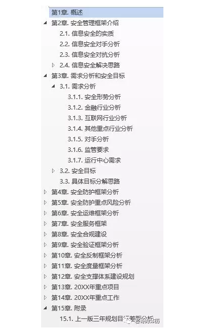
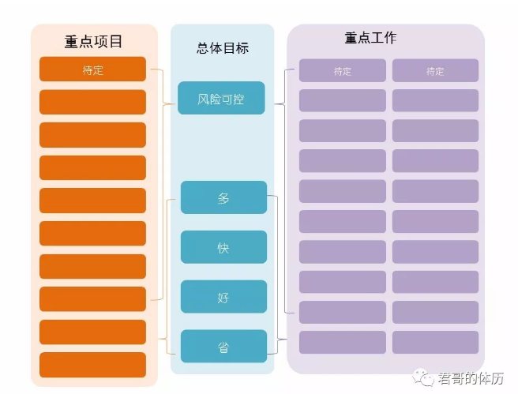
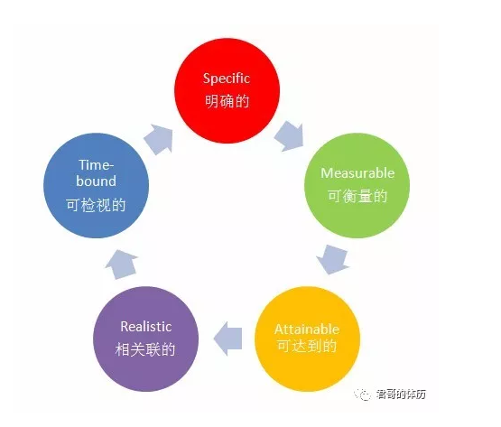

2017年快过完了，除了感叹一句：How time flies之外，企业安全负责人还有更重要的一项工作要忙：准备新一轮安全规划。  

## 一、必要性

企业安全建设中，有一项最基本的东西准备的不够充分，我们会在日常工作当中有非常多的浪费，或者叫太辛苦。陈春花老师说：  
> 
你为什么会辛苦？
很多人会发现你想做的事情下属没帮你去做。
你为什么很辛苦？
你发现每一个小时的效率不够。
你为什么那么辛苦？
是因为你发现很多人做的事情并不真正产生效益。

据史书记载，诸葛亮54岁去世，诸葛亮为何英年早逝呢？诸葛亮以忠君扶蜀为先，把自身的健康放在一边，既不锻炼，也不习武。为了一统天下，诸葛亮常常要深谋远虑，运筹帷幄，这是既劳精又费神的事。他还习惯于晚睡早起，一生谨慎小心，军中事无巨细，都要事必躬亲，整天弄得精疲力竭。这种身心劳累的负担，年轻时还能应付，一旦过了中年，就会显出快速衰老的征象。据史书载，诸葛亮的使者到了魏营，司马懿不问军中之事，单问诸葛亮的饮食起居和工作忙闲情况。使者告诉他，诸葛公向来喜欢晚睡早起，连罚打士兵二十军棍这样的小事都要亲自处理，可早饭却吃得很少。司马懿听后马上得出结论：“亮将死矣!”果然不出司马懿所料，不久在撤退途中，诸葛亮就忧虑呕血而亡。  

事必躬亲，对大BOSS来讲，弊大于利。  

三个问题，一则故事，反映了很多问题和错误，这些错误不应该发生，我们怎么解决它？我们应该从好几个角度去做，今天我就选一个角度，这个角度就是做好安全规划。  

## 二、几个因素

企业战略规划（通常是五年为周期）、IT战略规划（通常三年为周期）、信息安全三年规划、XX年工作方案和计划，是自上而下一脉相承的。通常是负责制定IT战略规划的人会要求企业安全负责人提供信息安全三年规划作为基础材料，统筹而成。能否做一份看起来高大上，实际实施又接地气可执行的信息安全规划是企业安全负责人的必备技能。这意味着新一年的安全投入，包括人员、资金、政策预算包的大小，预算包的大小和战略规划中信息安全篇幅占比成正比。  

在信息安全规划编制启动时间点选择方面，建议选择每年10月启动，12月定稿。有的企业喜欢12月启动，春节前后甚至3月底定稿，这样的时间安排存在很大弊端。企业工作中，总结、考核、预算，通常以自然年为单位（大部分金融企业如此，外资企业不同），而企业员工概念中，一年工作结束一般以农历年为单位。因此元旦到春节后，各种年会、总结、庆祝，基本上处于一个工作断档期。规划如果是3月前后定稿，那么和规划相关的重点项目的资源准备，如合作厂商技术交流测试、项目采购等等就会浪费自然年的第一季度（1月-3月）。如果每年10月启动，12月定稿，就可以利用元旦到春节前后的时间，进行规划相关项目、资源的准备工作（比如采购文档编制、采购流程发起、新招人员面试笔试等等），春节后就可以开足马力，立刻开干。  

安全规划考虑的因素，除了时间外，还应该考虑风险偏好、IT战略目标、监管要求、技术发展、资源约束、安全价值体现等，就不一一展开了。  

## 三、框架

安全规划框架，应包括概述、需求分析和安全目标、现状和差距分析、解决方案和计划、安全资源规划、当年重点项目和重点任务、上一版安全规划执行情况。以下是安全规划的框架示例：  

  
图1：安全规划框架示例  

概述包括信息安全形势分析，安全形势可以是外部安全形势，行业形势，监管和股东要求，对手分析（攻击者、内部异常员工）等。  

安全目标是规划周期结束组织应该达到什么样的信息安全水平。安全目标应该是跳一跳，拼命奔跑才能达到，甚至是很大概率完不成的，而不应该是躺在床上就能实现的。  

现状和差距分析，相当于自我体检，最重要的是能从过往的白盒检测、黑盒检测失效中获得差距分析，黑盒检测的两大利器：安全众测和红蓝对抗，能够先于对手发现自己的漏洞和弱点，对这类检测失效的原因深挖，是差距分析的重点。  

解决方案和计划，解决方案提出一条条解决措施，最终要落到重点项目和任务上去。计划的话，当年的细化到月，未来两年的细化到季度。  

当年重点项目和重点任务是解决方案落地的关键，当年的工作目标靠重点项目和重点任务实现。差距、解决方案、重点项目和任务、计划要形成完整链条，这样才是可落地。项目和任务的区别是，项目比任务要大和复杂一些，任务属于优化改进的小措施，项目通常是要立项和花钱。  

  
图2：安全规划落地示例

## 四、制定步骤

安全规划制定步骤：  
①调研；  
②确定规划目标、现状和差距；  
③制定解决方案；  
④一稿、二稿，……直到定稿；  
⑤向上层汇报；  
⑥回顾。  

### （一）调研

做规划前，大BOSS喜欢问我们几个问题：  
未来三年，本团队要做的最牛的三件事；  
未来三年，你认为世界最好的团队会做哪三件最牛的事（我们不做的原因）；  
未来三年想做但没敢写入规划的三件事；本团队领域，很有价值但技术没有可能实现的事情（列出1-2件）。每年最痛苦的就是怎么填这个大坑了O(∩_∩)O哈哈~  

后来，我们将大BOSS的问题转换了一下，搞的更接地气一点：  
这个领域最好的团队做什么（最佳实践）；  
我们在同业处于什么水平（自我感知）；  
我们的现状（存在哪些差距）。掌握上述信息的最好渠道是实地调研。  

这个领域最好的团队做什么。最好的团队在哪里？我们在同业处于什么水平？  
 
一是向大型互联网企业学习，这些大型互联网企业无论是面临的安全威胁、全量的攻击场景、复杂的网络和应用环境、海量的服务器、终端、人员数量、遇到过的坑等，都是宝贵的实践经验。稍显遗憾的是，互联网企业特别是做安全的，不太可能敞开心扉进行传道授惑，拥有一定的安全圈人脉资源也是企业安全负责人的必备要求之一，越来越多的企业安全人员招聘也要求这点。同时注意参加这些互联网企业举行的年度会议，也能收获很多干货，建议多参加此类会议，远离厂商自嗨会。  

二是向同业做的好的企业学习。向规模自己大的企业学实践中遇到过的问题，向规模差不多的企业学习了解资源配置情况，向规模比自己小的企业学习单点突破能力强的领域，可以抓住一切了解同业的机会，每年开春后，北上广深走一圈，差不多都能了解了，基本也能了解整个行业的大概。  

###（二）目标、现状和差距 

目标来自于企业战略规划和IT战略规划，总体目标应尽可能清晰、简洁。类似于军改提出的目标：军委管总、战区主战、军种主建。比如：“通过综合应用各类安全解决方案，发现并预防各类安全风险，能够承受除DDOS以外的黑客高手或者黑客集团的攻击；内部系统能有效防止非专业人员有意或者无意的数据泄露；能发现对内部重要服务器的普通内部黑客的攻击；对人员进行安全合规教育、违规、违纪现象持续降低，安全审计发现持续降低。”具体目标应尽可能明确、数字化。比如：非我公司组织的互联网系统漏洞发现为0；安全防护100%全覆盖；互联网基础设施风险，能够在2小时内化解；自动化验证平台100%覆盖所有管控措施，管控措施失效能够在24小时内发现……等。  

关于规划的目标，有两点：  

一是目标绝对不合理。因为目标是一种预测，没有人敢说预测是合理的，而且目标其实是一种决心，你发誓要做什么，目标就会出来。目标其实是你自己战略的一个安排，决定你目标的是三个要素：你对未来的预测、你下的决心和你的战略想法。  

二是**实现目标的行动必须合理**，理解了这点，规划就成功了大半，你做的规划才能围绕实现目标制定行动计划。如果你实现目标的行动是合理的话，那么这个不合理的目标反而是可以实现的。  

关于目标，陈春花老师有三个建议，很赞同：  

目标一定是从上往下走，一定不要从下往上来。我们最喜欢犯的错误是什么，就是各团队或者各人将自己要做的工作一报，报完集合起来然后往下一拍就行。目标决定不能从底下往上报，目标一定是上边来定，其他东西都可以授权，惟有目标设定是不授权的。  

第二个建议，目标必须是个人的目标。目标一定要给到个人，目标绝对不可以给到部门。  

第三个建议，每一个人承接的不是目标，而是一套解决方案。他必须去承诺这个解决方案，怎么让这个目标怎么实现。目标不是要确保，是你告诉我实现这 1 亿的销售额的行动方案是什么。  
。

现状和差距，在于两点：  

一是分析维度要全，建议分成安全政策、安全防护技术体系、安全运营体系、安全支撑、安全度量五个维度。安全政策考虑组织架构、职责、制度、安全考核四点，安全支撑考虑人员、流程、资源三点。现状和差距最好能做到全量摸底，重点突出。  

二是敢于自揭老底，自我否定。不要自我感觉良好，没发现异常很可能是发现能力不够，没有事件很可能是运气。  

此处，庸俗的科普一下安全规划SMART原则：  

  
图3：SMART原则  

1、Specific——明确性  

所谓明确就是要用具体的语言清楚地说明要达成的行为标准。明确的目标几乎是所有成功团队的一致特点。很多团队不成功的重要原因之一就因为目标定的模棱两可，或没有将目标有效的传达给相关成员。  

举个栗子：  

我们定安全目标中有一条是：防黑反黑。这种对目标的描述就很不明确，因为我们不知道要防护哪些目标，防护什么级别的黑暗力量。所以我们最后改成：能够承受除DDOS以外的黑客高手或者黑客集团的攻击；内部系统能有效防止非专业人员有意或者无意的数据泄露；能发现对内部重要服务器的普通内部黑客的攻击  

2、Measurable——衡量性  

衡量性就是指目标应该是明确的，而不是模糊的。应该有一组明确的数据，作为衡量是否达成目标的依据。如果制定的目标没有办法衡量，就无法判断这个目标是否实现。  

举个栗子：

我们定安全目标时，常见的用词是提高XX水平，加强XX能力，完善XX措施，这些目标是无法衡量的，因为不知道要提高到什么水平，加强到什么能力，完善哪些措施。在内部定具体安全目标时尽量使用可量化的目标，比如：非我公司组织的互联网系统漏洞发现为0；管控措施失效能够在24小时内发现，等等。  

3、Attainable——可实现性  

目标是要能够被执行人所接受的，目标设置要坚持员工参与、上下左右沟通，使拟定的工作目标在组织及个人之间达成一致。既不能是躺在床上就能完成目标，也不能是“摘星星”的工作任务。  

举例栗子：  

中小金融企业提出所有安全防护系统和工具都自研的目标，勇气可嘉，可实现性方面较困难。  

4、Relevant——相关性  

目标的相关性是指实现此目标与其他目标的关联情况。如果实现了这个目标，但对其他的目标完全不相关，或者相关度很低，那这个目标即使被达到了，意义也不是很大。  

所有的安全规划的目标和任务都是围绕保障企业安全性，并最终促进企业战略目标来计划，与此无关的工作都应该忽略。  

5、Time-bound——时限性  

目标特性的时限性就是指目标是有时间限制的。没有时间约束的目标没有办法衡量和评价。  

举个栗子：  

目标和任务需要时间约束，比如是三年后达到什么安全水平，每一年提升哪些安全能力，每个季度完成哪些安全任务，都是时间条件强约束。  

###（三）制定解决方案

分析出差距，针对性制定解决方案。解决方案：  

一是要体系化，头痛医头脚痛医脚的话，可能短时间能看到一点效果，但架不住BOSS问，怎么又是这个问题，怎么又要这个投入，你们能一次性和我说清楚吗之类。有些问题，初看是技术问题，仔细想想，其实是管理问题。遇到问题，最好从管理和技术两个方面都去考虑一下解决措施，综合着来。解决方案  

二是要可持续。我经常举的例子就是，给分行或分支机构上IPS/IDS，分行和分支机构根本就没有能看懂IPS/IDS日志的管理员啊，如果合规要求上，那一定要考虑日志怎么办，最好的做法就是日志收到总部来，由总部统一管理和运营（注意不是运维，日常开机等还是分支机构管，日志分析和异常告警由总部完成）。每项安全措施、每套安全设备都是有管理成本的，如果不能运营好，那这个解决方案就是无效的、无效的、无效的！  

制定解决方案的一个好方法就是，安全团队每位成员都先熟悉目标、现状、差距，找晚上时间进行头脑风暴，连续一周，试过后你会回来点赞的，头脑风暴完记得去撸串，团队建设、凝聚力、肚子饿的问题都一并解决了。  

###（四）定稿 

一稿、二稿……定稿。关键是迈出第一步，完成第一稿，万事开头难，一旦开始就停不下来了。  

这个过程还有一个很重要的环节：征求意见。首先是在安全团队内部充分讨论，碰撞，形成共识。其次是在IT内部其他团队征求意见，取得共识。  

###（五）上层汇报 

管理领域有个话题，如何管理你的上级，将上级作为你工作的资源之一，是非常有趣的话题。安全汇报是管理好你的上级非常非常非常重要的一环，也是我们安全人员最不擅长的。要建立面向高级管理层、IT部门和总经理、安全团队内部的安全汇报体系。一年内要和高级管理层汇报1-2次，安全规划、安全形势、重大安全决策等，汇报形式可以是IT治理委员会或总裁办公会框架下的正式会议，也可以是定期的签报阅签形式，取决于你的需求。在IT部门和安全团队内部要进行常态化的安全汇报，此类汇报的内容要围绕三个目的展开，邀功、表扬先进督促后进、要资源。  

安全规划汇报，建议先向IT部门总经理汇报，就目标、计划、资源达成一致，大部分总经理没有精力也不应该过多关注解决方案等细节，最多可能关心现状分析中存在的主要问题。达成一致后最好能在公司管理层汇报一次，可以是单独的安全规划议题，也可以合并在IT战略规划中一起，向公司高管层汇报。  
自用最好是Word，汇报最好是PPT 。  

###（六）执行与回顾

安全规划的执行，是规划的重要一环。因为一个看似一般但严格执行的规划，远胜于一个好的但无法或未能执行的规划。我们的实践是将安全规划目标分解落实到安全重点项目和工作任务后，再将重点项目和工作任务分解落实到安全团队每位员工的年度绩效考核中。对于重点项目和工作任务的回顾，每季度开展一次。对于安全团队员工绩效，每半年回顾一次，回顾后需要制定针对性的改进措施。  

经常听到的抱怨是规划没用，做完规划就放起来再也不看，肯定没用，安全规划要定期回顾，作为真正的行动指南。  

通常信息安全规划一次做三年，每年滚动更新。 任正非说过，方向可以大致正确，组织必须充满活力，执行中必须时刻调整。  

## 五、注意事项

一是要有逻辑，切记堆砌，很多企业安全负责人不重视安全规划，为了省时间，把自己想做的工作全部罗列出来变成一个安全规划，对于为什么要做这些工作，能解决什么问题，提高到什么安全水平，和同业的差距等没有系统介绍。那这份安全规划得到管理层支持的概率会很低。  

二是既要实（可落地），也要虚（远大目标），虚实结合。  

某种意义上来讲，安全规划其实是一套行动方案。规划不是目标分解，它其实是行动方案，在做整个规划的时候，希望大家都能够很好地找到行动方案，也祝各位能够在 2018 取得更好的成效。  