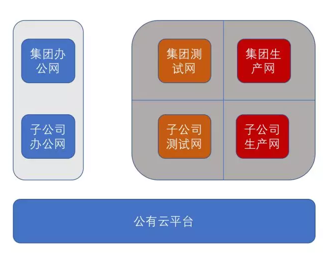
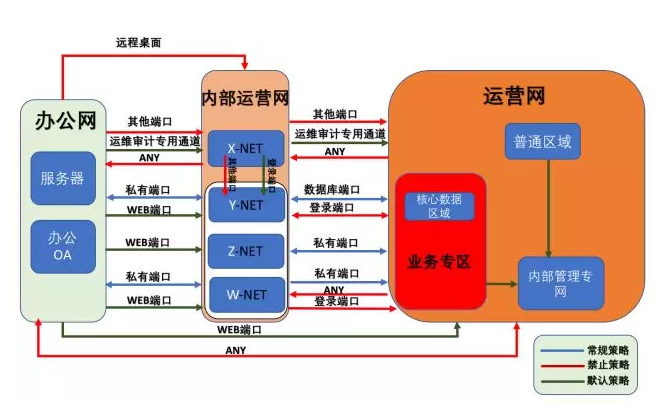
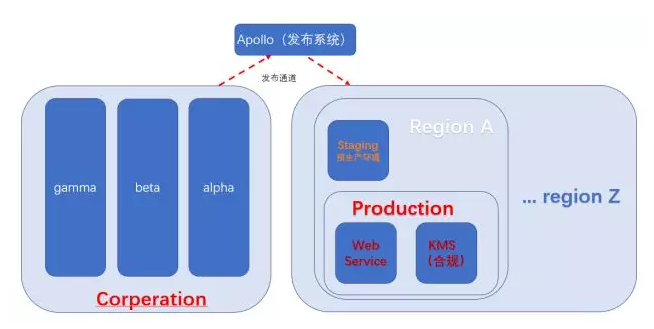
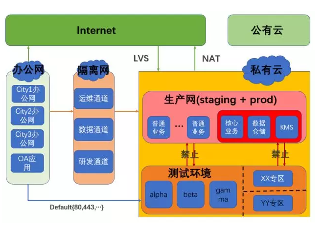
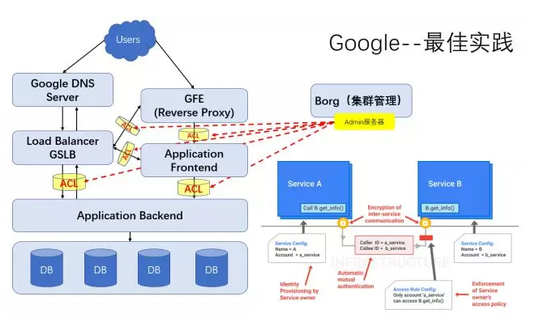
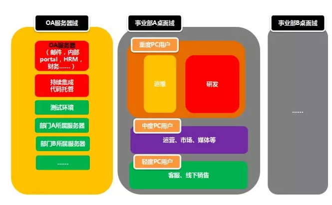
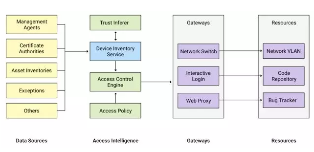

原文 by [赵彦](https://mp.weixin.qq.com/s?__biz=MjM5NjQ5MTI5OA==&mid=2651747457&idx=1&sn=ffb0162b656c998b680f1e518548ad3e&chksm=bd12adcc8a6524dafdeca303db5c1adc70f1bf8705f11febe9ee6fbd35f74a00109faa57ab8d&mpshare=1&scene=1&srcid=0126PP6zvGBo52JPp9GZwksA#rd)  

## 概述

安全域隔离是企业安全里最常见而且最基础的话题之一，目前主要的实现方式是网络隔离（特别重要的也会在物理上实现隔离）。对于很小的公司而言，云上开个VPC就实现了办公网和生产网的基础隔离，但对于有自建的IDC、网络基础设施甚至自己构建云基础设施的大型公司而言，网络隔离是一项基础而复杂的安全建设。基础在这里的意思并非没有技术含量，而是强调其在安全体系里处于一个根基的位置，根基做不好，上层建设都不牢靠。  

隔离的目标是为了抑制风险传播的最大范围，使受害范围限定在某个安全域内，类似于船坞的隔离模式，一个仓进水不会沉船。从攻击的角度看，网络隔离可以阻拦攻击者单点得手后的横向扩散，防御者视角更具体的思路可以参考《互联网企业安全高级指南》一书有关纵深防御的章节。  

网络隔离通常分为（1）IDC隔离以及（2）办公网隔离，除此之外，还有（3）办公网跟IDC之间的访问控制。受限于安全策略的敏感性，本文不会披露过于详细的策略或实现方案。  

## IDC隔离

以下先从IDC隔离说起，安全做的没有特点的公司通常是这么分的：办公网内部没有任何隔离，生产网内部也没有任何隔离。  
  

甚至有些市值好几百亿美元的公司也这么分。这样分的结果是对运维比较便利，但从安全来说相当于什么也没做。比较普遍的做法如下图所示（某电商公司的例子）：  
  

首先会在IDC整体上区分公有云和私有云，其次在私有云内部区分生产和测试环境，然后是办公网跟IDC的隔离。当然这个粒度是比较粗的，实际在每个安全域内部还有更细的划分，安全域之间设置运维和数据通道，数据在安全域之间流转时需要脱敏和审计。再来看另一个大型互联网公司安全域的例子：  
  

里面更细粒度的定义了OA-IDC之间的通道，即图中标示为内部运营网的部分，例如通常运维的堡垒机就属于内部运营网，思路还是把运维通道，数据通道，测试环境都放在了内部运营网，可以理解为整体上就是OA-测试（内部运营通道）-生产，3大安全域。  

除了国内主要的互联网公司，再看一个国际电商和云计算巨头的例子：  
    

办公网包含测试环境，通过发布系统与生产环境隔离，生产环境中除了密钥管理等强制合规性需求外，基本没有做太多隔离，推测是为了网络资源的弹性考虑，staging可以理解为是CI末端的一个预发布环境，在全球范围内会跟云计算一样区分Region（北美、亚太……Region之间几乎不互通），AZ（Availability Zone，可用区，可以理解为是同一个IDC内有用相同的灾备等级）的隔离概念。  

基本上上述例子可以代表全球范围内绝大部分互联网和云计算公司的安全域隔离方法论了。于是，我们吸收各家的优点，整理出一个相对通用的安全域划分示例，如下图所示：  
    

在大多数公司，如果安全工作做得认真到位，没有太激进或者技术引领之类的需求基本上也算OK了。只不过网络隔离这件事天生跟弹性计算是对立的，隔离的越细致，对于快速扩容、服务编排、资源回收都是不利的。在海量IDC运维环境下，会给追求全自动化资源管理的理念引入障碍。  

另一方面，虽然明确定义了很多诸如生产测试分离之类的规则，但在实际的日常使用中往往会有很多问题。互联网公司的研发不是传统的瀑布模型，也不一定都有专职的且供应量足够的测试人员，尤其对于扩展中的业务很多流程和规则往往处于模糊地带，测试环境也未必能满足所有的测试需求，例如全链路压测等，这些问题带来的挑战是安全隔离对业务需求产生阻碍，但是业务又不能中断，所以会有很多变相操作，例如直接去生产环境测试，从而跳过了安全预设的场景和规则，最后使得隔离看起来有点虚幻。  

笔者细数了一下网络隔离诞生于上个世纪，是自网络安全开始就有的概念，产生于一个互联网并不发达也没有海量IDC的时代，所以这种模式可能有点局部（并非全部和绝对）过时了。直到发现Google的模式，阐述了一种全新的思路：不使用基于网络的隔离，而是用应用级别的隔离来实现访问控制，如下图所示：  
    

我们从几个层面详细分析这一方案。  

首先Google这个规模的IDC管理的理念是必须通过自动化管理实现，人肉是不可能的，当然人肉审批ACL策略也是不可能的。集群全部通过自动化管理的前提是高度的弹性计算能力：所有机器的安装初始化，上线，应用实例部署，到自动擦除数据下线，回收资源都是自动化的，所以过度的隔离也会抑制生产能力。以前这些自动化工作都通过sshd服务来，且需要root权限，Google认为这是一个巨大的安全隐患，所以重新设计了一个admin服务运行于所有的VM、容器实例，这个admin服务本质上是一个RPC服务，支持认证、ACL驱动和审计，并且只需要完成工作的最小权限。相当于原来通过ssh管道执行的命令变成了通过admin服务的一堆RPC调用指令，每个参数都可审计。这是Google这套机制的背景之一。  

第二点，这套机制能work的前提是：Google的IDC内网只有RPC协议，没有像其他公司一样的mysql，ssh，rpc，http等各种协议，所以只对RPC服务做访问控制就相当于给所有的攻击面做访问控制，但是对于有着各种复杂协议的普适性IDC内网场景来说，这一点前提是不ready，不能说没有用，但显然其他协议仍然有攻击面，仍然可用于内网渗透和横向拓展。这也是Google自研技术栈比较深导致的跟大多数公司基础设施不太一样的地方，所以看官可能也察觉到这不是一个放之四海皆准的方案。  

第三点，这套机制的工作原理，可以参考图中右半部分。服务调用通过RPC鉴权：譬如某类型的前台服务A只能访问某个类型的后台服务B，也可以衍生出业务X的前台服务A只能访问业务X的后台服务B，而不能访问业务Y的后台服务B。测试跟生产分离，也只需要将测试和生产定义成不同的业务大类。从攻击者的立场来看，假如你搞定了内网的一台机器，你拿出扫描器去扫其他机器，虽然路由可达，但是因为不具有对应的RPC权限，所以没有对其他应用的访问token，相当于被隔离。  

不过可惜的是，前置条件IDC内网收敛为一种RPC协议这一条绝大多数公司都不符合，所以这种形式的可落地改进方案还有待讨论，但是笔者认为这代表了未来的方向，对于超大规模IDC自适应的安全隔离无法通过简单的划分安全域和手工ACL审批来实现。  

## 办公网隔离

笔者在《互联网企业安全高级指南》中描述过一种OA网络的划分方法，如下图所示：  
    

首先把IT应用（假如在内网的话）跟桌面用户划开，桌面用户根据职能部门划动态VLAN，这种一种传统的安全域方式。策略收敛比较到位的话也能起到不错的效果。  

Google的BeyondCorp（https://cloud.google.com/beyondcorp/）不走寻常路，本质上是办公应用云化和移动化后的产物。  
    

图示的是BeyondCorp这套机制，通过识别当前设备状态，使用动态的访问控制策略决定当前设备能访问哪些OA应用。这套机制跟传统的OA安全域最本质的区别是：  

* Bird传统的访问控制策略都是基于IP/MAC的。
* BeyondCorp模型是基于设备/账号的。
* 传统的模型访问控制是静态的，后者则是动态的。
* 传统的模型是ACL，BeyondCorp则有点风控的意味。

对于企业来说，如果移动办公程度非常高，那么应用云端化和SSO这些都是现成的，只需要梳理资产，改造gateway支持风控引擎就可以实现BeyondCorp。而对很多非高度移动化的公司而言，如果传统的安全域划分、网络监控、终端安全管理都做的非常到位的情况下，强制改造成BeyondCorp的成本是非常高的，笔者倾向于认为ROI可能不足以支撑安全团队的绩效。  

## OA和IDC之间

有几个必要的通道：  

1. SSH远程访问通道，通过跳板机，全程审计，权限回收。
2. 数据安全环境：数据开发，BI报表等，一切需要接触数据仓库的开发运营人员的工作集散地，通常这里会有一些类似虚拟化桌面的审计。
3. 数据传输通道，因为各种原因debug、测试需要上传/回传数据，只能在指定的传输通道进行，必须符合脱敏跟审计的要求。
4. 代码发布渠道，通常大型互联网公司都有自己的一套发布系统，甚至还有跟R&D同学本机磁盘映射的方案，所以这个通道的安全都在发布系统上做。
5. 基础设施管理通道：运维通道的特殊版本，可能会集成一些运维管理工具或自动化平台，需要能够触达全部的IDC资源。

## 小结

对于大部分企业来说传统的安全域划分方法仍然够用，至少几年内没有太大的问题，但对于IDC规模超大的企业来说，弹性计算和安全会成为对立面，如果需要走Google的模式需要高度的集群管理自动化，较高的服务治理水平，高度统一的技术栈和极度收敛的内网协议。

如果OA网络需要BeyondCorp模式，需要办公云化和移动化程度比较高。退一步回到一家公司整体的安全建设上，如果其他地方还有很多短板，在网络隔离上追求极致不是一个正确的策略，相较而言应该将资源（对于较大的安全团队而言也包括自研的资源）都投入到优先级更高的地方，譬如基础设施的攻击缓解能力。

站在一个高P的视角，追求技术的领先是一件本分的事情，而对于安全负责人来说，风险管理和ROI永远是安全工作的核心，也因此在2017年底这个时间点看对于绝大多数公司来说Google模式是没有复制的必要的，不幸的是笔者所在的公司恰好具备了这方面的基础条件，所以安全团队俨然一副在路上的架势。）